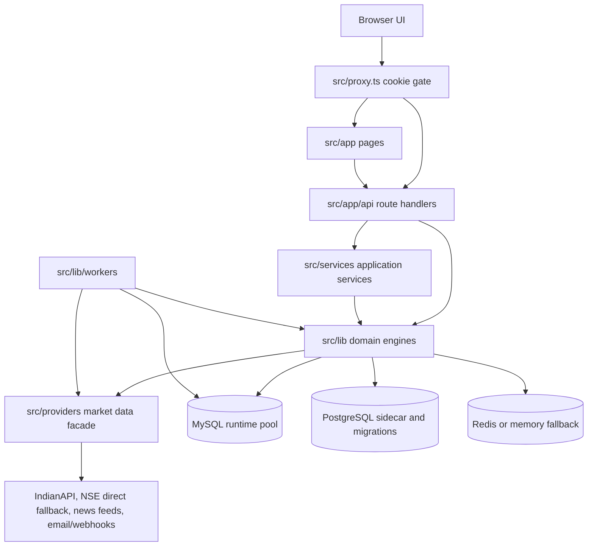
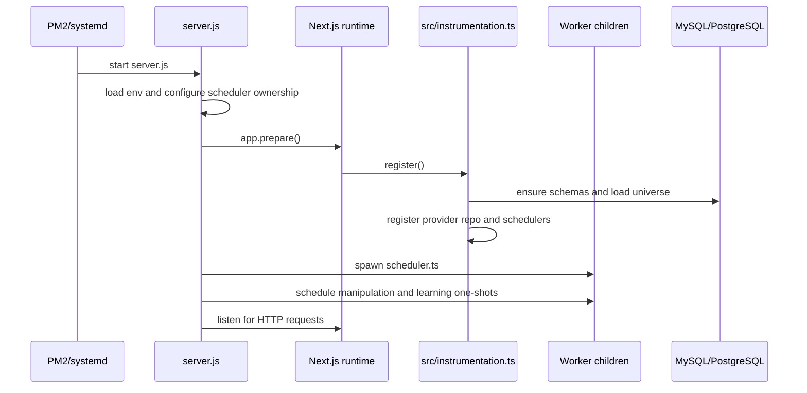
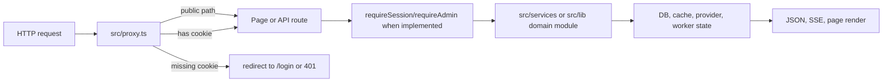
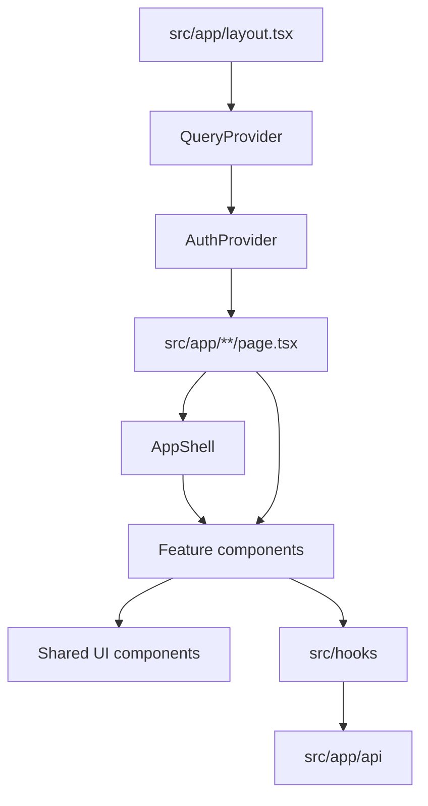
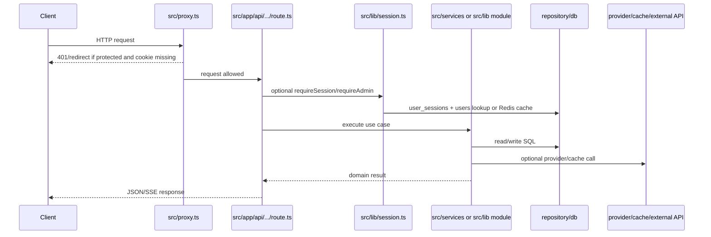
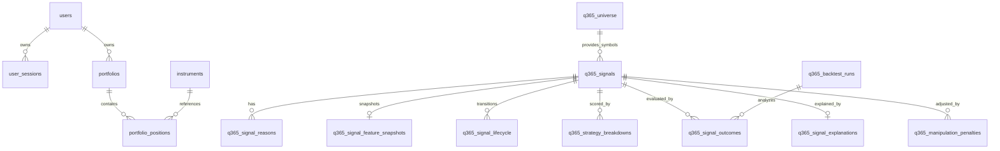
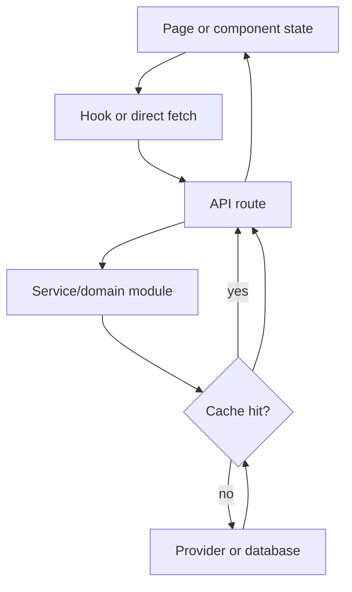
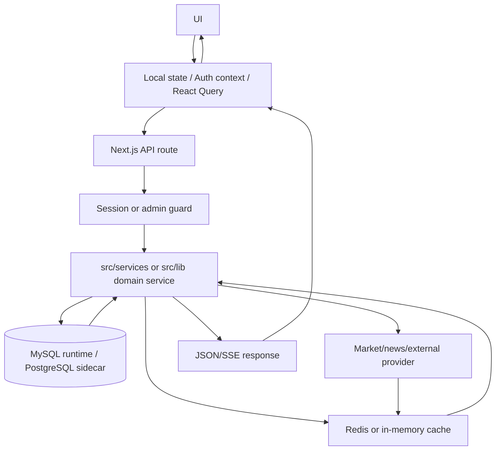
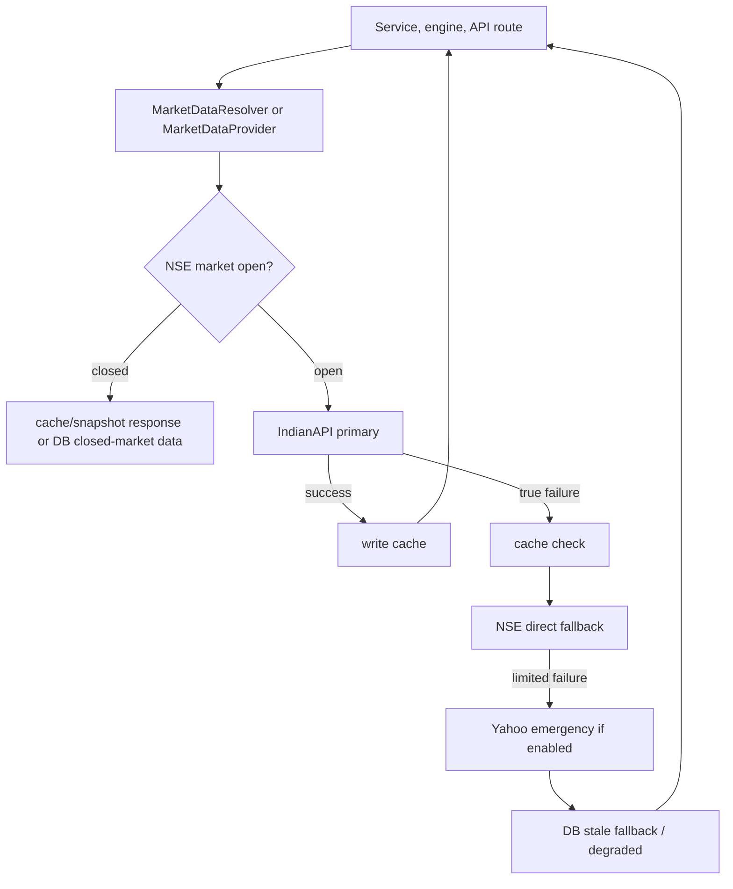

# Project Architecture

**Project:** Quantorus365
**Version from `package.json`:** 2.1.0
**Last analyzed:** 2026-07-04
**Scope:** Repository analysis of source code, package manifests, configuration, migrations, scripts, documentation, deployment files, and generated route inventory. Generated/vendor directories such as `.next/`, `.git/`, and `node_modules/` are intentionally excluded from architectural conclusions.

## 1. Overview

Quantorus365 is an institutional stock intelligence, signal generation, portfolio/risk, backtesting, news intelligence, manipulation surveillance, and trading workflow platform for Indian equity markets.

The active runtime is a large Next.js App Router application. Browser pages live under `src/app/**/page.tsx`, API handlers live under `src/app/api/**/route.ts`, application orchestration lives in `src/services/`, and domain engines/infrastructure live in `src/lib/`. The repository also contains standalone service scaffolds under `services/` and shared contract packages under `packages/`, but most implemented product behavior still runs inside the Next.js app and worker processes.

High-level architecture:



Core technologies:

- Next.js 16 App Router with React 18 and TypeScript.
- MySQL through `mysql2/promise` as the dominant runtime data access path in `src/lib/db.ts`.
- PostgreSQL through `pg` in `src/lib/db/postgres.ts` for side-by-side migration paths and standalone service scaffolds.
- Redis through `ioredis` with in-process memory fallback in `src/lib/redis.ts` and a separate in-memory provider cache in `src/lib/cache.ts`.
- Node workers and cron jobs through `tsx`, `ts-node`, and `node-cron`.
- Market data provider abstraction centered on `src/providers/MarketDataProvider.ts` and `src/lib/marketData/resolver/marketDataResolver.ts`.

Primary design principles observed in code:

| Principle | Evidence |
|---|---|
| Risk-first decisioning | Signal approval goes through Phase 3 gates in `src/lib/signal-engine/core/runRejectionEngine.ts` and related Phase 3 pipeline modules. |
| Provider discipline | Market data is expected to pass through `src/providers/MarketDataProvider.ts` or the resolver under `src/lib/marketData/resolver/`. |
| Session-first product UI | `src/proxy.ts` gates protected pages/routes by `q200_session`; API handlers add DB-backed checks with `requireSession()` or `requireAdmin()`. |
| Additive schema evolution | `src/lib/db/ensureAllSchemas.ts` and migration files use idempotent `CREATE TABLE IF NOT EXISTS` and additive ALTER patterns. |
| Operational visibility | `src/lib/logger.ts`, `src/lib/apiHandler.ts`, `src/lib/monitor/*`, `src/lib/reliability/*`, and `/api/debug/*` provide logs, traces, metrics, and health surfaces. |
| Explicit job ownership | `server.js` forces `Q365_INPROC_SCHEDULER=0` by default when its child scheduler owns production jobs. |

Important uncertainty: older docs such as `docs/database-inventory.md` describe PostgreSQL as the runtime primary database, but current runtime code imports `db` from `src/lib/db.ts` in many routes/services and that file creates a MySQL pool. This document treats MySQL as the current dominant runtime path and PostgreSQL as present but not fully cut over.

## 2. Tech Stack

| Area | Technology | Actual usage and files |
|---|---|---|
| Frontend | Next.js 16, React 18, TypeScript | App Router pages in `src/app/**/page.tsx`; root layout in `src/app/layout.tsx`. |
| Backend | Next.js route handlers, Node HTTP service scaffolds | 278 route handlers in `src/app/api/**/route.ts`; standalone Node services in `services/*/src/server.ts`. |
| Database | MySQL, PostgreSQL | MySQL runtime pool in `src/lib/db.ts`; PostgreSQL sidecar in `src/lib/db/postgres.ts`; SQL migrations in `migrations/postgres` and `migrations/mysql`. |
| Authentication | Cookie sessions, bcrypt, TOTP | `q200_session` cookie, `src/services/auth.ts`, `src/lib/session.ts`, `src/lib/security/sessionManager.ts`, `speakeasy`, `bcryptjs`. |
| Authorization | Role and permission helpers | `requireAdmin()`, `requirePermission()`, `src/lib/security/rbac.ts`, roles in `src/lib/security/types.ts`. |
| State management | React local state, Context, React Query | `AuthProvider` in `src/hooks/useAuth.tsx`; `QueryProvider` in `src/providers/QueryProvider.tsx`; feature/trust hooks in `src/hooks/`. |
| Styling | Sass, SCSS modules, global SCSS | `src/styles/globals.scss`, `src/styles/components/*`, page/component `*.module.scss`. |
| APIs | Next.js API routes, auto OpenAPI generator | `src/app/api/**/route.ts`; `/api/openapi` generated by `src/app/api/openapi/route.ts`. |
| Market data APIs | IndianAPI primary, NSE direct rare fallback, Yahoo emergency stub | `src/providers/adapters/IndianAPIAdapter.ts`, `src/lib/marketData/providers/nseDirectProvider.ts`, `src/providers/adapters/YahooAdapter.ts`. |
| News integrations | GNews, NewsData, Finnhub, exchange/RSS/social adapters | `src/lib/news-engine/ingestion/*`, `src/services/newsService.ts`. |
| Cache | Redis and in-process memory | `src/lib/redis.ts`, `src/lib/cache.ts`, provider caches and stream helpers. |
| Build tools | Next.js build, TypeScript, tsx, ts-node | Scripts in `package.json`; `tsconfig.json`; `tsconfig.node.json`; `next.config.js`. |
| Deployment | PM2, custom Node server, Nginx, Docker Compose | `server.js`, `ecosystem.config.js`, `nginx.conf`, `Dockerfile.nextjs`, `services/Dockerfile`, `docker-compose.*.yml`. |
| Testing | Vitest, tsx test scripts, HTTP validation scripts | `vitest.config.ts`; tests in `src/__tests__`; many `npm run test:*` and `validate:*` scripts. |
| Observability | Structured logger, API monitor, Prometheus helpers, reliability modules | `src/lib/logger.ts`, `src/lib/apiHandler.ts`, `src/lib/monitor/*`, `src/lib/reliability/*`. |
| Important UI libs | Recharts, Lucide, React Icons, Framer Motion, clsx | Declared in `package.json`; used by dashboards, icons, visualization components. |
| Other server libs | axios, ioredis, mysql2, pg, node-cron, nodemailer, pdfkit, xlsx, ws | Declared in `package.json`; usage spread across provider, worker, reporting, and infra modules. |

## 3. Project Structure

Current repository tree, trimmed to meaningful source/config/docs and excluding generated/vendor folders:

```text
api-update/
├── docs/
│   ├── api-inventory.md
│   ├── architecture-audit.md
│   ├── database-inventory.md
│   ├── DAILY_SCAN_SCHEDULE.md
│   ├── implementation-roadmap.md
│   ├── PERFORMANCE_DAILY_REPORT_BACKTEST.md
│   ├── PREMIUM_NEWS_FEEDS.md
│   ├── PROVIDER_REQUEST_POLICY.md
│   ├── quant-platform-release.md
│   ├── security-review.md
│   ├── signal-engine-flow.md
│   ├── SLO_RUNBOOK.md
│   └── strategy-flow.md
├── migrations/
│   ├── mysql/
│   └── postgres/
├── packages/
│   ├── contracts/src/{api.ts,correlation.ts,events.ts,index.ts}
│   ├── eventbus/src/{bus.ts,index.ts}
│   └── rpc/src/{client.ts,index.ts}
├── scripts/
│   ├── audit*, backfill*, validate*, verify*, diagnose*, run*, rebuild*
│   └── operational SQL and TypeScript utilities
├── services/
│   ├── _shared/{envLoader.ts,httpService.ts}
│   ├── alerting/src/{rules.ts,server.ts}
│   ├── identity/src/server.ts
│   ├── market-ingestion/src/{config.ts,handlers.ts,server.ts}
│   ├── market-intelligence/src/{news.ts,server.ts}
│   ├── portfolio/src/server.ts
│   ├── reporting/src/server.ts
│   └── signal-engine/src/server.ts
├── src/
│   ├── __tests__/
│   ├── app/
│   │   ├── api/**/route.ts
│   │   ├── admin/, dashboard/, market/, signals/, strategies/, ...
│   │   ├── error.tsx
│   │   ├── global-error.tsx
│   │   ├── layout.tsx
│   │   └── page.tsx
│   ├── components/
│   │   ├── backtesting/, dashboard/, intelligence/, layout/, market/
│   │   ├── signals/, stock/, strategies/, strategy-lab/, trust/, ui/
│   │   └── LivePriceTicker.tsx
│   ├── data/{EQUITY_L.csv,nseUniverse.json}
│   ├── hooks/
│   ├── lib/
│   │   ├── admin/, api/, backtesting/, billing/, broker/, confirmation/
│   │   ├── cron/, db/, execution/, learning/, manipulation-engine/
│   │   ├── marketData/, monitor/, news-engine/, paper-trading/
│   │   ├── pipeline/, quant-platform/, reliability/, scanner/, security/
│   │   ├── signal-engine/, signals/, startup/, strategies/
│   │   ├── strategy-hub/, strategy-lab/, trust-layer/, workers/, ws/
│   │   ├── apiClient.ts, apiHandler.ts, cache.ts, db.ts, errors.ts
│   │   ├── logger.ts, rateLimit.ts, redis.ts, session.ts, validateEnv.ts
│   │   └── utilities
│   ├── pages/{_document.tsx,_error.tsx}
│   ├── providers/
│   ├── services/
│   ├── styles/
│   ├── types/
│   ├── instrumentation.ts
│   └── proxy.ts
├── test-results/
├── .eslintrc.json
├── ARCHITECTURE.md
├── docker-compose.dev.yml
├── docker-compose.prod.yml
├── Dockerfile.nextjs
├── ecosystem.config.js
├── MIGRATION_PLAYBOOK.md
├── next.config.js
├── nginx.conf
├── package.json
├── package-lock.json
├── server.js
├── tsconfig.json
├── tsconfig.node.json
└── vitest.config.ts
```

Major folder responsibilities:

| Folder | Purpose | Important files | Interactions |
|---|---|---|---|
| `src/app` | Next.js App Router UI and API surface. | `layout.tsx`, `error.tsx`, `global-error.tsx`, `api/**/route.ts`, feature pages. | Pages fetch API routes; route handlers call `src/services`, `src/lib`, DB, providers. |
| `src/components` | Reusable client/server UI components. | `layout/AppShell.tsx`, `stock/StockDetail.tsx`, `trust/*`, `ui/index.tsx`. | Consumed by page files; calls hooks and browser fetch APIs. |
| `src/hooks` | Client-side hooks and context accessors. | `useAuth.tsx`, `useFeatures.ts`, `useOnboarding.ts`, `trust/*`. | Wraps API calls through `src/lib/apiClient.ts` or `fetch`; feeds components. |
| `src/providers` | Market data provider facade and React Query provider. | `MarketDataProvider.ts`, `QueryProvider.tsx`, `adapters/IndianAPIAdapter.ts`, `repos/snapshotRepo.ts`. | Used by services, market data resolver, pages via root layout. |
| `src/services` | Application-level orchestration. | `auth.ts`, `marketDataService.ts`, `marketQuote.ts`, `optionIntelligence.ts`, `portfolioLedgerService.ts`, `rankingsService.ts`. | Sits between API routes and lower-level engines/repositories. |
| `src/lib` | Domain engines, infrastructure, repositories, workers. | `db.ts`, `session.ts`, `apiHandler.ts`, `signal-engine/*`, `backtesting/*`, `marketData/*`, `security/*`. | Most business logic and persistence code lives here. |
| `src/__tests__` | Unit, integration, acceptance, and regression tests. | `*.vitest.ts`, `*.test.ts`, validation/proof scripts. | Run through Vitest or `tsx` scripts in `package.json`. |
| `migrations` | SQL migrations for PostgreSQL and MySQL. | `migrations/postgres/*.sql`, `migrations/mysql/*.sql`. | PostgreSQL service scaffolds and sidecar migration path; MySQL fallback migrations. |
| `services` | Standalone microservice extraction scaffolds. | `services/*/src/server.ts`, `_shared/httpService.ts`. | Use `packages/contracts`, `packages/eventbus`, `src/lib/db/postgres.ts`; Compose can run them. |
| `packages` | Shared internal contracts, event bus, and RPC client. | `contracts/src/api.ts`, `contracts/src/events.ts`, `eventbus/src/bus.ts`, `rpc/src/client.ts`. | Used by standalone services and future split-service calls. |
| `scripts` | Operational CLI, validation, migration, backfill, diagnostics. | `auditApiUsage.ts`, `backfillCandles.ts`, `validate*.ts`, `weeklyNse1000UniverseRebuild.ts`. | Invoked by `package.json` scripts or manually during operations. |
| `docs` | Existing design, audit, operations, and roadmap docs. | `signal-engine-flow.md`, `strategy-flow.md`, `DAILY_SCAN_SCHEDULE.md`, `security-review.md`. | Useful background, but some documents are stale versus current source. |

## 4. Application Flow

### App startup

Development startup uses `npm run dev`, which runs `next dev`.

Production startup uses `npm start`, which runs `next start -p 3000` according to `package.json`, while `npm run start:server` runs `node server.js`. The deployment files and `ecosystem.config.js` point to `server.js` as the production parent process.

`server.js` does the following:

1. Loads environment from `.env.local` or `.env`, plus `.env.production` as a secondary production source.
2. Forces `Q365_INPROC_SCHEDULER=0` when not explicitly configured to prevent duplicate scheduler ownership.
3. Starts the Next.js HTTP server on `PORT`/`NEXT_PORT`, default `5000`.
4. Starts and supervises `src/lib/workers/scheduler.ts` as a long-running child.
5. Schedules one-shot `src/lib/workers/manipulationScannerCli.ts` and `src/lib/workers/learningScheduler.ts` cron children.
6. Handles graceful shutdown for HTTP and child workers.

`src/instrumentation.ts` runs once in the Node runtime and performs boot checks, crash handler registration, environment visibility logging, provider flag logging, schema ensure, provider DB repo registration, universe loading, candle scheduler startup, feed-health retention startup, and optional in-process scheduler startup.



### Routing

- `src/proxy.ts` is the Next.js 16 proxy/middleware replacement. It lets public paths through and checks only for a non-empty `q200_session` cookie on protected paths.
- UI routes are file-system routes under `src/app/**/page.tsx`.
- API routes are file-system handlers under `src/app/api/**/route.ts`.
- `/api/openapi` is generated dynamically by walking `src/app/api` and detecting exported HTTP verbs.

### Authentication flow

```mermaid
sequenceDiagram
    participant Browser
    participant AuthRoute as src/app/api/auth/route.ts
    participant AuthService as src/services/auth.ts
    participant DB as src/lib/db.ts
    participant Redis as src/lib/redis.ts

    Browser->>AuthRoute: POST /api/auth {action,email,password}
    AuthRoute->>AuthRoute: authLimiter()
    AuthRoute->>AuthService: loginUser(email,password)
    AuthService->>DB: SELECT users
    AuthService->>AuthService: bcrypt.compare()
    AuthService->>DB: INSERT user_sessions
    AuthService->>Redis: cache invalidation/write where applicable
    AuthRoute->>Browser: Set-Cookie q200_session; JSON user
```

### Request flow



### Data flow

- UI components call route handlers with `fetch`, React Query, or small hooks.
- API routes call services or domain modules.
- Domain modules call MySQL through `src/lib/db.ts`, PostgreSQL through `src/lib/db/postgres.ts`, Redis/memory cache through `src/lib/redis.ts` or `src/lib/cache.ts`, and provider abstractions through `src/providers` or `src/lib/marketData/resolver`.
- Workers run the same domain code from `src/lib/workers` outside the request lifecycle.

### Rendering flow

- `src/app/layout.tsx` wraps all pages with `QueryProvider` and `AuthProvider` and imports `src/styles/globals.scss`.
- Feature pages compose domain components and often wrap content in `src/components/layout/AppShell.tsx`.
- `AppShell` renders navigation, admin-only navigation sections, ticker strip, regime/performance widgets, notification badge polling, and user avatar/logout.

### Error flow

- `src/app/error.tsx` and `src/app/global-error.tsx` harden error boundaries against non-Error values using `extractErrorMessage()` from `src/lib/errors.ts`.
- `src/lib/apiHandler.ts` provides structured handler wrapping, request IDs, traces, monitor recording, and consistent error envelopes for routes that use `withApiHandler()`.
- Many legacy/raw routes still return `NextResponse.json({ error })` directly.

## 5. Module Breakdown

| Module | Purpose | Dependencies | Public interfaces | Related files |
|---|---|---|---|---|
| App Router | Pages, layouts, API endpoints. | Next.js, React, route handlers. | `page.tsx`, `route.ts`, `layout.tsx`. | `src/app/**`. |
| Layout/UI shell | Navigation, authenticated app chrome, ticker strip, widgets. | `useAuth`, `next/link`, `lucide-react`, trust widgets. | `AppShell({ children, title })`. | `src/components/layout/AppShell.tsx`. |
| Auth/session | Login/register/logout, TOTP, session lookup, session invalidation. | MySQL `users` and `user_sessions`, bcrypt, speakeasy, Redis cache. | `loginUser`, `registerUser`, `createSession`, `getSession`, `requireSession`, `requireAdmin`. | `src/services/auth.ts`, `src/lib/session.ts`, `src/app/api/auth/route.ts`. |
| Security/RBAC | Role/permission helpers, validation, audit, encryption, secure errors. | `src/lib/errors.ts`, DB security repository, AES-256-GCM. | `requirePermission`, `getPermissionsForRole`, `validateEmail`, `encrypt`, `toClientError`. | `src/lib/security/*`, `src/lib/encryption.ts`. |
| Database | Runtime data access and schema ensure. | `mysql2/promise`, `pg`. | `db.query`, `getMysqlConnectionConfig`, `pg.query`, `ensureAllSchemas`. | `src/lib/db.ts`, `src/lib/db/postgres.ts`, `src/lib/db/ensureAllSchemas.ts`. |
| Cache | Session/cache helpers and provider-level in-memory cache. | Redis through `ioredis`; fallback Map. | `cacheGet`, `cacheSet`, `cacheDel`, `cache`. | `src/lib/redis.ts`, `src/lib/cache.ts`. |
| Market data | Provider facade, resolver, IndianAPI adapter, NSE direct fallback, stale DB repo. | IndianAPI, cache, market hours, budget guards, provider flags. | `MarketDataProvider`, `resolvePrice`, provider interfaces. | `src/providers/*`, `src/lib/marketData/*`, `src/services/marketDataService.ts`. |
| Signal engine | Multi-phase signal detection, scoring, gates, trade planning, persistence. | Candles, strategy evaluators, portfolio/risk modules, DB. | `generatePhase1Signals`, `generatePhase2Signals`, `generatePhase3Signals`, `generatePhase4Signals`. | `src/lib/signal-engine/**`. |
| Signals API assembly | Build `/api/signals` response from confirmed snapshots, freshness, policy, enrichment. | DB, market data, manipulation penalties, policy modules. | Response mappers and services under `src/lib/signals`. | `src/app/api/signals/route.ts`, `src/lib/signals/*`. |
| Strategy hub/lab | Strategy catalogue, registry, no-code strategy lab, validation, deployment. | Strategy registry, repositories, backtest builder. | `strategyHubService`, `strategyLabService`, `strategyValidator`. | `src/lib/strategy-hub/*`, `src/lib/strategy-lab/*`, `src/components/strategy-lab/*`. |
| Backtesting | Backtest runner, replay, simulation, metrics, analytics, persistence, exports. | Historical candles, simulation modules, DB. | `runBacktest`, `persistFullRun`, `runBatchBacktests`, `compareBacktestRuns`. | `src/lib/backtesting/**`, `src/app/api/backtests/**`. |
| Manipulation engine | Market manipulation/surveillance detectors, scoring, penalties, watchlists. | Candle warehouse, detector modules, persistence. | `runDailyScan`, detector registry, `applyManipulationPenalty`. | `src/lib/manipulation-engine/**`, `src/app/api/manipulation-engine/**`. |
| News engine | News ingestion, normalization, entity linking, sentiment/impact scoring, feedback. | News APIs/RSS, DB, scoring pipeline. | `runNewsPipeline`, adapters, repository functions. | `src/lib/news-engine/**`, `src/services/newsService.ts`. |
| Trust layer | Signal reasons/warnings, dashboards, regime confidence, watchlist trust. | Signals DB, benchmark candles, regime snapshots. | trust services and hooks. | `src/lib/trust-layer/**`, `src/components/trust/**`, `src/hooks/trust/**`. |
| Broker/live trading | Broker connection, live order gates, kill switches, sync services. | DB repositories, broker adapters, risk gates. | `liveOrderEngine`, `liveTradingGates`, broker routes. | `src/lib/broker/**`, `src/app/api/broker/**`, `src/app/api/live-trading/**`. |
| Paper trading | Simulated accounts, orders, positions, MTM, kill switch. | Paper repository, risk engine, order simulator. | `paperTradingService`, `orderSimulator`, `riskEngine`. | `src/lib/paper-trading/**`, `src/app/api/paper-trading/**`. |
| Billing | Wallets, subscriptions, usage, invoices, plans. | Billing repository, wallet/subscription services. | `walletService`, `subscriptionService`, billing routes. | `src/lib/billing/**`, `src/app/api/billing/**`. |
| Reliability/monitoring | Health aggregation, audit logs, alerts, API monitoring, Prometheus. | DB, logger, monitor counters. | `healthAggregator`, `alertDispatcher`, API monitor functions. | `src/lib/reliability/**`, `src/lib/monitor/**`, `src/app/api/reliability/**`. |
| Workers | Schedulers, scans, learning, market close snapshot, feed retention. | `node-cron`, DB, signal/backtest/market modules. | CLI entrypoints and start functions. | `src/lib/workers/**`, `server.js`. |
| Standalone services | Future microservice/extraction runtime. | `packages/contracts`, `packages/eventbus`, `src/lib/db/postgres.ts`. | HTTP endpoints through `startHttpService`. | `services/**`, `packages/**`. |

## 6. Component Architecture

Frontend exists and is built with the Next.js App Router.

Component hierarchy:



Shared components:

| Component area | Files | Responsibility |
|---|---|---|
| Layout | `src/components/layout/AppShell.tsx`, `TickerStrip.tsx`, `Nav.tsx`, `Footer.tsx` | Authenticated shell, navigation, ticker, footer/navigation pieces. |
| Stock detail | `src/components/stock/*`, `src/components/stock/tabs/*`, `src/components/stock/shared/*` | Stock dashboard/detail, charts, technicals, signals, news, portfolio fit. |
| Trust | `src/components/trust/*` | Trust dashboard, signal board, regime, performance, watchlist panels. |
| Strategy lab | `src/components/strategy-lab/*` | No-code strategy builder, previews, validation panels. |
| Backtesting | `src/components/backtesting/*` | Backtest configuration and comparison panels. |
| Intelligence | `src/components/intelligence/*` | Signal cards, feature gates, onboarding, opportunity/conviction UI. |
| UI primitives | `src/components/ui/index.tsx`, `FeedStatusBadge.tsx` | Shared cards/buttons/status pieces. |

Layout system:

- `src/app/layout.tsx` is the root HTML/body layout and provider wrapper.
- No nested App Router `layout.tsx` files were identified; product pages generally compose their own page content under the single root layout.
- `src/components/layout/AppShell.tsx` is the canonical authenticated app shell. `src/app/layout/AppShell.tsx` is only a re-export for historical imports.
- Global styles live in `src/styles/globals.scss`; shell styles use `src/styles/components/_layout.scss`; feature pages use SCSS modules.

Hooks, contexts, providers:

| Item | File | Role |
|---|---|---|
| `AuthProvider` / `useAuth` | `src/hooks/useAuth.tsx` | Fetches `/api/auth`, stores current user, exposes logout/refetch. |
| `QueryProvider` | `src/providers/QueryProvider.tsx` | Configures React Query with 30s stale time, window refetch, one retry. |
| Trust hooks | `src/hooks/trust/*` | Fetch trust dashboard, regime, signals, strategy performance, watchlist. |
| Other hooks | `src/hooks/useFeatures.ts`, `useOnboarding.ts`, `useStrategyHub.ts`, `useStrategyDetail.ts`, `useEventStream.ts` | Feature flags, onboarding, strategy data, SSE event consumption. |

Component communication:

- Parent pages pass props into components for view state.
- Hooks and components call internal API routes for server state.
- `AuthProvider` exposes user/logout through React context.
- React Query is available globally but not every page uses it; many pages use local `useState`/`useEffect` fetch patterns.
- `AppShell` polls `/api/notifications?summary=1` directly for the bell badge.

## 7. Backend Architecture

The backend is a Next.js route-handler backend plus worker processes. There are no Express controllers in the active monolith.

Backend layers:

| Layer | Location | Responsibility |
|---|---|---|
| Proxy/middleware | `src/proxy.ts` | Public path allowlist and coarse cookie-presence gate. |
| Route handlers | `src/app/api/**/route.ts` | Request parsing, auth checks, response creation, service invocation. |
| API wrapper | `src/lib/apiHandler.ts` | Optional wrapper for structured success/error envelopes, logs, traces, API monitor. |
| Services | `src/services/*` and `src/lib/*/services/*` | Application orchestration and domain-specific service functions. |
| Repositories | `src/lib/**/repository/*` | SQL persistence and data reads/writes. |
| Middleware-like helpers | `src/lib/session.ts`, `src/lib/rateLimit.ts`, `src/lib/security/*` | Auth, rate limiting, RBAC, validation, secure errors. |
| Workers/background jobs | `src/lib/workers/*`, `src/lib/cron/*`, `server.js` | Scheduled scans, refreshes, learning, manipulation, retention, lifecycle jobs. |
| External services | `src/providers/*`, `src/lib/news-engine/ingestion/*`, `src/lib/reliability/alertDelivery.ts` | Market data, news, email/webhook delivery. |

Request lifecycle:



Validation:

- Some routes validate manually with `NextResponse.json({ error }, { status: 400 })`.
- Some routes use `withApiHandler()` and typed errors from `src/lib/errors.ts`.
- Security validation helpers exist in `src/lib/security/validation.ts`, but route adoption is not universal.

Background jobs:

| Job/process | File | Trigger |
|---|---|---|
| Production parent | `server.js` | `node server.js` / PM2. |
| Long-running scheduler | `src/lib/workers/scheduler.ts` | Spawned by `server.js`; also `npm run scheduler`. |
| Daily scan schedule | `src/lib/workers/dailyScanSchedule.ts` | Registered by scheduler when enabled. |
| Candle refresh scheduler | `src/lib/workers/candleRefreshScheduler.ts` | Booted by `src/instrumentation.ts`. |
| Feed-health retention | `src/lib/workers/feedHealthRetention.ts` | Booted by `src/instrumentation.ts`. |
| Manipulation scan | `src/lib/workers/manipulationScannerCli.ts` | Cron one-shot from `server.js`; manual `npm run manipulation-scan`. |
| Learning scheduler | `src/lib/workers/learningScheduler.ts` | Cron one-shot from `server.js`; manual `npm run learning-scheduler`. |
| News scheduler | `src/lib/workers/newsIngestionScheduler.ts` | Script `npm run news-scheduler`. |

## 8. Database Architecture

Database type:

- Runtime application data access mostly uses MySQL via `src/lib/db.ts` and `db.query()`.
- PostgreSQL support exists in `src/lib/db/postgres.ts`, `migrations/postgres`, Docker Compose, and standalone service scaffolds.
- There is no ORM. SQL is written manually and parameterized through the `db.query()` and `pg.query()` helpers.

Runtime MySQL layer:

| Concern | Files | Notes |
|---|---|---|
| Connection | `src/lib/db.ts` | Reads `MYSQL_HOST`, `MYSQL_PORT`, `MYSQL_USER`, `MYSQL_PASSWORD`, `MYSQL_DATABASE`, or `DATABASE_URL`; creates a `mysql2` pool. |
| SQL compatibility shim | `src/lib/db.ts` | Converts `$1` placeholders, `ILIKE`, simple `ON CONFLICT`, and some interval syntax for MySQL. |
| Auto schema ensure | `src/lib/db/ensureAllSchemas.ts` | Creates app tables on first boot/API call and invokes domain migrations. |
| Domain migrations | `src/lib/db/migrate*.ts`, domain `repository/migrate.ts` files | Table creation/alter scripts by domain. |

PostgreSQL layer:

| Concern | Files | Notes |
|---|---|---|
| Connection | `src/lib/db/postgres.ts` | Reads `POSTGRES_URL`, `DATABASE_URL_PG`, PostgreSQL `DATABASE_URL`, or discrete `PG*` variables. |
| Versioned migrations | `migrations/postgres/*.sql` | Domain schemas `auth`, `master`, `market`, `intel`, `app`, `ops`, plus later feature migrations. |
| Service scaffolds | `services/*/src/server.ts` | `identity`, `portfolio`, `market-intelligence`, and `reporting` query PostgreSQL sidecar tables. |
| MySQL to PostgreSQL validation/backfill | `scripts/validateMysqlVsPostgres.ts`, `scripts/backfillFromMysql.ts` | Supports migration/cutover work. |

Important MySQL tables created by `src/lib/db/ensureAllSchemas.ts`:

| Domain | Tables |
|---|---|
| Auth | `users`, `user_sessions`, `password_resets` |
| Instruments/portfolio | `instruments`, `portfolios`, `portfolio_positions` |
| Signals | `q365_signals`, `q365_signal_reasons`, `q365_signal_feature_snapshots`, `q365_signal_lifecycle`, `q365_strategy_breakdowns`, `q365_signal_outcomes`, `q365_signal_explanations` |
| Learning/calibration | `q365_strategy_performance_snapshots`, `q365_confidence_calibration`, `q365_adaptive_recommendations`, `q365_learning_job_runs` |
| News | `q365_news_events`, `q365_news_scores`, `q365_news_ingestion_logs`, `q365_news_calibration`, `q365_news_adaptive_recommendations` |
| Manipulation | `q365_manipulation_snapshots`, `q365_manipulation_events`, `q365_manipulation_detector_results`, `q365_manipulation_penalties` |
| Backtests | `q365_backtest_runs` plus domain-specific backtest tables in `src/lib/backtesting/repository/migrate.ts` |
| Operations/config | `q365_alerts`, `q365_universe`, `securities_master`, `universe_snapshots`, `universe_snapshot_symbols`, `universe_rebuild_logs`, `q365_symbol_mapping_override`, `q365_pipeline_run_locks`, `q365_data_feed_health`, `system_thresholds`, `q365_market_close_snapshot`, `q365_options_snapshots` |

PostgreSQL schemas and examples:

| Schema | Migration | Examples |
|---|---|---|
| `auth` | `migrations/postgres/002_auth.sql` | `auth.users`, `auth.sessions`, `auth.audit_logs` |
| `master` | `migrations/postgres/003_master.sql` | sectors, industries, instruments, aliases |
| `market` | `migrations/postgres/004_market.sql` | snapshots, intraday data, candles, historical stats |
| `intel` | `migrations/postgres/005_intel.sql` | news, corporate events, announcements, forecasts, statements |
| `app` | `migrations/postgres/006_app.sql` | watchlists, portfolios, holdings, alerts, reports |
| `ops` | `migrations/postgres/007_ops.sql` and later | scheduler runs, provider health, DLQ, admin monitoring, alerts |
| feature schemas/tables | later migrations | trust layer, strategy hub/lab, paper trading, broker, billing, security, quant platform, universe snapshots |

Mermaid ER diagram for the active MySQL-oriented trading path:



Migrations:

- MySQL auto-DDL is runtime-driven by `ensureAllSchemas()` and domain migration scripts.
- PostgreSQL migrations are file-based under `migrations/postgres` and runnable through `npm run db:migrate:pg`.
- `package.json` includes `db:migrate`, `db:migrate:pg`, `db:migrate-all`, `db:ensure`, `db:backfill:pg`, and validation scripts.

Seeders:

- `src/lib/db/seedUsers.ts` seeds users.
- `src/lib/db/setup.ts` can create initial tables and seed users.
- `scripts/loadSecuritiesMaster.ts`, `scripts/buildNse1000Universe.ts`, and `scripts/weeklyNse1000UniverseRebuild.ts` support securities/universe data.

## 9. API Documentation

Current route inventory found 278 `src/app/api/**/route.ts` handlers across 78 route groups. `src/app/api/openapi/route.ts` dynamically generates an OpenAPI 3.0 spec by walking the route files and detecting exported HTTP verbs. In production it requires `requireAdmin()`.

Authentication legend used below:

| Auth label | Meaning |
|---|---|
| `PUBLIC` | Present in `src/proxy.ts` allowlist or intentionally public health/event endpoint. |
| `COOKIE` | Protected by proxy cookie presence but no direct `requireSession()` found in the route file. This is weaker than DB-backed session validation. |
| `SESSION` | Route calls `requireSession()`. |
| `ADMIN` | Route calls `requireAdmin()` or admin-only permission path. |
| `DISABLED` | Handler appears to return Gone/410 or legacy disabled behavior. |

Request and response conventions:

- GET routes usually use query parameters from `req.nextUrl.searchParams`.
- POST/PUT/PATCH routes generally accept JSON request bodies; route-specific validation is implemented inside the handler.
- Most handlers return JSON through `NextResponse.json()`.
- SSE-style routes exist for `/api/events`, `/api/market/stream`, and `/api/signals/stream`.
- Exact request/response schemas are not consistently declared in code. `/api/openapi` can detect verbs and query/path params but does not infer detailed schemas.

Route inventory by feature group:

| Feature | Endpoints |
|---|---|
| Admin | `/api/admin` GET/POST/PUT/DELETE ADMIN; `/api/admin/alert-rules` GET/PUT ADMIN; `/api/admin/cleanup-confirmed` POST SESSION; `/api/admin/cron` GET ADMIN; `/api/admin/dashboard` GET ADMIN; `/api/admin/performance` GET ADMIN; `/api/admin/recompute` POST ADMIN; `/api/admin/rescore` GET/POST ADMIN; `/api/admin/signal-rules` GET/PUT ADMIN; `/api/admin/signals` GET ADMIN; `/api/admin/system-health` GET ADMIN. |
| AI | `/api/ai/explain-opportunity` POST COOKIE; `/api/ai/explain-risk` POST SESSION; `/api/ai/summarize-scenario` POST SESSION. |
| Alerts/audit | `/api/alerts` GET/POST/PATCH/DELETE SESSION; `/api/alerts/breaches` GET/PATCH SESSION; `/api/audit` GET/POST ADMIN; `/api/audit/log-event` POST SESSION; `/api/audit/logs` GET ADMIN. |
| Auth/user | `/api/auth` GET/POST PUBLIC; `/api/auth/mfa` GET/POST COOKIE; `/api/user` GET/PUT SESSION; `/api/user/features` GET/PUT SESSION; `/api/user/onboarding` GET/POST/PUT SESSION. |
| Backtest/backtests | `/api/backtest` GET/POST SESSION; `/api/backtest/[id]` GET SESSION; `/api/backtest/[id]/export` GET SESSION; `/api/backtest/compare` GET SESSION; `/api/backtests` GET/POST COOKIE; `/api/backtests/[id]` GET/DELETE COOKIE; `/api/backtests/[id]/analytics` GET COOKIE; `/api/backtests/[id]/audit` GET COOKIE; `/api/backtests/[id]/calibration` GET COOKIE; `/api/backtests/[id]/cancel` POST COOKIE; `/api/backtests/[id]/dexter` GET COOKIE; `/api/backtests/[id]/export` GET SESSION; `/api/backtests/[id]/performance` GET COOKIE; `/api/backtests/[id]/signals` GET COOKIE; `/api/backtests/[id]/trades` GET COOKIE; `/api/backtests/compare` GET SESSION; `/api/backtests/process-queue` GET/POST COOKIE; `/api/backtests/seed-data` GET/POST DISABLED. |
| Billing/subscription/wallet | `/api/billing/admin/override` POST SESSION; `/api/billing/invoices` GET SESSION; `/api/billing/invoices/[id]` GET SESSION; `/api/billing/plans` GET COOKIE; `/api/billing/subscribe` POST SESSION; `/api/billing/subscription` GET SESSION; `/api/billing/upgrade` POST SESSION; `/api/billing/usage` POST SESSION; `/api/billing/usage/analytics` GET SESSION; `/api/billing/wallet` GET SESSION; `/api/billing/wallet/recharge` POST SESSION; `/api/subscription` GET SESSION; `/api/subscription/upgrade` POST SESSION; `/api/wallet` GET SESSION; `/api/wallet/recharge` POST SESSION. |
| Broker/live/paper trading | `/api/broker/auth/connect` GET/POST/PUT SESSION; `/api/broker/connect` GET/POST SESSION; `/api/broker/disclaimer` POST SESSION; `/api/broker/disconnect` POST SESSION; `/api/broker/health` GET SESSION; `/api/broker/kill-switch` GET/POST SESSION; `/api/broker/live/readiness` GET/POST SESSION; `/api/broker/order` POST SESSION; `/api/broker/orders` GET SESSION; `/api/broker/positions` GET SESSION; `/api/broker/sync/orders` POST SESSION; `/api/broker/sync/positions` POST SESSION; `/api/live-trading/deploy` POST SESSION; `/api/live-trading/order` POST SESSION; `/api/live-trading/positions` GET SESSION; `/api/paper/deploy` POST SESSION; `/api/paper/order` POST SESSION; `/api/paper/orders` GET COOKIE; `/api/paper/positions` GET SESSION; `/api/paper-trading/account` GET/POST SESSION; `/api/paper-trading/kill-switch` GET/POST SESSION; `/api/paper-trading/mtm` POST SESSION; `/api/paper-trading/orders` GET/POST SESSION; `/api/paper-trading/positions` GET SESSION; `/api/paper-trading/positions/[id]/close` POST SESSION. |
| Canonical data/instruments | `/api/bootstrap-nse` GET/POST SESSION; `/api/canonical/benchmarks` GET COOKIE; `/api/canonical/factors` GET COOKIE; `/api/canonical/instruments` GET COOKIE; `/api/canonical/portfolios` GET COOKIE; `/api/canonical/positions` GET COOKIE; `/api/canonical/prices` GET COOKIE; `/api/canonical/resolve` GET COOKIE; `/api/canonical/sectors` GET COOKIE; `/api/instruments` GET SESSION. |
| Charts/dashboard | `/api/chart-data` GET SESSION; `/api/charts` GET SESSION; `/api/dashboard` GET SESSION. |
| Debug/health/monitoring | `/api/data-feed/health` GET COOKIE; `/api/debug/env-check` GET COOKIE; `/api/debug/provider-report` GET COOKIE; `/api/debug/quota` GET COOKIE; `/api/debug/signal-maturity-status` GET COOKIE; `/api/debug/signal-validation` GET COOKIE; `/api/debug/system-health` GET COOKIE; `/api/engine-health/status` GET PUBLIC; `/api/events` GET PUBLIC/SSE; `/api/health` GET PUBLIC; `/api/metrics` GET COOKIE; `/api/monitor/run-checks` POST SESSION; `/api/openapi` GET ADMIN in production; `/api/reliability/alerts` GET/POST ADMIN; `/api/reliability/audit` GET/POST ADMIN; `/api/reliability/health` GET ADMIN; `/api/reliability/status` GET ADMIN; `/api/system/alerts` GET COOKIE; `/api/system/institutional-health` GET COOKIE; `/api/usage` GET COOKIE. |
| Decisions/explainability/governance | `/api/decisions/evaluate` POST SESSION; `/api/decisions/trace/[id]` GET COOKIE; `/api/decisions/traces` GET COOKIE; `/api/explainability/decision/[id]` GET COOKIE; `/api/explanations` GET SESSION; `/api/governance/evaluate` POST SESSION; `/api/governance/restrictions` GET/POST SESSION; `/api/governance/rules` GET COOKIE. |
| Manipulation/surveillance | `/api/manipulation` GET/POST/PATCH SESSION; `/api/manipulation/[symbol]` GET COOKIE; `/api/manipulation/analytics` re-export COOKIE; `/api/manipulation/backtest-impact` re-export COOKIE; `/api/manipulation/daily-scan` POST SESSION; `/api/manipulation/detectors` re-export COOKIE; `/api/manipulation/eod-ingest` POST SESSION; `/api/manipulation/penalties` re-export COOKIE; `/api/manipulation/run` POST SESSION; `/api/manipulation/trend` re-export COOKIE; `/api/manipulation/watchlists` re-export COOKIE; `/api/manipulation-engine` GET COOKIE; `/api/manipulation-engine/analytics` GET COOKIE; `/api/manipulation-engine/backtest-impact` GET COOKIE; `/api/manipulation-engine/clusters` GET COOKIE; `/api/manipulation-engine/dashboard` GET COOKIE; `/api/manipulation-engine/detectors` GET COOKIE; `/api/manipulation-engine/events` GET COOKIE; `/api/manipulation-engine/penalties` GET COOKIE; `/api/manipulation-engine/scan` GET/POST COOKIE; `/api/manipulation-engine/symbol-history` GET COOKIE; `/api/manipulation-engine/trend` GET COOKIE; `/api/manipulation-engine/watchlists` GET/POST COOKIE. |
| Market data/intelligence/news | `/api/market` GET SESSION; `/api/market/historical` GET COOKIE; `/api/market/movers` GET COOKIE; `/api/market/quote` GET COOKIE; `/api/market/snapshot-db` GET COOKIE; `/api/market/stream` GET COOKIE/SSE; `/api/market/v2/quote` GET COOKIE; `/api/market-data` GET/POST SESSION/ADMIN depending action; `/api/market-data/bot` GET PUBLIC; `/api/market-data/health` GET PUBLIC; `/api/market-data/reseed` GET PUBLIC; `/api/market-data/subscribe` POST COOKIE; `/api/market-data/unified` GET COOKIE; `/api/market-data/usage` GET SESSION; `/api/market-data/validate` GET PUBLIC; `/api/market-intelligence` GET SESSION; `/api/market-regime` GET SESSION; `/api/market-status` GET COOKIE; `/api/news` GET/POST/PATCH/DELETE SESSION/ADMIN by method; `/api/news/categories` GET SESSION; `/api/news-engine` GET/POST SESSION; `/api/notifications` GET/POST SESSION; `/api/price` GET COOKIE; `/api/ticker` GET SESSION. |
| Opportunities/options/portfolio/risk | `/api/opportunities` GET COOKIE; `/api/opportunities/evaluate` POST SESSION; `/api/opportunities/ranked` GET COOKIE; `/api/options` GET SESSION; `/api/options/intelligence` GET SESSION; `/api/portfolio` GET/POST/PATCH/DELETE SESSION; `/api/portfolio/history` GET SESSION; `/api/portfolio/holdings` GET SESSION; `/api/portfolio/ledger` GET/POST SESSION; `/api/portfolio/optimize` GET/POST SESSION; `/api/portfolio/overview` GET SESSION; `/api/portfolio/pnl` GET SESSION; `/api/portfolio-fit/evaluate` POST SESSION; `/api/portfolio-fit/institutional` POST SESSION; `/api/portfolio-fit/size-trade` POST SESSION; `/api/pretrade/evaluate` POST SESSION; `/api/risk/concentration` GET SESSION; `/api/risk/exposures` GET SESSION; `/api/risk/liquidity` GET SESSION; `/api/risk/settings` GET/POST SESSION; `/api/risk/summary` GET SESSION. |
| Public/quant/research | `/api/public/v1/market-regime` GET COOKIE; `/api/public/v1/recommendations` GET COOKIE; `/api/public/v1/signals` GET COOKIE; `/api/quant/api-keys` GET/POST SESSION; `/api/quant/event-risk` GET SESSION; `/api/quant/portfolio/optimize` GET/POST SESSION; `/api/quant/recommendations` GET SESSION; `/api/quant/reports` GET/POST SESSION; `/api/quant/research` GET/POST SESSION; `/api/quant/sector-rotation` GET SESSION; `/api/quant/sentiment` GET SESSION; `/api/recommendations` GET SESSION; `/api/reports` GET/POST SESSION; `/api/research` GET/POST SESSION. |
| Scanner/scenarios/signals/strategies | `/api/run-signal-engine` GET/POST SESSION; `/api/scanner/custom-universe/run` POST COOKIE; `/api/scenarios/evaluate-trade` POST SESSION; `/api/scenarios/library` GET COOKIE; `/api/scenarios/run` POST SESSION; `/api/signal-engine` GET SESSION; `/api/signal-engine/calibration` GET/POST SESSION; `/api/signal-engine/debug/conflicts` GET SESSION; `/api/signal-engine/dexter` GET SESSION; `/api/signal-engine/feedback/evaluate` POST SESSION; `/api/signal-engine/insights` GET COOKIE; `/api/signals` GET SESSION; `/api/signals/[id]` GET SESSION; `/api/signals/[id]/lifecycle` POST SESSION; `/api/signals/backtest` GET SESSION; `/api/signals/bootstrap` GET/POST SESSION; `/api/signals/confirmation` GET SESSION; `/api/signals/daily-report` GET SESSION; `/api/signals/diagnostics` GET SESSION; `/api/signals/engine-health` GET SESSION; `/api/signals/explain` GET SESSION; `/api/signals/force-seed` GET/POST DISABLED; `/api/signals/freshness` GET COOKIE; `/api/signals/health-report` GET SESSION; `/api/signals/rotation` GET SESSION; `/api/signals/stream` GET SESSION/SSE; `/api/strategies/[id]` GET SESSION; `/api/strategies/backfill` GET/POST SESSION; `/api/strategies/categories` GET SESSION; `/api/strategies/lab` GET/POST SESSION; `/api/strategies/lab/[id]` GET SESSION; `/api/strategies/lab/[id]/backtest` POST SESSION; `/api/strategies/lab/[id]/backtest/confirm` POST SESSION; `/api/strategies/lab/[id]/deploy` POST SESSION; `/api/strategies/lab/preview` POST SESSION; `/api/strategies/lab/save` POST SESSION; `/api/strategies/lab/validate` POST SESSION; `/api/strategies/learning` GET SESSION; `/api/strategies/metrics` GET SESSION; `/api/strategies/performance` GET SESSION; `/api/strategies/regime-router` GET SESSION; `/api/strategies/registry` GET/POST SESSION; `/api/strategy-builder/ai` POST SESSION; `/api/strategy-builder/backtest` POST SESSION; `/api/strategy-builder/save` POST SESSION; `/api/strategy-builder/validate` POST SESSION. |
| Security/trust/stocks/trade | `/api/security/audit` GET ADMIN; `/api/security/compliance` GET/POST SESSION; `/api/security/events` GET SESSION; `/api/security/mfa` GET/POST COOKIE; `/api/security/rbac` GET ADMIN; `/api/security/sessions` GET/DELETE SESSION; `/api/security/status` GET SESSION; `/api/stocks` GET COOKIE; `/api/stocks/[symbol]` GET SESSION; `/api/trade-journal` GET/POST/PATCH SESSION; `/api/trade-setups` GET/POST SESSION; `/api/trader-analytics` GET SESSION; `/api/trust/dashboard` GET SESSION; `/api/trust/regime` GET SESSION; `/api/trust/signals` GET SESSION; `/api/trust/signals/[id]/reasons` GET SESSION; `/api/trust/signals/[id]/warnings` GET SESSION; `/api/trust/strategies/performance` GET SESSION; `/api/trust/watchlist` GET SESSION; `/api/watchlist` GET/POST/DELETE SESSION; `/api/watchlist/intelligence` GET SESSION. |

## 10. Authentication & Authorization

Login flow:

1. Browser posts to `POST /api/auth` with `action: login`, `email`, and `password`.
2. `src/app/api/auth/route.ts` calls `authLimiter()` from `src/lib/rateLimit.ts`.
3. `loginUser()` in `src/services/auth.ts` loads the user by lowercased email from `users`.
4. Password is verified with `bcrypt.compare()`.
5. Failed attempts update `failed_login_attempts` and can set `locked_until`.
6. If `totp_enabled`, the route returns `requires2fa` and waits for a second `action: 2fa` request.
7. `createSession()` inserts into `user_sessions` and returns a random 48-byte hex token.
8. The route sets `q200_session` as an HTTP-only cookie with `sameSite: lax`, `secure` in production, path `/`, and `SESSION_MAX_AGE` defaulting to 86400 seconds.

Session model:

- Session tokens are stored in MySQL `user_sessions` as raw tokens, not JWTs.
- `src/lib/session.ts` reads the `q200_session` cookie, checks Redis/memory cache first, then joins `user_sessions` to `users` and requires `expires_at > NOW()` and active user.
- Cached sessions use `cacheSet(session:<token>, user, 300)`.

Refresh tokens:

- No refresh-token flow was found. Session lifetime is controlled by `SESSION_MAX_AGE`.

OAuth providers:

- `src/app/login/page.tsx` renders Google, Apple, and GitHub social sign-in buttons, but no corresponding OAuth route or provider implementation was found. The implemented auth path is email/password plus optional TOTP.

Roles and permissions:

- `src/lib/security/types.ts` defines roles `user`, `admin`, `trader`, and `analyst`, though `src/lib/session.ts` currently types session role as `user | admin`.
- `src/lib/security/rbac.ts` maps role permissions. Admin has `*`.
- `requireAdmin()` checks `user.role === 'admin'`.
- `requirePermission()` exists but route adoption is limited.

Middleware/guards:

- `src/proxy.ts` is a coarse cookie-presence gate only. It does not validate the session token against the database.
- Route handlers must call `requireSession()` or `requireAdmin()` for real authorization.
- Some current routes remain `COOKIE` only per the route inventory.

## 11. State Management

Global state:

| State | Implementation | Files |
|---|---|---|
| Current authenticated user | React context in `AuthProvider` | `src/hooks/useAuth.tsx` |
| Server cache/client query behavior | React Query `QueryClientProvider` | `src/providers/QueryProvider.tsx` |
| Market/provider server cache | Redis/memory helpers and provider in-memory cache | `src/lib/redis.ts`, `src/lib/cache.ts` |
| Worker/scanner state | Module-level state and DB locks | `src/lib/scanner/scannerState.ts`, `src/lib/pipeline/runLockRepo.ts` |
| Signal stream cache | In-memory signal stream cache | `src/lib/signals/streamSignalsCache.ts` |

Local state:

- Most UI pages/components use `useState`, `useEffect`, refs, and manual fetch/polling.
- Examples: `src/components/layout/AppShell.tsx` tracks sidebar and notification badge state; `src/app/signals/page.tsx` holds large signal dashboard state and sessionStorage tab persistence.

Data fetching:

- `AuthProvider` calls `authApi.me()` from `src/lib/apiClient.ts`.
- Trust hooks call trust-related API endpoints.
- Some pages use direct `fetch('/api/...')` with `cache: 'no-store'`.
- `src/lib/api/internalFetch.ts` is used for server-to-server calls between API routes within the same deployment.

Caching:

- Redis session/cache helpers have memory fallback in `src/lib/redis.ts`.
- Provider cache uses in-process `src/lib/cache.ts` with TTLs for quotes, historical data, news, movers, corporate intel, fundamentals, etc.
- Market data resolver and provider modules also implement budget/circuit/fallback controls.

Data flow diagram:



## 12. Data Flow

End-to-end user/product data flow:



Signal-generation flow:

```mermaid
flowchart LR
    Trigger[Scheduler/API/manual scan] --> Candles[Candle provider]
    Candles --> Phase1[Phase 1 features + strategy matching]
    Phase1 --> Phase2[Phase 2 scoring/conflict resolution]
    Phase2 --> Phase3[Phase 3 trade/risk/portfolio/rejection gates]
    Phase3 --> Phase4[Phase 4 enrichment/news/explanations]
    Phase4 --> Persistence[q365 tables]
    Persistence --> SignalsApi[/api/signals assembly]
    SignalsApi --> UI[Signals UI]
```

Market data flow:



Worker data flow:

- `server.js` spawns worker scripts with the same environment.
- Worker scripts import the same `src/lib` modules as route handlers.
- Jobs read/write DB tables and provider caches directly.
- Some jobs emit greppable console markers and structured JSON logs.

## 13. Configuration

Config files:

| File | Purpose |
|---|---|
| `package.json` | Scripts, dependencies, project metadata. |
| `tsconfig.json` | Main TypeScript/Next config, path aliases `@/*`, `@contracts/*`, `@eventbus/*`, `@rpc/*`. |
| `tsconfig.node.json` | CommonJS/node settings for scripts and `ts-node`. |
| `next.config.js` | Build behavior, server external packages, edge bundle stubs for Node-only modules. |
| `.eslintrc.json` | Extends `next/core-web-vitals`; disables selected React/Next rules. |
| `vitest.config.ts` | Vitest node environment and `src/**/*.vitest.ts` include. |
| `docker-compose.dev.yml` | Local Postgres plus market-ingestion, market-intelligence, alerting, nextjs. |
| `docker-compose.prod.yml` | Production-shape compose with Postgres, all services, and Next image. |
| `Dockerfile.nextjs` | Two-stage production Next image. It assumes standalone output, but `next.config.js` does not currently set `output: 'standalone'`. |
| `services/Dockerfile` | Shared TSX runtime Dockerfile for standalone services. |
| `nginx.conf` | VPS reverse proxy, SSL notes, gzip, headers, static asset cache, `/ws` proxy block. |
| `ecosystem.config.js` | PM2 parent process config for `server.js`. |
| `server.js` | Production parent HTTP/worker process. |

Environment variable table. This is not every one of the 342 unique names found in code; it focuses on variables that are required or operationally important. Detailed ad hoc/test variables remain in scripts and tests.

No `.env.example` file was found during repository inventory, even though some existing docs reference one. Local/prod values are expected to come from `.env.local`, deployment environment, or Compose/PM2 configuration; secret values are intentionally not documented here.

| Variable | Required | Default | Description |
|---|---:|---|---|
| `MYSQL_HOST` | Yes for current runtime | none | MySQL host used by `src/lib/db.ts`. |
| `MYSQL_PORT` | No | `3306` | MySQL port. |
| `MYSQL_USER` | Yes for current runtime | none | MySQL user. |
| `MYSQL_PASSWORD` | No | empty string | MySQL password. |
| `MYSQL_DATABASE` | Yes for current runtime | none | MySQL database. |
| `MYSQL_POOL_SIZE` | No | `30` bounded 5-100 | MySQL connection pool size. |
| `DATABASE_URL` | Fallback | none | MySQL fallback in `src/lib/db.ts`; PostgreSQL fallback only if URL starts with postgres in `src/lib/db/postgres.ts`. |
| `POSTGRES_URL` | Required for PostgreSQL paths unless discrete `PG*` set | none | PostgreSQL connection string. |
| `DATABASE_URL_PG` | No | none | PostgreSQL-specific connection string. |
| `PGHOST` | Required for discrete PostgreSQL | none | PostgreSQL host. |
| `PGPORT` | No | `5432` | PostgreSQL port. |
| `PGUSER` | Required for discrete PostgreSQL | none | PostgreSQL user. |
| `PGPASSWORD` | No | empty string | PostgreSQL password. |
| `PGDATABASE` | Required for discrete PostgreSQL | none | PostgreSQL database. |
| `PGSSL` | No | unset | Enables PostgreSQL SSL when `true`. |
| `PG_POOL_MAX` | No | `10` | PostgreSQL pool max size. |
| `SESSION_SECRET` | Yes | none | Session/encryption fallback secret; validator expects it. |
| `SESSION_MAX_AGE` | No | `86400` | Cookie/session TTL seconds. |
| `ENCRYPTION_KEY` | Recommended | SHA-256 of `SESSION_SECRET` fallback | 64-char hex AES-256-GCM key for encrypted secrets/TOTP. |
| `REDIS_DISABLED` | No | unset | `1` disables Redis in `src/lib/redis.ts`; comments also mention `true` in validator warning. |
| `REDIS_HOST` | No | `127.0.0.1` | Redis host. |
| `REDIS_PORT` | No | `6379` | Redis port. |
| `REDIS_USER` | No | unset | Redis ACL username. |
| `REDIS_PASSWORD` | No | unset | Redis password. |
| `REDIS_URL` | No | none | Used by some stream helpers. |
| `NODE_ENV` | No | runtime-provided | Controls secure cookies, production safety lock, build/runtime behavior. |
| `PORT` | No | `5000` in `server.js`, `3000` in Dockerfile.nextjs | HTTP server port depending entrypoint. |
| `NEXT_PORT` | No | `5000` | Alternative Next HTTP port for `server.js`. |
| `HOST` | No | `0.0.0.0` | Hostname for `server.js`. |
| `APP_URL` | No | loopback fallback | Internal fetch origin if loopback. |
| `INTERNAL_APP_URL` | No | none | Preferred server-to-server origin for `internalFetch()`. |
| `NEXT_PUBLIC_APP_URL` | No | none | Public app URL metadata/redirect/CORS related config. |
| `MARKET_DATA_PROVIDER` | No | `indianapi` | Primary provider flag in `providerFlags.ts`. |
| `INDIANAPI_PRIMARY` | No | false/unset but resolves to IndianAPI by default | Preferred flag forcing IndianAPI primary. |
| `INDIANAPI_ENABLED` | No | `true` | Enables IndianAPI default selection. |
| `INDIANAPI_API_KEY` | Required for IndianAPI calls | none | Preferred IndianAPI key name. |
| `INDIANAPI_KEY` | Fallback | none | Existing IndianAPI key alias. |
| `INDIAN_API_KEY` | Fallback | none | Older IndianAPI key alias. |
| `INDIANAPI_BASE_URL` | No | `https://dev.indianapi.in` | Preferred IndianAPI base URL. |
| `INDIAN_API_BASE_URL` | No | `https://dev.indianapi.in` | Older base URL alias. |
| `INDIANAPI_TIMEOUT_MS` | No | `8000`, capped at `10000` | IndianAPI request timeout. |
| `INDIANAPI_EMULATED_BATCH_MAX` | No | `25` or adapter-specific fallback | Controls emulated batch symbol capacity and socket pool. |
| `INDIANAPI_MIN_CALL_GAP_MS` | No | module-specific | Provider throttling knob. |
| `INDIANAPI_PER_RUN_LIMIT` | No | module-specific | Production safety lock rejects values over 1500. |
| `INDIANAPI_BLOCK_OUTSIDE_MARKET` | No | enabled unless `0` in provider | Blocks provider calls outside market hours. |
| `YAHOO_EMERGENCY_FALLBACK_ENABLED` | No | `false` | Allows Yahoo emergency branch, but `YahooAdapter` is currently a removed stub. |
| `YAHOO_ENABLED` | No | `true` unless explicitly false | Legacy Yahoo kill switch in `MarketDataProvider`. |
| `KITE_ENABLED` | No | `false` | Kite runtime flag remains, but code comments indicate Kite is removed/neutralized. |
| `NSE_DIRECT_FALLBACK_ENABLED` | No | `true` | Enables rare NSE direct fallback. |
| `NSE_DIRECT_FALLBACK_TRIGGER_FAILURES` | No | `1` | IndianAPI failure count before NSE direct may run. |
| `NSE_DIRECT_FALLBACK_MAX_SYMBOLS_PER_DAY` | No | `50` | NSE direct daily cap. |
| `NSE_DIRECT_FALLBACK_MIN_DELAY_MS` | No | `500` floor `250` | Minimum delay between NSE direct requests. |
| `FORCE_NSE_MODE` | No | `false` | Temporarily bypasses IndianAPI toward NSE direct. |
| `FORCE_MARKET_OPEN` | No | false | Dev override; production safety lock forbids truthy. |
| `MOCK_MARKET_OPEN` | No | false | Dev override; production safety lock forbids truthy. |
| `BYPASS_MARKET_HOURS` | No | false | Dev override; production safety lock forbids truthy. |
| `CANDLE_MAX_PER_CYCLE` | No | module-specific | Production safety lock rejects values over 100. |
| `CANDLE_INGEST_CONCURRENCY` | No | module-specific | Candle ingest concurrency. |
| `CANDLE_REFRESH_INTERVAL_MS` | No | minimum 60000 in scheduler | Candle refresh cadence. |
| `CANDLE_ALLOW_OFF_HOURS_REFRESH` | No | disabled | Allows off-hours candle refresh when `1`. |
| `CANDLE_COLD_START_STALE_MS` | No | 12h | Cold-start stale threshold. |
| `DAILY_SCAN_SCHEDULE_ENABLED` | No | documented as `true` | Enables daily scan schedule. |
| `READINESS_CHECK_CRON` | No | `30 8 * * 1-5` | Readiness check schedule. |
| `FIRST_MORNING_SCAN_CRON` | No | `20 9 * * 1-5` | First morning DB-only scan. |
| `MAIN_MORNING_SCAN_CRON` | No | `45 9 * * 1-5` | Main morning DB-only scan. |
| `MIDDAY_RESCORE_CRON` | No | `30 12 * * 1-5` | Midday rescore. |
| `LATE_RESCORE_CRON` | No | `45 14 * * 1-5` | Late rescore. |
| `EVENING_UPDATE_CRON` | No | `0 16 * * 1-5` | EOD candle update. |
| `EVENING_SCAN_CRON` | No | `30 16 * * 1-5` | Final EOD scan. |
| `MANIPULATION_DAILY_SCAN_CRON` | No | `30 18 * * 1-5` | Manipulation scan. |
| `Q365_INPROC_SCHEDULER` | No | `0` in `server.js` if unset | Controls in-process scheduler ownership. |
| `Q365_INPROC_REGEN` | No | unset | Regen toggle logged at boot and used by scheduler paths. |
| `Q365_REGEN_24X7` | No | unset | Allows regen outside normal gates. |
| `SIGNAL_FULL_UNIVERSE_SCAN` | No | `true` in routes | Enables full universe scan behavior. |
| `SIGNAL_RUN_UNIVERSE_CAP` | No | route-specific | Manual run cap. |
| `SIGNALS_MAX_LIMIT` | No | `1000` capped 50-5000 | `/api/signals` hard result cap. |
| `SIGNALS_FREEZE_TTL_MS` | No | 5 minutes | Signals freeze TTL. |
| `SIGNAL_RELAX_MODE` | No | false | Relaxed strategy/regime behavior. |
| `SIGNAL_LEGACY_EVENING_SCAN_1830` | No | `false` | Optional legacy duplicate evening scan. |
| `UNIVERSE_MODE` | No | documented `NSE1000` | Universe operating mode. |
| `UNIVERSE_TARGET_SIZE` | No | documented `1000` | Target universe size. |
| `UNIVERSE_ALLOW_BAND` | No | `false` | Universe size tolerance mode. |
| `UNIVERSE_WEEKLY_REBUILD_ENABLED` | No | module-specific | Weekly universe rebuild schedule toggle. |
| `SERVICE_AUTH_TOKEN` | Required in production for standalone services | none | Bearer token for `services/_shared/httpService.ts`; also used by market-ingestion config. |
| `MARKET_INGESTION_PORT` | No | `4100` | Standalone market-ingestion service port. |
| `MARKET_INGESTION_URL` | No | `http://localhost:4100` via registry | Service URL for RPC/Compose. |
| `MARKET_INTELLIGENCE_PORT` | No | `4200` | Standalone market-intelligence service port. |
| `MARKET_INTELLIGENCE_URL` | No | `http://localhost:4200` via registry | Service URL. |
| `ALERTING_PORT` | No | `4300` | Standalone alerting service port. |
| `ALERTING_URL` | No | `http://localhost:4300` via registry | Service URL. |
| `SIGNAL_ENGINE_PORT` | No | `4400` | Standalone signal-engine service port. |
| `SIGNAL_ENGINE_URL` | No | `http://localhost:4400` via registry | Service URL. |
| `PORTFOLIO_PORT` | No | `4500` | Standalone portfolio service port. |
| `PORTFOLIO_URL` | No | `http://localhost:4500` via registry | Service URL. |
| `IDENTITY_PORT` | No | `4600` | Standalone identity service port. |
| `IDENTITY_URL` | No | `http://localhost:4600` via registry | Service URL. |
| `REPORTING_PORT` | No | `4700` | Standalone reporting service port. |
| `REPORTING_URL` | No | `http://localhost:4700` via registry | Service URL. |
| `GNEWS_API_KEY` | Optional | none | GNews ingestion. |
| `NEWSDATA_API_KEY` | Optional | none | NewsData ingestion. |
| `FINNHUB_API_KEY` | Optional | none | Finnhub ingestion/health. |
| `BSE_ANNOUNCEMENTS_RSS` | Optional | module-specific | Exchange RSS source. |
| `SLACK_OPS_WEBHOOK_URL` | Optional | none | Reliability alert delivery. |
| `RESEND_API_KEY` | Optional | none | Email/alert delivery. |
| `LOG_LEVEL` | No | `info` | Structured logger minimum level. |
| `LOG_DEDUP_WINDOW_MS` | No | `60000` | Logger deduplication window. |
| `LOG_VERBOSE_MIDDLEWARE` | No | disabled | Verbose proxy path logs. |
| `LOG_VERBOSE_MARKETDATA` | No | disabled | Verbose market data logs. |
| `DOTENV_CONFIG_PATH` | No | env resolver default | Overrides env file path. |
| `APP_DIR` | No | `/var/www/api-update` in PM2 config | PM2 deployment directory. |

## 14. External Integrations

| Integration | Purpose | Files | Status from code |
|---|---|---|---|
| IndianAPI | Primary stock, historical, news, movers, usage provider. | `src/providers/adapters/IndianAPIAdapter.ts`, `src/lib/marketData/providers/indianApiEndpoints.ts`. | Active and central. |
| NSE direct | Rare fallback when IndianAPI has true failures. | `src/lib/marketData/providers/nseDirectProvider.ts`, `src/lib/marketData/resolver/marketDataResolver.ts`. | Enabled by default with caps/delays. |
| Yahoo Finance | Emergency fallback/stub remnants. | `src/providers/adapters/YahooAdapter.ts`, provider flags. | Adapter currently throws `yahoo_removed`; emergency branch is off by default. |
| Kite/Zerodha | Historical broker/market-data references and execution hooks. | `src/lib/marketData/kiteSession.ts`, `src/lib/broker/*`, comments in provider files. | Market-data path is removed/neutralized; broker/execution modules remain. |
| GNews | News ingestion. | `src/lib/news-engine/ingestion/gnewsAdapter.ts`, `src/services/newsService.ts`. | Optional via key. |
| NewsData | News ingestion. | `src/lib/news-engine/ingestion/newsDataAdapter.ts`, `src/services/newsService.ts`. | Optional via key. |
| Finnhub | News/source health ingestion. | `src/lib/news-engine/ingestion/finnhubAdapter.ts`, `src/lib/news-engine/health/newsSourceHealth.ts`. | Optional via key. |
| Exchange/RSS/social feeds | Official filings and social/deals feeds. | `src/lib/news-engine/ingestion/*Adapter.ts`. | Optional; several URLs/keys env-gated. |
| Redis | Cache/session/streams. | `src/lib/redis.ts`, `src/lib/marketData/redisTickBridge.ts`, `src/lib/pipeline/streams.ts`. | Optional with memory fallback for some paths. |
| Nodemailer/Resend/Slack | Alert/reliability delivery. | `src/lib/reliability/alertDelivery.ts`. | Optional, env-gated. |
| PDF/CSV/XLSX | Reporting/export. | `pdfkit`, `json2csv`, `xlsx`; reporting/backtest/export modules. | Present in dependencies and domain modules. |
| Payment provider | Not clearly implemented. | Billing modules are internal wallet/subscription/invoice logic. | No concrete payment gateway integration found. |
| Analytics provider | Not clearly implemented. | Internal analytics modules/routes exist. | No third-party analytics SDK found. |
| OAuth providers | Social login UI affordance only. | `src/app/login/page.tsx`. | Google/Apple/GitHub buttons render, but no OAuth backend route was found. |
| Object storage | Not found. | N/A. | Could not be determined from code. |

## 15. Error Handling

Frontend error boundaries:

- `src/app/error.tsx` handles route-level render errors.
- `src/app/global-error.tsx` handles root-level errors.
- Both use `extractErrorMessage()` from `src/lib/errors.ts` to avoid crashing when Next.js receives non-Error thrown values.

API errors:

- `src/lib/errors.ts` defines `AppError`, `ValidationError`, `AuthenticationError`, `ForbiddenError`, `NotFoundError`, `ConflictError`, `RateLimitError`, `DatabaseError`, and `ExternalServiceError`.
- `src/lib/apiHandler.ts` wraps some route handlers and converts typed errors into consistent JSON envelopes.
- Many route handlers still manually return `NextResponse.json({ error }, { status })`, so error envelope consistency is partial.
- `src/lib/security/secureErrors.ts` hides unexpected details in production.

Logging:

- `src/lib/logger.ts` emits JSON lines with levels `debug`, `info`, `warn`, `error`, `fatal`.
- It supports child loggers and deduplication through `LOG_DEDUP_WINDOW_MS`.
- `server.js` prefixes child-process output.

Retries/circuit breakers:

- Provider resilience lives in `src/providers/resilience.ts` with timeout, retry, circuit breaker, and health state.
- Broker retry helpers live in `src/lib/broker/sdk/retry.ts`.
- RPC client retries with timeout/backoff in `packages/rpc/src/client.ts`.

Monitoring:

- API monitoring/tracing: `src/lib/apiHandler.ts`, `src/lib/monitor/apiMonitor.ts`, `src/lib/monitor/trace.ts`.
- Health aggregation: `src/lib/reliability/healthAggregator.ts`.
- Prometheus helper: `src/lib/monitor/prometheus.ts`.
- Debug/health endpoints exist under `/api/debug/*`, `/api/health`, `/api/metrics`, `/api/reliability/*`, and `/api/system/*`.

## 16. Security

Authentication:

- Cookie session auth with HTTP-only `q200_session` cookies.
- Password hashing through `bcryptjs`.
- Optional TOTP through `speakeasy` and encrypted TOTP secrets.
- Account lockout after failed attempts in `src/services/auth.ts`.

Authorization:

- Role checks in `src/lib/session.ts` and `src/lib/security/rbac.ts`.
- Admin routes use `requireAdmin()` in many places.
- Some routes remain proxy-cookie-only. These should be reviewed if they mutate data, trigger expensive work, or expose diagnostics.

Validation:

- Helpers exist in `src/lib/security/validation.ts` for email, password, TOTP, consent type, and safe strings.
- Route-level validation is mixed: some routes use helpers, many validate manually.

Rate limiting:

- `src/lib/rateLimit.ts` implements an in-memory token bucket by IP.
- `src/lib/security/rateLimiter.ts` implements a Redis-backed limiter with in-memory fallback.
- `authLimiter` from `src/lib/rateLimit.ts` is used by `/api/auth`.
- Broader limiter adoption is not universal across route groups.

CORS:

- Explicit CORS configuration was not found as a central module. Nginx forwards headers; `next.config.js` comments mention forwarded headers and CORS implications.

CSRF:

- No explicit CSRF token protection was found. Cookies use `sameSite: lax`, which provides partial browser-level mitigation.

XSS protection:

- React escaping is the primary default protection.
- Nginx sets `X-XSS-Protection`, `X-Content-Type-Options`, and `X-Frame-Options` headers in `nginx.conf`.

SQL injection protection:

- Most SQL uses parameterized calls through `db.query()` or `pg.query()`.
- Some dynamic SQL/table names exist; those should remain constrained to trusted values.
- No ORM is present.

Secrets management:

- `.env.local` is used locally and by Compose. This document does not expose secret values.
- `src/lib/encryption.ts` encrypts database secrets/TOTP with AES-256-GCM using `ENCRYPTION_KEY` or `SESSION_SECRET` fallback.
- `src/lib/security/secretManager.ts` and `src/lib/security/repository/securityRepository.ts` support encrypted secret storage.

Production safety:

- `src/lib/startup/envSafetyLock.ts` blocks production boot when market-hour bypasses are truthy or provider budget caps are too high.

## 17. Performance

Caching:

- Redis/memory cache for sessions and quote/tick helpers in `src/lib/redis.ts`.
- In-memory market data cache with per-data-class TTLs in `src/lib/cache.ts`.
- Provider cache keys for quotes, historical series, movers, corporate intel, news, trending, shockers, and most-active data.

Lazy loading/code splitting:

- Next.js App Router naturally code-splits route segments.
- Several modules use lazy `require`/dynamic import to avoid build/runtime issues, especially boot and worker paths.

Memoization/in-flight guards:

- MySQL and PostgreSQL pools are stored on `global` to survive dev hot reloads.
- Provider adapters cache axios clients and keep-alive agents.
- Workers use in-flight guards to prevent overlapping scans/jobs.
- Logger dedup suppresses repeated warnings.

Database optimization:

- MySQL pool size defaults to 30 with capped queue, idle timeout, and connect timeout.
- Many tables define indexes in `ensureAllSchemas.ts` and SQL migrations.
- Provider request logs and health retention prevent unbounded data growth in some paths.

API/provider optimization:

- IndianAPI adapter uses keep-alive HTTP(S) agents.
- Provider resilience adds timeout/retry/circuit breaker behavior.
- Budget guard modules cap provider usage.
- `internalFetch()` uses loopback origins and timeouts for same-deployment API calls.

Known performance gaps:

- Large API routes such as `src/app/api/signals/route.ts` and `src/app/api/run-signal-engine/route.ts` are very large and carry substantial orchestration logic.
- Some older comments and route docs are stale; this increases operational debugging cost.
- Not all route handlers use `withApiHandler()`, so observability and error envelope performance attribution are uneven.

## 18. Deployment

Build process:

| Command | Purpose |
|---|---|
| `npm run dev` | `next dev`. |
| `npm run build` | `NODE_OPTIONS='--max-old-space-size=8192' next build --webpack`. |
| `npm start` | `next start -p 3000`. |
| `npm run start:server` | `node server.js`. |
| `npm run typecheck` | `tsc --noEmit`. |
| `npm run lint` | `eslint .`. |
| `npm test` / `npm run test:unit` | `vitest run`. |

Hosting/infrastructure artifacts:

- `ecosystem.config.js` expects deployment under `/var/www/api-update` by default and runs `server.js` under PM2.
- `nginx.conf` proxies public HTTPS traffic to `127.0.0.1:5000`, sets security headers, gzip, static asset caching, and a `/ws` proxy to `127.0.0.1:5001`.
- `server.js` currently logs signal-only mode and comments that the Kite WebSocket stream server was removed. The Nginx `/ws` block may therefore be legacy unless `src/lib/ws/*` is explicitly run.

Docker:

- `docker-compose.dev.yml` starts Postgres, market-ingestion, market-intelligence, alerting, and a Next.js dev container.
- `docker-compose.prod.yml` starts Postgres, market-ingestion, market-intelligence, alerting, signal-engine, portfolio, identity, reporting, and a Next.js production image.
- `services/Dockerfile` runs standalone services with `tsx` at runtime and exposes `4100`, `4200`, and `4300`; production Compose also runs services on `4400` through `4700`, so the exposed-port comments/defaults are incomplete.
- `Dockerfile.nextjs` assumes `.next/standalone` output, but `next.config.js` does not currently set `output: 'standalone'`; this should be reconciled before relying on that Dockerfile.

CI/CD:

- No GitHub Actions, GitLab CI, or other CI pipeline file was found in the analyzed file set.
- CI/CD could not be determined from the repository.

## 19. Testing

Testing tools:

- Vitest configured in `vitest.config.ts` with `environment: 'node'`, `globals: true`, include `src/**/*.vitest.ts`, timeout 30s.
- Many tests and validation scripts use `tsx` directly via `package.json` scripts.

Test organization:

| Test type | Location | Examples |
|---|---|---|
| Unit/regression Vitest | `src/__tests__/*.vitest.ts`, domain `*.vitest.ts` | market/provider, scheduler, signal policy, strategy hub, trust. |
| Domain acceptance scripts | `src/__tests__/*.test.ts`, scripts | backtesting phases, broker, billing, reliability, security, quant. |
| End-to-end/proof scripts | `src/__tests__/runEnd2End.ts`, `verifyEnd2End.ts`, proof scripts | Pipeline and runtime proofs. |
| UI HTTP validation | `scripts/uiValidate*.mjs` | Daily report and manipulation UI validation. |
| Operational validation | `scripts/validate*.ts`, `scripts/check*.ts`, `scripts/verify*.ts` | Provider quota, signal engine, news, universe, data validation. |

Important scripts:

| Script | Command |
|---|---|
| Full type/test combo | `npm run testcheck` |
| All Vitest tests | `npm test` |
| Unit tests | `npm run test:unit` |
| Typecheck | `npm run typecheck` |
| Lint | `npm run lint` |
| Architecture verification | `npm run test:architecture` |
| Backtesting phases | `npm run test:phase1` through `npm run test:phase4` |
| Security tests | `npm run test:security` |
| Reliability tests | `npm run test:reliability` |

Coverage:

- No coverage configuration was found in `vitest.config.ts`.
- Coverage reporting could not be determined from the repository.
- Some docs mention release-gate style validation, but no `npm run test:release-gate` script was found in `package.json`.

## 20. Coding Patterns

Architectural patterns:

| Pattern | Evidence |
|---|---|
| Layered monolith | `src/app` -> `src/services` -> `src/lib`/repositories/providers. |
| Domain modules | `src/lib/signal-engine`, `backtesting`, `manipulation-engine`, `news-engine`, `billing`, `broker`, `trust-layer`. |
| Repository pattern | Domain `repository/*` modules encapsulate SQL. |
| Provider/facade pattern | `src/providers/MarketDataProvider.ts` and provider interfaces hide vendor details. |
| Adapter pattern | `IndianAPIAdapter`, `YahooAdapter`, NSE provider modules, broker adapters. |
| Event bus abstraction | `packages/eventbus/src/bus.ts` supports in-process event delivery and future transport swap. |
| Contract package | `packages/contracts/src/api.ts` and `events.ts` centralize service/event contracts. |
| API wrapper | `withApiHandler()` standardizes some route behavior. |
| Worker entrypoints | Long-running and one-shot scripts under `src/lib/workers`. |
| Additive DDL | `CREATE TABLE IF NOT EXISTS`, idempotent migrations, boot-time schema ensure. |

Naming conventions:

- App Router pages use `page.tsx`; API endpoints use `route.ts`.
- Domain modules tend to use descriptive names such as `generatePhase4Signals`, `runDailyScan`, `signalWarningEngine`, `portfolioFitService`.
- Tables often use `q365_*` for application-specific operational tables.
- Event names in `packages/contracts/src/events.ts` are dot-separated past-tense names such as `market.snapshot.updated`.
- Environment variables are uppercase snake case.

Reusable abstractions:

- `db.query()` and `pg.query()` envelopes.
- `withApiHandler()` route wrapper.
- `cacheGet/cacheSet` and `cache` interfaces.
- `MarketDataProvider` and provider interfaces.
- `startHttpService()` for standalone service servers.
- `bus.publish/subscribe()` for in-process events.
- Strategy registry/evaluator pattern in `src/lib/signal-engine/strategies` and `strategy-engine`.

## 21. Dependencies

Important dependencies and why they exist:

| Dependency | Purpose |
|---|---|
| `next`, `react`, `react-dom` | Main web app framework and rendering. |
| `typescript`, `tsx`, `ts-node`, `tsconfig-paths` | TypeScript build/runtime scripts and path aliases. |
| `@tanstack/react-query` | Client server-state cache/provider. |
| `mysql2` | Current dominant runtime MySQL access. |
| `pg`, `@types/pg` | PostgreSQL sidecar/migration/service access. |
| `ioredis` | Redis cache/stream helpers. |
| `axios` | IndianAPI HTTP adapter. |
| `bcryptjs` | Password hashing. |
| `speakeasy` | TOTP/MFA. |
| `node-cron` | Scheduled worker jobs. |
| `winston` | Listed dependency, though custom logger in `src/lib/logger.ts` uses direct JSON writes. |
| `ws` | WebSocket support modules under `src/lib/ws`, though production comments say WS feed removed. |
| `recharts` | Dashboard/chart UI. |
| `sass` | SCSS and SCSS modules. |
| `lucide-react`, `react-icons` | Iconography. |
| `framer-motion` | UI animation library. |
| `json2csv`, `pdfkit`, `xlsx` | Reporting/export utilities. |
| `nodemailer` | Email delivery. |
| `uuid` | UUID generation in modules where not using `crypto.randomUUID`. |
| `node-cache` | In-memory cache dependency. |
| `vitest` | Test runner. |

## 22. Potential Improvements

Refactoring opportunities:

- Split very large route files such as `src/app/api/signals/route.ts` and `src/app/api/run-signal-engine/route.ts` into smaller service modules and route adapters.
- Consolidate stale provider comments that still describe Kite/Yahoo paths after the code moved to IndianAPI-first with removed/stubbed Yahoo/Kite paths.
- Make `docs/api-inventory.md` and `docs/database-inventory.md` match current route count and MySQL/PostgreSQL reality, or mark them as historical.
- Move more raw route handlers to `withApiHandler()` for consistent logging/error envelopes.
- Normalize the overlapping `backtest` and `backtests` route families if both are not required.
- Resolve route groups that re-export unknown verbs so generated API docs show accurate methods.

Scalability improvements:

- Complete the MySQL to PostgreSQL strategy or document the long-term dual-database boundary. The current state has MySQL runtime code and PostgreSQL service scaffolds simultaneously.
- Replace in-process event bus with Redis Streams/NATS/Kafka if standalone services become active in separate processes.
- Replace in-memory rate limiting with Redis-backed rate limiting for multi-instance deployments.
- Move long-running scans/queue drains to durable job queues if horizontal scaling is required.

Performance improvements:

- Keep provider budget/circuit work, but centralize all provider path decisions in one module to reduce duplicated stale logic.
- Add route-level performance budgets to the largest dashboard and signal endpoints.
- Add database query profiling for hot routes such as `/api/signals`, `/api/dashboard`, `/api/rankings`, and `/api/notifications`.
- Reconcile `Dockerfile.nextjs` standalone assumption with `next.config.js`.

Security improvements:

- Upgrade all `COOKIE`-only API routes that expose diagnostics, trigger scans, mutate cache/DB, or perform expensive work to `requireSession()` or `requireAdmin()`.
- Add CSRF protection for cookie-authenticated mutating routes, or switch mutation APIs to require an explicit anti-CSRF header/token.
- Expand `authLimiter`, `apiLimiter`, and `pipelineLimiter` adoption, ideally with Redis-backed storage.
- Avoid storing raw session tokens in DB; store token hashes like the `services/identity` scaffold does.
- Audit public/proxy-allowlisted endpoints: `/api/market-data/reseed`, `/api/market-data/bot`, `/api/market-data/validate`, and debug surfaces.

Code organization improvements:

- Decide whether standalone `services/` are production targets or scaffolds. If production targets, route Next.js calls through `packages/rpc`; if scaffolds, document them as extraction foundations.
- Add a generated route inventory artifact to keep API docs from drifting.
- Centralize environment variable documentation from code extraction.

## 23. Developer Onboarding

Install:

```bash
npm install
```

Local run:

```bash
npm run dev
```

Production-like parent process:

```bash
npm run build
npm run start:server
```

Database setup and migrations:

```bash
npm run db:ensure
npm run db:migrate
npm run db:migrate:pg
npm run db:migrate-all
npm run db:seed-users
```

Common development commands:

```bash
npm run typecheck
npm run lint
npm test
npm run test:unit
npm run test:security
npm run test:reliability
npm run validate:signal-engine-status
npm run validate:engines-health
npm run validate:nse1000-universe
```

Folder conventions:

- Put pages in `src/app/<route>/page.tsx`.
- Put API handlers in `src/app/api/<feature>/route.ts`.
- Put reusable UI in `src/components/<domain>`.
- Put client hooks in `src/hooks`.
- Put application orchestration in `src/services`.
- Put reusable domain engines and infrastructure in `src/lib/<domain>`.
- Put SQL/repository access close to the domain under `repository/` where a domain pattern already exists.
- Use `@/` path alias for `src/*`; shared package aliases are `@contracts/*`, `@eventbus/*`, and `@rpc/*`.

Development workflow:

1. Check the existing route/service/domain pattern before adding a new abstraction.
2. Add route auth explicitly with `requireSession()` or `requireAdmin()` when needed; do not rely only on `src/proxy.ts` for sensitive endpoints.
3. Use provider facades for market data rather than direct vendor calls outside `src/providers` or sanctioned provider modules.
4. Prefer parameterized SQL through `db.query()`/`pg.query()`.
5. Run focused tests first, then `npm run typecheck` and relevant validation scripts.

Debugging tips:

- Check `src/instrumentation.ts` boot logs for environment, provider flags, universe readiness, schema ensure, and scheduler startup.
- Use `/api/debug/system-health`, `/api/debug/provider-report`, `/api/data-feed/health`, and `/api/engine-health/status` carefully; some are cookie-only and expose operator internals.
- Use `scripts/diagnose*.ts`, `scripts/validate*.ts`, and `scripts/verify*.ts` for targeted operational checks.
- Check `src/lib/logger.ts` JSON logs and greppable worker markers like `[FULL_SCAN_START]`, `[FULL_SCAN_COMPLETE]`, and `[DAILY_JOB]`.
- When internal API aggregation fails behind Nginx, inspect `INTERNAL_APP_URL`, `APP_URL`, and `PORT` because `internalFetch()` intentionally avoids public hostnames.

## 24. Appendix

### Glossary

| Term | Meaning |
|---|---|
| App Router | Next.js file-system routing model used under `src/app`. |
| `q200_session` | HTTP-only session cookie used by the active auth flow. |
| Phase 1 | Initial signal feature building, strategy matching, ranking, and persistence. |
| Phase 2 | Enhanced scoring and conflict resolution layer. |
| Phase 3 | Authoritative trade plan, portfolio/risk, rejection, and execution readiness gate. |
| Phase 4 | Enrichment layer adding scenario/news/explanations/Dexter artifacts. |
| NSE1000 | Current documented universe mode/target for scanning. |
| Provider facade | `MarketDataProvider` and resolver abstraction over IndianAPI/cache/NSE direct/Yahoo emergency/DB. |
| Standalone services | `services/*` Node HTTP servers for a future split-service architecture. |
| COOKIE auth | Route is protected only by proxy cookie presence unless the route itself validates the session. |
| SESSION auth | Route calls `requireSession()` and validates the token in DB/cache. |
| ADMIN auth | Route calls `requireAdmin()`. |

### Important Files

| File | Why it matters |
|---|---|
| `package.json` | Project scripts, version, dependencies. |
| `src/app/layout.tsx` | Root provider/layout wrapper. |
| `src/proxy.ts` | Public path allowlist and session cookie gate. |
| `src/app/api/auth/route.ts` | Login/register/logout/session API. |
| `src/services/auth.ts` | Auth service and session creation. |
| `src/lib/session.ts` | DB-backed session helpers and admin guard. |
| `src/lib/db.ts` | Current MySQL runtime database layer. |
| `src/lib/db/postgres.ts` | PostgreSQL sidecar database layer. |
| `src/lib/db/ensureAllSchemas.ts` | Runtime auto-DDL table creation. |
| `src/instrumentation.ts` | Boot checks, schema ensure, universe/provider setup, schedulers. |
| `src/providers/MarketDataProvider.ts` | Primary market-data facade. |
| `src/lib/marketData/resolver/marketDataResolver.ts` | Live resolver policy and fallback flow. |
| `src/lib/signal-engine/index.ts` | Signal engine public barrel. |
| `src/app/api/signals/route.ts` | Main signal board API. |
| `src/app/api/run-signal-engine/route.ts` | Manual signal engine trigger/status route. |
| `src/lib/workers/scheduler.ts` | Worker scheduler entrypoint. |
| `server.js` | Production parent server/worker supervisor. |
| `ecosystem.config.js` | PM2 deployment config. |
| `nginx.conf` | Reverse proxy config. |
| `docker-compose.dev.yml` and `docker-compose.prod.yml` | Compose runtime topology. |
| `services/_shared/httpService.ts` | Shared standalone-service HTTP framework. |
| `packages/contracts/src/api.ts` | Service registry and response contracts. |
| `packages/eventbus/src/bus.ts` | In-process event bus abstraction. |
| `packages/rpc/src/client.ts` | Typed service-to-service HTTP client. |

### Useful Commands

```bash
npm run dev
npm run build
npm run start:server
npm run lint
npm run typecheck
npm test
npm run db:ensure
npm run db:migrate
npm run db:migrate:pg
npm run db:migrate-all
npm run scheduler
npm run scheduler:dev
npm run manipulation-scan
npm run news-scheduler
npm run validate:signals
npm run validate:signal-engine-status
npm run validate:provider-request-policy
npm run validate:nse1000-universe
npm run ws-server
```

### Reference Links

| Reference | Location |
|---|---|
| Existing API inventory, currently stale route count | `docs/api-inventory.md` |
| Existing database inventory, contains PostgreSQL-primary claims that conflict with current MySQL runtime code | `docs/database-inventory.md` |
| Signal engine flow | `docs/signal-engine-flow.md` |
| Strategy flow | `docs/strategy-flow.md` |
| Daily scan schedule | `docs/DAILY_SCAN_SCHEDULE.md` |
| Provider request policy | `docs/PROVIDER_REQUEST_POLICY.md` |
| Security review | `docs/security-review.md` |
| SLO runbook | `docs/SLO_RUNBOOK.md` |
| Migration playbook | `MIGRATION_PLAYBOOK.md` |

### What Could Not Be Determined From Code

- A concrete CI/CD pipeline file was not found.
- A concrete third-party payment provider integration was not found.
- A concrete analytics SDK integration was not found.
- Object storage integration was not found.
- Detailed request/response schemas for all 278 API routes are not consistently declared; `/api/openapi` infers verbs and parameters but not rich bodies/responses.
- Whether PostgreSQL is intended to fully replace MySQL is implied by docs and scaffolds, but current active runtime code still heavily uses MySQL.
