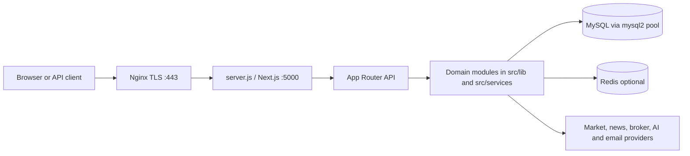
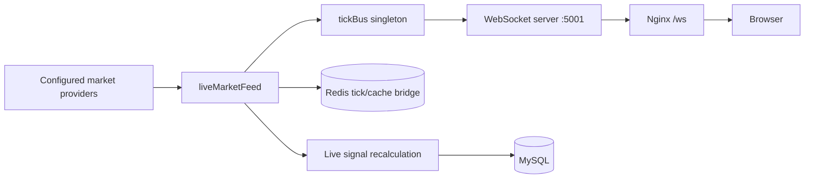
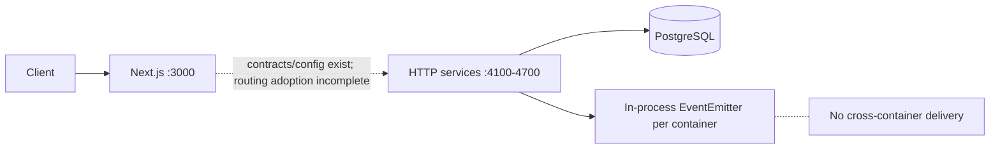
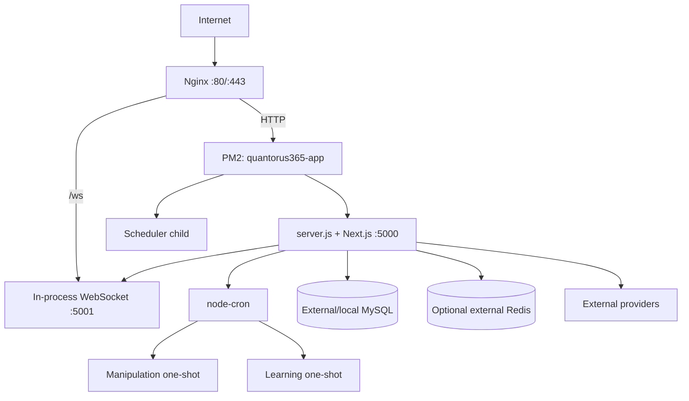

# Quantorus365 Current Architecture

Last audited: 2026-08-10

This document describes the implementation in the repository at the audit date. Source, runtime entry points, dependency declarations, and deployment configuration take precedence over older phase and migration documents.

## 1. Architecture Summary

**Verdict: HYBRID / PARTIAL MICROSERVICES.** The production VPS definition is primarily a modular Next.js monolith with supervised worker children and an in-process WebSocket server. A second, Docker Compose topology can start seven small HTTP services, but those services are incomplete extractions, share monolith source, use a process-local event bus, and are not the primary PM2 production path.

### Implemented architecture

- A Next.js 16 application supplies the React UI and 323 App Router API route files (`package.json`, `src/app`, `src/app/api`).
- `server.js` is the custom production entry used by the single PM2 application. It serves Next.js on port 5000, starts the live-feed WebSocket server on 5001 through `src/instrumentation.ts`, supervises the scheduler child, and launches two daily one-shot workers (`server.js`, `ecosystem.config.js`).
- The primary application and its workers use raw SQL through the MySQL `mysql2` pool in `src/lib/db.ts`. Redis is an optional shared cache/lock/tick transport with an in-memory fallback (`src/lib/redis.ts`).
- Nginx terminates TLS, proxies `/ws` to 5001 and all normal HTTP traffic to 5000 (`nginx.conf`).
- Structured JSON logging, Prometheus-format metrics, health endpoints, correlation IDs, RBAC, sessions, MFA, API keys, and security headers exist in application code.

### Partially implemented architecture

- Seven independently startable HTTP services exist under `services/`: market ingestion, market intelligence, alerting, signal engine, portfolio, identity, and reporting.
- `docker-compose.prod.yml` starts those seven services, Next.js, and PostgreSQL. The development Compose file starts only three extracted services, Next.js, and PostgreSQL.
- Five service/package directories contain generated-looking folders and migration directories, but the repository contains **no `schema.prisma`, no `PrismaClient` usage, and no Prisma package dependency**. These directories are not evidence of a working Prisma layer.
- PostgreSQL is implemented using `pg` plus handwritten SQL in `src/lib/db/postgres.ts` and several extracted services. The main application remains MySQL-based.

### Planned or not implemented

- RabbitMQ, AMQP, Kafka, NATS, or another durable broker is not implemented. `packages/eventbus/src/bus.ts` is an in-process `EventEmitter` bus.
- Redis Streams are discussed as a future adapter but are not implemented.
- OpenTelemetry and an OTel collector are not present. Metrics are custom Prometheus text and in-memory/Redis counters.
- Complete service-owned databases, durable cross-process events, Kubernetes, autoscaling, and full Prisma adoption are not implemented.

### Major dependencies and entry points

The core runtime depends on Next.js/React, `mysql2`, `pg`, `ioredis`, `ws`, `node-cron`, `bcryptjs`, `speakeasy`, `winston`, provider HTTP APIs, email providers, and broker adapters (`package.json`). Production entry points are Nginx -> `server.js` under PM2 for the VPS path, or port 3000 Next.js plus ports 4100-4700 for the Compose path.

## 2. Runtime Architecture

| Component | Responsibility | Entry point | Port | Database | Cache | Queue/event bus | Dependencies |
|---|---|---|---:|---|---|---|---|
| Next.js monolith/BFF | UI, 323 API routes, domain orchestration | `server.js` -> Next.js | 5000 PM2; 3000 standard/Compose | MySQL primary; limited PostgreSQL modules | Redis + process memory | In-process events only | providers, brokers, mail, worker modules |
| WebSocket/live feed | Poll/live feed, tick fan-out | `src/instrumentation.ts`, `src/lib/ws/streamServer.ts` | 5001 default | MySQL fallback paths | Redis tick bridge/cache | `tickBus` in process | market providers, `ws` |
| Production scheduler | Market/candle/signal schedules | `src/lib/workers/scheduler.ts`, supervised by `server.js` | none | MySQL | Redis heartbeats/locks | none durable | monolith libraries/providers |
| Manipulation scan | Daily surveillance one-shot at 13:00 UTC | `src/lib/workers/manipulationScannerCli.ts` | none | MySQL | optional Redis | none | monolith engine code |
| Learning scheduler | Daily calibration one-shot at 15:00 UTC | `src/lib/workers/learningScheduler.ts` | none | MySQL | optional Redis | none | monolith signal code |
| News ingestion scheduler | Optional npm-script process; not PM2-started | `src/lib/workers/newsIngestionScheduler.ts` | none | MySQL | optional Redis | none | news providers |
| Standalone WS CLI | Alternative, not PM2-started | `src/lib/ws/streamServerCli.ts` | 5001 default | inherited monolith paths | Redis | in-process tick bus | market providers |
| Market ingestion service | Snapshot/historical provider façade | `services/market-ingestion/src/server.ts` | 4100 | persistence package/monolith imports | monolith cache paths | in-process event bus | `src`, packages, provider APIs |
| Market intelligence service | News and corporate events | `services/market-intelligence/src/server.ts` | 4200 | PostgreSQL raw SQL (`intel`) | none local | in-process event bus | monolith news/provider code |
| Alerting service | In-memory alert rules/history | `services/alerting/src/server.ts` | 4300 | none active despite scaffolding | process memory | in-process event bus | shared service helper |
| Signal-engine service | Demo momentum consumer; real pipeline not wired | `services/signal-engine/src/server.ts` | 4400 | none | process memory | in-process event bus | monolith logger/contracts |
| Portfolio service | Read watchlists/holdings and overlay prices | `services/portfolio/src/server.ts` | 4500 | PostgreSQL raw SQL (`app`) | process-local price map | in-process event bus | shared monolith PostgreSQL layer |
| Identity service | Login/session/logout/user lookup | `services/identity/src/server.ts` | 4600 | PostgreSQL raw SQL (`auth`) | none | none | bcrypt, monolith logger/PG layer |
| Reporting service | In-memory async report jobs | `services/reporting/src/server.ts` | 4700 | PostgreSQL raw SQL (`app`) | process memory | none | monolith logger/PG layer |

The service image deliberately copies the entire `src` directory and packages (`services/Dockerfile`). Therefore service deployment is process isolation, not source or dependency independence. Each service can create its own PostgreSQL pool (default maximum 10), while the MySQL monolith pool defaults to 30 (`src/lib/db.ts`, `src/lib/db/postgres.ts`).

## 3. Service and Data Boundaries

| Domain/service | Implemented responsibility/API | Data ownership in code | Events | Boundary status |
|---|---|---|---|---|
| Main Next.js application | Nearly all UI/API/business behavior | Broad shared MySQL tables across auth, market, signals, portfolios, billing, brokers, security, operations | process-local publishers/consumers | Actual system owner; modular monolith |
| Market ingestion | `GET /snapshot`, `/historical`, `/health` | No exclusive store demonstrated | publishes `market.snapshot.updated` | Partial extraction; imports monolith provider code |
| Market intelligence | `GET /news`, `/events` | Reads `intel.corporate_events` in shared PostgreSQL | publishes `corporate.event.ingested` | Shared DB and in-process bus prevent independence |
| Alerting | rule CRUD/history | Rules and history are process memory | consumes snapshot; publishes `alert.triggered` | Data is lost on restart; events cannot cross containers |
| Signal engine | `/evaluate`, `/signals` | None in service; endpoints explicitly return unwired/empty results | consumes snapshot; publishes demo `signal.generated` | Skeleton; real engine remains under `src/lib/signal-engine` |
| Portfolio | watchlist/portfolio/holding reads | Direct reads of shared PostgreSQL `app.*` tables | consumes snapshot | No per-user authorization shown at service boundary |
| Identity | credential and session operations | Direct access to shared PostgreSQL `auth.users` and `auth.sessions` | none | Competes with monolith MySQL auth/session implementation |
| Reporting | queued report status | Jobs in process memory; reads shared `app.*` tables | none | Skeleton; PDF/CSV implementations remain in monolith |

Ownership violations are structural: all extracted services use the same root dependencies; most import `@/lib/*` or providers from the monolith; four query the same PostgreSQL instance directly; the event bus singleton is per process; and Compose exposes every service port on the host. There is no enforceable database-per-service boundary.

## 4. Request and Event Flows

### Primary production request

Sessions are read from an HTTP-only cookie, hashed/validated against MySQL, and enriched with RBAC permissions (`src/services/auth.ts`, `src/lib/session.ts`). API-key routes validate bearer keys and apply rate limits. Provider calls pass through provider-specific adapters, retry/circuit-breaker logic, and caches.

### Live market data

Redis outage degrades shared cache, distributed coordination, and cross-process tick visibility. Many cache calls fall back to per-process memory, which preserves availability but not consistency.

### Compose service flow and its limitation

`packages/contracts/src/api.ts` declares service URLs, but repository search found no production gateway call sites using those URL variables. The monolith API routes therefore remain the effective BFF implementation.

## 5. Database Architecture

### Current state

- **MySQL is the primary runtime database.** `src/lib/db.ts` creates a global `mysql2/promise` pool, defaults to 30 connections, caps its wait queue, configures UTF-8 collation and IST session time, and exposes a `db.query()` compatibility wrapper.
- **PostgreSQL is a side-by-side partial migration.** `src/lib/db/postgres.ts` creates a global `pg` pool (default maximum 10), provides query, transaction, health, and close helpers, and is used by extracted services and migration/validation paths.
- **Prisma adoption is 0%.** There is no Prisma schema, client import, generated client source, dependency, or executable Prisma migration in the current repository.
- PostgreSQL has 31 executable root SQL migrations and four `.proposal` files under `migrations/postgres`. MySQL has four root migration SQL files plus many programmatic boot-time/schema migration modules.
- The monolith performs boot-time DDL through `src/instrumentation.ts` and `src/lib/db/ensureSchemasSafely.ts`. This couples application availability and schema mutation.
- No managed proxy such as PgBouncer is configured. Every independent process/container owns its own pool.

### Adoption measurement

The audit found 299 persistence/runtime source files in `src`, `services`, and `packages` after excluding tests and proposal files: 289 reference the MySQL adapter or MySQL runtime semantics, and 10 reference the PostgreSQL layer. On that reproducible file-path basis, PostgreSQL adoption is **3%** (10 / 299, rounded); MySQL remains **97%**. This is a code-path estimate, not a measure of rows or production traffic.

There are **289 remaining MySQL runtime source paths**, including one direct runtime package dependency (`mysql2`). There are **280 raw-SQL runtime/source paths** matching query/execute calls under the same exclusions. Some are schema/migration utilities reachable by scripts or boot; the number is intentionally conservative. PostgreSQL paths also use raw SQL, so raw SQL and MySQL counts are not identical.

### MySQL categorization

| Category | Evidence | Status |
|---|---|---|
| Active runtime dependency | `mysql2` in `package.json`; `src/lib/db.ts`; hundreds of API/domain/worker imports | Active and primary |
| Active MySQL-specific SQL | `?` placeholders, `SHOW COLUMNS`, `INSERT IGNORE`, `ON DUPLICATE KEY`, `DATE_SUB`, `UNIX_TIMESTAMP`, backticks across repositories | Active runtime paths |
| Migration/setup | `src/lib/db/migrate*.ts`, `ensureAllSchemas.ts`, `setup.ts`, `migrations/mysql` | Active scripts; some boot reachable |
| Test-only | mocks and fixtures under `src/__tests__` and `*.vitest.ts` | Test only |
| Legacy/dead | Old phase docs and proposal files | Not used as runtime evidence |

Transactions exist in the PostgreSQL helper and some MySQL modules, but there is no repository-wide unit-of-work boundary. Index definitions are spread across SQL migrations, boot DDL, and scripts such as `scripts/addPerfIndexes.ts`.

## 6. Communication Architecture

### Synchronous

- Public and UI traffic uses Next.js HTTP routes behind Nginx.
- Extracted services expose built-in Node HTTP servers and use a shared bearer token (`SERVICE_AUTH_TOKEN`) in production (`services/_shared/httpService.ts`).
- Correlation IDs use `x-correlation-id` contracts.
- Service URL contracts exist, but gateway routing to the extracted services is not materially adopted.

### Asynchronous

Implemented event contracts in `packages/contracts/src/events.ts` include `market.snapshot.updated`, `corporate.event.ingested`, `signal.generated`, and `alert.triggered`. The in-process bus retries handlers up to three times with exponential backoff, retains at most 1,000 dead letters in memory, and keeps bounded in-memory idempotency sets (`packages/eventbus/src/bus.ts`).

There is no RabbitMQ dependency, configuration, queue declaration, acknowledgement mode, persistence, durable DLQ, consumer group, or cross-process transport. Restart loses queued/dead-letter state. Separately launched services do not exchange bus events.

## 7. Caching Architecture

`src/lib/redis.ts` implements Redis-first shared functions with a process-memory tier. It supports JSON values, TTL preservation when warming memory, scan-based invalidation, locks, quote/tick helpers, and short retry behavior. Feature-specific TTLs include live quotes/ticks (typically 15-120 seconds), ticker/rankings caches (about 30-60 seconds), and longer policy-based data caches (`src/lib/cache`, market-data modules).

Cache ownership is distributed across API/domain modules; keys are partially centralized in `src/lib/cache`. Invalidation is explicit by key/pattern or expiry, not event-driven globally. When Redis is disabled or first fails, most helpers silently use process memory. Consequences are stale/divergent cache values across workers and replicas, loss of distributed locks, and loss of cross-process tick/state sharing. Modules that require a real distributed lock can report `unavailable` rather than falsely treating memory as distributed.

Compose files do not start Redis, so it must be external or disabled. No Redis persistence/eviction configuration is versioned here.

## 8. Authentication and Security

- Monolith authentication uses bcrypt password hashes and random session tokens; stored sessions are looked up through MySQL and delivered by secure cookie configuration in the auth routes/services.
- TOTP MFA uses `speakeasy`; RBAC supports user/admin/analyst-style permission checks; public quant APIs support hashed API keys (`src/services/auth.ts`, `src/lib/security`, `src/lib/quant-platform/api-platform/apiKeyAuth.ts`).
- Application rate limiting has Redis-backed and in-memory implementations. Provider-specific rate limits, retries, and circuit breakers are separate.
- Nginx terminates TLS and adds basic anti-sniffing/frame/referrer headers. Application CSP and permissions-policy helpers exist (`nginx.conf`, `src/lib/security/csp.ts`).
- Broker secrets/tokens have encryption helpers and kill switches; secrets are expected in environment files. `.env.local` and `.env.production` exist locally but are ignored and must never be committed or copied into images/artifacts.
- Extracted services require one shared bearer token in production. There is no mTLS or workload identity.

Security gaps supported by code/config:

- Docker Compose publishes database and all internal service ports to the host.
- A single shared service token has broad authority and is optional outside production.
- Service endpoints accepting `user_id` do not demonstrate end-user authorization or tenancy checks.
- In-memory rate limiting is replica-local during Redis failure.
- Nginx includes obsolete `X-XSS-Protection` and does not show HSTS in the inspected configuration.
- CSRF protection is not consistently evident across state-changing cookie-authenticated routes; SameSite cookies reduce but do not replace deliberate CSRF review.
- Docker services import the entire monolith and therefore inherit a large dependency and secret-access surface.

## 9. Observability

Implemented:

- JSON structured logger with levels and repeated-log suppression (`src/lib/logger.ts`). PM2 writes stdout/stderr to application log files.
- Correlation ID propagation in extracted services and shared contracts.
- `/api/metrics` emits Prometheus text from custom in-memory metrics and mirrors selected health counters to Redis (`src/app/api/metrics/route.ts`, `src/lib/monitor`).
- Application and service health endpoints; Docker health checks for PostgreSQL, Next.js, and extracted service images.
- Admin/reliability dashboards and operational alert delivery through email/Slack configuration.

Not implemented/configured:

- No OpenTelemetry SDK, collector, exporter, trace backend, or distributed spans.
- No Prometheus/Grafana container or scrape configuration is versioned.
- Metrics are process-local unless explicitly mirrored; aggregation across replicas is incomplete.
- The Docker Next.js health check probes a market quote endpoint rather than a dedicated readiness endpoint, so provider failure can conflate dependency and process health.
- Compose service readiness is not used by Next.js `depends_on`; only start ordering is guaranteed for services.

## 10. Deployment Architecture

### Local development

`npm run dev` starts only Next.js on port 3000. `src/instrumentation.ts` can also start WebSockets, candle refresh, retention, and the development in-process scheduler. PostgreSQL, Redis, MySQL, and extracted services are not automatically started by that command. `docker-compose.dev.yml` provides PostgreSQL plus three extracted services and Next.js, but not MySQL or Redis despite the monolith's active dependence on them.

### Docker Compose

The production Compose topology starts PostgreSQL 16, seven services, and a standalone Next.js image. It declares resource limits but no Redis, RabbitMQ, Nginx, backups, telemetry collector, or MySQL. Consequently it is not a complete representation of the current monolith runtime. The shared service image runs TypeScript via `npx tsx` and installs `tsx` during image build.

### VPS/PM2 production

PM2 runs one fork with a 1 GB restart threshold. `server.js` supervises children, performs graceful shutdown, and caps restarts. Persistent DB/cache volumes and backups are host/operator responsibilities in this path. `setup-vps.sh` and `scripts/deployAndValidate.sh` assist deployment; GitHub Actions runs typecheck, lint, selected blocking tests, builds, operational gates, and non-blocking suites.

## 11. Dependency Architecture

The dependency direction is approximately UI -> API routes -> `src/services`/`src/lib` -> adapters -> MySQL/Redis/providers. In practice, API routes often import repositories directly, domain modules execute raw SQL, boot instrumentation imports database and worker logic, and extracted services import monolith internals. Path aliases make shared imports convenient but obscure service boundaries.

High coupling points:

- `src/lib/db.ts` is shared by most persisted domains and includes SQL dialect translation.
- `src/instrumentation.ts` owns schema mutation, providers, WebSocket, multiple schedulers, universe loading, and startup recovery.
- `services/Dockerfile` copies all of `src` into every service image.
- The event-bus singleton assumes one process while Compose assumes many.
- Identity, portfolio, and reporting query shared logical schemas directly rather than calling an owning service.

No package-level circular dependency graph was generated at runtime, but these shared inward/outward imports create architectural cycles in responsibility: services depend on the monolith they are intended to replace, and the proposed gateway contracts coexist with monolith implementations.

## 12. Current Architecture Risks

| Risk | Severity | Evidence | Impact | Recommended fix |
|---|---|---|---|---|
| Compose topology omits active MySQL dependency | P0 Critical | `docker-compose*.yml`, `src/lib/db.ts` | Stack can start but core API routes fail | Add MySQL to supported topology or complete/test PostgreSQL cutover before claiming Compose production readiness |
| Cross-process events are not delivered | P0 Critical | `packages/eventbus/src/bus.ts`, seven containers in prod Compose | Alerts/signals/portfolio updates silently do not propagate | Implement a durable broker/Redis Streams adapter with contract tests, ACK/retry/DLQ semantics |
| Primary persistence remains MySQL/raw SQL | P1 High | 289 MySQL paths; `mysql2` dependency | Migration drift, dialect coupling, broad blast radius | Inventory endpoints by traffic, migrate domain by domain, remove compatibility shim after cutover |
| Prisma scaffolding is absent | P1 High | no schema/client/dependency | Claimed model ownership/migrations cannot be reproduced | Either implement and generate Prisma properly or remove misleading empty/generated directories |
| Services are skeletons and import monolith source | P1 High | service TODOs, empty responses, `services/Dockerfile` | False isolation; oversized images; coupled releases | Extract real domain packages and contract-test behavior before routing traffic |
| Shared DB ownership and caller-supplied user IDs | P1 High | portfolio/reporting/identity service SQL | Authorization/data isolation errors | Establish owner APIs and authenticated principal propagation; deny direct cross-domain reads |
| Boot-time DDL and many process pools | P1 High | `src/instrumentation.ts`, DB helpers | startup stalls, lock contention, connection exhaustion | Run migrations as a deployment job; budget connections centrally/PgBouncer |
| Redis fallback loses distributed guarantees | P2 Medium | `src/lib/redis.ts` | duplicate work and inconsistent caches after outage | Separate availability cache from required coordination; fail closed for distributed locks |
| Health/readiness conflation | P2 Medium | Dockerfiles/Compose | restart storms or premature routing | Add dedicated liveness and readiness probes with explicit dependency policy |
| In-memory jobs/rules/DLQ | P2 Medium | reporting, alerting, eventbus | state loss on restart | Persist jobs/rules/events in owned stores |
| Missing distributed tracing and scrape stack | P2 Medium | no OTel/Prometheus deployment config | slow cross-component diagnosis | Add trace/metric exporters, scrape config, dashboards and retention |
| Broad host port exposure | P2 Medium | prod Compose ports | unnecessary attack surface | expose only gateway/reverse proxy; use internal Compose networks |
| Resource limits only partially enforceable | P3 Low | Compose `deploy.resources` on non-Swarm hosts | sizing expectations may not match runtime | use Compose-supported limits or orchestrator policy and verify enforcement |

## 13. Architecture Completion Assessment

| Area | Completion | Evidence |
|---|---:|---|
| Microservice decomposition | 25% | Seven servers exist, but most business behavior and all primary routes remain in monolith; some services are explicit skeletons |
| Runtime isolation | 35% | Compose can isolate processes, but shared source/dependencies and process-local events break functional isolation |
| PostgreSQL migration | 3% | 10 PostgreSQL vs 289 MySQL persistence paths on the documented file-path metric |
| Prisma adoption | 0% | No dependency, schema, client, or executable Prisma migration |
| Data ownership | 20% | Logical PG schemas exist, but services share one DB and query domains directly; MySQL remains broadly shared |
| Messaging architecture | 15% | Typed events, retry and memory DLQ exist only in process; no durable transport |
| Cache architecture | 65% | Redis abstraction, TTLs, locks, invalidation, metrics and fallback exist; ownership and consistency remain decentralized |
| Security | 65% | Sessions, hashing, MFA, RBAC, API keys, rate limits, encryption and TLS config exist; service auth/port/CSRF gaps remain |
| Observability | 55% | Structured logs, metrics, health, correlation IDs and dashboards exist; no tracing/scrape deployment |
| Deployment independence | 25% | Service containers exist, but primary PM2 production is one application and Compose is missing active infrastructure |

These percentages express implementation maturity, not roadmap effort. They should be recalculated after traffic-level route tracing and production validation.

## Evidence and Validation Limits

Primary evidence inspected includes `package.json`, lockfile, `server.js`, `ecosystem.config.js`, `next.config.js`, `nginx.conf`, both Compose files, both Dockerfiles, `.env.example` (keys only), `src/app/api`, `src/instrumentation.ts`, `src/lib/db*`, `src/lib/redis.ts`, workers/schedulers, WebSocket/market-data modules, security/auth modules, all `services/*/src/server.ts`, `services/_shared`, `packages/contracts`, `packages/eventbus`, `packages/rpc`, migrations, scripts, tests, and `.github/workflows/ci.yml`.

No production infrastructure was executed, secrets were not printed, database sizes and traffic distributions are unknown, and no representative load test was run. Architecture confidence is therefore **88/100 for repository structure and code paths**, but materially lower for production capacity and runtime behavior.
