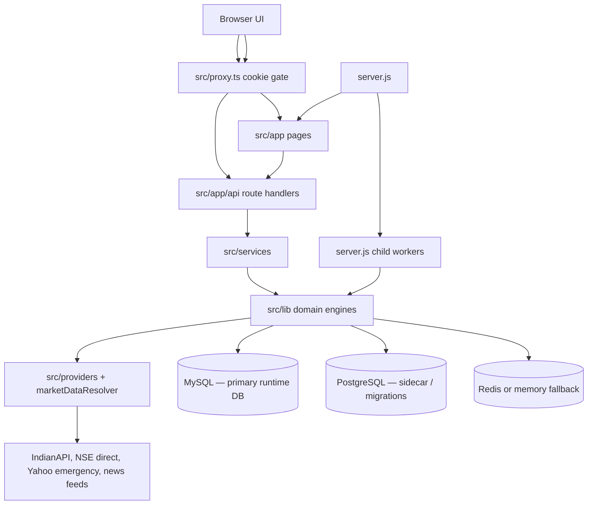
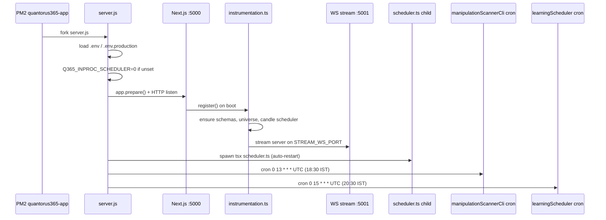
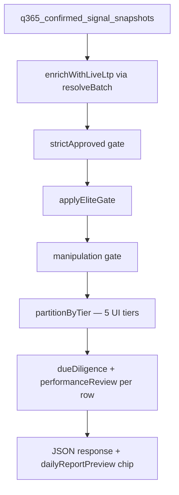
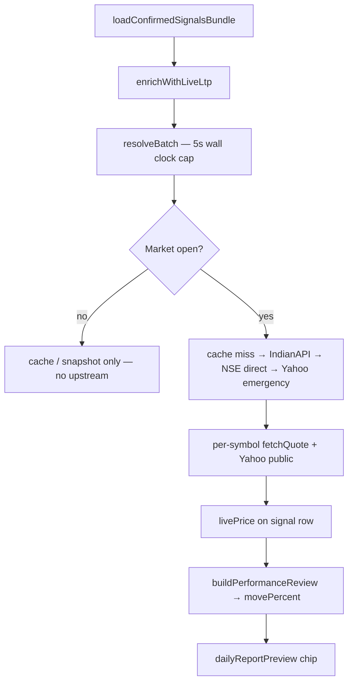
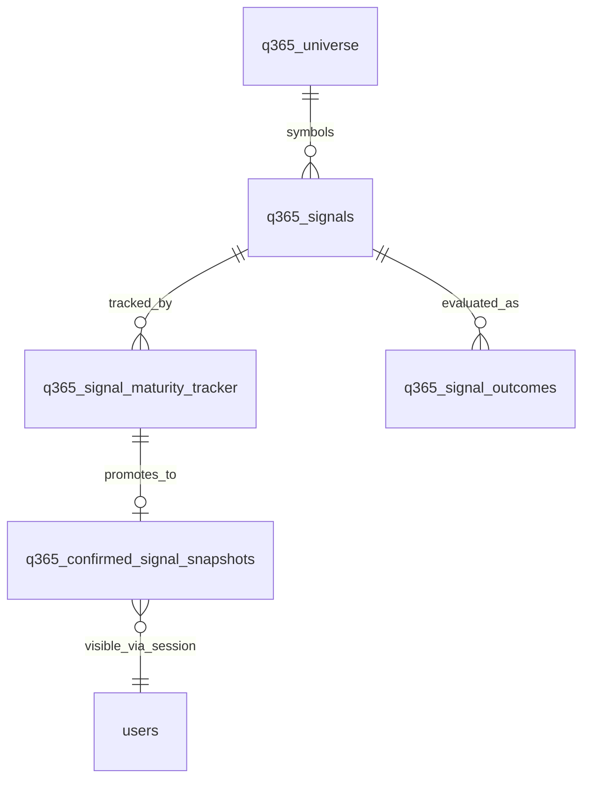
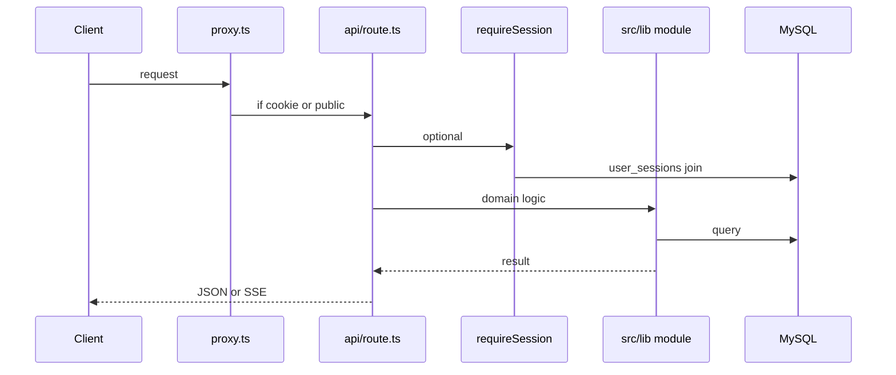

# Project Architecture

**Project:** Quantorus365  
**Version from `package.json`:** 2.1.0  
**Last analyzed:** 2026-07-10  
**Scope:** Current implementation in source code, `package.json`, `server.js`, `ecosystem.config.js`, workers, and migrations. Generated/vendor directories (`.next/`, `node_modules/`) are excluded from architectural conclusions.

> **Source of truth:** This document describes what the code does today. Where older docs (`docs/signal-engine-flow.md`, `docs/database-inventory.md`, proposal SQL files) disagree with implementation, the code wins. Planned or deprecated features are called out explicitly.

---

## 1. Overview

Quantorus365 is an institutional stock intelligence platform for Indian equity markets: signal generation, portfolio/risk, backtesting, news intelligence, manipulation surveillance, and trading workflows.

The active runtime is a **Next.js 16 App Router monolith** plus **worker child processes** started by `server.js`. Browser pages live under `src/app/**/page.tsx`, API handlers under `src/app/api/**/route.ts`, orchestration in `src/services/`, and domain engines in `src/lib/`. Standalone microservice scaffolds exist under `services/` and `packages/` but most product behavior runs inside the Next.js app and its workers.



### Core technologies

| Area | Technology | Current usage |
|---|---|---|
| Frontend | Next.js 16, React 18, TypeScript | App Router, SCSS modules |
| Runtime DB | **MySQL** (`mysql2/promise`) | `src/lib/db.ts` — dominant path for signals, auth, candles warehouse |
| Sidecar DB | PostgreSQL (`pg`) | `src/lib/db/postgres.ts`, `migrations/postgres/`, service scaffolds |
| Cache | Redis + in-memory | `src/lib/redis.ts`, `src/lib/cache.ts` |
| Market data | IndianAPI primary | `IndianAPIAdapter.ts` → `marketDataResolver.ts` |
| Workers | `node-cron`, `tsx` | `src/lib/workers/scheduler.ts`, `dailyScanSchedule.ts` |
| Auth | Cookie sessions, bcrypt, TOTP | `q200_session`, `src/services/auth.ts` |

### Design principles (observed in code)

| Principle | Evidence |
|---|---|
| Risk-first decisioning | Phase 3 rejection engine, strict/elite/manipulation gates on read path |
| Provider discipline | Live prices via `resolveBatch` / `MarketDataProvider`; scan crons are DB-only |
| Session-first UI | `src/proxy.ts` + `requireSession()` on sensitive APIs |
| Additive schema | `ensureAllSchemas.ts`, idempotent `CREATE TABLE IF NOT EXISTS` |
| Single scheduler owner | `server.js` sets `Q365_INPROC_SCHEDULER=0` to avoid duplicate crons |
| Maturity-only promotion | Confirmed snapshots written only by `signalMaturity.ts`, not scanner |

---

## 2. Production Runtime Topology

**Production entry:** `npm run start:server` → `node server.js` (PM2: `ecosystem.config.js` → single app `quantorus365-app`).

`npm start` runs `next start -p 3000` and is **not** the VPS production path.



| Process | Port / trigger | File |
|---|---|---|
| Next.js HTTP | `PORT` default **5000** | `server.js` |
| WebSocket stream | `STREAM_WS_PORT` default **5001** | `src/instrumentation.ts` |
| Long-running scheduler | Child of `server.js` | `src/lib/workers/scheduler.ts` |
| Manipulation one-shot | Daily 18:30 IST (UTC cron) | `manipulationScannerCli.ts` |
| Learning one-shot | Daily 20:30 IST (UTC cron) | `learningScheduler.ts` |

**Removed:** Kite WebSocket tick server (`server.js` comments). Live ticks use IndianAPI polling + in-process `tickBus` fan-out.

**Dev:** `npm run dev` → `next dev`. In-process scheduler optional via `Q365_INPROC_SCHEDULER=1` (`bootInProc.ts`).

---

## 3. Signal Scanning Pipeline

### Entry points

| Trigger | File | Notes |
|---|---|---|
| Cron (primary) | `src/lib/workers/dailyScanSchedule.ts` | Mon–Fri IST; registered by `scheduler.ts` |
| Manual script | `scripts/runDailyScanJob.ts` | `npm run scans:morning` etc. |
| HTTP manual | `POST /api/run-signal-engine` | `src/app/api/run-signal-engine/route.ts` |
| Legacy opt-in | `SIGNAL_INTRADAY_REGEN_ENABLED=true` | */10 Phase-4 regen, */5 rescore (default **off**) |

### Scan flow (write path)

```mermaid
flowchart LR
    subgraph triggers [Triggers]
        Cron[dailyScanSchedule IST crons]
        Manual[POST /api/run-signal-engine]
    end

    subgraph ingest [Candle input]
        DBOnly[fetchDailyCandlesWithFallback dbOnly=true]
        EOD[runCandleDailyUpdateJob IndianAPI 16:00 IST]
    end

    subgraph phase4 [Phase 4 pipeline]
        P3[generatePhase3Signals]
        P4[generatePhase4Signals + Phase11]
        Save[saveSignals]
    end

    subgraph maturity [Promotion path]
        Tracker[q365_signal_maturity_tracker]
        Worker[signalMaturity.ts every 60s]
        Snap[q365_confirmed_signal_snapshots]
    end

    Cron --> DBOnly
    Manual --> DBOnly
    EOD --> DBOnly
    DBOnly --> P3 --> P4 --> Save
    Save --> q365_signals[(q365_signals)]
    Save --> Tracker
    Worker --> Tracker
    Worker --> Snap
    Snap --> ReadPath[/api/signals read path]
```

**Key rules (current code):**

1. **Scheduled scans use DB-only candles** — no IndianAPI during scan (`dailyScanSchedule.ts` passes `dbOnly: true`).
2. **`saveSignals()`** upserts `q365_signals` and upserts maturity tracker rows; it does **not** write confirmed snapshots.
3. **`runSignalMaturityWorker()`** (60s interval) is the **only** promoter to `q365_confirmed_signal_snapshots`.
4. **`runConfirmedSnapshotLifecycle()`** (30s) mutates snapshot status (TARGET_HIT, STOP_LOSS_HIT, EXPIRED, INVALIDATED) — no new promotions.

### Phase pipeline (summary)

| Phase | Module | Output |
|---|---|---|
| 1 | `generatePhase1Signals` | Universe features, strategy matching |
| 2 | `generatePhase2Signals` | Scoring, conflict resolution |
| 3 | `generatePhase3Signals` | Trade plan, risk, portfolio fit, rejection engine |
| 4 | `generatePhase4Signals` | News/macro enrichment, explanations, Phase 11 pipeline |
| Persist | `saveSignals.ts` | `q365_signals` + Phase 3/4 artifact tables |

---

## 4. Signal Approval Pipeline (Read Path)

`/api/signals` does **not** scan. It reads confirmed snapshots and assembles the response in `src/lib/signals/responseAssembly.ts` via `loadConfirmedSignalsBundle()` (`confirmedSignalsService.ts`).



### Layer A — Strict gate (`confirmedSignalPolicy.ts`)

Applied when loading confirmed snapshots. Env-overridable floors (defaults):

- Confidence ≥ **55** (`SIGNAL_API_STRICT_CONFIDENCE_FLOOR`)
- Final score ≥ **60** (`SIGNAL_API_STRICT_FINAL_FLOOR`)
- Risk:reward ≥ **1.5** (`SIGNAL_API_STRICT_RR_FLOOR`)
- Stress ≥ **60** (`SIGNAL_API_STRICT_STRESS_FLOOR`)
- Classification whitelist (no `MEDIUM_CONVICTION`)
- Cap: `Q365_CONFIRMED_CAP` (default **20**, max **30**)

### Layer B — Elite gate (`applyEliteGate` in `confirmedSignalPolicy.ts`)

Applied in `responseAssembly.ts`. Stricter floors (confidence **70**, final **60**, RR **1.5**, factor floors). Bypass: `ELITE_GATE=0`. Soft freeze demotes rows when feed is stale (`APPROVAL_FREEZE_MODE`).

### Layer C — Manipulation gate (`manipulationSignalRisk.ts`)

`canAffectApproval` only when `freshnessStatus === 'FRESH'` **and** band ∈ `{ELEVATED, HIGH, SEVERE}`. Stale/no-data → warning only, cannot demote.

### Layer D — UI tiers (`signalTierClassifier.ts`)

`EXECUTION_READY`, `HIGH_POTENTIAL`, `AWAITING_CONFIRMATION`, `EMERGING_OPPORTUNITY`, `MONITOR`, `RISK_RESTRICTED`.

### Empty approved set

No fallback from `q365_signals` to main table (spec: empty stays empty). Off-hours may serve `loadClosedMarketSignals()` from last-close warehouse.

---

## 5. Maturity & Stability Engine

| Item | Location |
|---|---|
| Scoring (pure) | `src/lib/signal-engine/maturity/maturityScorer.ts` |
| Tracker repo | `src/lib/signal-engine/repository/maturityTracker.ts` |
| Worker | `src/lib/cron/signalMaturity.ts` |
| Snapshot insert | `src/lib/signal-engine/repository/confirmedSnapshots.ts` |

**Schedule:** `setInterval` every **60s** in `scheduler.ts` and `bootInProc.ts` (24×7).

**Promotion thresholds (env):**

- `MATURITY_MATURE_THRESHOLD` (default **70**)
- `MATURITY_MIN_CYCLES` (default **3**)
- `MATURITY_PROMOTE_THRESHOLD`
- Stability raw floor `STABILITY_RAW_PROMOTION_FLOOR` (default **0.55**)
- Regime veto: `REGIME_GATE_THRESHOLD = 0.5`

**Table:** `q365_signal_maturity_tracker` (candidate → developing → mature → promoted/terminated).

Worker does **not** call `resolveBatch`; uses `q365_data_feed_health` for data-quality gating.

---

## 6. Live Price Enrichment



| Function | File | Role |
|---|---|---|
| `resolveBatch` | `marketDataResolver.ts` | Primary batch resolver; NIFTY500 lock; market-closed gate |
| `enrichWithLiveLtp` | `confirmedSignalsService.ts` | Sets `livePrice`, `livePChange`, `liveSource` on snapshot rows |
| `buildPerformanceReview` | `signalDueDiligence.ts` | `movePercent` from `entry_price` + `livePrice` |

**Env:** `SIGNALS_ENRICH_TIMEOUT_MS` (default **5000**), `NIFTY500_LOCK`, `MARKET_CLOSED_RESOLVER_GATE`, `YAHOO_EMERGENCY_FALLBACK_ENABLED`, `INDIANAPI_PRIMARY`, `FORCE_NSE_MODE`.

**Also used by:** `/api/signals/stream` (SSE), `/api/rankings`, `liveMarketFeed.ts`, `dualSource/dataSourceManager.ts`.

Confirmed snapshot rows have `entry_price` but **no** `ltp` fallback on the read path — if `livePrice` is null after enrichment, `movePercent` is null.

---

## 7. Daily Signal Intelligence Report

| Layer | File |
|---|---|
| Pure builder | `src/lib/signals/dailySignalReport.ts` — `buildDailySignalReport()` |
| API | `GET /api/signals/daily-report` — parallel market movers + internal `/api/signals` |
| UI | `src/app/signals/daily-report/page.tsx` |
| Chip on Signals page | `buildLightweightDailyReportPreview()` in `responseAssembly.ts` |

### Status logic (implementation)

**Overall `reportStatus`** (`buildDailySignalReport`):

- **COMPLETE** — at least one of {indicator, sector, time-window, missed-opportunities} sections is `COMPLETE`
- **PARTIAL** — any section is `COMPLETE` or `PARTIAL`
- **INSUFFICIENT_DATA** — otherwise

In practice, **COMPLETE** is most often reached when **missed opportunities** has EOD market movers from the `candles` warehouse (`getHistoricalMarketMovers`). Indicator/sector/time-window sections max out at **PARTIAL** without `livePrice` outcome data on rows.

**Signals page chip** (`buildLightweightDailyReportPreview`) uses a **stricter** rule: `PARTIAL` only when `approvedSuccess` or `highPotentialPerformed` is non-null (requires `movePercent`). It never shows `COMPLETE`.

**Not persisted:** Historical daily reports — `migrations/postgres/011_q365_daily_signal_reports.sql.proposal` not applied.

**Engine Health mapping** (`engineHealthMap.ts`): Daily Report node `WARNING` when `reportStatus === 'PARTIAL'` with actionable warnings; `HEALTHY` when `COMPLETE` or partial with only expected platform-gap warnings.

---

## 8. Signal Feedback & Outcome Evaluation

| Item | Detail |
|---|---|
| Cron | **20:00 IST** Mon–Fri — `scheduler.ts` / `bootInProc.ts` |
| API | `POST /api/signal-engine/feedback/evaluate` |
| Core | `src/lib/signal-engine/feedback/runOutcomeEvaluation.ts` |
| Input | `q365_signals` + post-signal candles from `market_data_daily` |
| Output | `q365_signal_outcomes` (idempotent DELETE+INSERT), strategy/calibration snapshots |
| Params | `minBarsSinceEntry` default **5**, `staleHours: 20`, batches of **1000** |

**Separate:** `learningScheduler.ts` — additional learning jobs (spawned by `server.js` at 20:30 IST).

**Tables:** `q365_signal_outcomes`, `q365_strategy_performance_snapshots`, `q365_confidence_calibration`, `q365_adaptive_recommendations`, `q365_learning_job_runs`.

---

## 9. Scheduler & Cron Jobs (IST, Mon–Fri unless noted)

### Daily signal schedule (`dailyScanSchedule.ts`)

Controlled by `DAILY_SCAN_SCHEDULE_ENABLED` (default on). Timezone: `Asia/Kolkata`.

| IST | Cron default | Job |
|---|---|---|
| 08:30 | `30 8 * * 1-5` | Readiness check (universe + candles, no signals) |
| 09:20 | `20 9 * * 1-5` | First morning scan — DB-only Phase 4 |
| 09:45 | `45 9 * * 1-5` | Main morning scan — DB-only Phase 4 |
| 12:30 | `30 12 * * 1-5` | `rescoreActiveSignals()` |
| 14:45 | `45 14 * * 1-5` | Late rescore |
| 16:00 | `0 16 * * 1-5` | Evening candle update — **IndianAPI** EOD (+ bhavcopy fallback) |
| 16:30 | `30 16 * * 1-5` | Evening scan — DB-only Phase 4 post-EOD |
| 18:30 | `30 18 * * 1-5` | Manipulation scan (`skipIngestion: true`) |

Cron expressions overridable via `READINESS_CHECK_CRON`, `FIRST_MORNING_SCAN_CRON`, `MAIN_MORNING_SCAN_CRON`, `MIDDAY_RESCORE_CRON`, `LATE_RESCORE_CRON`, `EVENING_UPDATE_CRON`, `CANDLE_DAILY_UPDATE_CRON`, `EVENING_SCAN_CRON`, `MANIPULATION_DAILY_SCAN_CRON`.

### Additional jobs (`scheduler.ts`)

| IST | Job |
|---|---|
| 19:00 Mon–Fri | Nightly backtest |
| 19:30 Mon–Fri | EOD bhavcopy ingestion + `runDailyManipulationScan()` (with ingestion) |
| 20:00 Mon–Fri | Outcome evaluation (up to 20 × 1000 batch) |
| */5 9–15 | Legacy rescore if `SIGNAL_INTRADAY_REGEN_ENABLED` |
| */10 9–15 | Legacy Phase-4 regen if `SIGNAL_INTRADAY_REGEN_ENABLED` |
| 30s interval | Confirmed snapshot lifecycle |
| 60s interval | Maturity worker |
| 5m interval | Alert monitor (`ALERT_MONITOR_DISABLED` to skip) |
| 1m interval | Backtest queue drain if `BACKTEST_QUEUE_SCHEDULER_ENABLED` |
| Sun 22:00 | Weekly universe rebuild if `UNIVERSE_WEEKLY_REBUILD_ENABLED` |

### Market data scheduler (`src/lib/scheduler.ts`)

| IST | Job |
|---|---|
| 09:20 | Pre-open warmup |
| 09:25 | Full-universe candle warmup if `PREOPEN_CANDLE_WARMUP_ENABLED` |
| */10 09:30–15:30 | Tier A batch quotes |
| Every minute 9–15 | Heartbeat tier |
| :05,:25,:45 9–15 | Tier B |
| :15 9–15 | Tier C intel |
| 15:35 | Post-close batch |
| 09:00 Sat/Sun | Weekend intel refresh |

### Boot-time schedulers (`instrumentation.ts`)

- `candleRefreshScheduler.ts`
- `feedHealthRetention.ts`
- Optional `bootInProcScheduler()` when `Q365_INPROC_SCHEDULER=1`

**Note:** Manipulation can be triggered from three places in production (18:30 daily scan, 19:30 scheduler ingestion+scan, 18:30 UTC cron one-shot from `server.js`). Operators should treat logs as source of truth for which run executed.

---

## 10. Market Data & External Integrations

### Resolver chain (market open)

`src/lib/marketData/resolver/marketDataResolver.ts`:

1. **NIFTY500 lock** — reject symbols outside universe (`NIFTY500_LOCK !== '0'`)
2. **Market-closed gate** — no IndianAPI/NSE/Yahoo; cache or `MARKET_CLOSED` (`MARKET_CLOSED_RESOLVER_GATE`)
3. **Cache-first** — per-symbol quote cache
4. **IndianAPI** — `getBatchQuotes` / emulated `/stock` fan-out (`IndianAPIAdapter.ts`)
5. **NSE direct** — rare fallback (`nseDirectProvider.ts`), caps via `NSE_DIRECT_FALLBACK_*`
6. **Yahoo emergency** — only if `YAHOO_EMERGENCY_FALLBACK_ENABLED=true` (`mayUseYahoo()`)

### Provider flags (`providerFlags.ts`)

- `INDIANAPI_PRIMARY=true` wins over `MARKET_DATA_PROVIDER`
- `LIVE_FEED_PROVIDER` — `yahoo` (default), `indianapi`, or `auto` for WS poll loop
- `FORCE_NSE_MODE=1` — skip IndianAPI primary
- `MARKET_DATA_PROVIDER=legacy` — resolver short-circuit (rollback kill-switch)

### IndianAPI

| Concern | Files |
|---|---|
| HTTP adapter | `src/providers/adapters/IndianAPIAdapter.ts` |
| Endpoints catalog | `src/lib/marketData/providers/indianApiEndpoints.ts` |
| High-level wrapper | `src/lib/marketData/providers/indianApiProvider.ts` |
| Quota / budget | `indianApiUsageTracker.ts`, `providerRequestLog.ts`, `apiBudgetGuard.ts` |
| 429 circuit breaker | Built into adapter (`INDIANAPI_429_BACKOFF_MS`) |

**Verify script:** `npx tsx scripts/verifyIndianApiEndpoints.ts`

### Yahoo / Kite

- **Yahoo:** Emergency fallback path + `fetchYahooPublicQuote` in enrich fallback; `YahooAdapter.ts` largely stubbed for primary paths (`@deprecated` markers).
- **Kite:** Removed from live market-data path; broker modules may remain.

### Evening candles

- `runCandleDailyUpdateJob()` — IndianAPI `historical_data`
- Warehouse tables: `candles`, `market_data_daily`
- Bhavcopy fallback: `runDailyEodIngestion()` at 19:30 IST

---

## 11. Database Architecture (High-Level)

**Runtime:** MySQL via `src/lib/db.ts` (`db.query()`). No ORM. PostgreSQL via `src/lib/db/postgres.ts` for migrations and service scaffolds.

### Core `q365_*` tables (MySQL)

| Domain | Tables |
|---|---|
| Signals (live) | `q365_signals`, `q365_signal_reasons`, `q365_signal_feature_snapshots`, `q365_signal_lifecycle`, `q365_signal_trade_plans`, `q365_signal_execution_readiness`, … |
| Confirmed / maturity | `q365_confirmed_signal_snapshots`, `q365_signal_maturity_tracker` |
| Outcomes / learning | `q365_signal_outcomes`, `q365_strategy_performance_snapshots`, `q365_confidence_calibration`, `q365_adaptive_recommendations`, `q365_learning_job_runs` |
| Manipulation | `q365_manipulation_snapshots`, `q365_manipulation_events`, `q365_manipulation_detector_results`, `q365_manipulation_penalties` |
| Universe / ops | `q365_universe`, `q365_pipeline_run_locks`, `q365_data_feed_health`, `q365_market_close_snapshot`, `q365_alerts` |
| News | `q365_news_events`, `q365_news_scores`, … |
| Backtests | `q365_backtest_runs` + domain tables in `backtesting/repository/migrate.ts` |
| Auth (MySQL) | `users`, `user_sessions`, `password_resets` |



Schema ensure: `src/lib/db/ensureAllSchemas.ts` on boot. Domain migrations: `src/lib/db/migrate*.ts`, `migrateSignalEngine.ts`.

---

## 12. API Surface (Signals & Intelligence)

~**282** route handlers under `src/app/api/**/route.ts`. OpenAPI: `GET /api/openapi` (admin in production).

### Signals cluster

| Route | Methods | Role |
|---|---|---|
| `/api/signals` | GET | Main board — confirmed snapshots + assembly |
| `/api/signals/stream` | GET SSE | Live price stream |
| `/api/signals/daily-report` | GET | Daily Signal Intelligence Report |
| `/api/signals/engine-health` | GET | Engine health map |
| `/api/signals/freshness` | GET | Freshness probe |
| `/api/signals/backtest` | GET | Backtest preview |
| `/api/run-signal-engine` | GET, POST | Manual pipeline + lock status |
| `/api/signal-engine` | GET | `generate` / `latest` / `regime` |
| `/api/signal-engine/feedback/evaluate` | POST | Outcome evaluation |
| `/api/scanner/custom-universe/run` | POST | Custom universe scan |
| `/api/dashboard` | GET | Fused dashboard (`internalFetch` to signals, health, daily report) |

### Auth model

| Label | Meaning |
|---|---|
| `PUBLIC` | In `proxy.ts` allowlist |
| `COOKIE` | Proxy cookie only — weaker |
| `SESSION` | `requireSession()` — DB-backed |
| `ADMIN` | `requireAdmin()` |

`/api/signals`, `/api/signals/daily-report`, `/api/run-signal-engine` require **SESSION**.

---

## 13. Frontend ↔ Backend (Signals)

| Page | Path | Primary APIs |
|---|---|---|
| Signal Engine | `src/app/signals/page.tsx` | `GET /api/signals?action=all`, SSE `/api/signals/stream`, `GET /api/run-signal-engine?status=true`, `POST /api/run-signal-engine` |
| Daily Report | `src/app/signals/daily-report/page.tsx` | `GET /api/signals/daily-report?date=` |
| Engine Health | `src/app/signals/engine-health/page.tsx` | `GET /api/signals/engine-health` |
| Signal detail | `src/app/signals/[key]/page.tsx` | `GET /api/signals?action=instrument` |
| Dashboard | `src/app/dashboard/page.tsx` | `GET /api/dashboard` |
| Market | `src/app/market/page.tsx` | Market data routes |

**Polling:** `useSignalsPolling.ts` — HTTP poll carries `dailyReportPreview`, `healthPreview`, tier pools. SSE updates live prices client-side but does not update daily report chip.

**Shell:** `AppShell.tsx` — nav, ticker, notification poll `/api/notifications?summary=1`.

---

## 14. Application Flow

### Routing & auth

- `src/proxy.ts` — cookie presence gate for protected paths
- `POST /api/auth` — login, TOTP, session cookie `q200_session`
- No OAuth backend despite social buttons on login page
- No refresh-token flow — `SESSION_MAX_AGE` (default 86400s)

### Request lifecycle



---

## 15. Configuration & Environment Variables

Config files: `package.json`, `next.config.js`, `ecosystem.config.js`, `server.js`, `nginx.conf`, `vitest.config.ts`.

No `.env.example` in repo. Production loads `.env` + non-overriding `.env.production` (`server.js`).

### Required / critical

| Variable | Purpose |
|---|---|
| `MYSQL_HOST`, `MYSQL_USER`, `MYSQL_DATABASE` | Runtime DB |
| `SESSION_SECRET` | Sessions / encryption fallback |
| `INDIANAPI_API_KEY` (or aliases) | Live quotes + EOD candles |

### Database

| Variable | Default | Purpose |
|---|---|---|
| `MYSQL_PORT` | 3306 | MySQL port |
| `MYSQL_PASSWORD` | — | MySQL password |
| `MYSQL_POOL_SIZE` | 30 | Pool size |
| `POSTGRES_URL` / `PG*` | — | PostgreSQL sidecar |
| `REDIS_DISABLED` | — | `1` disables Redis |
| `REDIS_HOST` | 127.0.0.1 | Redis host |

### IndianAPI & market data

| Variable | Default | Purpose |
|---|---|---|
| `INDIANAPI_BASE_URL` | `https://dev.indianapi.in` in code; prod often `https://stock.indianapi.in` | API host |
| `INDIANAPI_PRIMARY` | — | Forces IndianAPI as primary |
| `INDIANAPI_ENABLED` | true | Provider selection |
| `INDIANAPI_TIMEOUT_MS` | 8000 (max 10000) | Per-request timeout |
| `INDIANAPI_EMULATED_BATCH_MAX` | 25 | Batch fan-out cap |
| `INDIANAPI_DAILY_SOFT_LIMIT` / `INDIANAPI_MONTHLY_LIMIT` | — | Budget caps |
| `INDIANAPI_PER_RUN_LIMIT` | — | Per pipeline run cap |
| `INDIANAPI_429_BACKOFF_MS` | — | 429 circuit breaker cooldown |
| `SIGNALS_ENRICH_TIMEOUT_MS` | 5000 | `/api/signals` enrich wall clock |
| `NSE_DIRECT_FALLBACK_*` | — | NSE direct caps and delays |
| `YAHOO_EMERGENCY_FALLBACK_ENABLED` | false | Yahoo in resolver |
| `LIVE_FEED_PROVIDER` | yahoo | WS poll upstream: yahoo / indianapi / auto |
| `FORCE_NSE_MODE` | false | Skip IndianAPI |

### Scheduler & signals

| Variable | Default | Purpose |
|---|---|---|
| `Q365_INPROC_SCHEDULER` | 0 in server.js | In-process cron in Next |
| `DAILY_SCAN_SCHEDULE_ENABLED` | true | IST daily scan jobs |
| `SIGNAL_INTRADAY_REGEN_ENABLED` | false | Legacy */10 regen |
| `SIGNAL_LEGACY_EVENING_SCAN_1830` | false | Duplicate 18:30 signal scan |
| `SIGNAL_API_STRICT_*` | — | Strict gate floors |
| `ELITE_GATE` | on | Elite gate (`0` bypass) |
| `Q365_CONFIRMED_CAP` | 20 | Max approved rows |
| `MATURITY_*` | — | Maturity promotion thresholds |
| `PORT` / `STREAM_WS_PORT` | 5000 / 5001 | HTTP / WS |
| `APP_DIR` | /var/www/api-update | PM2 cwd |

Full list of 300+ env names exists across codebase; `src/lib/validateEnv.ts` and `src/app/api/debug/env-check` surface boot-time visibility.

---

## 16. Security, Errors, Performance (Summary)

- **Auth:** bcrypt passwords, optional TOTP, account lockout, HTTP-only `sameSite: lax` cookie
- **RBAC:** `user` / `admin` in session; `requireAdmin()` on admin routes
- **Rate limits:** `authLimiter` on `/api/auth`; Redis-backed limiter available
- **Production safety:** `envSafetyLock.ts` blocks dangerous prod env combos
- **Errors:** `src/lib/errors.ts` typed errors; `withApiHandler()` on some routes; many routes still return ad-hoc JSON
- **Logging:** JSON logger `src/lib/logger.ts`; provider resilience in `src/providers/resilience.ts`
- **Caching:** Redis/memory sessions; in-memory quote TTLs; resolver cache-first
- **Known gaps:** Very large route files (`signals/route.ts`, `run-signal-engine/route.ts`); uneven `withApiHandler` adoption

---

## 17. Deployment & Testing

| Command | Purpose |
|---|---|
| `npm run build` | Production Next build |
| `npm run start:server` | **Production** unified entry |
| `npm start` | `next start -p 3000` only |
| `pm2 start ecosystem.config.js` | VPS deploy |
| `npm run scheduler` | Standalone worker (also child of server.js) |
| `npm test` | Vitest `src/**/*.vitest.ts` |
| `npm run validate:*` | Operational validation scripts |

**CI/CD:** No pipeline file found in repo.

**Docker:** `docker-compose.*.yml`, `Dockerfile.nextjs` — note `output: 'standalone'` may not be set in `next.config.js`.

---

## 18. Standalone Services & Packages (Scaffolds)

`services/*/src/server.ts` — identity, portfolio, market-ingestion, market-intelligence, reporting, signal-engine, alerting. These use PostgreSQL contracts and are **not** the primary production signal path today.

`packages/contracts`, `packages/eventbus`, `packages/rpc` — shared types and RPC for future extraction.

---

## 19. Implementation Gaps & TODOs

These are **not** completed features — do not treat as production-ready:

| Gap | Evidence |
|---|---|
| Daily report DB persistence | `011_q365_daily_signal_reports.sql.proposal` not applied; API warns on historical dates |
| Sector performance in daily report | `getSectorPerformance()` returns empty — Phase 4B backlog (`historicalMarketData.ts`) |
| Signals page chip vs full report status | Chip uses stricter `movePercent` rule; can show INSUFFICIENT while full report is PARTIAL/COMPLETE |
| Yahoo primary paths | Stubbed/deprecated; emergency flag off by default |
| Kite live feed | Removed |
| OAuth social login | UI buttons only |
| Payment gateway | Billing is internal wallet logic |
| `npm run test:release-gate` | Referenced in docs, not in `package.json` |
| `.env.example` | Not in repository |
| Duplicate manipulation triggers | 18:30 scan, 19:30 ingestion scan, server.js cron — coordinate operationally |
| PostgreSQL as runtime primary | MySQL remains dominant; PG is sidecar/migration target |

---

## 20. Project Structure (Trimmed)

```text
api-update/
├── src/
│   ├── app/              # Pages + API routes
│   ├── components/       # UI (layout, signals, stock, trust, …)
│   ├── hooks/            # useAuth, trust hooks, …
│   ├── lib/
│   │   ├── signal-engine/    # Phases 1–4, maturity, feedback
│   │   ├── signals/          # responseAssembly, dailySignalReport, policy
│   │   ├── marketData/       # resolver, candles, scheduler
│   │   ├── workers/          # scheduler, dailyScanSchedule, bootInProc
│   │   ├── cron/             # signalMaturity, snapshot lifecycle
│   │   ├── manipulation-engine/
│   │   ├── backtesting/
│   │   ├── news-engine/
│   │   └── db/
│   ├── providers/        # MarketDataProvider, IndianAPIAdapter
│   ├── services/         # auth, marketQuote, …
│   └── instrumentation.ts
├── scripts/              # validate*, runDailyScanJob, verifyIndianApi*
├── migrations/mysql|postgres/
├── services/             # Standalone scaffolds
├── packages/             # contracts, eventbus, rpc
├── server.js             # Production parent process
├── ecosystem.config.js   # PM2 single app
└── docs/                 # Supplementary (may be stale)
```

---

## 21. Related Documentation

| Doc | Use |
|---|---|
| `docs/DAILY_SCAN_SCHEDULE.md` | IST scan schedule detail |
| `docs/signal-engine-flow.md` | Phase pipeline background |
| `docs/PROVIDER_REQUEST_POLICY.md` | IndianAPI budget policy |
| `docs/api-inventory.md` | Route inventory (may lag code) |
| `MIGRATION_PLAYBOOK.md` | MySQL → PostgreSQL migration notes |

When in doubt, grep the codebase or run validation scripts (`validate:signal-engine-status`, `verifyIndianApiEndpoints.ts`, `validate:engines-health`).

---

## 22. Document Change Summary (2026-07-10)

Major updates from prior version (2026-07-04):

1. **Production topology** — Documented single PM2 app + `server.js` child workers; corrected `npm start` vs `start:server`.
2. **Signal pipeline** — Added full write path: Phase 4 → `q365_signals` → maturity tracker → 60s worker → confirmed snapshots only; DB-only scheduled scans.
3. **Approval pipeline** — Documented strict → elite → manipulation → tier gates on read path; removed implication that `/api/signals` scans.
4. **Maturity engine** — New section with thresholds, tables, and 60s worker.
5. **Live enrichment** — Documented `resolveBatch` chain, market-closed gate, `enrichWithLiveLtp`, and `movePercent` dependency for daily report chip.
6. **Daily Signal Intelligence Report** — Documented status logic (COMPLETE/PARTIAL/INSUFFICIENT), chip vs full report difference, non-persistence.
7. **Outcome evaluation** — 20:00 IST cron, `q365_signal_outcomes`, min 5 post-signal bars.
8. **Schedulers** — Full IST tables for `dailyScanSchedule`, `scheduler.ts`, `src/lib/scheduler.ts`; noted legacy opt-in crons and manipulation overlap.
9. **Market data** — Updated IndianAPI-first resolver, removed Kite, clarified Yahoo emergency-only; added `LIVE_FEED_PROVIDER`.
10. **Database** — Emphasized MySQL runtime; added maturity/snapshot ER relationships.
11. **Frontend mapping** — Signals page APIs, polling vs SSE behavior.
12. **Implementation gaps** — New section for proposals, partial features, and doc/code mismatches.
13. **Diagrams** — Updated/added Mermaid for runtime, scan flow, approval path, enrichment, ER subset.
14. **Removed/stale** — De-emphasized separate PM2 scheduler apps; noted missing `.env.example` and release-gate script.
