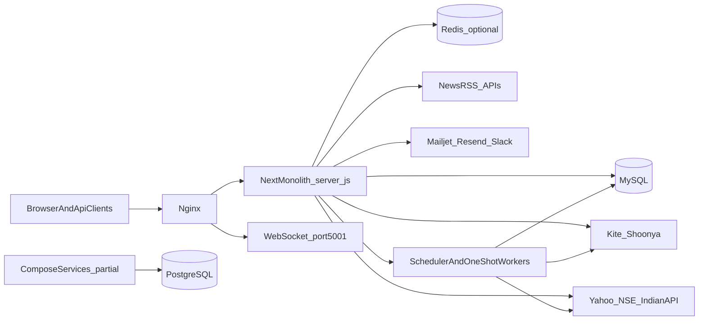
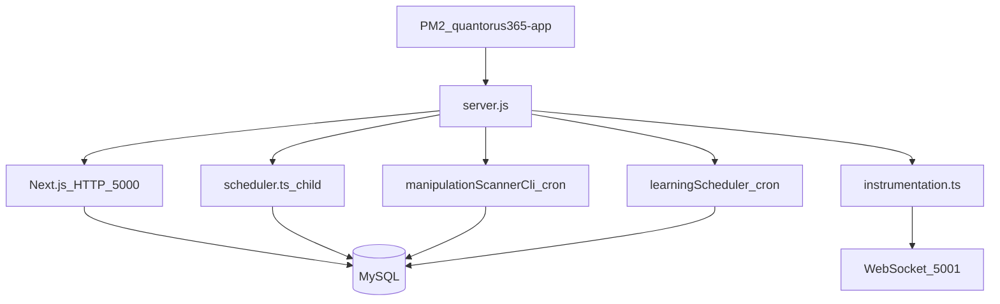
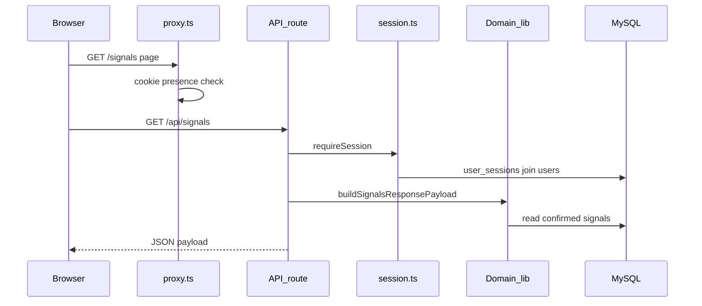
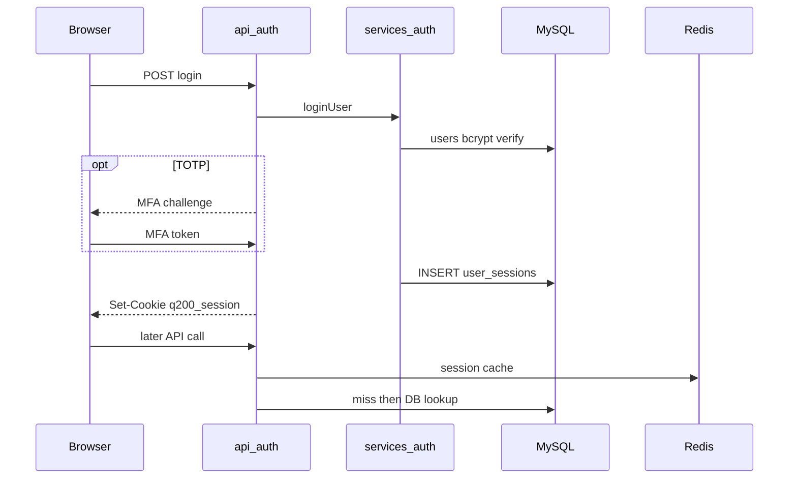
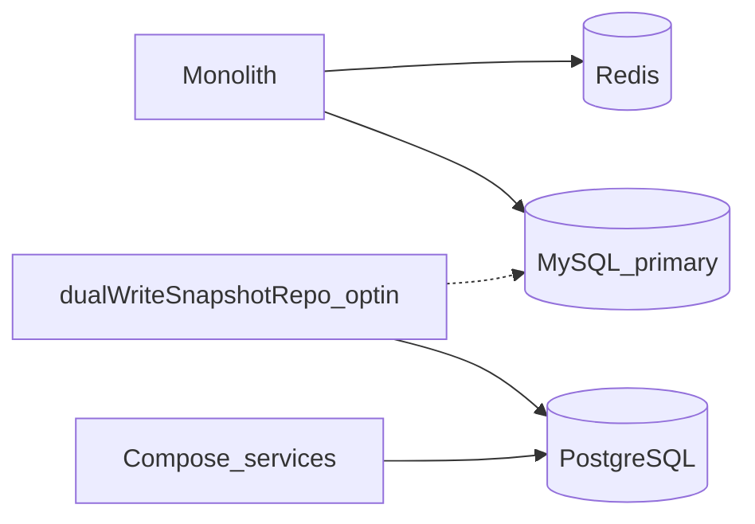
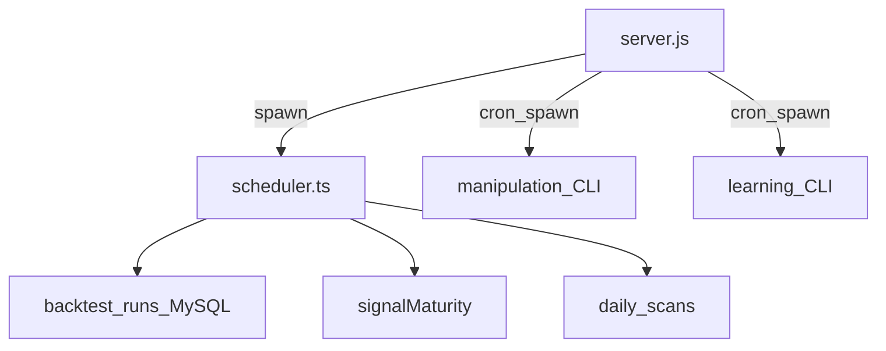
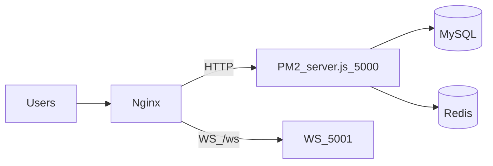
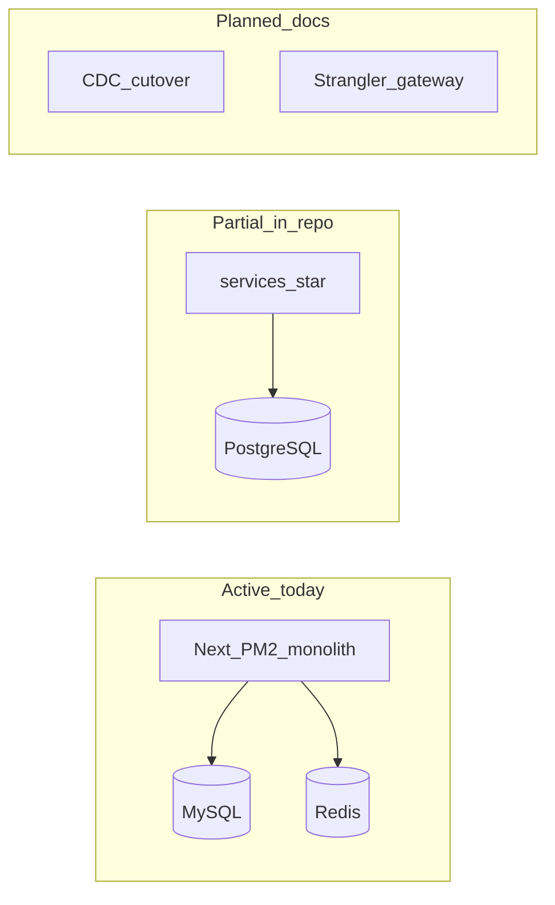

# System Architecture

> Backtest migration status: an additive MySQL lease queue and internal worker executable exist, but monolith ownership and worker-disabled defaults remain authoritative. No production deployment is enabled.

Staging assets and an isolated MySQL 8.4 integration harness exist. They do not change production PM2, Nginx, Compose, database authority, or scheduler ownership.

Backtest cancellation is BFF-authenticated and atomically owner/admin scoped. Internal cancellation acknowledgement remains worker-lease scoped.

All browser-facing Backtest resources are private to `created_by` by default. Administrators use an explicit audited scope; workers remain processor/lease scoped.

## 1. Document purpose

This document describes the **architecture implemented in this repository today**. Source code, package scripts, migrations, deployment manifests, and tests are the evidence standard. When another document disagrees with the code, the code wins.

| Field | Value |
| ----- | ----- |
| Last updated | 2026-08-03 |
| Repository revision | `c6b1241` (at time of writing) |
| Canonical path | [`ARCHITECTURE.md`](./ARCHITECTURE.md) |
| Scope | Runtime processes, modules, data stores, APIs, auth, jobs, integrations, deployment, observability, migration work present in-repo |
| Out of scope | Copying [`MIGRATION_PLAN.md`](./MIGRATION_PLAN.md) as if shipped; production-only operator secrets; live traffic volumes |

**Evidence labels**

- **Active** — wired into the primary runtime path (PM2 / `server.js` / Next app).
- **Partial** — code and config exist; not the primary production path or not fully cut over.
- **Planned** — documented as future work; not runtime truth.
- **Unknown / Needs verification** — cannot be confirmed from the repository alone.
- **Inferred** — strongly indicated by code but not exercised against live infrastructure here.

**Related documents (not canonical architecture)**

| Document | Purpose | Status relative to this file |
| -------- | ------- | ---------------------------- |
| [`docs/architecture-audit.md`](./docs/architecture-audit.md) | Historical enterprise audit (2025-06-25) | **Outdated** — incorrectly states PostgreSQL as primary runtime DB |
| [`docs/product-a/architecture.md`](./docs/product-a/architecture.md) | Product-A domain notes | Domain-scoped; not system topology |
| [`docs/research/architecture.md`](./docs/research/architecture.md) | Research subsystem | Domain-scoped |
| [`docs/ai/architecture.md`](./docs/ai/architecture.md) | AI-agent conventions | Not system architecture |
| [`docs/portfolio/architecture.md`](./docs/portfolio/architecture.md) | Portfolio domain | Domain-scoped |
| [`MIGRATION_PLAN.md`](./MIGRATION_PLAN.md) | Forward Strangler/CDC/PG cutover plan | **Planned** roadmap — not current architecture |

---

## 2. Architecture summary

| Dimension | Current implementation |
| --------- | ---------------------- |
| Style | Modular monolith (Next.js App Router) with optional extracted HTTP services under `services/` |
| Main runtime | Single PM2 process running `server.js` (Next HTTP + supervised worker children) |
| Primary database | **MySQL** via `mysql2` (`src/lib/db.ts`) |
| Cache | Redis via `ioredis` (`src/lib/redis.ts`), with in-process fallback |
| PostgreSQL | **Partial** — migrations + limited runtime/service usage; not the monolith’s primary store |
| Jobs | `node-cron` + MySQL-backed queues; **no** external message broker (Kafka/Rabbit/Bull) |
| Auth | Opaque DB session cookie `q200_session` + Redis session cache; route-level RBAC |
| Deployment (committed) | VPS: Nginx → PM2 → `server.js` (`setup-vps.sh`, `ecosystem.config.js`) |
| Alternate topology | Docker Compose + `services/*` + Postgres (**Partial** / not what PM2 runs) |
| Migration state | Microservice scaffolds and PG tooling present; MySQL→PG CDC cutover **Planned** |

---

## 3. System context

Primary consumers: authenticated users, admins/operators, public API clients, and corporate-site visitors.

---

## 4. Repository and module structure

Review-time counts (2026-08-03): **75** App Router pages, **332** API `route.ts` files (filesystem count; ignored files can make `rg` report fewer). Prefer a filesystem walk for the security inventory.

| Module/component | Responsibility | Key paths | Runtime unit | Main dependencies |
| ---------------- | -------------- | --------- | ------------ | ----------------- |
| App UI | Pages, layouts, client components | `src/app/`, `src/components/` | Next HTTP | React Query, SCSS |
| API layer | HTTP Route Handlers | `src/app/api/**/route.ts` | Next HTTP | `session`, domain libs |
| Signal engine | Strategy evaluation, candidates, maturity | `src/lib/signal-engine/`, `src/lib/signals/` | Next + scheduler | MySQL, market resolver |
| Market data | Quotes, candles, provider policy | `src/lib/marketData/`, `src/providers/` | Next + scheduler | Kite/Yahoo/NSE/IndianAPI, Redis |
| Backtesting | Institutional replay, queue, analytics | `src/lib/backtesting/` | Next + scheduler | MySQL |
| Manipulation | Surveillance engine + scan CLI | `src/lib/manipulation-engine/`, `src/lib/workers/manipulationScannerCli.ts` | One-shot worker | MySQL, market data |
| News | Ingestion, classification, health | `src/lib/news-engine/`, `src/lib/workers/newsIngestionScheduler.ts` | Optional CLI | MySQL, RSS/APIs |
| Portfolio / paper / risk | Positions, paper trading, risk gates | `src/lib/portfolio/`, `src/lib/paper-trading/`, `src/lib/risk/` | Next HTTP | MySQL |
| Broker / execution | OAuth, tokens, orders | `src/lib/broker/`, `src/lib/kite/`, `src/lib/execution/` | Next HTTP | Broker APIs, MySQL |
| Billing | Plans, wallet, entitlements | `src/lib/billing/` | Next HTTP | MySQL (manual payment_method default) |
| Auth / security | Sessions, MFA, RBAC, audit | `src/services/auth.ts`, `src/lib/session.ts`, `src/lib/security/` | Next HTTP | MySQL, Redis |
| Reliability / monitor | Health, alerts, Prometheus metrics | `src/lib/reliability/`, `src/lib/monitor/` | Next HTTP | MySQL, Redis, Slack/email |
| Trade setups | Generate/list user setups | `src/app/trade-setups/`, `src/app/api/trade-setups/` | Next HTTP | MySQL, Redis locks, signal engine |
| Shared packages | Contracts, in-process event bus, RPC client | `packages/contracts`, `packages/eventbus`, `packages/rpc` | Compose services primarily | — |
| Extracted services | Decoupled HTTP services | `services/*` | Compose / `services/Dockerfile` | PostgreSQL (typical) |

`src/lib/` mixes domain rules and infrastructure; the repo is **not** a strict layered architecture.

---

## 5. Runtime architecture

### 5.1 Processes

| Process | Entry / command | Responsibility | Port | DB | Notes |
| ------- | --------------- | -------------- | ---- | -- | ----- |
| Production app | `node server.js` (`npm run start:server`, PM2) | Next HTTP + spawn workers | 5000 (default) | MySQL, Redis | Primary VPS unit |
| Stock Next start | `npm start` → `next start -p 3000` | Next only | 3000 | MySQL, Redis | **No** worker supervisor |
| Dev | `npm run dev` → `next dev` | Hot reload UI/API | Next default | MySQL, Redis | In-proc schedulers via flags / `bootInProc` |
| Scheduler child | `tsx src/lib/workers/scheduler.ts` | Scans, market jobs, backtest drain, maturity | — | MySQL | Spawned by `server.js` |
| Manipulation scan | `tsx src/lib/workers/manipulationScannerCli.ts` | Daily scan | — | MySQL | Cron 13:00 UTC from `server.js` |
| Learning scheduler | `tsx src/lib/workers/learningScheduler.ts` | Outcomes, calibration | — | MySQL | Cron 15:00 UTC from `server.js` |
| News scheduler | `npm run news-scheduler` | News ingestion loop | — | MySQL | Script exists; **not** in PM2 ecosystem apps list |
| WS CLI | `npm run ws-server` | Standalone stream | `STREAM_WS_PORT` | Redis ticks | Prod WS also started via instrumentation / same V8 as noted in `server.js` |
| Compose services | `services/*/src/server.ts` | Extracted capabilities | per-service | PostgreSQL | **Partial** alternate topology |

Evidence: `server.js`, `ecosystem.config.js`, `src/instrumentation.ts`, `package.json` scripts.

### 5.2 Boot sequence (production)

1. PM2 starts `server.js` (`ecosystem.config.js`).
2. Env loaded from `DOTENV_CONFIG_PATH` or `.env.production`; `NODE_ENV` forced to `production` unless `Q365_CUSTOM_SERVER_DEV=1`.
3. `Q365_INPROC_SCHEDULER=0` forced so Next does not duplicate cron ownership.
4. Next prepares and HTTP binds (default port 5000).
5. `src/instrumentation.ts` runs Node boot hooks (env safety, schema/provider/stream init as configured).
6. After bind, `server.js` spawns the long-running scheduler and registers UTC crons for manipulation and learning children.

---

## 6. Request lifecycle

### 6.1 Authenticated read (representative: signals)

### 6.2 Authentication

Evidence: `src/app/api/auth/route.ts`, `src/services/auth.ts`, `src/lib/session.ts`.

### 6.3 Important business write — trade setups

Authenticated page → `GET /api/trade-setups` → optional `POST /api/trade-setups` with Redis lock + cache identity → `generateSignal` / `resolvePrice` → upsert `trade_setups`. Must not trigger a full-universe scan. Evidence: `src/app/trade-setups/page.tsx`, `src/app/api/trade-setups/route.ts`.

### 6.4 Background job — scheduler

`server.js` child runs `src/lib/workers/scheduler.ts`, which registers domain schedules (market data cadence, scans, backtest queue drain, signal maturity, maintenance). Failures log to stdout; long-running child is restarted by the supervisor; daily one-shots are not auto-retried by `server.js`.

### 6.5 Error handling

Preferred wrapper: `withApiHandler` in `src/lib/apiHandler.ts` (request IDs, timing, normalized errors, metrics). Adoption is **partial**; many routes use local `try/catch` and `{ error: string }`.

---

## 7. Data architecture

### 7.1 Data-store status

| Data store | Current role | Accessed by | Configuration evidence | Status |
| ---------- | ------------ | ----------- | ---------------------- | ------ |
| MySQL | Primary transactional DB for monolith | Next routes, workers, most scripts | `src/lib/db.ts`, `validateEnv.ts` `MYSQL_*`, `db:migrate*` | **Active** |
| Redis | Session cache, quotes/ticks, distributed locks, general cache | `session.ts`, `redis.ts`, `cache/`, trade-setups locks | `REDIS_*`, `REDIS_DISABLED` | **Active** (optional; in-memory fallback) |
| PostgreSQL | Migration target; Compose services; limited repos | `src/lib/db/postgres.ts`, `migrations/postgres/`, some `services/*`, snapshot dual-write | `POSTGRES_URL` / `DATABASE_URL_PG` / `PG*` | **Partial** |
| Local files | Universe/reference seeds | `src/data/`, scripts | — | **Active** (reference only) |

PostgreSQL is **not** the monolith’s authoritative store merely because `pg` is a dependency or Compose starts Postgres 16.

### 7.2 MySQL access

- Pool and `db.query` in `src/lib/db.ts` (`mysql2/promise`).
- Returns a PG-like `{ rows }` shape and rewrites limited `$1` / `INTERVAL` SQL for MySQL convenience — **not** full dialect portability.
- Schema ensured via `src/lib/db/ensureAllSchemas.ts`, domain `migrate*.ts`, and `migrations/mysql/` (numbered incremental SQL).
- Operator commands: `npm run db:ensure`, `npm run db:migrate-all`.

### 7.3 PostgreSQL

- Migrator: `npm run db:migrate:pg` → `src/lib/db/postgres/migrate.ts` over `migrations/postgres/` (~31 `.sql` files; `*.sql.proposal` are **not** normal applied migrations).
- Opt-in snapshot dual-write: `src/services/repos/dualWriteSnapshotRepo.ts` (`MYSQL_DUAL_WRITE_TABLE`).
- Validation/backfill scripts: `db:check:pg`, `db:validate:pg`, `db:backfill:pg`.
- **No** MySQL binlog CDC consumer implemented in application code. CDC cutover remains in [`MIGRATION_PLAN.md`](./MIGRATION_PLAN.md) (**Planned**).

### 7.4 Entity families (MySQL-centric)

Identity; market/master (instruments, candles); signals/runs/snapshots; strategy/backtest; portfolio/trading; news/manipulation/rankings; operations/audit; billing/wallet. Full ER is **Not verified** (runtime DDL is distributed).

---

## 8. API architecture

| Topic | Implementation |
| ----- | -------------- |
| Protocol | HTTP REST via Next App Router Route Handlers; WebSocket for live ticks |
| Organization | `src/app/api/<domain>/.../route.ts` |
| Versioning | Limited public surface under `/api/public/v1/*`; most routes unversioned |
| Contracts | OpenAPI sketch at `/api/openapi`; shared types in `packages/contracts` |
| Validation | Per-handler; no single global schema framework |
| Auth | Cookie `q200_session`; `requireSession` / `requireAdmin` / `requirePermission` |
| Errors | Mixed: `withApiHandler` envelopes vs ad-hoc `{ error }` |
| Internal vs public | Most routes authenticated; corporate and some public/health endpoints open |

**Representative clusters:** `/api/auth`, `/api/signals`, `/api/market*`, `/api/strategies`, `/api/backtest*`, `/api/trade-setups`, `/api/portfolio`, `/api/broker*`, `/api/kite`, `/api/billing`, `/api/manipulation*`, `/api/news*`, `/api/health`, `/api/metrics`, `/api/admin`, `/api/security`.

Inventory snapshots: `docs/api-inventory.md`, `docs/performance/api-optimization-inventory.json` (may lag code).

---

## 9. Background processing and events

**No external event broker is currently required for the monolith.** Coordination uses:

| Mechanism | Evidence | Notes |
| --------- | -------- | ----- |
| `node-cron` in `server.js` | manipulation + learning spawn | UTC schedules |
| Long-running scheduler | `src/lib/workers/scheduler.ts` | Domain crons / intervals |
| MySQL job rows | e.g. `backtest_runs` queue in `src/lib/backtesting/runner/backtestQueue.ts` | Drain via scheduler + `/api/backtests/process-queue` |
| MySQL pipeline locks | `src/lib/pipeline/runLockRepo.ts` | Not Redis |
| Redis distributed locks | trade-setups, cache locks | Short TTL NX locks |
| In-process event bus package | `packages/eventbus` | Supports service topology; not a durable broker |
| Dev in-process jobs | `src/lib/workers/bootInProc.ts` | When flags enable; disabled under `server.js` |

Do not describe the system as “event-driven architecture” in the sense of a durable bus coordinating production services.

---

## 10. Authentication and authorization

| Concern | Implementation | Path |
| ------- | -------------- | ---- |
| Credential login | Email/password, bcrypt | `src/services/auth.ts` |
| Session | Opaque 48-byte hex token in MySQL `user_sessions` | `createSession` |
| Cookie | `q200_session` HttpOnly | `src/app/api/auth/route.ts` |
| Cache | Redis `session:{token}` TTL 300s | `src/lib/session.ts` |
| MFA | TOTP (`speakeasy`) | auth + `/api/security/mfa` |
| Browser gate | Cookie **presence** redirect | `src/proxy.ts` (includes `/trade-setups`) |
| API authz | Explicit per-route guards | `requireSession`, `requireAdmin`, `requirePermission` |
| RBAC | Static matrix + DB overrides | `src/lib/security/rbac.ts` |
| Roles | `user`, `trader`, `analyst`, `admin` | security module |

**Gap (evidence-backed):** There is no root `middleware.ts`. Proxy presence checks are not cryptographic validation; a missing `requireSession` on an API route is a real exposure risk.

Social OAuth login buttons may appear in UI copy on some environments; a third-party IdP as the primary session issuer is **Not verified** in server auth code.

---

## 11. External integrations

| Integration | Purpose | Direction | Implementation path | Failure handling |
| ----------- | ------- | --------- | ------------------- | ---------------- |
| Kite / Zerodha | Market data, broker session | Outbound (+ OAuth inbound) | `src/lib/kite/`, `src/providers/adapters/KiteAdapter.ts`, `/api/kite` | Timeouts/rate limits; auth failures surface as provider unavailable |
| Shoonya | Alternate broker/data | Outbound | `src/lib/marketData/brokerProvider/shoonya/`, `/api/brokers/shoonya` | Feature-flagged; credential validation |
| Yahoo / NSE | Fallback market data | Outbound | Yahoo/NSE providers under `src/lib/marketData/`, `src/providers/` | Emergency/fallback cascade via resolver |
| IndianAPI | Market data provider | Outbound | `IndianAPIAdapter`, indianApi providers | Provider flag driven |
| Mailjet | Contact form mail | Outbound | `/api/contact` | 503 if unconfigured; 502 on provider failure |
| Resend / Nodemailer | Ops email alerts | Outbound | `src/lib/reliability/alertDelivery.ts` | Log + delivery status |
| Slack webhook | Ops alerts | Outbound | same alert delivery module | Log on failure |
| News RSS / APIs | News intelligence | Outbound | `src/lib/news-engine/` | Per-source health/fallback |
| Billing gateways (Razorpay/Stripe) | Card checkout | — | **Not found** in `src` | Wallet/plans use in-app / `payment_method` default `manual` |

Provider resilience helpers exist in `src/providers/resilience.ts`; not every client uses them.

---

## 12. Deployment architecture

| Topic | Evidence |
| ----- | -------- |
| Build unit | `npm run build` → Next webpack build (`package.json`, `next.config.js`) |
| Deploy unit (VPS) | One PM2 app → `server.js` (`ecosystem.config.js`, `setup-vps.sh`) |
| Reverse proxy | `nginx.conf` — `/` → 5000, `/ws` → 5001 |
| Environments | Local `.env.local`; production `.env.production` (not committed with secrets) |
| Migrations on VPS | `setup-vps.sh` runs `npm run db:migrate-all` (MySQL) |
| CI | `.github/workflows/ci.yml` — typecheck, lint, signals gate, build, ops/deployment validation; **no deploy job** |
| Docker | `Dockerfile.nextjs`, `services/Dockerfile`, `docker-compose.dev.yml`, `docker-compose.prod.yml` | **Partial** alternate topology (Postgres + services) |
| Kubernetes | **Absent** in repository |

`Dockerfile.nextjs` assumes Next standalone output; `next.config.js` does **not** set `output: 'standalone'` — treat Docker image build as **Needs verification**.

Local development: `npm run dev` (no custom supervisor). Production-like local: build + `npm run start:server` with valid MySQL/Redis env.

---

## 13. Observability and resilience

### Implemented

| Capability | Evidence |
| ---------- | -------- |
| Structured JSON logging | `src/lib/logger.ts` |
| Request IDs / API timing | `src/lib/apiHandler.ts` |
| Prometheus text metrics | `GET /api/metrics`, `src/lib/monitor/prometheus.ts`, `apiPerformanceMetrics.ts` |
| Health endpoints | `/api/health`, plus engine/data-feed/broker/reliability/admin variants |
| Retries / timeouts | Provider resilience modules; per-route timeouts (e.g. trade-setups) |
| Rate limiting | Auth and selected paths (`src/lib/rateLimit.ts`) |
| Caching | `src/lib/cache/` over Redis |
| Graceful shutdown | `server.js` SIGTERM children (`kill_timeout` in PM2) |
| Process crash logging | `src/instrumentation.ts` |

### Missing or not verified

| Capability | Status |
| ---------- | ------ |
| OpenTelemetry / Jaeger / Sentry APM | **Not found** in `src` |
| Coverage thresholds in CI | **Not configured** |
| Uniform API error envelope | **Partial** (`withApiHandler` adoption incomplete) |
| `winston` as primary logger | Dependency present; **not** proven as primary abstraction under `src/` |

---

## 14. Security boundaries

- **Trust boundary:** Nginx terminates TLS (operator config); Node trusts forwarded headers per `next.config.js`.
- **Auth boundary:** Browser proxy cookie presence ≠ API authorization; handlers must call session guards.
- **Data stores:** MySQL holds PII, sessions, broker metadata; Redis holds session cache and ticks — treat as sensitive.
- **Secrets:** `SESSION_SECRET`, encryption keys, broker credentials, provider API keys — validate via `src/lib/validateEnv.ts` / startup locks; never document values.
- **Broker tokens / TOTP:** Encrypted at rest; dedicated `BROKER_TOKEN_ENCRYPTION_KEY` expected in production.
- **Client bundles:** Only `NEXT_PUBLIC_*` may ship to the browser; no DB/crypto/worker imports in client components.

---

## 15. Current migration state

Classify only what exists in-repo. Do not treat [`MIGRATION_PLAN.md`](./MIGRATION_PLAN.md) phases as complete.

| Migration capability | Status | Evidence | Notes |
| -------------------- | ------ | -------- | ----- |
| Modular-monolith domain folders | **Active** | `src/lib/*` domains | Shared MySQL; not independently deployable |
| Extracted HTTP services | **Partial** | `services/*`, Compose | Not started by `ecosystem.config.js` |
| Shared contracts / RPC / eventbus packages | **Partial** | `packages/*` | Oriented to service topology |
| PostgreSQL schema migrations | **Partial** | `migrations/postgres/`, `db:migrate:pg` | Includes `*.sql.proposal` non-applied files |
| MySQL incremental SQL | **Active** | `migrations/mysql/`, `db:migrate*` | Primary schema path for monolith |
| Data migration / validation tooling | **Partial** | `db:backfill:pg`, `db:validate:pg`, scripts | Operator-driven |
| Application dual-write (snapshots) | **Partial / opt-in** | `dualWriteSnapshotRepo.ts` | Requires `MYSQL_DUAL_WRITE_TABLE` |
| CDC (binlog → PG) | **Planned** | `MIGRATION_PLAN.md` | No consumer in app code |
| Shadow reads (DB traffic) | **Planned / Unknown** | Plan docs; not a monolith default | ML “shadow” naming elsewhere is unrelated |
| Reconciliation tooling | **Partial** | validate scripts | Not continuous production reconciler |
| Outbox / inbox | **Planned / Experimental** | Plan + packages | Not proven as monolith write path |
| API gateway routing to services | **Planned** | `MIGRATION_PLAN.md` | Nginx currently fronts monolith |
| Cutover / rollback SQL | **Partial** | Some PG `_rollback.sql` / scripts | Full production cutover **Not verified** |

---

## 16. Architectural constraints and technical debt

| Issue | Evidence | Impact | Affected | Mitigation if any |
| ----- | -------- | ------ | -------- | ----------------- |
| Shared MySQL across all domains | `src/lib/db.ts`, ensure/migrate sprawl | Blocks true service extraction; coupling via tables | All modules | Domain folders only |
| Handler-local auth; no global middleware | No `middleware.ts`; `proxy.ts` presence-only | Missed `requireSession` → exposure | API layer | Manual guards; security docs |
| Partial `withApiHandler` adoption | `src/app/api/**` | Inconsistent errors/metrics | API clients | Prefer wrapper on new routes |
| MySQL↔PG SQL rewrite shim | `src/lib/db.ts` | Complex SQL may mistranslate | Any `$n`/INTERVAL SQL | Prefer native MySQL SQL for monolith |
| Dual topologies (PM2 MySQL vs Compose PG) | `ecosystem.config.js` vs `docker-compose.*.yml` | Docs/ops confusion | Deploy | Treat VPS/PM2 as primary unless proven otherwise |
| `tsconfig` non-strict | `strict: false` | Null/type bugs escape CI | Whole TS tree | Incremental tightening |
| No committed `.env.example` | Repo search | Onboarding friction; unsafe copy of live env files | DevEx | Template still absent |
| Non-blocking CI jobs | `.github/workflows/ci.yml` | Regressions can merge | Quality | Review `continue-on-error` jobs |
| In-process / child cron ownership risks | `server.js` forces `Q365_INPROC_SCHEDULER=0` | Duplicate scans if misconfigured | Workers | Flag forced off under custom server |
| Billing without card gateway in code | billing modules, no Stripe/Razorpay SDK usage | Payments are manual/in-app | Commercial | Explicit product constraint |
| Outdated audit doc claims PG primary | `docs/architecture-audit.md` | Misleads new engineers | Docs | Prefer this file |

---

## 17. Architectural decisions

No formal ADR directory (`docs/adr`, `ADR*.md`) was found.

| Decision | Status | Where encoded |
| -------- | ------ | ------------- |
| Next.js App Router monolith as product surface | **Accepted** | `src/app/`, `package.json` |
| MySQL as primary store for monolith | **Accepted** | `src/lib/db.ts`, migrators, env validation |
| PM2 + `server.js` as production process model | **Accepted** | `ecosystem.config.js`, `setup-vps.sh` |
| Cookie session auth (`q200_session`) | **Accepted** | `auth/route.ts`, `session.ts` |
| Extracted services + PostgreSQL as strangler path | **Proposed / Partial** | `services/`, Compose, `MIGRATION_PLAN.md` |
| MySQL→PG CDC cutover | **Proposed** | `MIGRATION_PLAN.md` |
| Application dual-write as default cutover strategy | **Superseded by plan preference** | Plan prefers CDC; dual-write exists only opt-in for snapshots |

---

## 18. Known unknowns

- Whether production enables Redis, dual-write, Shoonya, or IndianAPI as primary provider (`MARKET_DATA_PROVIDER`).
- Whether any environment runs `services/*` in production versus VPS monolith only.
- Whether `news-scheduler` is cron’d by operators outside `server.js`.
- Managed MySQL/Redis/Postgres versions and HA topology.
- Backup/restore RPO/RTO and production traffic volumes.
- Whether `Dockerfile.nextjs` builds successfully without `output: 'standalone'`.
- Depth of `@anthropic-ai/claude-code` usage versus other AI route implementations.

---

## 19. Keeping this document current

Update this file when any of the following land in the repository:

- New runtime process, PM2 app, or Compose service
- Database engine change or cutover flag
- New broker/queue or external integration
- Authentication/session model change
- Deployment topology change (k8s, multi-region, gateway)
- Major module boundary or ownership change
- Migration capability moving between Planned / Partial / Active
- Material change to health, metrics, or security boundaries

Prefer tables and Mermaid over long prose. Do not paste secrets. Do not promote planned migration steps to “current” without code and config evidence.

---

## Appendix A — Development commands (verified)

| Task | Command |
| ---- | ------- |
| Develop | `npm run dev` |
| Typecheck | `npm run typecheck` |
| Lint | `npm run lint` |
| Test | `npm test` |
| Signals gate | `npm run test:signals-gate` |
| Build | `npm run build` |
| Production start | `npm run start:server` |
| MySQL ensure / migrate | `npm run db:ensure`, `npm run db:migrate-all` |
| PostgreSQL migrate | `npm run db:migrate:pg` |
| Scheduler alone | `npm run scheduler` |

`package.json` is authoritative for the full script catalog.

## Appendix B — Verification basis

Repository inspection on 2026-08-03 including: `package.json`, `server.js`, `ecosystem.config.js`, `setup-vps.sh`, `next.config.js`, `src/lib/db.ts`, `src/lib/redis.ts`, `src/lib/session.ts`, `src/proxy.ts`, `src/instrumentation.ts`, workers under `src/lib/workers/`, `migrations/{mysql,postgres}`, `services/`, `packages/`, `.github/workflows/ci.yml`, Docker/Compose files, `MIGRATION_PLAN.md`, and prior accurate content from this file. Live production hosts and secret env files were not used as evidence for topology claims.
The Backtest Worker remains inactive in production. Staging preparation proposes a MySQL-backed owner/epoch singleton and a versioned deterministic fixture; neither constitutes production ownership approval.
Backtest queue ownership uses a proposed additive MySQL singleton owner and monotonic epoch. Environment values express process-local intent; MySQL is runtime authority. Both monolith and staging worker claims/lifecycle acknowledgements validate the same epoch. Production remains monolith-owned with the worker disabled, and migration 017 has not been applied to production.
Staging verification assets now include fail-closed fixture validation, a real-process harness, staging-only dashboard and alert definitions, and machine-readable evidence templates. They are preparation artifacts only: persisted parity and process-backed rollback have not passed, and the worker remains inactive in production.
# Backtest pre-canary evidence status (2026-08-04)

The Backtest Worker remains staging-only, disabled by default, concurrency one, and production remains monolith-owned. Deterministic fixture v2 passes static and production signal-pipeline suitability, but no persisted processor parity or process-backed rollback evidence has passed; staging canary execution remains blocked.
Local pre-canary process evidence now proves real monolith/service persistence parity and crash-to-monolith recovery. This does not activate the worker: production remains monolith-owned, the worker remains disabled by default, and concurrency remains one. Observability firing proof and repeated CI reliability evidence still block staging canary approval.
