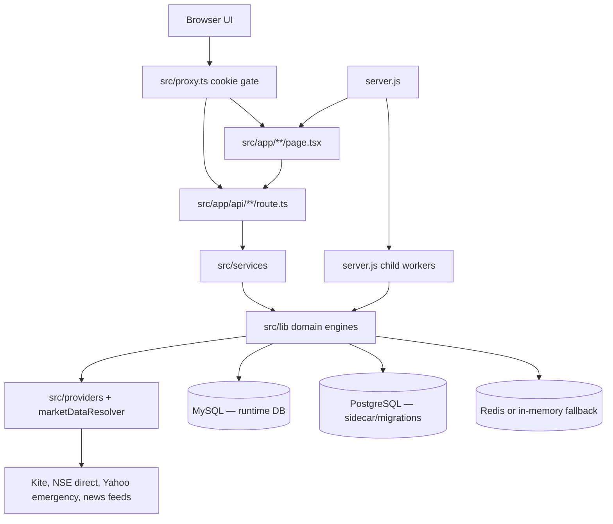
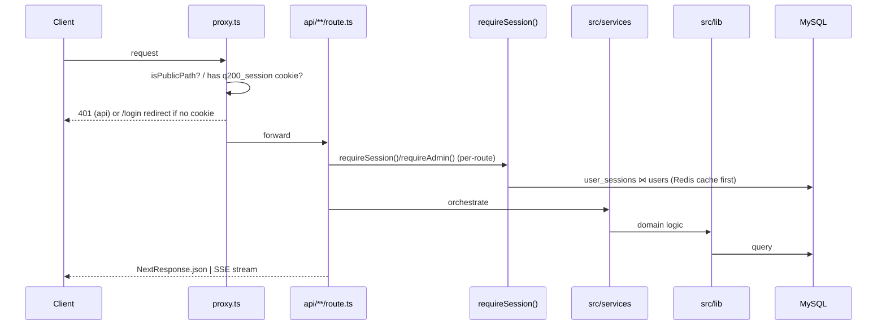
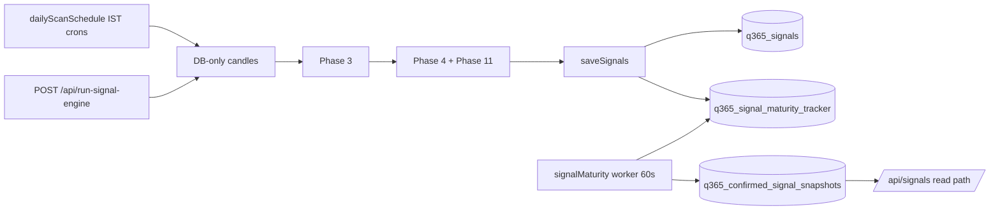
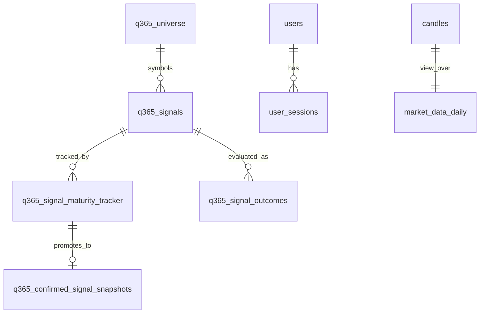

# Quantorus365 — Technical Architecture

**Project:** Quantorus365 — Institutional Stock Intelligence Platform
**Version (`package.json`):** 2.1.0
**Last analyzed:** 2026-07-17 (audited against repo)
**Companion AI maps:** `docs/ai/` (`architecture.md`, `conventions.md`, `workflows.md`, `invariants.md`, `troubleshooting.md`, `change-impact-map.md`)
**Scope:** Current implementation in source (`src/`, `services/`, `packages/`), configs (`package.json`, `next.config.js`, `ecosystem.config.js`, `server.js`, `nginx.conf`, `vitest.config.ts`, `tsconfig*.json`), `.github/workflows/ci.yml`, `migrations/`, and `.env.example`. Generated/vendor dirs (`.next/`, `node_modules/`, `out/`) are excluded.

> **Source-of-truth rule:** This document describes what the code does *today*. Where older docs under `docs/` disagree with the implementation, the code wins. Planned, partial, or deprecated features are labeled explicitly. Values labeled `Unknown` / `Not found` / `Needs verification` were not resolvable from the repository alone.
>
> **Vendor note:** A former third-party market-data vendor has been **decommissioned**. The **execution** cascade in `marketDataResolver.resolveBatch` (market open) is **cache → Kite → NSE direct → Yahoo emergency → degraded/none**. `providerFlags.getPrimaryFallbackProvider('kite')` returns the descriptive string `yahoo|nse|db` (not the call order). Unrecognized `MARKET_DATA_PROVIDER` values (including former `legacy_vendor`) resolve to `kite`. `LEGACY_VENDOR_ENV` is **not** used for provider selection; it is still read as a **numeric** production budget guard in `envSafetyLock.ts` (header comment says ≤500; code enforces ≤1500). Do not reintroduce a vendor dependency.

---

## Table of Contents

1. [Project Purpose & Domain](#1-project-purpose--domain)
2. [Architecture & Style](#2-architecture--style)
3. [Repository & Module Structure](#3-repository--module-structure)
4. [Technology Stack](#4-technology-stack)
5. [Runtime & Application Flow](#5-runtime--application-flow)
6. [Major Components & Boundaries](#6-major-components--boundaries)
7. [Data Models, Schema & Migrations](#7-data-models-schema--migrations)
8. [API Architecture](#8-api-architecture)
9. [Frontend Architecture](#9-frontend-architecture)
10. [Backend Architecture (routes, services, workers, jobs)](#10-backend-architecture-routes-services-workers-jobs)
11. [Authentication, Authorization & Security](#11-authentication-authorization--security)
12. [External Services & Integrations](#12-external-services--integrations)
13. [Configuration & Environment Variables](#13-configuration--environment-variables)
14. [Error Handling, Logging & Observability](#14-error-handling-logging--observability)
15. [Testing Strategy](#15-testing-strategy)
16. [Build, Deploy, CI/CD & Operations](#16-build-deploy-cicd--operations)
17. [Architectural Decisions, Constraints & Limitations](#17-architectural-decisions-constraints--limitations)
18. [Naming, Patterns & Extension Guidelines](#18-naming-patterns--extension-guidelines)
19. [Common Workflows](#19-common-workflows)
20. [AI Working Instructions](#20-ai-working-instructions)
21. [Architecture Verification](#21-architecture-verification)

---

## 1. Project Purpose & Domain

Quantorus365 is an **institutional-grade stock intelligence platform for Indian equity markets (NSE)**. It generates, validates, matures, and serves trading signals; runs backtests; performs manipulation/market-surveillance; ingests news intelligence; manages portfolios and risk; and exposes paper-trading and broker-integration workflows behind an authenticated web app.

**Domain concepts** (from code):

| Concept | Meaning | Primary code owner |
|---|---|---|
| Signal | A directional trade idea with entry/stop/targets, scores, and lifecycle | `src/lib/signal-engine/`, `q365_signals` |
| Confirmed snapshot | A matured, promoted signal shown on the board | `q365_confirmed_signal_snapshots` |
| Maturity | Multi-cycle stability gating before a signal is promoted | `src/lib/signal-engine/maturity/`, `src/lib/cron/signalMaturity.ts` |
| Universe | The tradeable symbol set (≈ NIFTY500/NSE1000) | `q365_universe`, `nifty500Universe.ts` |
| Regime / stance / scenario | Market-state classifiers that gate strategies | `src/services/scenarioEngine.ts`, `marketStanceEngine.ts` |
| Manipulation band | Surveillance risk banding (ELEVATED/HIGH/SEVERE) | `src/lib/manipulation-engine/` |
| Decision trace | Deterministic, audit-ready pre-trade decision record | `src/services/decisionOrchestrator.ts`, `decisionTraceBuilder.ts` |

**Business invariants observed in code:**
- Signals shown to users are **real DB rows only** — force-seed is permanently disabled (`instrumentation.ts` → `BALANCED_REAL_DATA_MODE_ENABLED`).
- `/api/signals` **reads** confirmed snapshots; it never scans.
- Only the maturity worker promotes to confirmed snapshots (single promoter invariant).
- Risk/governance gates are mandatory in the decision path (`decisionContext.assertOrchestratorContext`).

---

## 2. Architecture & Style

**Style:** A **Next.js 16 App Router modular monolith** plus **supervised worker child processes**, backed by MySQL (runtime) with PostgreSQL as a sidecar/migration target. Domain logic is layered:

```
Browser → proxy.ts (cookie gate) → app/ pages + app/api route handlers
        → src/services (application/orchestration)
        → src/lib (domain engines + infrastructure)
        → src/providers (market-data adapters) / MySQL / PostgreSQL / Redis
```

Standalone microservice **scaffolds** exist under `services/` and shared `packages/`, but **product behavior runs inside the Next.js app and its workers today** — the microservices are not the production signal path.



**Design principles (evidence-based):**

| Principle | Evidence |
|---|---|
| Read/write separation for signals | Scans write `q365_signals`; `/api/signals` reads confirmed snapshots |
| Single scheduler owner | `server.js` forces `Q365_INPROC_SCHEDULER=0` for the Next process |
| Single promotion path | `signalMaturity.ts` is the only writer of confirmed snapshots |
| Additive, idempotent schema | Boot-time `CREATE TABLE IF NOT EXISTS` + additive `ALTER` migrations |
| Provider discipline | All live prices flow through `marketDataResolver.resolveBatch`; market-closed gate blocks upstream calls |
| Boot never fatally throws | `instrumentation.ts` wraps each step in `withBudget()` and swallows non-critical errors |
| Real-data-only UI | Force-seed disabled at SQL layer; empty-approved stays empty |

---

## 3. Repository & Module Structure

Top-level (non-generated):

```text
api-update/
├── server.js                # Production entry: Next.js + WS + supervised workers
├── ecosystem.config.js      # PM2 single-app config (quantorus365-app)
├── next.config.js           # serverExternalPackages + edge webpack stubs
├── nginx.conf               # Reverse proxy (5000 → /, 5001 → /ws)
├── setup-vps.sh             # VPS provisioning
├── Dockerfile.nextjs, docker-compose.{dev,prod}.yml
├── vitest.config.ts, tsconfig.json, tsconfig.node.json
├── .env.example             # Env template (Phase 0)
├── .github/workflows/ci.yml # CI pipeline
├── migrations/{mysql,postgres}/
├── scripts/                 # ~140 operational/validation/backfill scripts
├── docs/                    # Supplementary docs (may lag code)
├── packages/{contracts,eventbus,rpc}/  # Shared types/RPC scaffolds
├── services/                # Standalone microservice scaffolds (not prod path)
└── src/
    ├── app/                 # App Router: pages + api/**/route.ts
    ├── components/          # 76 UI components (feature-grouped)
    ├── hooks/               # 21 hooks (React Query + streaming)
    ├── providers/           # Market-data adapters (Kite/Yahoo/NSE), resilience
    ├── services/            # 44 application/orchestration services
    ├── lib/                 # Domain engines + infrastructure (see below)
    ├── styles/              # SCSS globals, variables, mixins
    ├── types/               # Shared TS types (dashboard, market, …)
    ├── data/                # Static seed data (nseUniverse.json, …)
    ├── pages/               # Legacy Pages-Router shims only (_document, _error)
    ├── scripts/             # A few TS validation scripts
    └── instrumentation.ts   # Next boot hook (register())
```

### `src/lib/` domain areas (responsibilities)

| Dir | Responsibility |
|---|---|
| `signal-engine/` | Phases 1–4 pipeline, scoring, maturity, feedback, explainability, indicators, strategies, repository (DDL) |
| `signals/` | Read-path assembly (`responseAssembly.ts`), gates/policy, daily report, backtest handler, engine health map |
| `marketData/` | `resolver/marketDataResolver.ts`, providers, candle refresh, live feed, dual-source (disabled), market hours, universe |
| `workers/` | `scheduler.ts`, `dailyScanSchedule.ts`, `bootInProc.ts`, `learningScheduler.ts`, `manipulationScannerCli.ts`, `newsIngestionScheduler.ts`, `candleRefreshScheduler.ts`, `feedHealthRetention.ts` |
| `cron/` | `signalMaturity.ts` (60s promoter), confirmed-snapshot lifecycle (30s) |
| `db/` | `db.ts` (MySQL pool), `postgres.ts`, `ensureAllSchemas.ts`, `ensureSchemasSafely.ts`, `migrate*.ts` |
| `manipulation-engine/` | Detectors, analytics, calibration, candle loader |
| `backtesting/` | Metrics, analytics, data validators, repository migrations |
| `news-engine/` | Ingestion, scoring, sentiment, narrative |
| `security/` | Sessions, RBAC, rate limiter, audit, MFA, secrets, validation |
| `reliability/` | Health aggregation, alert dispatch/delivery, audit |
| `strategy-hub/`, `strategy-lab/`, `strategy-layer/`, `strategies/` | Strategy registry, no-code lab, deployment/ops |
| `portfolio/`, `trust-layer/`, `quant-platform/`, `research/`, `paper-trading/`, `broker/`, `billing/` | Feature domains |
| `platform/` | Multi-asset adapters, market-session engine, strategy registry |
| `api/` | `apiPerf.ts` (ApiPerfTracker), `internalFetch.ts` (server-to-server) |
| `monitor/` | `apiMonitor.ts`, `institutionalHealth.ts` |

---

## 4. Technology Stack

| Layer | Tech | Version (`package.json`) | Notes |
|---|---|---|---|
| Framework | Next.js | `16.2.9` | App Router; `serverExternalPackages`; custom `server.js` |
| UI | React / React DOM | `^18.3.0` | Client-heavy (50/59 pages `'use client'`) |
| Language | TypeScript | `^6.0.3` | `strict: false`, `strictNullChecks: false`, path alias `@/*` |
| Runtime DB | MySQL via `mysql2/promise` | `^3.22.5` | `src/lib/db.ts`; dominant path |
| Sidecar DB | PostgreSQL via `pg` | `^8.22.0` | `src/lib/db/postgres.ts`; migrations + service scaffolds |
| Cache/queue | Redis via `ioredis` | `^5.11.1` | `src/lib/redis.ts` + memory fallback (`REDIS_DISABLED=1`) |
| Data fetching | `@tanstack/react-query` | `^5.101.1` | `src/providers/QueryProvider.tsx` |
| Market data | `kiteconnect` | `^5.3.0` | Kite primary; ticker + REST |
| Cron | `node-cron` | `^4.4.1` | In `server.js` + workers |
| Auth | `bcryptjs`, `speakeasy` | `^2.4.3`, `^2.0.0` | Passwords + TOTP |
| WebSocket | `ws` | `^8.18.0` | Live tick fan-out |
| Charts | `recharts` | `^2.12.7` | |
| Styling | `sass` + `clsx` | `^1.101.0`, `^2.1.1` | SCSS modules; **no Tailwind** |
| Logging | custom JSON logger | — | `src/lib/logger.ts` (**not** winston, though `winston` is a dep) |
| Email | `nodemailer` | `^6.9.14` | Alerts/OTP |
| Testing | `vitest` | `^4.1.9` | `*.vitest.ts`; some `tsx`-run `*.test.ts` |
| Tooling | `tsx`, `ts-node`, `eslint` | — | Workers/scripts run via `tsx` |
| Node | `20` | (CI `setup-node@v4`) | |

---

## 5. Runtime & Application Flow

### 5.1 Production process topology

**Entry:** `pm2 start ecosystem.config.js` → single app `quantorus365-app` → `node server.js`.

`server.js` responsibilities:
1. Loads `.env` (prod) or `.env.local` (dev); additionally loads `.env.production` (non-overriding) in prod.
2. Forces `Q365_INPROC_SCHEDULER=0` if unset (prevents double crons).
3. Boots Next.js HTTP server on `PORT` (default **5000**).
4. Next `instrumentation.ts` `register()` runs at boot (schemas, live feed + WS on `STREAM_WS_PORT` default **5001**, universe, candle scheduler, feed-health retention, optional in-proc scheduler).
5. Spawns + supervises child workers via `tsx`:
   - `scheduler` (long-running, auto-restart, `src/lib/workers/scheduler.ts`)
   - `manipulation-scan` one-shot cron `0 13 * * *` UTC (18:30 IST)
   - `learning-scheduler` one-shot cron `0 15 * * *` UTC (20:30 IST)
6. Graceful shutdown: SIGTERM children, force-kill after grace.

```mermaid
sequenceDiagram
    participant PM2
    participant Server as server.js
    participant Next as Next.js :5000
    participant Instr as instrumentation.register()
    participant WS as WS :5001
    participant Sched as scheduler.ts child
    PM2->>Server: fork server.js
    Server->>Server: load env; Q365_INPROC_SCHEDULER=0
    Server->>Next: app.prepare() + listen
    Next->>Instr: register() on boot
    Instr->>Instr: ensure schemas / universe / candle scheduler
    Instr->>WS: startLiveMarketFeed + startStreamServer
    Server->>Sched: spawn tsx scheduler.ts (supervised)
    Server->>Server: cron 13:00 UTC manipulation, 15:00 UTC learning
```

| Process/port | Trigger | File |
|---|---|---|
| Next.js HTTP | `PORT` (5000) | `server.js` |
| WebSocket stream | `STREAM_WS_PORT` (5001) | `src/instrumentation.ts` → `src/lib/ws/streamServer.ts` |
| Scheduler | supervised child | `src/lib/workers/scheduler.ts` |
| Manipulation scan | daily 18:30 IST | `src/lib/workers/manipulationScannerCli.ts` |
| Learning scheduler | daily 20:30 IST | `src/lib/workers/learningScheduler.ts` |

> `npm start` (`next start -p 3000`) is **not** the VPS path; `npm run start:server` (`node server.js`) is.
> Dev: `npm run dev` (`next dev`). Set `Q365_INPROC_SCHEDULER=1` to run crons inside Next (`bootInProc.ts`).

### 5.2 HTTP request lifecycle



`src/proxy.ts` is the Next.js 16 middleware replacement: it only checks **presence** of the `q200_session` cookie for non-public paths (a weak gate). Real authorization happens inside handlers via `requireSession()`/`requireAdmin()`.

### 5.3 Signal write path (scan → promotion)



1. Scheduled scans use **DB-only candles** (`dbOnly: true`) — no upstream fetch during scan.
2. `saveSignals()` upserts `q365_signals` + maturity tracker rows; it does **not** write confirmed snapshots.
3. `runSignalMaturityWorker()` (60s) is the **only** promoter to `q365_confirmed_signal_snapshots`.
4. `runConfirmedSnapshotLifecycle()` (30s) mutates snapshot status (TARGET_HIT/STOP_LOSS_HIT/EXPIRED/INVALIDATED) — no new promotions.

### 5.4 Signal read path (`/api/signals`)

Assembled in `src/lib/signals/responseAssembly.ts` via `loadConfirmedSignalsBundle()`:

```
confirmed snapshots
  → enrichWithLiveLtp (resolveBatch, ~5s cap, market-closed aware)
  → strict gate (confirmedSignalPolicy.ts)
  → elite gate (applyEliteGate)
  → manipulation gate (canAffectApproval only when FRESH + band∈{ELEVATED,HIGH,SEVERE})
  → tier partition (signalTierClassifier.ts)
  → dueDiligence + performanceReview per row
  → JSON + dailyReportPreview chip
```

**Strict-gate floors (env-overridable defaults):** confidence ≥ 55, final ≥ 60, RR ≥ 1.5, stress ≥ 60; cap `Q365_CONFIRMED_CAP` (default 20, max 30). **Elite gate:** confidence 70, final 60, RR 1.5 (bypass `ELITE_GATE=0`).

---

## 6. Major Components & Boundaries

For each major component: **Purpose · Location · Inputs/Outputs · Dependencies · Data flow · Side effects · Public interface · Modification risk.**

### 6.1 Signal Engine (write path)
- **Purpose:** Generate signals through Phases 1–4.
- **Location:** `src/lib/signal-engine/` (pipeline, scoring, strategies, indicators, repository).
- **Inputs:** universe (`q365_universe`), candles (`candles`/`market_data_daily`), regime/stance.
- **Outputs:** rows in `q365_signals` + Phase 3/4 artifact tables + maturity tracker.
- **Dependencies:** `src/lib/db.ts`, indicators, scenario/stance engines.
- **Side effects:** DB writes; pipeline run locks (`q365_pipeline_run_locks`).
- **Public interface:** `generatePhaseNSignals`, `saveSignals`, `src/lib/signal-engine/index.ts`.
- **Risk:** High. Schema drift (missing `q365_signals` columns like `composite_final_score`) breaks `/api/signals` (HTTP 500 → engine `BROKEN` → `RECOVERY_MODE`).

### 6.2 Maturity & Promotion
- **Purpose:** Gate signals over multiple cycles; promote stable ones.
- **Location:** `src/lib/signal-engine/maturity/maturityScorer.ts`, `repository/maturityTracker.ts`, `repository/confirmedSnapshots.ts`, `src/lib/cron/signalMaturity.ts`.
- **I/O:** reads tracker + `q365_data_feed_health`; writes `q365_confirmed_signal_snapshots`.
- **Side effects:** Sole promoter. **Does not** call `resolveBatch`.
- **Thresholds:** env `MATURITY_MATURE_THRESHOLD` (70), `MATURITY_MIN_CYCLES` (3), `MATURITY_STABILITY_RAW_FLOOR` (0.55; const alias `STABILITY_RAW_PROMOTION_FLOOR` in `maturityScorer.ts`), `MATURITY_PROMOTE_THRESHOLD` (defaults to mature threshold). Regime veto uses **hardcoded** `REGIME_GATE_THRESHOLD = 0.5` in `src/lib/cron/signalMaturity.ts` (not an env var).
- **Risk:** High — changing thresholds alters which signals go live.

### 6.3 Read-path Assembly & Gates
- **Purpose:** Turn confirmed snapshots into the board response.
- **Location:** `src/lib/signals/responseAssembly.ts`, `confirmedSignalsService.ts`, `confirmedSignalPolicy.ts`, `signalTierClassifier.ts`, `manipulationSignalRisk.ts`.
- **I/O:** in = snapshots; out = tiered signals + preview chips.
- **Side effects:** live-price enrichment issues upstream calls (market-open only).
- **Risk:** High — gate float changes silently change visible signal count. Covered by `test:signals-gate`.

### 6.4 Market Data Resolver
- **Purpose:** Single entry for live prices/batch snapshots.
- **Location:** `src/lib/marketData/resolver/marketDataResolver.ts` (`resolveBatch`).
- **Cascade (market open):** market-closed gate → NIFTY500 lock → cache → **Kite** → **NSE direct** (after consecutive true-failures trip threshold) → **Yahoo emergency** (`YAHOO_EMERGENCY_FALLBACK_ENABLED`) → DB/snapshot / `DATA_DEGRADED`.
- **Dependencies:** `providerFlags.ts`, `KiteAdapter`, `nseDirectProvider`, `YahooAdapter`, `cache.ts`, `marketHours.ts`.
- **Side effects:** provider-call metrics, feed-health logs, budget/circuit accounting.
- **Public interface:** `resolveBatch`, `ResolverResult`, `ResolverRow`.
- **Risk:** High — hard rule: `dataQuality='LOW'` must stop confirmed-signal generation.

### 6.5 Live Feed + WebSocket Stream
- **Purpose:** Push live ticks to browsers.
- **Location:** `src/lib/marketData/liveMarketFeed.ts` (poll/ticker → `tickBus`), `src/lib/ws/streamServer.ts` (WS on `STREAM_WS_PORT`), SSE via `/api/signals/stream` and `/api/events`.
- **Provider:** `getLiveFeedProvider()` = `kite` when Kite primary+enabled else `yahoo`.
- **Risk:** Medium — WS/SSE lifecycle and stale-tick handling.

### 6.6 Schedulers/Workers
See §10.3. **Risk:** High — duplicate cron ownership burns quota and races DB writes; `server.js` guards this.

### 6.7 Decision Orchestrator (pre-trade)
- **Purpose:** Mandatory institutional decision gate.
- **Location:** `src/services/decisionOrchestrator.ts` → breach → portfolio fit → risk → governance → scenario → explainability → audit.
- **Guardrail:** `decisionContext.assertOrchestratorContext()` detects direct risk/governance bypass.
- **Output:** persisted decision trace (`decisionTraceBuilder.ts`).
- **Risk:** High — bypassing gates violates a core invariant.

---

## 7. Data Models, Schema & Migrations

**Runtime DB:** MySQL, accessed via `src/lib/db.ts` `db.query<T>(text, params) → { rows, insertId?, affectedRows? }`. No ORM. A compatibility shim rewrites Postgres-style `$1`/`ILIKE`/`RETURNING`/`ON CONFLICT` into MySQL. **PostgreSQL** (`src/lib/db/postgres.ts`) is a sidecar with its own migration set + service scaffolds.

### 7.1 Connection config

| DB | File | Env (priority) | Pool |
|---|---|---|---|
| MySQL | `src/lib/db.ts` | `MYSQL_HOST/PORT(3306)/USER/PASSWORD/DATABASE`, else `DATABASE_URL` | `MYSQL_POOL_SIZE` (30, clamp 5–100), `queueLimit 100`, `connectTimeout 10s` |
| PostgreSQL | `src/lib/db/postgres.ts` | `POSTGRES_URL` → `DATABASE_URL_PG` → PG-form `DATABASE_URL` → `PGHOST/…` | `PG_POOL_MAX` (10); SSL via `PGSSL=true`/`sslmode=require` |

### 7.2 Boot-time schema ensure

`src/instrumentation.ts` → `ensureSchemasSafely()` runs (concurrently, non-throwing):
- `ensureAllSchemas()` (`src/lib/db/ensureAllSchemas.ts`) — auth/core, portfolio, signals, learning, news, manipulation, universe/ops, strategy-hub tables; delegates `candles`, `market_data_snapshots`, `provider_request_logs`, dual-feed, and signal-engine DDL.
- `ensureSignalEngineSchemas()` (`src/lib/signal-engine/repository/ensureSchemas.ts`) — Phase 3/4 tables and **creates `market_data_daily` as a VIEW over `candles`** (filtered to `candle_type='eod'`, `interval_unit='1day'`).

Domain migration modules under `src/lib/db/`: `migrate.ts`, `migrateCanonical.ts`, `migrateIntelligence.ts`, `migrateQ365.ts`, `migrateMarketData.ts`, `migrateSignalEngine.ts`, `migrateLearningPersistence.ts`, `migrateDualSource.ts`, `migrateProviderRequestLogs.ts` (run via `npm run db:migrate*`, `db:ensure`).

### 7.3 Key tables (from DDL)

**`q365_signals`** (`migrateSignalEngine.ts`) — signal store. Notable columns:
- Identity: `id`, `instrument_key`, `symbol`, `exchange`, `direction`, `timeframe`, `signal_type`
- Scores: `confidence_score/band`, `risk_score/band`, `opportunity_score`, `portfolio_fit_score`, `regime_alignment`, `final_score`, **`composite_final_score DECIMAL(6,2)`**, `stress_survival_score`
- Prices: `entry_price`, `stop_loss`, `target1`, `target2`, `risk_reward`, `ltp`, `pct_change`
- Context: `market_regime`, `market_stance`, `scenario_tag`, `factor_scores_json`, **`phase4_factor_scores_json JSON`**, `sector`, `volatility_state`
- Lifecycle/gating: `status` (default `active`), `signal_status` (nullable: `APPROVED_SIGNAL`/`DEVELOPING_SETUP`/`NO_TRADE`), **`classification VARCHAR(40)`** (6-band: `INSTITUTIONAL_HIGH_CONVICTION`, `HIGH_CONVICTION`, `VALID_SIGNAL`, `DEVELOPING_SETUP`, `WATCHLIST_ONLY`, `NO_TRADE`)
- Provenance: `engine_phase`, `engine_version`, `generation_source`, `code_build`, `batch_id`
- Key indexes: `idx_q365sig_batch_score_class(batch_id, final_score DESC, confidence_score DESC, classification)`, `idx_q365sig_classification`, `idx_q365sig_signal_status`, `idx_q365sig_final_score`.

> **Critical:** `composite_final_score`, `classification`, `phase4_factor_scores_json` must exist before their index is created; missing columns are the historical root cause of production `RECOVERY_MODE` (see §17). Run `npm run db:ensure`.

**`q365_confirmed_signal_snapshots`** — promoted board rows: `source_signal_id`, entry/stop/targets, `rr_ratio`, `confidence_score`, `final_score`, `classification`, `stress_survival_score`, `status`, `confirmed_at`, `valid_until`, `maturity_score`, `validation_cycles_passed`, `conviction_level`, `maturity_factors_json`. Indexes on `(status, valid_until)`, `(symbol, direction, status)`, `source_signal_id`, `confirmed_at DESC`.

**`q365_signal_maturity_tracker`** — `(symbol, direction)` unique; `stage`, `maturity_score`, `validation_cycles_passed`, `stable`, `promoted_snapshot_id`, `stability_history_json`.

**`q365_universe`** — `symbol` (unique), `company_name`, `isin`, `sector`, `is_active`; index `idx_universe_active(is_active)`.

**`candles`** (`migrateMarketData.ts`) — `instrument_key`, `candle_type`, `interval_unit`, `ts`, OHLCV+`oi`. Unique `(instrument_key, candle_type, interval_unit, ts)`; `idx_candles_key_ts(instrument_key, ts DESC)`. **Canonical key format `NSE_EQ|SYMBOL`** (indices `NSE_INDEX|SYMBOL`).

**`market_data_daily`** — **VIEW** over EOD `candles` (`symbol` derived via `SUBSTRING_INDEX(instrument_key,'|',-1)`).

**`users`** — `email` (unique), `password_hash`, `role`, `is_active`, `totp_secret`, `totp_enabled`, `failed_login_attempts`, `locked_until`, `last_login_at`. **`user_sessions`** — `token` (unique), `user_id`, `device`, `ip_address`, `expires_at`; indexes on token + expiry.

**`q365_signal_outcomes`** — feedback/outcome eval (idempotent DELETE+INSERT). ⚠ Multiple competing `CREATE TABLE IF NOT EXISTS` definitions exist (legacy signal-centric shape wins on clean boot, later normalized columns are added by `ALTER`; some indexes in the later definition are not auto-created). See §17.

### 7.4 ER (subset)



### 7.5 Migration files

- `migrations/mysql/`: `012_q365_signal_learning_observations_fallback.sql`, `013_universe_snapshots.sql`.
- `migrations/postgres/`: `001`–`032` (`001_create_schemas` … `032_universe_snapshots`) covering auth, master, market, intel, app, ops, trust, regime, strategy-hub/catalog/lab/builder, backtest, paper-trading, broker, billing, reliability, admin-monitoring, security, quant-platform, universe.
- **Not applied:** `*.sql.proposal` (`010_…due_diligence_reviews`, `011_…daily_signal_reports`, `012_…backtest_runs`, `013_…engine_health`) — the runner selects names ending exactly in `.sql`; `_rollback.sql` is skipped (leading `_`).
- **PG version collision (proven):** `031_quant_platform.sql` and `031_quant_platform_rollback.sql` are both discoverable (29 `.sql` files total after `_`/`proposal` filters). Both map to version key `031` (`ops._migrations` PRIMARY KEY). Lexical order applies the forward file first; the rollback file is then skipped as already-applied version `031`. Do not rely on the rollback filename for automated undo.

---

## 8. API Architecture

**Total:** **319** route handlers under `src/app/api/**/route.ts` (count via `find src/app/api -name route.ts`, audited 2026-07-17). OpenAPI at `GET /api/openapi` (walks the route tree; public in non-prod, `requireAdmin()` in prod; OpenAPI 3.0.3).

### 8.1 Clusters (first path segment)

| Cluster | ~Count | Representative routes |
|---|---:|---|
| signals / signal-engine / run-signal-engine | 23 | `/api/signals`, `/api/signals/stream`, `/api/signals/daily-report`, `/api/signals/backtest`, `/api/signals/engine-health`, `/api/run-signal-engine`, `/api/signal-engine/feedback/evaluate` |
| strategies / strategy-builder | 52 | `/api/strategies/[id]`, `/api/strategies/lab/[id]/backtest`, `/api/strategies/portfolio/optimize`, `/api/strategy-builder/validate` |
| market-data / market / market-intelligence + utils | ~29 | `/api/market-data/unified`, `/api/market/quote`, `/api/market/movers`, `/api/price`, `/api/ticker`, `/api/bootstrap-nse` |
| manipulation / manipulation-engine | 23 | `/api/manipulation/run`, `/api/manipulation/daily-scan`, `/api/manipulation-engine/dashboard` |
| portfolio / portfolio-fit / risk / pretrade | 16 | `/api/portfolio/overview`, `/api/portfolio-fit/institutional`, `/api/risk/summary`, `/api/pretrade/evaluate` |
| backtests / backtest | 18 | `/api/backtests/[id]`, `/api/backtest/compare` |
| paper-trading / paper | 10 | `/api/paper-trading/orders`, `/api/paper/deploy` |
| billing / subscription / wallet / usage | 16 | `/api/billing/plans`, `/api/billing/subscribe`, `/api/wallet/recharge` |
| broker / live-trading | 15 | `/api/broker/connect`, `/api/broker/live/readiness`, `/api/broker/kill-switch` |
| admin | 11 | `/api/admin/dashboard`, `/api/admin/signal-rules`, `/api/admin/recompute` |
| trust / governance | 10 | `/api/trust/regime`, `/api/governance/evaluate` |
| security / audit | 9 | `/api/security/sessions`, `/api/security/rbac`, `/api/audit` |
| decisions / explainability / ai | 8 | `/api/decisions/evaluate`, `/api/ai/explain-risk` |
| quant | 8 | `/api/quant/recommendations`, `/api/quant/sector-rotation` |
| canonical | 8 | `/api/canonical/instruments`, `/api/canonical/resolve` |
| research / recommendations / opportunities / rankings / intelligence | 8 | `/api/opportunities/ranked`, `/api/rankings/opportunities` |
| operations/health/debug | ~22 | `/api/health`, `/api/operations/health`, `/api/reliability/health`, `/api/system/institutional-health` |
| auth / user | 5 | `/api/auth`, `/api/auth/mfa`, `/api/user` |
| notifications / alerts / watchlist | 5 | `/api/notifications`, `/api/watchlist/intelligence` |
| news / news-engine / events | 4 | `/api/news`, `/api/events` (SSE) |
| public | 3 | `/api/public/v1/signals` (Bearer API key via `requireApiKey()`) |
| scenarios / options / scanner / dashboard / reports … | remaining | `/api/scenarios/run`, `/api/dashboard`, `/api/scanner/custom-universe/run` |

### 8.2 Methods, auth, validation, responses

- **Methods:** GET/POST dominate; PATCH/DELETE for updates/lifecycle; PUT rare. Handlers export `GET`/`POST`/etc. functions.
- **Auth patterns:** `requireSession()` in **204** route files; `requireAdmin()` in **36** route files (admin, reliability, security, prod OpenAPI, some strategy mutations); public (`/api/health`, `/api/market/quote`, login/register under `/api/auth`); API-key (`/api/public/v1/*` via `requireApiKey()`). ⚠ Auth is **not** globally enforced — routes without either guard rely only on `proxy.ts` cookie presence (e.g. inspected `/api/backtests/[id]`).
- **Validation:** Ad-hoc per handler (manual parsing/checks) plus `src/lib/security/validation.ts` helpers; no schema library (no Zod/Yup).
- **Response envelopes (not uniform):**
  - `withApiHandler`-wrapped (55 files): success `{ success: true, requestId, ...result }`, error `{ success: false, requestId, error, code, statusCode }`.
  - Ad-hoc (majority): `{ ok: true, ... }` / `{ ok: false, error }` / bare payloads / `{ error }`.
- **Errors:** typed errors from `src/lib/errors.ts` map to HTTP codes inside `withApiHandler`; ad-hoc routes map errors manually.

### 8.3 Signals cluster reference

| Route | Method | Role | Auth |
|---|---|---|---|
| `/api/signals` | GET | Board — confirmed snapshots + assembly | SESSION |
| `/api/signals/stream` | GET (SSE) | Live price stream | SESSION |
| `/api/signals/daily-report` | GET | Daily Signal Intelligence Report | SESSION |
| `/api/signals/backtest` | GET | Backtest preview | SESSION |
| `/api/signals/engine-health` | GET | Engine health map | SESSION |
| `/api/run-signal-engine` | GET/POST | Manual pipeline + lock status | SESSION |
| `/api/signal-engine/feedback/evaluate` | POST | Outcome evaluation | SESSION |
| `/api/dashboard` | GET | Fused dashboard (internalFetch to signals/health/report) | SESSION |

---

## 9. Frontend Architecture

Next.js App Router, **59 pages** (`src/app/**/page.tsx`), **client-heavy** (50 use `'use client'`). Single root layout `src/app/layout.tsx`; error boundaries `src/app/error.tsx` + `global-error.tsx`. Legacy `src/pages/` holds only `_document.tsx`/`_error.tsx` shims.

### 9.1 Providers & shell
- **Provider nesting:** `QueryProvider` (`src/providers/QueryProvider.tsx`, React Query — 30s stale, refetch-on-focus, 1 retry) → `AuthProvider` (`src/hooks/useAuth.tsx`) → page.
- **No theme provider** (SCSS token-driven).
- **App shell:** `src/components/layout/AppShell.tsx` (canonical); thin re-export at `src/app/layout/AppShell.tsx`. Imported by **48** App Router pages/clients via `@/components/layout/AppShell`. Not installed at the root layout.

### 9.2 Pages by area
signals/engines (7: `/signals`, `/signals/[key]`, `/signals/daily-report`, `/signals/engine-health`, `/signals/backtesting`, `/calibration`, `/engines`), dashboard/account (5), market/stocks/news (9), strategies/research/trading (9), portfolio (1), intelligence/trust/surveillance (6: `/manipulation`, `/surveillance`, `/trust`, `/dexter`, `/intelligence`, `/compliance`), admin (11), auth/billing (3: `/login`, `/register`, `/billing`), marketing (7), diagnostics (1).

### 9.3 Components
**76 files** under `src/components/`, grouped: `stock/` (25), `strategies/` (16), `trust/` (7), `intelligence/` (6), `layout/` (4), `signals/` (4), `strategy-lab/` (3), `ui/` (3), plus `market/`, `backtesting/`, `dashboard/`, `examples/`, and `LivePriceTicker.tsx`.

### 9.4 State & data fetching
- No Redux/Zustand. State = local React + `useAuth` context + React Query (strategy/trust hooks) + direct `fetch()`.
- **Hooks (21)** in `src/hooks/`: React Query hooks (`useStrategyHub`, `useStrategyDetail`, `useStrategyOperations`, trust hooks in `src/hooks/trust/`), streaming (`useEventStream`, `useMarketStream`, `useLiveTick`), `useAuth`, `useFeatures`, `useOnboarding`.
- **Signals polling coordinator:** `src/app/signals/useSignalsPolling.ts` — combines SSE, WS prices, HTTP fallback (5s open / 60s closed, hidden-tab suppression, stale guards). SSE (`src/app/signals/useSignalStream.ts`) updates live prices but **not** the daily-report chip.
- **Market ticks:** WS external-store client `src/lib/marketData/marketStreamClient.ts` via `useMarketStream`.

### 9.5 Styling & forms
- **SCSS** (41 files, 32 modules): globals `src/styles/globals.scss`, `variables.scss`, `mixins.scss`; feature `*.module.scss` colocated. `clsx` heavily used; helper in `src/lib/utils.ts`. **No Tailwind.**
- **Forms:** controlled state + handwritten validation (no form lib). Login/2FA (`src/app/login/page.tsx`), register, contact, Strategy Lab (`NoCodeBuilder.tsx`, `StrategyConfigurationPanel.tsx`).

---

## 10. Backend Architecture (routes, services, workers, jobs)

Layering: **route handlers** (`src/app/api`) → **services** (`src/services`, application/orchestration) → **lib** (`src/lib`, domain engines + infra) → **providers/DB/cache**. Services compose persistence + providers + policy; lib holds reusable primitives.

### 10.1 Services (`src/services/`, 44 files) — key modules

| Area | Modules |
|---|---|
| Auth/entitlement | `auth.ts` (bcrypt, TOTP, MySQL sessions), `entitlement.ts` (features, daily quotas) |
| Market data | `marketQuote.ts`, `marketDataService.ts`, `dataAggregator.ts`, `LiveQuoteService.ts`, `unifiedMarketData.ts`, `chartService.ts`, `stockDetailService.ts`, `dataSync.ts`, `marketIntelligenceService.ts`, `optionIntelligence.ts`, `rankingsService.ts`, `newsService.ts` |
| Portfolio/risk | `portfolioLedgerService.ts`, `deterministicLedger.ts` (WAC replay, determinism proof), `pnlService.ts`, `valuationService.ts`, `portfolioFitService.ts`, `institutionalFitService.ts`, `riskCoreService.ts`, `preTradeGatewayService.ts`, `scenarioStressService.ts`, `breachDetectionService.ts`, `instrumentResolver.ts` |
| Decision/governance | `decisionOrchestrator.ts`, `decisionContext.ts`, `decisionTraceBuilder.ts`, `explainDecisionService.ts`, `opportunityService.ts`, `scenarioEngine.ts`, `marketStanceEngine.ts`, `governanceService.ts`, `systemConfigService.ts` |
| Alerts/audit/AI/ops | `alertService.ts`, `alertsEngine.ts`, `auditLogService.ts`, `aiBoundary.ts` (`sanitizeAIOutput`), `aiLayerService.ts`, `tradeSetupGenerator.ts`, `performanceTracker.ts`, `repos/dualWriteSnapshotRepo.ts` |

**Boundary:** `instrumentResolver.ts` is the sole ticker↔`instrumentId` mapping boundary; `aiBoundary.sanitizeAIOutput` strips decision-authoritative fields from AI output before it can influence trades.

### 10.2 Route handlers
See §8. Cross-service aggregators (`/api/dashboard`, `/api/signals/daily-report`, `/api/signals/backtest`) call other local endpoints via `src/lib/api/internalFetch.ts`. A short-TTL cache (`src/lib/signals/engineSignalsPayload.ts`, 5s TTL, 4s nested timeout) de-dupes concurrent `/api/signals` fan-out and preserves the ~8s response budget.

### 10.3 Workers & jobs (IST, Mon–Fri unless noted)

**`dailyScanSchedule.ts`** (gate `DAILY_SCAN_SCHEDULE_ENABLED`, tz `Asia/Kolkata`; each cron env-overridable):

| IST | Job |
|---|---|
| 08:30 | Readiness check (universe + candles) |
| 09:20 / 09:45 | Morning scans — DB-only Phase 4 |
| 12:30 / 14:45 | `rescoreActiveSignals()` |
| 16:00 | Evening candle update (EOD) |
| 16:30 | Evening scan — DB-only Phase 4 post-EOD |
| 18:30 | Manipulation scan (`skipIngestion: true`) |

**`scheduler.ts`** additional: 19:00 nightly backtest; 19:30 EOD bhavcopy ingest + manipulation scan; 20:00 outcome evaluation; 30s confirmed-snapshot lifecycle; 60s maturity worker; 5m alert monitor (`ALERT_MONITOR_DISABLED`); 1m backtest queue drain (`BACKTEST_QUEUE_SCHEDULER_ENABLED`); Sun 22:00 weekly universe rebuild (`UNIVERSE_WEEKLY_REBUILD_ENABLED`); legacy */5 rescore & */10 regen only if `SIGNAL_INTRADAY_REGEN_ENABLED`.

**`src/lib/scheduler.ts`** (market-data): pre-open warmup, tiered batch quotes during market hours, post-close batch, weekend intel.

**Boot-time (`instrumentation.ts`):** `candleRefreshScheduler.ts`, `feedHealthRetention.ts` (daily 02:30 IST cleanup), optional `bootInProcScheduler()` when `Q365_INPROC_SCHEDULER=1`.

**`server.js` crons:** 13:00 UTC manipulation one-shot, 15:00 UTC learning one-shot.

> ⚠ Manipulation can be triggered from three places (18:30 daily scan, 19:30 scheduler ingest+scan, 13:00 UTC one-shot). Treat logs as the source of truth for which run executed.

### 10.4 Outcome evaluation & learning
- 20:00 IST cron / `POST /api/signal-engine/feedback/evaluate` → `runOutcomeEvaluation.ts`.
- Input: `q365_signals` + post-signal candles (`market_data_daily`); output: `q365_signal_outcomes` (idempotent), strategy/calibration snapshots. Params: `minBarsSinceEntry` 5, `staleHours` 20, batches of 1000.
- Separate `learningScheduler.ts` (20:30 IST) runs additional learning jobs.

---

## 11. Authentication, Authorization & Security

### 11.1 Sessions
- **Cookie:** `q200_session` (httpOnly, `sameSite: lax`, `secure` in prod, path `/`).
- **Creation:** `createSession(userId, device?, ip?)` (`src/services/auth.ts`) — 48-byte hex token inserted into MySQL `user_sessions`; expiry `now + SESSION_MAX_AGE*1000` (default 86400s). `enforceSessionLimit()` caps at `MAX_SESSIONS_PER_USER` (default 5).
- **Validation:** `getSession()` (`src/lib/session.ts`) reads cookie → Redis `session:${token}` (300s cache) → falls back to `user_sessions ⋈ users` (requires unexpired + `users.is_active`). **MySQL is authoritative; Redis is only a read cache.**
- **Guards:** `requireSession(): SessionUser` (throws `AuthenticationError`), `requireAdmin()` (throws `ForbiddenError` unless `role==='admin'`), `requirePermission(permission)`.

### 11.2 Login & MFA
- `src/app/api/auth/route.ts` multiplexes login/register/2FA/logout/me. Login → `loginUser()` (bcrypt compare, cost 12; 5 failed attempts → 30-min lock via `failed_login_attempts`/`locked_until`). MFA login returns `{ requires2fa, userId }`; `action:'2fa'` → `verifyTotp()` (speakeasy base32, window 1) → `createSession`. TOTP secrets encrypted at rest (`users.totp_secret`).
- `src/app/api/auth/mfa/route.ts` → `handleMfaGet/Post` in `src/lib/security/mfaService.ts`.

### 11.3 RBAC
- Role in `users.role`. Registration → `user`. `src/lib/security/types.ts` defines `Role = 'user' | 'admin' | 'trader' | 'analyst'`; `rbac.ts` grants `admin` `'*'`. **Proven type mismatch:** `SessionUser.role` in `src/lib/session.ts` is only `'user' | 'admin'` — extending roles requires updating both the session type and any SQL/`requireAdmin` assumptions.

### 11.4 Security utilities (`src/lib/security/`)
`audit.ts`, `compliance.ts`, `mfaService.ts`, `rateLimiter.ts` (Redis + memory fallback; `RATE_LIMITS`: auth 5/min, API 60/min, pipeline 3/min, security 30/min), `rbac.ts`, `secretManager.ts`, `secureErrors.ts` (`toClientError` prevents leakage), `sessionManager.ts`, `types.ts`, `validation.ts`, `repository/securityRepository.ts`.

Rate limiting applied to `/api/audit`, `/api/security/*`, and (via `mfaService`) MFA routes. `/api/auth` uses a **separate** in-memory `authLimiter` (`src/lib/rateLimit.ts`, 5/min/IP).

### 11.5 Production safety
`src/lib/startup/envSafetyLock.ts` — `enforceProductionEnvSafety()` (called in `instrumentation.ts`) blocks production boot when `FORCE_MARKET_OPEN` / `MOCK_MARKET_OPEN` / `BYPASS_MARKET_HOURS` are truthy, when `CANDLE_MAX_PER_CYCLE > 100`, or when numeric `LEGACY_VENDOR_ENV > 1500`. **Proven doc/code mismatch:** the file header still says `LEGACY_VENDOR_ENV ≤ 500`; the implementation enforces `≤ 1500`. Behavior follows the implementation.

**Security boundaries:** proxy cookie gate (coarse) → per-route session/admin/API-key guards (fine) → service-level ownership scoping (`user.id`) → `aiBoundary` for AI output → decision-orchestrator gate for trades.

---

## 12. External Services & Integrations

| Integration | Purpose | Location | Config |
|---|---|---|---|
| **Kite Connect (Zerodha)** | Primary live + historical quotes; WS ticker | `src/providers/adapters/KiteAdapter.ts`, `src/lib/kite/`, `kiteconnect` | `KITE_API_KEY`, `KITE_API_SECRET`, `KITE_ACCESS_TOKEN`, `KITE_ENABLED` |
| **NSE direct** | Rare per-symbol fallback after Kite true-failures | `src/lib/marketData/providers/nseDirectProvider.ts` | `NSE_DIRECT_FALLBACK_ENABLED`, `NSE_DIRECT_FALLBACK_*` |
| **Yahoo** | Emergency fallback quotes | `src/providers/adapters/YahooAdapter.ts` | `YAHOO_EMERGENCY_FALLBACK_ENABLED` (default true) |
| **Database/snapshot** | Last-resort stale tier | `q365_market_close_snapshot`, resolver | — |
| **News feeds** | GNews → NewsData → RSS fallback | `src/services/newsService.ts`, `src/lib/news-engine/` | `GNEWS_API_KEY`, `NEWSDATA_API_KEY`, `NEWSAPI_API_KEY`, `FINNHUB_API_KEY` |
| **Email** | Alerts / OTP delivery | `nodemailer`, `src/lib/reliability/alertDelivery.ts` | `RESEND_API_KEY`, `AUTH_EMAIL_FROM`, `OPS_EMAIL_TO` |
| **Slack** | Reliability alert delivery | `src/lib/reliability/alertDelivery.ts` | `SLACK_OPS_WEBHOOK_URL` |
| **Redis** | Session cache, rate limiting, quote cache | `ioredis`, `src/lib/redis.ts` | `REDIS_*`, `REDIS_DISABLED` |
| **Broker (live trading)** | Adapter registry, kill switch, retries | `src/lib/broker/`, `/api/broker/*` | `EXECUTION_MODE` (default `signal-only`), `BROKER_ADAPTER`, `LIVE_KILL_SWITCH` / `BROKER_KILL_SWITCH` / `EXECUTION_HALT`, `LIVE_MIN_PAPER_TRADES`, `BROKER_RETRY_*` |

- **Resolver decommission note:** the former vendor's movers/trending/news/corporate capabilities are gone; Kite supports only `quotes`, `batch_quotes`, `historical`, `search` (`KITE_SUPPORTED_CAPABILITIES`). Dual-source validation is force-disabled (`isDualSourceEnabled()` → false).
- **Provider resilience:** `src/providers/resilience.ts` — `withTimeout`, `withRetry`, `breaker`, `guarded` (per-provider circuit breaker + retry + timeout; defaults 5s, 2 attempts).
- **Queues:** No external MQ; `packages/eventbus` is a scaffold. Backtest queue is DB-driven (`BACKTEST_QUEUE_SCHEDULER_ENABLED`).
- **Storage:** Local filesystem for reports/`releases/`; no object storage integration found.
- **Inbound webhooks:** `Not found` under `src/app/api/` for Kite postback (`/api/kite/**` absent). Code comments in `src/lib/execution/signalExecutor.ts` still mention `/api/kite/postback` — stale reference. Broker routes live under `/api/broker/*`.

---

## 13. Configuration & Environment Variables

**Files:** `package.json`, `next.config.js`, `ecosystem.config.js`, `server.js`, `nginx.conf`, `vitest.config.ts`, `.env.example`.
**Loading:** prod loads `.env` then non-overriding `.env.production`; dev loads `.env.local` if present (`server.js` `resolveEnvFilePath`). `DOTENV_CONFIG_PATH` overrides. Presence-only env is logged at boot; secrets never printed. Validation via `src/lib/validateEnv.ts` (`ensureEnv()` logs but never throws from the boot hook).

> A `.env.example` template exists (300+ env names are referenced across the codebase; the table below is the operationally critical subset).

### Required / critical
| Variable | Req? | Purpose |
|---|---|---|
| `MYSQL_HOST`, `MYSQL_USER`, `MYSQL_DATABASE` | required (`validateEnv.ts`) | Runtime DB |
| `MYSQL_PASSWORD`, `MYSQL_PORT` | optional / recommended | Empty password allowed for local; port default 3306 |
| `SESSION_SECRET` | required (min 32 chars recommended) | Session signing; also encryption fallback |
| `ENCRYPTION_KEY` | recommended (warn if missing/`<64` hex) | AES for TOTP/secrets; falls back to `SHA-256(SESSION_SECRET)` |
| `KITE_API_KEY`, `KITE_ACCESS_TOKEN` | required for Kite primary path | Warn-only in `validateEnv` when unset; cascade falls through |

### Database / cache
`MYSQL_POOL_SIZE` (30), `DATABASE_URL` (fallback), `POSTGRES_URL`/`DATABASE_URL_PG`/`PG*` (sidecar), `PG_POOL_MAX` (10), `PGSSL`; `REDIS_DISABLED` (1 → memory), `REDIS_HOST/PORT/USER/PASSWORD`.

### Market data
`MARKET_DATA_PROVIDER` (`kite` default; `yahoo`/`none`/`legacy`), `KITE_ENABLED` (true), `YAHOO_EMERGENCY_FALLBACK_ENABLED` (true), `NSE_DIRECT_FALLBACK_ENABLED` (true) + `NSE_DIRECT_FALLBACK_TRIGGER_FAILURES/MAX_SYMBOLS_PER_DAY/MIN_DELAY_MS`, `FORCE_NSE_MODE` (false), `SIGNALS_ENRICH_TIMEOUT_MS` (5000), `MARKET_CLOSED_RESOLVER_GATE`, `NIFTY500_LOCK`.

### Scheduler / signals
`Q365_INPROC_SCHEDULER` (0 in server.js), `Q365_INPROC_REGEN`, `DAILY_SCAN_SCHEDULE_ENABLED` (true), `SIGNAL_INTRADAY_REGEN_ENABLED` (false), per-job `*_CRON` overrides, `SIGNAL_API_STRICT_*` floors, `ELITE_GATE` (on), `Q365_CONFIRMED_CAP` (20, hard max 30), `MATURITY_MATURE_THRESHOLD` / `MATURITY_MIN_CYCLES` / `MATURITY_STABILITY_RAW_FLOOR` / `MATURITY_PROMOTE_THRESHOLD`, `UNIVERSE_WEEKLY_REBUILD_ENABLED`, `ALERT_MONITOR_DISABLED`, `BACKTEST_QUEUE_SCHEDULER_ENABLED`.

### App / ports / server
`PORT`/`NEXT_PORT` (5000 prod), `STREAM_WS_PORT` (5001 prod; 3001 in `.env.example`), `STREAM_WS_DISABLED`, `NEXT_PUBLIC_APP_URL`, `NEXT_PUBLIC_STREAM_WS_PORT`, `APP_DIR` (`/var/www/api-update`), `SESSION_MAX_AGE` (86400), `MAX_SESSIONS_PER_USER` (5).

### Safety (must NOT be set in prod)
`FORCE_MARKET_OPEN`, `MOCK_MARKET_OPEN`, `BYPASS_MARKET_HOURS`, `DEBUG_FORCE_SIGNAL`, high `CANDLE_MAX_PER_CYCLE`, `SEED_*_PASSWORD` — blocked/guarded by `envSafetyLock.ts`.

**Safe handling:** never commit real secrets (`.env*` gitignored except `.env.example`); rotation guide referenced at `docs/security/credential-rotation.md`; presence-only logging; `secretManager.ts` for encrypted storage.

---

## 14. Error Handling, Logging & Observability

- **Typed errors** (`src/lib/errors.ts`): `AppError`, `ValidationError` (400), `AuthenticationError` (401), `ForbiddenError` (403), `NotFoundError` (404), `ConflictError` (409), `RateLimitError` (429), `DatabaseError` (500), `ExternalServiceError` (502); helpers `normalizeError`, `extractErrorMessage`, `isOperationalError`.
- **API wrapper** (`src/lib/apiHandler.ts`): `withApiHandler(handler)` — request IDs, structured logging, normalized envelope, typed-error mapping, secure unexpected-error masking, API monitoring, provider/fallback attribution, request traces. **Adopted in 55/319 routes**; the rest are ad-hoc `try/catch` + `NextResponse.json`.
- **Logging** (`src/lib/logger.ts`): custom dependency-free **JSON logger** to stdout/stderr with child contexts, levels, and dedup/rate-limiting. `console.*` is used sparingly for boot-critical lines. (`winston` is a dependency but the primary logger is custom.)
- **Perf tracing** (`src/lib/api/apiPerf.ts`): `ApiPerfTracker` via `createApiPerfTracker(route)` — `mark`, `time`, `timedSql`, `addSql`, `setMeta`, `finish`. Used by `/api/signals/daily-report`, `/api/signals/backtest`, `engineSignalsPayload.ts`, `signalsBacktestHandler.ts`.
- **Resilience** (`src/providers/resilience.ts`): timeout/retry/circuit-breaker.
- **Monitoring** (`src/lib/monitor/`): `apiMonitor.ts` (latency/fallback metrics), `institutionalHealth.ts` (fallback triggered/success/failed).
- **Reliability** (`src/lib/reliability/`): `healthAggregator.collectReliabilityDashboard`, `alertDispatcher` → `alertDelivery` (Slack/email/in-app), audit to MySQL `reliability_audit_logs`/`reliability_health_snapshots`/`reliability_alert_deliveries`. Admin-gated routes.
- **Engine health / recovery:** Health nodes are assembled in `src/lib/signals/engineHealthMap.ts`. Operator mode is derived by `getIntelligenceMode(marketOpen, status)` in **`src/types/dashboard.ts`**: returns `RECOVERY` when `status === 'BROKEN' || status === 'AUTH_REQUIRED'` (e.g. `/api/signals` 500 → broken probe). Feed health tracked in `q365_data_feed_health`.
- **Health endpoints:** `/api/health` (DB, Redis, freshness, schedulers, backtests, signal engine, process), plus `/api/operations/health`, `/api/reliability/health`, `/api/market-data/health`, `/api/system/institutional-health`, `/api/engine-health/status`.
- **Crash handling:** `instrumentation.ts` registers `uncaughtException`/`unhandledRejection` handlers (log-only; boot continues).
- **Retries:** provider `withRetry` (2 attempts); outcome eval reprocesses in 1000-row batches.

---

## 15. Testing Strategy

- **Runner:** Vitest (`vitest.config.ts`, node env, `include: src/**/*.vitest.ts`, 30s timeout, `@` alias). Some legacy suites are `*.test.ts` run directly via `tsx` (`npm run test:phase1`, `test:broker`, etc.).
- **Location:** `src/__tests__/` (unit/integration), colocated `*.vitest.ts` (e.g. `src/lib/strategy-hub/categories.vitest.ts`).
- **Key gates:**
  - `test:signals-gate` — **blocking** suite (displayable/approved filters, engine health, live feed state, dual-source, elite gate, consistency, closed-market expiry, count parity, scoring terminology).
  - `test:product-a-release`, `test:contracts` (UI source contracts, quarantined/non-blocking), phase suites (`test:phase1..9`), operations/monitoring/alerts/deployment/backup/release-governance, multi-asset, research, portfolio.
- **Commands:** `npm test` / `test:unit` (full vitest), `typecheck` (`tsc --noEmit`), `testcheck` (typecheck + test).
- **Benchmarks & validators:** `benchmark:*` and `validate:*`/`smoke:*` scripts (offline-capable) for signal quality, engine health, provider policy, deployment.

---

## 16. Build, Deploy, CI/CD & Operations

### 16.1 Build & run
| Command | Purpose |
|---|---|
| `npm run dev` | `next dev` (local) |
| `npm run build` | `NODE_OPTIONS=--max-old-space-size=8192 next build --webpack` |
| `npm run start:server` | **Production**: `node server.js` (Next + WS + workers) |
| `npm start` | `next start -p 3000` (not VPS path) |
| `npm run scheduler` / `learning-scheduler` / `manipulation-scan` / `news-scheduler` | Standalone workers |
| `npm run db:ensure` / `db:migrate*` / `candles:backfill*` / `candles:daily` | DB + data ops |

### 16.2 Deployment
- **PM2:** `pm2 start ecosystem.config.js --env production` → single `quantorus365-app` (fork, `max_memory_restart 1G`, `kill_timeout 12000`, logs under `${APP_DIR}/logs`). First-run steps in the config header (`APP_DIR`, `mkdir logs`, `npm install && npm run build`, `pm2 save && pm2 startup`).
- **Nginx** (`nginx.conf`): proxies `/` → 5000, `/ws` → 5001; ports never publicly exposed.
- **VPS bootstrap:** `setup-vps.sh`.
- **Docker:** `Dockerfile.nextjs`, `docker-compose.dev.yml`, `docker-compose.prod.yml` (present; PM2 is the documented VPS path).
- **`next.config.js`:** `serverExternalPackages` (`ws`, `mysql2`, `ioredis`, `pg`, native addons); edge bundle stubs Node builtins + externalizes node-only packages so `instrumentation.ts` compiles for edge (guarded by `NEXT_RUNTIME !== 'nodejs'` at runtime).

### 16.3 CI/CD (`.github/workflows/ci.yml`)
Triggers: push to `main`/`master`, PRs. Node 20, `npm ci`. Jobs:
- **signals-gate** (blocking): `typecheck` → `lint` → `test:signals-gate` → `build`.
- **operations-gate**: operations/monitoring/alerts/deployment/backup/release-governance tests + `benchmark:operations` + `validate:deployment` + `release:manifest`.
- **phase-tests**: Phase 1–8 regression suites.
- **contracts** & **full-suite**: non-blocking (`continue-on-error`).

### 16.4 Operational one-time setup
```bash
npm ci
npm run db:ensure                 # create/upgrade schema (idempotent)
npm run build
# universe (if empty):
npx tsx scripts/weeklyNse1000UniverseRebuild.ts --bootstrap
# candles (requires Kite creds):
npm run candles:backfill:batch
npm run candles:daily
pm2 start ecosystem.config.js --env production
```

---

## 17. Architectural Decisions, Constraints & Limitations

**Decisions:**
1. **MySQL is the runtime DB**; PostgreSQL is a sidecar/migration target (dual-write scaffolds exist but MySQL dominates).
2. **Monolith + workers** over microservices for now; `services/`+`packages/` remain scaffolds.
3. **Single scheduler owner** to avoid double crons / quota burn.
4. **Read/write split** for signals; single promotion path.
5. **Real-data-only**; force-seed permanently disabled.
6. **Provider decommission** — vendor removed; Kite-first cascade.

**Constraints:** IST market hours gate upstream calls; ~8s response budget for aggregator endpoints; Kite capability set is limited (quotes/historical/search); TypeScript `strict:false`/`strictNullChecks:false`.

**Known limitations / gaps:**
| Gap | Evidence |
|---|---|
| `q365_signals` schema drift breaks `/api/signals` | Missing `composite_final_score`/`classification` → 500 → `RECOVERY_MODE`; fix via `db:ensure` / manual `ALTER` before index creation |
| Empty warehouse → 0 approved signals | Needs candle backfill (`market_data_daily` empty otherwise) |
| `q365_signal_outcomes` competing DDL | Legacy shape wins on clean boot; some normalized indexes not auto-created |
| Non-uniform API response envelope | Only 55/319 use `withApiHandler` |
| Auth not globally enforced at route layer | Some routes rely only on proxy cookie gate (`requireSession` in 204/319 files) |
| `.sql.proposal` migrations unapplied | Daily-report persistence, due-diligence, engine-health, backtest-runs tables |
| `031_quant_platform_rollback.sql` | Discoverable; shares version `031` with forward migration → skipped after apply |
| `envSafetyLock` header vs code | Header says `LEGACY_VENDOR_ENV ≤ 500`; code enforces `> 1500` |
| `SessionUser.role` type narrower than RBAC roles | `user\|admin` vs `user\|admin\|trader\|analyst` |
| Yahoo primary paths largely deprecated | `@deprecated` markers; emergency-only |
| OAuth social login / payment gateway | UI-only / internal wallet logic |
| Dual-source validation | Force-disabled |

---

## 18. Naming, Patterns & Extension Guidelines

**Conventions:**
- Files: camelCase for TS modules (`marketDataResolver.ts`), PascalCase for React components (`AppShell.tsx`), `*.vitest.ts` for tests, `*.module.scss` for scoped styles.
- Tables: `q365_*` for the intelligence platform domain; `snake_case` columns; canonical instrument key `NSE_EQ|SYMBOL`.
- Path alias: `@/*` → `src/*`; `@contracts/*`, `@eventbus/*`, `@rpc/*` → `packages/*`.
- API: `src/app/api/<cluster>/<resource>/route.ts`; dynamic segments `[id]`.

**Patterns:**
- Route → service → lib layering; keep DB/SQL in lib/repository, orchestration in services.
- Read market data only through `resolveBatch` / `MarketDataProvider`.
- Read provider flags only through `providerFlags.ts` (never `process.env` directly for provider decisions).
- Session guards at the top of each handler; scope by `user.id`.
- Additive schema: `CREATE TABLE IF NOT EXISTS` + additive `ALTER`; add columns **before** indexes referencing them.

**File-placement rules:**
- New page → `src/app/<route>/page.tsx` (`'use client'` if interactive; compose `AppShell`).
- New component → `src/components/<area>/`; colocate `*.module.scss`.
- New hook → `src/hooks/` (React Query for server state).
- New API → `src/app/api/...`; prefer `withApiHandler` for new routes.
- New service → `src/services/`; new domain engine/infra → `src/lib/<domain>/`.
- New table → add DDL to the relevant `ensure*`/`migrate*` module so boot creates it.

---

## 19. Common Workflows

**Add a new API endpoint:**
1. Create `src/app/api/<cluster>/<name>/route.ts`; export `GET`/`POST`.
2. Wrap in `withApiHandler` (preferred) or handle errors via `src/lib/errors.ts`.
3. Add `requireSession()`/`requireAdmin()` as needed.
4. Put logic in a service (`src/services/`) or lib domain; keep SQL in lib.
5. Add a `*.vitest.ts` if behavior is testable; run `npm run typecheck && npm test`.

**Add a signal-engine field:**
1. Add column DDL to `src/lib/db/migrateSignalEngine.ts` (**column before any index**).
2. Update `saveSignals.ts` write and `responseAssembly.ts`/gates read.
3. `npm run db:ensure` locally; verify `/api/signals` returns 200.
4. Update `test:signals-gate` expectations if surface changes.

**Change a gate threshold:** edit `confirmedSignalPolicy.ts` (or env floor); update `src/__tests__/*` gate tests; run `npm run test:signals-gate`.

**Diagnose production `RECOVERY_MODE`:** probe `/api/signals` (with a valid `q200_session` cookie) → if 500 with "Unknown column", run `npm run db:ensure` (or manual `ALTER` then `CREATE INDEX`). If 0 approved signals, check `market_data_daily`/`candles` are populated (Kite creds + `candles:backfill:batch` + `candles:daily`).

**Add a page:** create `src/app/<route>/page.tsx`, compose `AppShell`, fetch via a React Query hook or `useSignalsPolling` pattern; add SCSS module.

---

## 20. AI Working Instructions

**Inspect first (in order):**
1. `server.js`, `ecosystem.config.js`, `src/instrumentation.ts` — runtime/boot.
2. `src/proxy.ts`, `src/lib/session.ts`, `src/services/auth.ts` — auth.
3. `src/lib/db.ts`, `ensureAllSchemas.ts`, `migrateSignalEngine.ts` — schema.
4. `src/lib/marketData/resolver/marketDataResolver.ts`, `providerFlags.ts` — market data.
5. `src/lib/signals/responseAssembly.ts`, `confirmedSignalPolicy.ts`, `engineHealthMap.ts`, `src/types/dashboard.ts` (`getIntelligenceMode`) — read path/health/mode.
6. `src/lib/workers/scheduler.ts`, `dailyScanSchedule.ts`, `src/lib/cron/signalMaturity.ts` — jobs.

**Invariants to preserve:**
- `/api/signals` never scans; only reads confirmed snapshots.
- Only `signalMaturity.ts` promotes to `q365_confirmed_signal_snapshots`.
- Only `server.js`'s scheduler process owns rescore/regen crons (`Q365_INPROC_SCHEDULER=0` in Next).
- All live prices flow through `resolveBatch`; honor the market-closed gate and `dataQuality='LOW'` stop rule.
- Read provider decisions via `providerFlags.ts`, not raw env.
- Real-data-only; never reintroduce force-seed or a removed vendor dependency.
- Aggregator endpoints must respect the ~8s response budget (`engineSignalsPayload` cache + budget gating).
- Add DB columns **before** indexes that reference them.

**Files that must change together:**
- `q365_signals` DDL (`migrateSignalEngine.ts`) ↔ `saveSignals.ts` ↔ `responseAssembly.ts`/gates ↔ signals-gate tests.
- Gate floors (`confirmedSignalPolicy.ts`) ↔ `src/__tests__` gate tests.
- Provider behavior (`marketDataResolver.ts`) ↔ `providerFlags.ts` ↔ `instrumentation.ts` boot logs.
- Cron changes (`scheduler.ts`/`dailyScanSchedule.ts`) ↔ `server.js` cron ownership ↔ `bootInProc.ts`.
- New API response shape ↔ `withApiHandler` adoption ↔ frontend hook/consumer.

**Forbidden assumptions:**
- Do **not** assume PostgreSQL is the runtime DB (MySQL is).
- Do **not** assume `market_data_daily` is a table (it is a VIEW).
- Do **not** assume all routes are authenticated (proxy is presence-only; guards are per-route).
- Do **not** assume a uniform response envelope.
- Do **not** assume `winston` is the logger (custom JSON logger is).
- Do **not** re-enable dual-source / vendor / force-seed.

**Validation commands (run after changes):**
```bash
npm run typecheck
npm run lint
npm run test:signals-gate      # blocking gate
npm test                       # full vitest (as needed)
npm run db:ensure              # after schema changes (needs DB)
npm run build                  # before deploy
```

---

## 21. Architecture Verification

**Audit date:** 2026-07-17

### Files inspected (this audit)
- Counts: `src/app/api/**/route.ts`, `src/app/**/page.tsx`, `src/components/**`, `src/hooks/**`, `src/services/**`, SCSS, vitest, `scripts/`
- Auth/wrapper: `requireSession` / `requireAdmin` / `withApiHandler` usages under `src/app/api`
- Market data: `src/lib/marketData/providerFlags.ts`, `src/lib/marketData/resolver/marketDataResolver.ts` (cascade call sites)
- Maturity/promotion: `src/lib/cron/signalMaturity.ts`, `src/lib/signal-engine/maturity/maturityScorer.ts`, `src/lib/signal-engine/repository/confirmedSnapshots.ts`
- Recovery mode: `src/types/dashboard.ts` (`getIntelligenceMode`)
- Sessions/auth: `src/lib/session.ts`, `src/services/auth.ts`, `src/lib/security/sessionManager.ts`, `src/app/api/auth/route.ts`, `src/proxy.ts`
- Env: `.env.example`, `src/lib/validateEnv.ts`, `src/lib/startup/envSafetyLock.ts`
- Schema: `src/lib/signal-engine/repository/ensureSchemas.ts` (`market_data_daily` VIEW), `src/lib/db/postgres/migrate.ts`, `migrations/postgres/*`
- Integrations: `src/lib/reliability/alertDelivery.ts`, `src/lib/broker/*` (env reads), absence of `src/app/api/kite/**`
- Perf helpers: `src/lib/signals/engineSignalsPayload.ts`, daily-report/backtest `RESPONSE_BUDGET_MS`
- Frontend: `src/components/layout/AppShell.tsx`, `src/app/layout/AppShell.tsx` re-export
- CI/deploy: `.github/workflows/ci.yml`, `ecosystem.config.js`, `server.js`, `package.json`

### Commands / checks run
```bash
find src/app/api -name route.ts | wc -l          # → 319
find src/app -name page.tsx | wc -l              # → 59
find src/components -type f | …                  # → 76 files; 71 .ts/.tsx
find src/hooks -type f | wc -l                   # → 21
find src/services -name '*.ts' | wc -l           # → 44
rg -l withApiHandler src/app/api | wc -l         # → 55
rg -l requireAdmin src/app/api | wc -l           # → 36
rg -l requireSession src/app/api | wc -l         # → 204
find src/app -name page.tsx -exec grep -l "use client" …  # → 50
find src -name '*.scss' | wc -l                  # → 41 (32 modules)
ls scripts | wc -l                               # → 141
python3 … migrations/postgres discover filter    # → 29 discoverable; version 031 duplicated
```
Also: symbol/path greps for promotion insert sites, Slack/broker env names, cascade order, cookie name, VIEW DDL, `getIntelligenceMode` location.

Cheapest automated tests (run after doc audit):
```bash
npx vitest run src/__tests__/engineHealthStatus.vitest.ts src/__tests__/architectureFreeze.vitest.ts --reporter=dot
# → Test Files 2 passed; Tests 30 passed (2026-07-17)
```

### Corrections made in this audit
| Claim | Prior | Corrected |
|---|---|---|
| API route count | 318 | **319** |
| `requireAdmin` coverage | ~35 | **36** files |
| `requireSession` coverage | qualitative | **204** files |
| AppShell imports | ~45 | **48** (`@/components/layout/AppShell`) |
| `getIntelligenceMode` location | `engineHealthMap.ts` | **`src/types/dashboard.ts`** |
| Maturity stability env | `STABILITY_RAW_PROMOTION_FLOOR` | **`MATURITY_STABILITY_RAW_FLOOR`** (const alias in code) |
| `REGIME_GATE_THRESHOLD` | implied env | **hardcoded 0.5** in `signalMaturity.ts` |
| Cascade | simplified Kite→NSE→Yahoo→DB | **cache→Kite→NSE→Yahoo**; note `getPrimaryFallbackProvider` string ≠ call order |
| `LEGACY_VENDOR_ENV` | “inert shim” | Not used for provider selection; still numeric guard in `envSafetyLock` |
| `ENCRYPTION_KEY` | required | **recommended**; warn + `SESSION_SECRET` fallback |
| Kite creds in `validateEnv` | required hard-fail | **warn-only** when kite primary |
| Slack config | Needs verification | **`SLACK_OPS_WEBHOOK_URL`** |
| Broker config | Needs verification | **`EXECUTION_MODE`, `BROKER_ADAPTER`, kill-switch envs** |
| `031_*_rollback.sql` | Needs verification | **Proven:** discoverable; shares version `031`; skipped after forward apply |
| `envSafetyLock` mismatch | Needs verification | **Proven:** header ≤500 vs code ≤1500 |
| Kite postback webhook | Needs verification | **`Not found`** (`/api/kite/**` absent; stale comment in execution code) |
| Session Redis TTL | implied | **300s** via `cacheSet(..., 300)` |
| Daily-report/backtest budget | qualitative | **`RESPONSE_BUDGET_MS = 7500`**, nested signals fetch **4s**, cache TTL **5s** |

### Unresolved unknowns
- Whether Docker Compose (`docker-compose.*.yml`) is used in any live environment (PM2/`server.js` is the documented VPS path).
- Exhaustive inventory of every env var referenced across the repo (300+ names; critical subset documented).
- Live operator values for secrets/webhooks (intentionally not in repo).
- Whether any out-of-tree nginx/systemd units differ from committed `nginx.conf` / `ecosystem.config.js`.

### Remaining documentation gaps
- Per-strategy modules under `src/lib/signal-engine/strategies/*` not enumerated.
- Manipulation detectors, full backtest metric catalog, news scorers summarized only.
- Billing / paper-trading / broker happy-path sequences are cluster-level, not step-by-step (see `docs/ai/workflows.md` for the primary paths).
- UI contract tests remain quarantined (`test:contracts`, non-blocking in CI).

### Sufficiency statement
After this audit, `ARCHITECTURE.md` plus `docs/ai/*` provide an accurate operational map (counts, cascade, schema/VIEW facts, auth coverage, env validation rules, promotion invariant, recovery-mode symbol) sufficient for a new AI model to navigate and change the system without rediscovering topology. Prefer reading the cited source files for detector/strategy internals.

---

## Appendix: Related Documentation (may lag code)

| Doc | Use |
|---|---|
| `docs/ai/*` | AI-oriented operational maps (conventions, workflows, invariants, troubleshooting, change-impact) |
| `docs/DAILY_SCAN_SCHEDULE.md` | IST scan schedule detail |
| `docs/PERFORMANCE_DAILY_REPORT_BACKTEST.md` | Daily-report/backtest performance |
| `docs/signal-engine-flow.md` | Phase pipeline background |
| `docs/PROVIDER_REQUEST_POLICY.md` | Provider budget policy |
| `docs/api-inventory.md` | Route inventory (may lag) |
| `docs/signals-debug-playbook.md` | Signal debugging |
| `docs/SLO_RUNBOOK.md` | Operational SLOs |
| `MIGRATION_PLAYBOOK.md` | MySQL → PostgreSQL migration notes |

When in doubt, grep the codebase or run `validate:signal-engine-status`, `validate:engines-health`, `db:status`.
