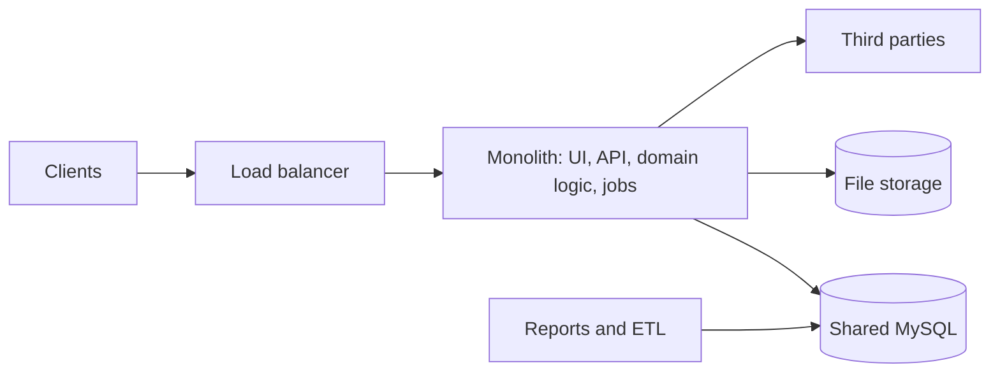
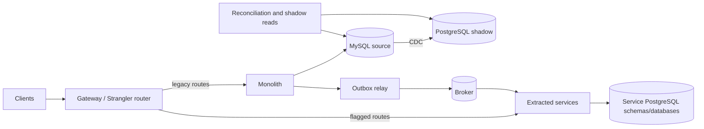
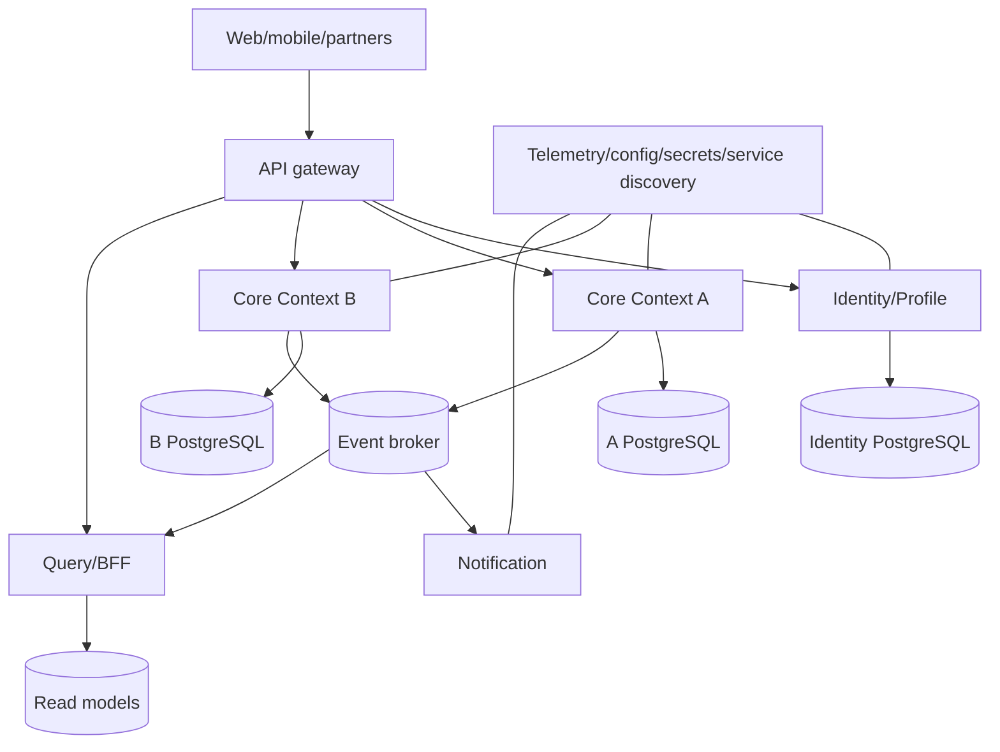
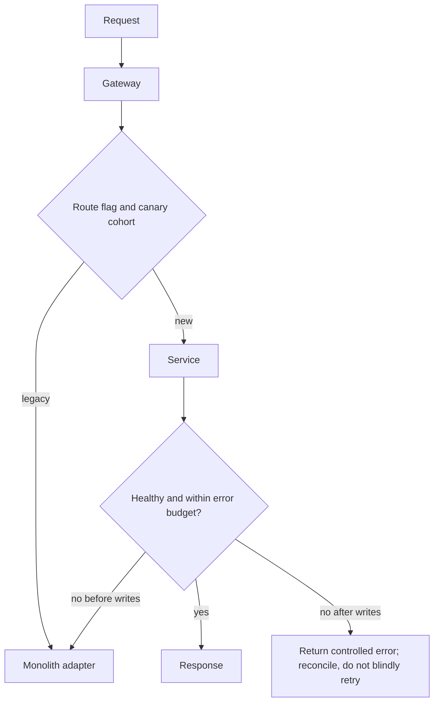
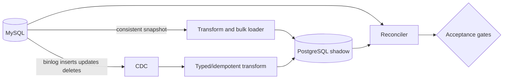
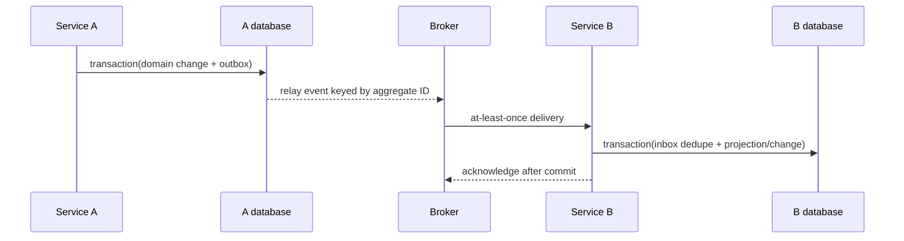
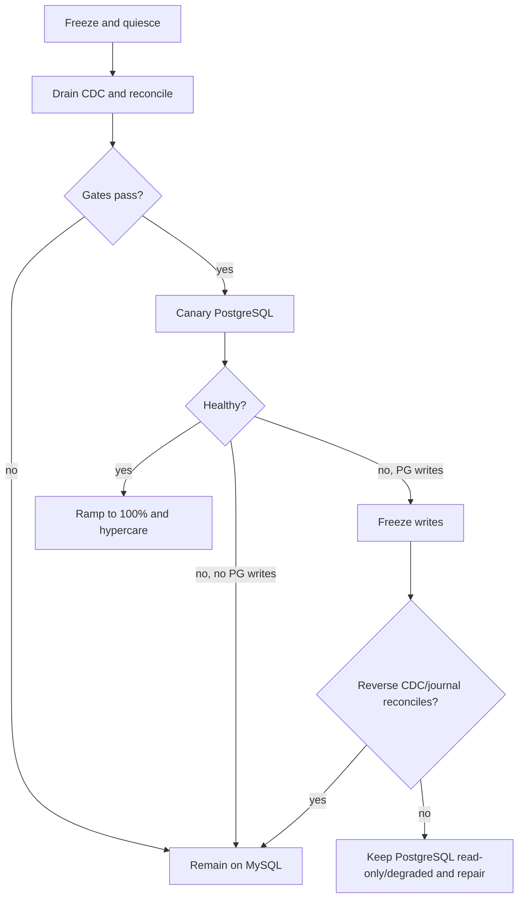

# [Quantorus365] Monolith and MySQL Migration Plan

## Important assumptions made before producing this plan

1. The monolith is business-critical, writes primarily to one MySQL database, and can be changed and redeployed; source code, schema, and production telemetry are available.
2. `[quantorus.in]`, service boundaries, versions, database size, transaction volume, SLA, downtime limit, compliance scope, cloud, and team capability are unknown. Every threshold below is a proposed gate, not an asserted fact.
3. PostgreSQL is a supported target for the framework/ORM and all business logic can be moved out of MySQL-specific routines where necessary.
4. A brief write pause is possible. If `[DOWNTIME_LIMIT]` is effectively zero, reverse replication or a durable write-forwarding bridge must be proven before cutover.
5. The preferred strategy is Strangler Fig plus bulk load and log-based CDC; application dual-write is not the default.
6. The first extraction candidate will be selected by evidence. “Notification” is used as the illustrative first service because it is usually asynchronous and low-coupling; it must be replaced if discovery disproves that.
7. Existing public contracts must remain backward compatible during migration. No consumer is forced to migrate in lockstep.
8. Temporary schema-per-service may be used operationally, but final ownership is database-per-service (or independently secured logical databases on a managed cluster).
9. IDs are retained during database migration. Changing key types or introducing global IDs is a separate, high-risk decision.
10. Recovery objectives, reconciliation tolerances, and irreversible data-retention choices require stakeholder approval.

> **Stakeholder approvals required:** bounded-context ownership; target PostgreSQL version/provider; broker and orchestration platform; cutover write-pause; RPO/RTO; consistency expectations; acceptable reconciliation variance; compliance retention; budget; MySQL rollback window and decommission date.
>
> **High-risk/irreversible:** deleting MySQL, changing identifiers, dropping source columns, changing event semantics, and accepting divergent writes. Delay all until evidence, backups, and expiry of the rollback window.

## 1. Executive summary

Do not rewrite the system. Place a gateway in front of the monolith, establish observability and contract tests, then extract one low-coupling capability at a time. During transition, the gateway routes selected endpoints to services and everything else to the monolith. Services publish facts through a transactional outbox; consumers use inbox/idempotency controls. The monolith remains deployable throughout.

Migrate MySQL independently but coordinately: convert schema and queries, bulk-load PostgreSQL, continuously replicate MySQL binlog changes with CDC, validate shadow reads and business totals, briefly quiesce writes, drain CDC, synchronize sequences, and switch through a reversible connection flag. Avoid application dual-write. Keep MySQL read-only after cutover until the rollback window expires. If PostgreSQL receives writes, rollback requires reverse CDC or replay of a durable write journal—not a blind connection flip.

Success means independently deployable bounded contexts, no cross-service table writes, zero unreconciled data loss, performance within agreed budgets, tested rollback/restore, and operational ownership.

## 2. Assumptions and missing information

Replace all placeholders and collect: domain capability map; code/module dependency graph; table/query ownership; MySQL version/configuration/SQL modes/binlog format; PostgreSQL target; row counts and growth; largest tables; peak TPS/concurrency; query latency percentiles; deadlocks; charset/collations; routines/triggers/events; BLOB volume; replication topology; maintenance windows; SLA/RPO/RTO; deployments and rollback time; integrations/contracts; auth flows; data classification/residency/retention; cloud quotas; team skills; incidents; costs; and test coverage.

Decision log labels: **A** architecture board, **B** business owner, **S** security/compliance, **O** operations/SRE. Approval gates appear as `[A/B/S/O]`.

## 3. Current-state assessment checklist

| Area | Evidence to collect | Output |
|---|---|---|
| Modules/capabilities | packages, routes, call graph, release history; event-storming interviews | capability/context map and owners |
| Database coupling | query logs, ORM mappings, FK graph, writes by module, shared tables, routines | table CRUD matrix; transaction boundaries |
| Transactions | traces and code review for multi-module commits, locks, retries | saga candidates; invariants |
| Jobs/schedules | scheduler definitions, ownership, locks, retries, duplicate behavior | job inventory and migration order |
| Files | paths/object stores, metadata tables, backup/retention | object ownership and migration plan |
| IAM | login, token/session lifecycle, roles, impersonation, machine identities | auth sequence and policy map |
| Integrations | protocols, contracts, rate limits, webhooks, retry behavior | dependency catalog and contract tests |
| Reporting | joins, replicas, ETL, freshness, PII exports | analytical/read-model design |
| Performance | p50/p95/p99, TPS, slow queries, pools, caches, hot rows | baseline and capacity model |
| Deployment | build graph, config, feature flags, rollback, environment drift | dependency graph and deployment SLO |
| Risk/tests | incidents, single points, unit/integration/E2E/migration coverage | risk heat map and coverage gaps |
| Observability | logs, metrics, traces, IDs, alert quality | instrumentation backlog |

Discovery techniques: static dependency analysis; production trace sampling; MySQL `performance_schema` and slow-query review; schema/FK graph; two weeks of representative workload; release-correlation analysis; and workshops with business/domain owners. Sanitize production data used outside production.

### Current architecture (assumed)



## 4. Recommended target architecture

Use bounded contexts derived from domain discovery, not entity-per-service. Each service owns behavior, API/events, and data. Prefer synchronous HTTP/gRPC only for immediate answers; publish durable events for state propagation and workflows. Limit a request path to a small, measured dependency depth; use local projections for repeated remote reads.

Platform: gateway (managed gateway/Kong; alternative Envoy/NGINX), OIDC provider (existing/Keycloak; alternative cloud IAM), broker (Kafka when replay/order/throughput matter; alternative RabbitMQ or managed queue), containers with Kubernetes (alternative managed container service), OpenTelemetry (alternative vendor SDK), Prometheus/Grafana (alternative cloud monitoring), centralized logs (OpenSearch; alternative vendor/cloud logs), secrets manager (cloud vault; alternative Vault), IaC (Terraform/OpenTofu; alternative native templates), CI/CD (existing tool; alternative GitHub Actions/GitLab CI), GitOps where useful (Argo CD; alternative Flux or pipeline deployment). Tool choice follows existing skills and operational cost `[A/O]`.

Policies: TLS everywhere; workload identity; least privilege; config outside images; readiness/liveness/startup probes; timeouts on every remote call; bounded exponential retry with jitter only for transient/idempotent operations; circuit breakers; idempotency keys; trace/correlation propagation; rate limits per identity; immutable images/SBOM/signing; separate accounts/projects and credentials for dev/stage/prod.

### Transitional architecture



### Final target architecture



## 5. Proposed microservice catalog

Names are templates; validate against `[DOMAIN]`.

| Service | Responsibility | Owned APIs/events | Owned data | Dependencies | Priority / complexity | Main risk |
|---|---|---|---|---|---|---|
| Notification | email/SMS/push policy and delivery | send/status; NotificationRequested/Delivered | templates, preferences, delivery attempts | broker, providers | 1 / low-medium | duplicate delivery |
| Identity/Profile | principals/profile lifecycle; auth remains at IdP | profile/admin; ProfileChanged | profile and service authorization metadata | IdP | 2 / medium-high | security/session compatibility |
| Reference/Catalog | stable reference data | query/admin; ReferenceChanged | catalog/reference entities | none/core | 2 / medium | stale caches |
| Core Context A | primary aggregate/workflow `[TBD]` | aggregate commands/queries/events | aggregate A | identity, broker | 3 / high | wrong boundary/invariants |
| Core Context B | second business capability `[TBD]` | B commands/queries/events | aggregate B | A events | 4 / high | temporal coupling |
| Integration Adapter | anti-corruption layer for third parties/webhooks | integration commands/status/events | delivery state, mappings | third parties | 2 / medium | rate limits/outages |
| Reporting/Projection | operational query models and exports | report/query APIs; consumes domain events | denormalized projections | broker/object store | 3 / medium | freshness/replay |
| Job/Workflow | long-running orchestration, only if domain warrants | workflow commands/events | workflow state | services/broker | 3 / high | distributed failure |

Do not create generic “shared,” database, or CRUD services. Keep cohesive capabilities together until independent change/scale/ownership justifies a split.

## 6. Monolith decomposition sequence

1. Build a modular-monolith boundary: internal interfaces, table ownership annotations, dependency tests, and an anti-corruption layer.
2. Introduce gateway with 100% legacy routing and correlation IDs; prove no behavior change.
3. Select first candidate by low shared writes, few synchronous callers, clear owner, measurable value, and easy rollback. Notification is provisional.
4. Add an interface in monolith, implement legacy and remote adapters behind a feature flag. Preserve public URLs/payloads at gateway.
5. Move behavior and tests, then data. Initially permit read-only legacy access only through an explicitly expiring adapter; never new direct writes.
6. Emit source events via outbox. Backfill service data, shadow requests, compare results, then canary 1%→10%→50%→100% subject to gates.
7. Migrate jobs with leader election/durable leases; disable the old scheduler before enabling the new one. Make handlers idempotent.
8. After stability, remove the monolith path and revoke its write role for owned tables. Repeat by business value and coupling.

Shared code: duplicate small stable value objects; publish only versioned, backward-compatible platform libraries (telemetry/auth), never shared domain models. Tightly coupled modules first gain seams inside the monolith. Replace cross-module ACID with aggregate redesign or an orchestrated/choreographed saga with compensations. Avoid a distributed monolith through ownership, async facts, dependency-depth budgets, independent pipelines, and contract tests.

### Request routing



Contracts: additive changes, explicit deprecation, OpenAPI/AsyncAPI in source control, consumer-driven tests, tolerant readers, and event schema compatibility checks. Rollback is gateway/flag reversal only while the legacy path remains authoritative and no new-only writes exist.

## 7. MySQL-to-PostgreSQL compatibility matrix

“Current usage” must be populated by inventory.

| MySQL feature | Current usage | PostgreSQL equivalent | Required application change | Risk | Recommended validation |
|---|---|---|---|---|---|
| `AUTO_INCREMENT` | TBD | `GENERATED ... AS IDENTITY`/sequence | preserve IDs; reset sequence | H | insert-at-max tests |
| `TINYINT(1)` boolean | TBD | `boolean` | explicit converters | M | all distinct values |
| unsigned integers | TBD | larger signed type/check | overflow/range mapping | H | min/max scan |
| datetime/timestamp | TBD | timestamp / `timestamptz` | UTC policy; zero-date cleanse | H | DST/offset cases |
| charset/collation | TBD | UTF-8 + ICU/libc collation | choose deterministic locale | H | sort/unique comparisons |
| case-insensitive names | TBD | normalized field/`citext`/index | explicit comparison semantics | H | duplicate pre-scan |
| `ENUM` | TBD | text+check or enum | prefer evolvable check/domain | M | unknown values/evolution |
| JSON functions | TBD | `jsonb`, operators | rewrite paths/functions/indexes | H | result and plan comparison |
| decimal | TBD | `numeric(p,s)` | preserve rounding modes | H | financial totals |
| defaults/on-update | TBD | defaults/triggers/app logic | remove implicit behavior | H | insert/update matrix |
| generated columns | TBD | generated stored/expression index | rewrite expressions | M | recomputation |
| indexes/prefix index | TBD | B-tree/GIN/GiST/expression | redesign prefix/index order | H | `EXPLAIN ANALYZE` |
| full-text | TBD | `tsvector`/GIN or search service | rewrite ranking/tokenization | H | relevance benchmark |
| FK/check constraints | TBD | FK/check | validate data; deferrability decision | M | orphan/constraint scan |
| procedures/functions | TBD | PL/pgSQL or application | relocate business logic | H | golden-master tests |
| triggers/events | TBD | triggers + external scheduler | rewrite and avoid CDC loops | H | side-effect audit |
| views/temp tables | TBD | views/materialized/temp | syntax/security rewrite | M | result comparison |
| partitioning | TBD | declarative partitioning | redesign keys/maintenance | H | pruning/load test |
| `ON DUPLICATE KEY` | TBD | `ON CONFLICT` | specify conflict target | M | concurrency tests |
| `LIMIT offset,count` | TBD | `LIMIT count OFFSET offset` | rewrite; prefer keyset | L-M | page boundary tests |
| SQL modes/coercion | TBD | stricter typing | make casts/validation explicit | H | invalid-input suite |
| isolation/locking | TBD | MVCC; default read committed | review gap locks/`FOR UPDATE` | H | concurrent invariant tests |
| planner/hints | TBD | PostgreSQL planner/statistics | rewrite/tune queries | H | representative plans |
| identifiers/keywords | TBD | quoted/lowercase identifiers | rename or quote consistently | M | schema compile |
| ORM dialect | TBD | PostgreSQL dialect/driver | upgrade mappings/migrations | H | full integration suite |
| raw SQL/libraries | TBD | PostgreSQL syntax/driver | inventory and replace | H | static scan + runtime coverage |
| BLOB/binary | TBD | `bytea`/large objects/object store | stream; verify hashes | M-H | byte checksums |

## 8. Database migration strategy

### Options

| Approach | Downtime | Risk/fit |
|---|---:|---|
| Offline dump/restore | high | simplest; only if data and downtime permit |
| Bulk + incremental sync | low | **preferred envelope** |
| Log-based CDC | low | preferred incremental mechanism; operationally complex |
| Dual-write | low apparent | divergence risk; avoid as primary method |
| App replication | low-medium | useful only when binlog CDC unavailable |
| Per-service migration | gradual | final ownership path; does not alone migrate remaining monolith |

Preferred: schema conversion + repeatable bulk load + binlog CDC (Debezium; alternative managed DMS) + shadow validation + short quiesce and connection switch. Verify tool support for actual versions/types before approval.



Execution: inventory; convert DDL explicitly; cleanse zero dates, invalid UTF-8, duplicates, orphans and out-of-range unsigned values; create tables/constraints; bulk-load by key ranges while recording snapshot position; stream I/U/D with source position and idempotent apply; backfill largest tables in chunks; hash binaries or move payloads to object storage; replace routines/triggers with tested app/domain logic; create secondary indexes after load where safe; `ANALYZE`; tune autovacuum per hot table; use PgBouncer (alternative managed proxy) with transaction-mode compatibility review; replay captured workload; shadow reads only for side-effect-free queries; then cut over.

Sequence formula after final sync: set each sequence to at least `MAX(id)` with correct next-value semantics; test an insert in a rollback transaction. Preserve CDC tombstones/deletes. Validate counts by table/partition, PK-range checksums, FK/orphans, null/value distributions, and business totals.

Do not dual-write indefinitely. If temporarily unavoidable, write to one system of record, publish a durable outbox operation with idempotency key, reconcile continuously, alert on age/count, and exit once CDC lag is zero, validation passes, and all writers point to PostgreSQL. Never acknowledge success before the authoritative commit.

## 9. Data ownership and consistency model

Rules:

1. Exactly one service owns each table and schema migration. Database roles technically enforce it.
2. No service may modify another service’s tables. Reads across ownership are temporary, read-only, logged, approved, and carry an expiry date.
3. Cross-service data is obtained via API for immediate decisions or events/projections for repeated queries. No production cross-service joins.
4. Reporting consumes CDC/domain events into a warehouse/read model; it does not query every operational database.
5. Cross-service foreign keys are logical IDs, not DB constraints. Reconciliation detects dangling references.
6. Within an aggregate use ACID; across services use eventual consistency and sagas with explicit compensation/timeouts.
7. Producers use transactional outbox; consumers use inbox/deduplication. Ordering is guaranteed only per aggregate key. Events are immutable, versioned, additive, replayable, and retained per policy.

### Event-driven communication



```sql
-- transactional outbox pseudocode
BEGIN;
UPDATE orders SET status = :status, version = version + 1 WHERE id=:id AND version=:expected;
INSERT INTO outbox(event_id, aggregate_id, event_type, schema_version, payload, occurred_at)
VALUES (:uuid, :id, 'OrderStatusChanged', 1, :json, CURRENT_TIMESTAMP);
COMMIT;
-- relay publishes then marks sent; duplicate publish remains safe.
```

```text
consume(event):
  begin transaction
  if inbox contains event.id: commit; acknowledge; return
  assert supported schema version
  apply only if event.aggregateVersion > localVersion
  insert inbox(event.id, receivedAt)
  commit; acknowledge
```

Reconciliation jobs compare authoritative IDs/versions/totals, emit metrics, and create repair work—not silent mutation. Replay uses a new consumer group and version-aware projectors.

## 10. Phased implementation roadmap

| Phase | Objective and tasks | Deliverables / exit criteria | Entry/dependencies | Risks / rollback | Size / roles |
|---|---|---|---|---|---|
| 0 Discovery | inventory code/data/workload; map contexts/invariants; baseline SLA | maps, baseline, ADRs; all placeholders filled | source/telemetry access | missed coupling; no production change | M / architect, domain, DBA, SRE, QA |
| 1 Foundations | tests, telemetry, gateway legacy route, IaC, environments, secrets, pipelines | trace coverage; deploy/rollback proven; gateway parity | phase 0 | platform overhead; remove/bypass gateway | L / platform, security, app, QA |
| 2 PG compatibility | scan SQL; convert schema; cleanse; driver/ORM abstraction; migration rehearsals | compatibility matrix complete; repeatable load; test gates pass | versions and capacity approved | semantic mismatch; remain MySQL | L / DBA, app, QA |
| 3 First extraction | create seam, service, contracts/outbox, backfill, flags | independently deployable service; legacy fallback tested | phases 0–1 | boundary wrong; route back | M / domain team, platform, QA |
| 4 Sync/shadow | bulk load, CDC, reconciliation, shadow reads/traffic | sustained lag and data/perf gates met | phase 2 | lag/load; stop CDC and rebuild shadow | L / DBA, data, SRE |
| 5 PG cutover | rehearse; freeze; quiesce; drain; validate; switch/canary | PostgreSQL authoritative; hypercare stable | rollback path and approvals | data divergence; execute runbook | H/L / incident commander, DBA, SRE, app, QA |
| 6 More services | repeat value-based extractions; migrate jobs/integrations | increasing independent ownership | stable platform/PG | distributed monolith; merge/defer boundary | L ongoing / domain squads |
| 7 Eliminate shared DB | projections/APIs; revoke cross-writes/reads; sagas | zero unauthorized access; service-owned DBs | service contracts stable | reporting gaps; temporary read adapter | L / squads, data, DBA |
| 8 Optimize/decommission | tune cost/perf; DR; remove dead code; archive/delete MySQL after approval | SLOs met; audit evidence; decommission signed `[A/B/S/O]` | rollback window expired | premature deletion; restore archive | M / SRE, DBA, security, finance |

## 11. Testing and validation strategy

Layered suite: unit tests for domain and transforms; containerized MySQL/PostgreSQL integration tests; provider and consumer-driven API/event contract tests; narrow E2E critical journeys; migration fixtures with edge types; schema diff; counts/checksums/FKs/business totals; query-result comparison with normalization; sampled shadow reads; sanitized/replayed shadow traffic; load/stress/soak; failover, broker redelivery, CDC restart, network fault/chaos; SAST/DAST/dependency/container/IaC scans; restore, DR, cutover, and rollback rehearsals.

Proposed measurable PostgreSQL acceptance gates—stakeholders must calibrate:

- 100% tables/columns/constraints mapped and all unsupported SQL classified.
- Zero missing/extra primary keys; zero unexpected FK violations; 100% binary hashes match.
- Exact counts for immutable/reference tables; exact critical financial/business totals; no unexplained variance elsewhere.
- CDC lag below agreed time and event thresholds for a representative peak/soak period; no dead-letter backlog.
- Critical query result equivalence 100%; sampled noncritical equivalence ≥99.99% with every difference explained.
- Error rate no worse than baseline plus agreed margin; p95/p99 latency within agreed budget; peak throughput with ≥30% tested headroom.
- No severity-critical security findings; backup restore, failover, cutover, and post-write rollback rehearsal pass.

## 12. Production cutover runbook

1. Name incident commander, DBA lead, app lead, SRE, QA validator, security observer, communications owner; open bridge and timestamped log.
2. Confirm approvals, backups and restore test, capacity, CDC health, dashboards/alerts, feature flags, reverse-sync/write-journal readiness, rollback deadline, vendor support, and change freeze.
3. Stop schema changes and nonessential releases; pause data repair, ETL, and destructive jobs. Keep customer traffic on MySQL.
4. Complete bulk load; verify CDC lag, delete propagation, reconciliation, query plans, sequences in dry-run, and PostgreSQL pool headroom. **Go/no-go 1.**
5. Put writes into maintenance/read-only mode at gateway; drain requests and queues; disable monolith schedulers and consumers using leases. Record source binlog position.
6. Drain CDC to zero at that position; run critical counts/checksums/totals; synchronize sequences; verify roles/config/backups. **Go/no-go 2.**
7. Switch internal canary workers, then 1% read traffic and controlled synthetic write; validate trace, row, event, cache. Ramp 10%→50%→100% only after observation windows defined in rehearsal.
8. Invalidate/version caches whose representations depend on DB semantics. Enable jobs once, using ownership leases.
9. Monitor application errors/latency/saturation, DB connections/locks/deadlocks/replication/WAL/autovacuum, queue age/DLQ, business KPIs, and reconciliation. **Go/no-go at every ramp.**
10. Keep MySQL read-only, CDC/write journal and rollback resources intact through hypercare. Communicate outcome and record deviations.

```yaml
database:
  target: ${DB_TARGET:mysql}  # flag controlled, audited, two-person approval
  mysqlDsnSecret: monolith/mysql
  postgresDsnSecret: monolith/postgres
  poolMax: 50
featureFlags:
  postgresReadPercent: 0
  postgresWrites: false
  notificationServicePercent: 0
```

```text
health/readiness:
  fail if config/secrets unavailable, DB cannot execute SELECT 1 within 500ms,
  required migrations are absent, or broker cannot accept required writes.
liveness: process/event-loop only; never restart solely for a dependency outage.
```

```yaml
remotePolicy:
  timeout: 800ms
  retry: {maxAttempts: 3, backoff: exponential, jitter: true, only: [timeout, 429, 502, 503, 504]}
  circuitBreaker: {window: 50, failureRate: 50%, openFor: 30s, halfOpenCalls: 5}
  requireIdempotencyKeyFor: [POST, PUT, PATCH]
```

## 13. Rollback runbook

Triggers: unexplained data mismatch; sustained error/latency above gate; invariant violation; CDC/reverse path failure; security exposure; inability to meet business KPI. Incident commander declares rollback before the documented point of no return.

If no PostgreSQL writes occurred: set gateway write/read flags to MySQL, stop PostgreSQL consumers/jobs, restore caches, validate, and investigate.

If PostgreSQL writes occurred:

1. Stop new writes at gateway and freeze all jobs/consumers; preserve logs/WAL/binlog and capture exact positions.
2. **Never blindly flip to stale MySQL.** Determine whether reverse CDC was continuously proven. If yes, drain PostgreSQL→MySQL, deduplicate by operation/event ID, reconcile, synchronize MySQL auto-increment, then switch.
3. If reverse CDC is unavailable, replay the durable PostgreSQL write journal/outbox into MySQL through tested idempotent translators. Resolve conflicts using documented authoritative version rules with business-owner approval.
4. If safe reconciliation cannot meet RTO, remain on PostgreSQL in degraded/read-only mode and restore service there; data integrity outranks fast rollback.
5. Switch cohorts back, validate critical journeys/totals, resume jobs once, communicate, and retain both datasets for forensics.

### Cutover and rollback flow



## 14. Security and compliance plan

TLS/mTLS in transit; provider-managed encryption with customer-managed keys where required; encrypted, access-logged backups; automated secret rotation; separate migration/runtime/admin roles; workload identities; private network segments and deny-by-default rules; audited privileged/JIT access; immutable audit events; PII/PCI/PHI discovery and ownership; tokenized or masked nonproduction data; retention/legal-hold/right-to-delete propagated to projections, events, backups, and replicas; evidence collection mapped to `[COMPLIANCE_REQUIREMENTS]`; SAST, DAST, dependency/license, secret, IaC, image, and runtime scans; minimal non-root signed images, SBOMs, admission policy, and patch SLOs. Alternatives: cloud-native security services or portable Vault/OPA/Trivy-class tooling.

## 15. Observability and operational-readiness plan

SLIs: availability, correct-result rate, p50/p95/p99 latency, throughput, saturation; business completion/success; DB query latency, connections, locks/deadlocks, WAL, cache hit, bloat/autovacuum; CDC lag/errors; broker publish/consume rate, queue age, retries/DLQ; reconciliation mismatches. Set SLOs from `[SLA]`, not aspiration; assign error budgets and halt risky migration ramps when exhausted.

Structured logs include timestamp, service/version/environment, severity, trace/span, correlation and safe business operation ID—never secrets/regulated payloads. OpenTelemetry traces span gateway, services, DB and broker. Dashboards: executive/business, service golden signals, PostgreSQL, CDC/migration, broker, and cutover command center. Page on user-impacting multi-window burn rates, critical invariants, stalled CDC/queues, or capacity exhaustion; tickets for trends.

Each service has owner, runbook, escalation, dependency map, capacity limit, and on-call rotation. Backups use full + point-in-time recovery with cross-failure-domain copies and policy-based retention; restores are tested on a schedule. DR exercises prove stakeholder-approved RPO/RTO `[O/B/S]`; document regional/provider failure strategy and manual business continuity.

## 16. Risk register

| Risk | Probability / impact | Detection | Mitigation | Contingency | Owner |
|---|---|---|---|---|---|
| Incorrect boundaries | M/H | change coupling, chatty calls | event storming, modular seam first | merge/defer split | Architect/domain |
| Hidden DB coupling | H/H | query audit, permission failures | CRUD matrix, revoke in stage | temporary expiring adapter | DBA/app |
| Data inconsistency | M/C | reconciliation/invariants | CDC, idempotency, freeze | repair/replay/read-only | DBA/data |
| Replication lag | M/H | lag/queue age | capacity, chunk throttling | pause load/cutover | DBA/SRE |
| Dual-write failure | M/C | per-target outcome metric | avoid; outbox authority | replay/reconcile | App/data |
| Query regression | H/H | plan/latency comparison | realistic load, indexes/stats | route back/tune | DBA/app |
| PG incompatibility | M/H | compatibility suite | explicit mappings/rewrites | remain MySQL | DBA/app |
| Event duplication | H/M | inbox/duplicate metric | idempotent consumers | replay/repair | Service owner |
| Event ordering | M/H | version gaps | partition by aggregate/version | park/resequence | Service owner |
| Distributed transaction failure | M/H | saga timeout/invariant | compensation/outbox | manual workflow | Domain owner |
| Operational complexity | H/H | incidents/toil/cost | platform standards/training | slow extraction | Platform lead |
| Observability gaps | M/H | unknown failures | phase-1 gates | stop ramp | SRE |
| Rollback failure | L/C | rehearsals | reverse path/journal | PG degraded mode | Incident commander |
| Team skill gaps | H/M | delivery/review defects | pairing/training/support | reduce scope | Eng manager |
| Cost overruns | M/H | budget/usage forecast | quotas, FinOps gates | delay/resize | Sponsor/FinOps |

## 17. Team and responsibility matrix

| Activity | Accountable | Responsible | Consulted |
|---|---|---|---|
| Boundaries/invariants | Chief architect | domain leads | product, DBA |
| Data migration/cutover | DBA lead | DBA/data engineers | app, SRE, business |
| Platform/CI/CD/IaC | Platform lead | DevOps/SRE | security, squads |
| Service extraction | Domain eng lead | service squad | architect, QA, SRE |
| Test acceptance | QA lead | QA + engineers | product/DBA |
| Security/compliance | Security officer | security engineers | legal, platform, DBA |
| Go/no-go | Business sponsor | incident commander | all leads |
| Communications | Product/ops owner | communications lead | support/account teams |

With a small team, combine roles but preserve independent go/no-go and data-validation review.

## 18. Definition of done

A phase/service is done only when: owner and bounded context approved; versioned API/events documented; independent build/deploy/rollback works; unit/integration/contract/E2E tests pass; data ownership enforced by roles; no unauthorized table access; migration/backfill/replay are idempotent; SLOs/dashboards/alerts/runbooks/on-call exist; threat model and scans pass; backup/restore proven; failure/rollback rehearsed; cost/capacity recorded; legacy route/code/data access removed after stability; and ADR/evidence updated.

Overall completion additionally requires PostgreSQL authoritative and stable, every reconciliation gate met, no shared writes/cross-service joins, MySQL archived/decommissioned with approval, and business/SRE/security acceptance.

## 19. First 30 implementation tasks

1. Replace every project placeholder and nominate decision owners.
2. Export schema, routines, triggers, events, views, users, SQL modes, and collations.
3. Capture table sizes, growth, peak TPS, slow queries, locks, and pool usage.
4. Build module/call/deployment dependency graphs.
5. Build table CRUD and cross-module transaction matrices.
6. Run capability mapping/event-storming workshops.
7. Inventory jobs, files, reports, integrations, and auth flows.
8. Define current SLIs/SLA, RPO/RTO, downtime and reconciliation gates.
9. Baseline critical business totals and journeys.
10. Create risk register and decision board.
11. Add correlation IDs and structured logging to monolith.
12. Instrument traces, golden signals, DB and job metrics.
13. Create sanitized migration edge-case dataset.
14. Add golden-master and critical E2E tests.
15. Add API/event contract repositories and compatibility checks.
16. Select gateway, PostgreSQL provider/version, CDC, broker, and orchestrator via ADRs.
17. Provision isolated dev/stage platform using IaC.
18. Configure identity, secrets, least-privilege roles, network controls, and audit.
19. Put gateway in front with 100% legacy routing.
20. Introduce feature-flagged database connection abstraction.
21. Inventory and classify every raw SQL/dialect dependency.
22. Draft explicit PostgreSQL DDL and mapping rules.
23. Implement cleansing reports; do not silently transform anomalies.
24. Build repeatable snapshot/bulk-load pipeline.
25. Build CDC pipeline with I/U/D, offsets, DLQ, and metrics.
26. Build count/checksum/FK/business-total reconciler.
27. Replay representative queries against PostgreSQL and tune.
28. Score first extraction candidates and approve one.
29. Create monolith seam, remote adapter, outbox, and first service skeleton.
30. Rehearse extraction rollback and full database cutover/post-write rollback in staging.

## 20. Architecture decision records to create

ADR-001 context boundaries and ownership; 002 Strangler routing; 003 sync/async rules and dependency budget; 004 API/event versioning; 005 broker choice and delivery semantics; 006 outbox/inbox and ordering; 007 saga strategy; 008 PostgreSQL version/provider/topology; 009 schema/type/collation/time-zone mappings; 010 CDC and cutover design; 011 post-write rollback authority; 012 database-per-service transition; 013 identity/service authorization; 014 secrets/encryption/key ownership; 015 orchestration/service discovery; 016 observability/SLO/error budgets; 017 CI/CD and environment promotion; 018 IaC and DR; 019 reporting/read models; 020 retention/deletion/event replay; 021 ID strategy; 022 MySQL decommission criteria.

## Prioritized first 10 actions

1. Fill the missing context and assign accountable decision owners.
2. Agree SLA, downtime, RPO/RTO, integrity tolerances, and rollback window.
3. Map capabilities, invariants, code dependencies, and table CRUD ownership.
4. Inventory all MySQL-specific schema, SQL, routines, triggers, collations, and data anomalies.
5. Baseline critical journeys, business totals, performance, and production failure modes.
6. Add correlation IDs, traces, DB/queue/job metrics, and cutover dashboards.
7. Establish golden-master, contract, migration, and rollback tests.
8. Approve PostgreSQL/CDC/gateway/broker choices through short evidence-based ADRs.
9. Build a repeatable bulk-load + CDC + reconciliation rehearsal in staging.
10. Score extraction candidates and implement one modular seam behind a gateway feature flag.
