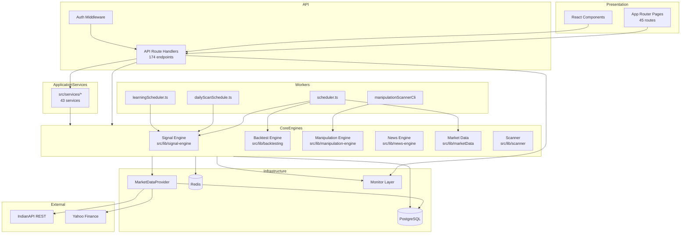
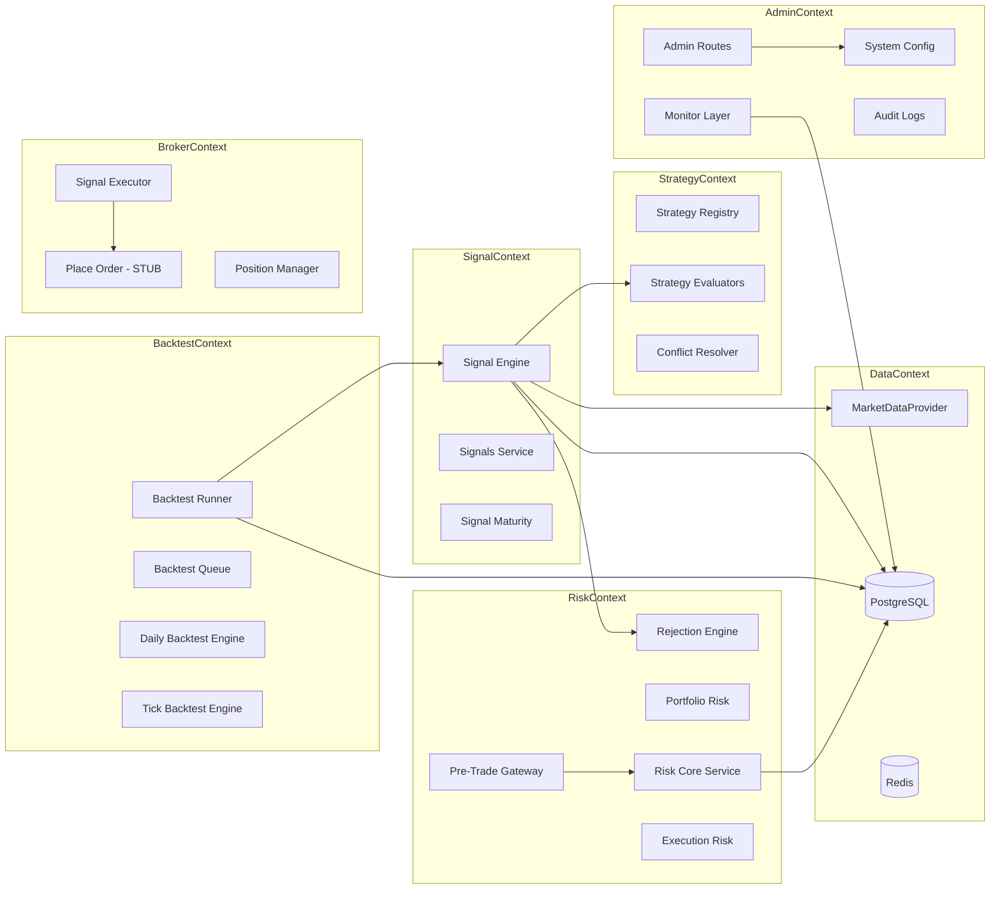
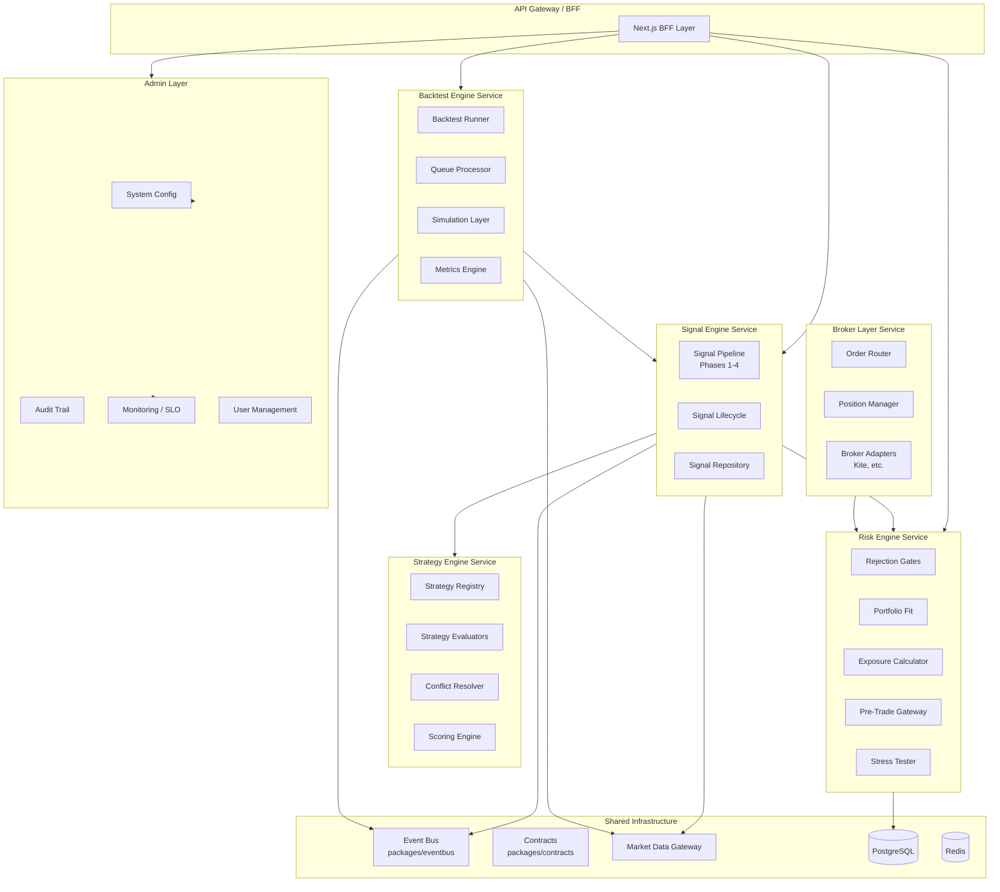

# Quantorus365 — Enterprise Architecture Audit

**Version:** 2.1.0  
**Audit Date:** 2025-06-25  
**Scope:** Full codebase analysis — documentation only, no business-logic changes  
**Auditor Role:** Senior Software Architect / Full-Stack / Prompt Engineering review

---

## Executive Summary

Quantorus365 is an institutional stock intelligence and decision platform built on **Next.js 16**, **TypeScript**, **PostgreSQL** (primary runtime DB), **Redis** (streams/cache), and **node-cron** workers. The system implements a 4-phase signal pipeline, institutional backtesting, manipulation surveillance, news intelligence, and portfolio-aware risk gating.

| Dimension | Status |
|-----------|--------|
| **Scale** | ~1,092 tracked files, 174 API routes, 45 frontend pages, 117 CLI scripts, 93 test files |
| **TypeScript (`tsc --noEmit`)** | ✅ Pass |
| **ESLint** | ✅ Pass |
| **Production Build (`next build`)** | ✅ Pass (with `ignoreBuildErrors: true`) |
| **Hardcoded secrets in source** | ✅ None found |
| **Auth coverage on API routes** | ⚠️ ~88/174 routes use `requireSession`; middleware validates cookie presence only |
| **Modular readiness** | ⚠️ Monolith with microservice scaffolds; tight coupling in signal/backtest paths |

**Primary recommendation:** Extract six bounded contexts (Signal, Strategy, Backtest, Risk, Broker, Admin) behind stable contracts while preserving the existing Phase 3 approval gate as the single source of truth for signal persistence.

### Document Suite

| Document | Scope |
|----------|-------|
| [architecture-audit.md](./architecture-audit.md) | Master audit — architecture, modules, gaps, build health |
| [api-inventory.md](./api-inventory.md) | All 174 API routes with auth classification |
| [database-inventory.md](./database-inventory.md) | Schemas, tables, migrations, ER diagram |
| [signal-engine-flow.md](./signal-engine-flow.md) | 4-phase signal pipeline, entry points, lifecycle |
| [strategy-flow.md](./strategy-flow.md) | Strategy registry (24), evaluators, scoring flow |
| [security-review.md](./security-review.md) | Secret exposure, auth gaps, risk register |
| [implementation-roadmap.md](./implementation-roadmap.md) | Gap analysis, backtest flow, phase-wise roadmap, release workflow |

### Acceptance Criteria Status

| Criterion | Status | Document |
|-----------|--------|----------|
| Existing architecture documented | ✅ | This file §1 |
| Module dependency map created | ✅ | This file §1.5 |
| Frontend routes documented | ✅ | This file §2, [api-inventory](./api-inventory.md) |
| Backend services documented | ✅ | This file §3 |
| Signal generation flow documented | ✅ | [signal-engine-flow.md](./signal-engine-flow.md) |
| Strategy registry documented | ✅ | [strategy-flow.md](./strategy-flow.md) |
| Backtest flow documented | ✅ | [implementation-roadmap.md](./implementation-roadmap.md) |
| Cron jobs identified | ✅ | This file §6 |
| Scheduled jobs documented | ✅ | This file §6, [implementation-roadmap.md](./implementation-roadmap.md) |
| Environment variables audited | ✅ | [security-review.md](./security-review.md) §3 |
| Secret exposure reviewed | ✅ | [security-review.md](./security-review.md) §1 |
| Sensitive configuration documented | ✅ | [security-review.md](./security-review.md) §3 |
| Risk report generated | ✅ | [security-review.md](./security-review.md) §6 |
| Feature branch strategy documented | ✅ | [implementation-roadmap.md](./implementation-roadmap.md) |
| Release workflow documented | ✅ | [implementation-roadmap.md](./implementation-roadmap.md) |

---

## 1. Current Architecture

### 1.1 High-Level System Topology

```
┌─────────────────────────────────────────────────────────────────────────────┐
│                         PRODUCTION RUNTIME (server.js)                       │
├─────────────────────────────────────────────────────────────────────────────┤
│  Next.js HTTP (port 5000)          │  WebSocket Stream (port 5001)          │
│  ├── 45 App Router pages           │  └── tickBus fan-out                   │
│  ├── 174 API routes                │                                        │
│  └── instrumentation.ts boot       │                                        │
├─────────────────────────────────────────────────────────────────────────────┤
│  Child Worker Processes (PM2-supervised)                                     │
│  ├── scheduler.ts          — market data, signal regen, backtest, maturity  │
│  ├── manipulationScannerCli — daily 18:30 IST manipulation scan               │
│  └── learningScheduler.ts  — outcome grading, calibration (20:30 IST)         │
└─────────────────────────────────────────────────────────────────────────────┘
         │                    │                    │
         ▼                    ▼                    ▼
   PostgreSQL            Redis (streams)      IndianAPI (primary)
   (auth, master,         market_ticks,         Yahoo (fallback)
    market, intel,        signals_stream        Cache (in-memory)
    app, ops, q365_*)     provider health
```

### 1.2 Technology Stack

| Layer | Technology | Location |
|-------|-----------|----------|
| Frontend | React 18, Next.js 16 App Router, SCSS modules, Recharts | `src/app/`, `src/components/` |
| API | Next.js Route Handlers | `src/app/api/**/route.ts` |
| Business Logic | TypeScript modules | `src/lib/`, `src/services/` |
| Market Data Gateway | Provider facade + adapters | `src/providers/MarketDataProvider.ts` |
| Database | PostgreSQL (`pg`), legacy MySQL backfill only | `src/lib/db/`, `migrations/postgres/` |
| Cache / Streams | Redis (`ioredis`), in-memory `node-cache` | `src/lib/redis.ts`, `src/lib/cache.ts` |
| Scheduling | `node-cron`, worker child processes | `src/lib/workers/`, `server.js` |
| Auth | Cookie sessions (`q200_session`), bcrypt, optional TOTP | `src/services/auth.ts`, `src/middleware.ts` |
| Monitoring | Winston logger, Prometheus, API monitor | `src/lib/monitor/`, `src/lib/logger.ts` |
| Testing | Vitest + tsx acceptance scripts | `src/__tests__/`, `scripts/validatePhase*.ts` |

### 1.3 Architectural Principles (Frozen — `ARCHITECTURE.md`)

1. **Risk-first** — Risk is a gatekeeper, not a display metric
2. **Portfolio awareness** — Trade quality = stock quality × portfolio fit
3. **Scenario-driven** — Market conditions control strategy access
4. **Confidence scoring** — Measures decision quality, not prediction certainty
5. **Rejection discipline** — System earns trust by filtering, not volume

**Canonical market-data chain:**

```
IndianAPI (PRIMARY) → Cache (10-min TTL) → Yahoo (fallback) → PostgreSQL stale snapshot
```

**Single provider entry point:** `src/providers/MarketDataProvider.ts`

**Runtime database:** PostgreSQL only. MySQL survives as one-way migration source.

**Kite/Zerodha:** Broker/order-execution only — never a market-data truth source (currently neutralized/stubbed).

### 1.4 Layered Code Organization

```
src/
├── app/           # Next.js pages (45) + API routes (174)
├── components/    # React UI (dashboard, signals, stock detail, layout)
├── lib/           # Core engines (signal, backtest, manipulation, news, market data)
├── services/      # Application service layer (43 services)
├── providers/     # Market data adapters (IndianAPI, Yahoo)
├── hooks/         # React hooks
├── types/         # Shared TypeScript types
├── instrumentation.ts  # Boot: env validation, schema ensure, schedulers
└── middleware.ts       # Cookie-presence auth gate

services/          # Microservice scaffolds (7 standalone servers)
packages/          # Shared contracts, eventbus, RPC (monorepo foundation)
scripts/           # 117 CLI ops, validation, backfill scripts
migrations/        # Postgres + MySQL SQL migrations
```

### 1.5 Dependency Diagram



---

## 2. Frontend Pages

### 2.1 Page Inventory (45 routes)

| Route | File | Domain |
|-------|------|--------|
| `/` | `src/app/page.tsx` | Landing |
| `/about` | `src/app/about/page.tsx` | Marketing |
| `/backtesting` | `src/app/backtesting/page.tsx` | Backtest UI |
| `/calibration` | `src/app/calibration/page.tsx` | Confidence calibration |
| `/contact` | `src/app/contact/page.tsx` | Contact |
| `/dashboard` | `src/app/dashboard/page.tsx` | Main dashboard |
| `/dexter` | `src/app/dexter/page.tsx` | AI narrative (Dexter) |
| `/engines` | `src/app/engines/page.tsx` | Engine overview (public) |
| `/gateway` | `src/app/gateway/page.tsx` | Gateway (public) |
| `/insights` | `src/app/insights/page.tsx` | Institutional insights |
| `/insights/[slug]` | `src/app/insights/[slug]/page.tsx` | Insight articles (SSG) |
| `/intelligence` | `src/app/intelligence/page.tsx` | Market intelligence |
| `/login` | `src/app/login/page.tsx` | Authentication |
| `/manipulation` | `src/app/manipulation/page.tsx` | Surveillance dashboard |
| `/market` | `src/app/market/page.tsx` | Market overview |
| `/market/[key]` | `src/app/market/[key]/page.tsx` | Market segment detail |
| `/news` | `src/app/news/page.tsx` | News feed |
| `/news-intelligence` | `src/app/news-intelligence/page.tsx` | News intelligence |
| `/notifications` | `src/app/notifications/page.tsx` | User notifications |
| `/options/chain` | `src/app/options/chain/page.tsx` | Options chain |
| `/platform` | `src/app/platform/page.tsx` | Platform overview |
| `/portfolio` | `src/app/portfolio/page.tsx` | Portfolio management |
| `/rankings` | `src/app/rankings/page.tsx` | Stock rankings |
| `/register` | `src/app/register/page.tsx` | Self-registration |
| `/reports` | `src/app/reports/page.tsx` | Reports |
| `/settings` | `src/app/settings/page.tsx` | User settings |
| `/signals` | `src/app/signals/page.tsx` | Signal board (primary) |
| `/signals/[key]` | `src/app/signals/[key]/page.tsx` | Signal detail |
| `/signals/backtesting` | `src/app/signals/backtesting/page.tsx` | Signal backtest view |
| `/signals/daily-report` | `src/app/signals/daily-report/page.tsx` | Daily signal report |
| `/signals/engine-health` | `src/app/signals/engine-health/page.tsx` | Engine health |
| `/stocks` | `src/app/stocks/page.tsx` | Stock list |
| `/stocks/[symbol]` | `src/app/stocks/[symbol]/page.tsx` | Stock detail |
| `/strategies/performance` | `src/app/strategies/performance/page.tsx` | Strategy performance |
| `/surveillance` | `src/app/surveillance/page.tsx` | Surveillance |
| `/trade-journal` | `src/app/trade-journal/page.tsx` | Trade journal |
| `/trade-setups` | `src/app/trade-setups/page.tsx` | Trade setups |
| `/watchlist` | `src/app/watchlist/page.tsx` | Watchlist |
| `/debug/system-health` | `src/app/debug/system-health/page.tsx` | Operator debug UI |
| `/admin/audit` | `src/app/admin/audit/page.tsx` | Admin audit |
| `/admin/data` | `src/app/admin/data/page.tsx` | Admin data ops |
| `/admin/news` | `src/app/admin/news/page.tsx` | Admin news |
| `/admin/performance` | `src/app/admin/performance/page.tsx` | Admin performance |
| `/admin/pipeline` | `src/app/admin/pipeline/page.tsx` | Admin pipeline |
| `/admin/signal-rules` | `src/app/admin/signal-rules/page.tsx` | Signal rules config |
| `/admin/users` | `src/app/admin/users/page.tsx` | User management |

### 2.2 Key Frontend Patterns

- **Polling:** `src/app/signals/useSignalsPolling.ts` — dashboard signal refresh
- **Live prices:** `src/lib/hooks/useLivePrices.ts`, `src/components/LivePriceTicker.tsx`
- **Auth gate:** `src/middleware.ts` — cookie presence check, redirect to `/login`
- **Styling:** SCSS modules (`*.module.scss`) + global styles in `src/styles/`

---

## 3. Backend Modules

### 3.1 Core Engine Modules (`src/lib/`)

| Module | Path | Files | Purpose |
|--------|------|-------|---------|
| **Signal Engine** | `src/lib/signal-engine/` | ~125 | 4-phase pipeline, 17 strategies, scoring, rejection, lifecycle |
| **Signals Service** | `src/lib/signals/` | 23 | API-facing signal assembly, freshness, rotation, reports |
| **Backtesting** | `src/lib/backtesting/` | 47 | Institutional simulation, replay, metrics, queue |
| **Manipulation Engine** | `src/lib/manipulation-engine/` | 36 | 14 detectors, daily scan, penalties |
| **News Engine** | `src/lib/news-engine/` | 31 | Ingestion, scoring, impact, calibration |
| **Market Data** | `src/lib/marketData/` | 49 | Providers, candles, universe, quota, fallback chain |
| **Scanner** | `src/lib/scanner/` | 9 | Pre-filter, indicators, custom universe |
| **Pipeline (Redis)** | `src/lib/pipeline/` | 11 | Tick-stream strategy/execution/backtest workers |
| **Execution** | `src/lib/execution/` | 8 | Order placement (stubbed), position mgmt |
| **Strategies** | `src/lib/strategies/` | 6 | Performance tracking, regime router |
| **Monitor** | `src/lib/monitor/` | 8 | API quota, health probes, Prometheus |
| **Workers** | `src/lib/workers/` | 12 | Cron schedulers, CLI entrypoints |
| **DB** | `src/lib/db/` | 18 | Migrations, schema ensure, queries |
| **Cron** | `src/lib/cron/` | 2 | Signal maturity, snapshot lifecycle |
| **Learning** | `src/lib/learning/` | 2 | Signal review, learning persistence |
| **Portfolio** | `src/lib/portfolio/` | 1 | Position manager |
| **Confirmation** | `src/lib/confirmation/` | 1 | Signal confirmation aggregator |
| **Explainability** | `src/lib/explainability/` | 1 | Signal explanations |
| **Startup** | `src/lib/startup/` | 2 | Env safety lock, universe readiness |
| **WebSocket** | `src/lib/ws/` | 2 | Stream server |
| **Strategy Layer** | `src/lib/strategy-layer/` | — | Empty scaffold |
| **Trust Layer** | `src/lib/trust-layer/` | — | Empty scaffold |

### 3.2 Application Services (`src/services/` — 43 files)

| Service | File | Responsibility |
|---------|------|----------------|
| Auth | `auth.ts` | Sessions, login, registration |
| System Config | `systemConfigService.ts` | Threshold loading from `system_thresholds` |
| Scenario Engine | `scenarioEngine.ts` | Market scenario classification |
| Market Stance | `marketStanceEngine.ts` | Aggressiveness adjustments |
| Portfolio Fit | `portfolioFitService.ts` | Portfolio correlation fit |
| Risk Core | `riskCoreService.ts` | Exposure, concentration, liquidity, drawdown |
| Pre-Trade Gateway | `preTradeGatewayService.ts` | Mandatory pre-trade gate |
| Decision Orchestrator | `decisionOrchestrator.ts` | Decision pipeline assembly |
| Explain Decision | `explainDecisionService.ts` | Decision explainability |
| Governance | `governanceService.ts` | Trading restrictions |
| Breach Detection | `breachDetectionService.ts` | Alert breach monitoring |
| Scenario Stress | `scenarioStressService.ts` | Stress test scenarios |
| Opportunity | `opportunityService.ts` | Ranked opportunities |
| Market Data | `marketDataService.ts`, `unifiedMarketData.ts`, `marketQuote.ts` | Quote resolution (legacy paths) |
| Market Intelligence | `marketIntelligenceService.ts` | Intelligence aggregation |
| News | `newsService.ts` | News API layer |
| Alerts | `alertsEngine.ts`, `alertService.ts` | Alert rules and delivery |
| Portfolio Ledger | `portfolioLedgerService.ts`, `deterministicLedger.ts` | P&L ledger |
| PnL | `pnlService.ts` | Profit/loss computation |
| Performance | `performanceTracker.ts` | Strategy performance |
| Rankings | `rankingsService.ts` | Stock rankings |
| Trade Setups | `tradeSetupGenerator.ts` | Trade setup generation |
| Chart | `chartService.ts` | Chart data |
| Stock Detail | `stockDetailService.ts` | Stock detail aggregation |
| Canonical Data | `canonicalDataService.ts` | Canonical schema access |
| Instrument Resolver | `instrumentResolver.ts` | Symbol resolution |
| AI Layer | `aiLayerService.ts`, `aiBoundary.ts` | AI explanation boundaries |
| Audit Log | `auditLogService.ts` | Audit event logging |
| Entitlement | `entitlement.ts` | Feature entitlements |
| Data Sync | `dataSync.ts`, `dataAggregator.ts` | Data synchronization |
| Valuation | `valuationService.ts` | Valuation metrics |
| Option Intelligence | `optionIntelligence.ts` | Options analysis |
| Live Quote | `LiveQuoteService.ts` | Live quote service |
| Decision Context | `decisionContext.ts` | Decision context builder |
| Decision Trace | `decisionTraceBuilder.ts` | Trace construction |
| Institutional Fit | `institutionalFitService.ts` | Institutional portfolio fit |
| Market Explanation | `marketExplanation.ts` | Market narrative |

### 3.3 Microservice Scaffolds (`services/`)

| Service | Path | Status |
|---------|------|--------|
| Signal Engine | `services/signal-engine/src/server.ts` | Skeleton — bus subscriber |
| Market Ingestion | `services/market-ingestion/` | Skeleton |
| Market Intelligence | `services/market-intelligence/` | Skeleton |
| Portfolio | `services/portfolio/` | Skeleton |
| Alerting | `services/alerting/` | Skeleton |
| Identity | `services/identity/` | Skeleton |
| Reporting | `services/reporting/` | Skeleton |

### 3.4 Shared Packages (`packages/`)

| Package | Purpose |
|---------|---------|
| `packages/contracts` | API contracts, events, correlation types |
| `packages/eventbus` | Event bus abstraction |
| `packages/rpc` | RPC client |

---

## 4. API Inventory

**Total:** 174 route handlers under `src/app/api/`

### 4.1 API by Domain

#### Admin (7)
| Method | Path | Auth |
|--------|------|------|
| * | `/api/admin` | `requireSession` + admin |
| * | `/api/admin/alert-rules` | admin |
| * | `/api/admin/cleanup-confirmed` | `requireSession` |
| * | `/api/admin/performance` | admin |
| * | `/api/admin/recompute` | admin |
| * | `/api/admin/rescore` | admin |
| * | `/api/admin/signal-rules` | admin |

#### AI (3)
| Path | Auth |
|------|------|
| `/api/ai/explain-opportunity` | ⚠️ middleware only |
| `/api/ai/explain-risk` | `requireSession` |
| `/api/ai/summarize-scenario` | `requireSession` |

#### Alerts & Audit (4)
| Path | Auth |
|------|------|
| `/api/alerts` | `requireSession` |
| `/api/alerts/breaches` | `requireSession` |
| `/api/audit/log-event` | `requireSession` |
| `/api/audit/logs` | ⚠️ middleware only |

#### Auth & User (4)
| Path | Auth |
|------|------|
| `/api/auth` | **Public** |
| `/api/user` | `requireSession` |
| `/api/user/features` | `requireSession` |
| `/api/user/onboarding` | `requireSession` |

#### Backtests (13)
| Path | Auth |
|------|------|
| `/api/backtests` | ⚠️ **No requireSession** |
| `/api/backtests/process-queue` | ⚠️ **No requireSession** |
| `/api/backtests/seed-data` | 410 Gone (disabled) |
| `/api/backtests/[id]` | ⚠️ middleware only |
| `/api/backtests/[id]/analytics` | ⚠️ middleware only |
| `/api/backtests/[id]/audit` | ⚠️ middleware only |
| `/api/backtests/[id]/calibration` | ⚠️ middleware only |
| `/api/backtests/[id]/cancel` | ⚠️ middleware only |
| `/api/backtests/[id]/dexter` | ⚠️ middleware only |
| `/api/backtests/[id]/performance` | ⚠️ middleware only |
| `/api/backtests/[id]/signals` | ⚠️ middleware only |
| `/api/backtests/[id]/trades` | ⚠️ middleware only |

#### Canonical Data (8)
| Path | Auth |
|------|------|
| `/api/canonical/benchmarks` | ⚠️ middleware only |
| `/api/canonical/factors` | ⚠️ middleware only |
| `/api/canonical/instruments` | ⚠️ middleware only |
| `/api/canonical/portfolios` | ⚠️ middleware only |
| `/api/canonical/positions` | ⚠️ middleware only |
| `/api/canonical/prices` | ⚠️ middleware only |
| `/api/canonical/resolve` | ⚠️ middleware only |
| `/api/canonical/sectors` | ⚠️ middleware only |

#### Charts & Dashboard (3)
| Path | Auth |
|------|------|
| `/api/chart-data` | `requireSession` |
| `/api/charts` | `requireSession` |
| `/api/dashboard` | `requireSession` |

#### Debug (5) — **Security concern**
| Path | Auth |
|------|------|
| `/api/debug/env-check` | ⚠️ middleware only — exposes key metadata |
| `/api/debug/provider-report` | ⚠️ middleware only |
| `/api/debug/quota` | ⚠️ middleware only |
| `/api/debug/signal-validation` | ⚠️ middleware only |
| `/api/debug/system-health` | ⚠️ middleware only — full operator telemetry |

#### Decisions & Explainability (4)
| Path | Auth |
|------|------|
| `/api/decisions/evaluate` | `requireSession` |
| `/api/decisions/traces` | ⚠️ middleware only |
| `/api/decisions/trace/[id]` | ⚠️ middleware only |
| `/api/explainability/decision/[id]` | ⚠️ middleware only |
| `/api/explanations` | `requireSession` |

#### Governance (3)
| Path | Auth |
|------|------|
| `/api/governance/evaluate` | `requireSession` |
| `/api/governance/restrictions` | `requireSession` |
| `/api/governance/rules` | ⚠️ middleware only |

#### Health & Monitoring (7)
| Path | Auth |
|------|------|
| `/api/health` | **Public** — leaks internals |
| `/api/engine-health/status` | **Public** |
| `/api/data-feed/health` | ⚠️ middleware only |
| `/api/monitor/run-checks` | `requireSession` |
| `/api/metrics` | ⚠️ **No auth** — Prometheus export |
| `/api/system/alerts` | ⚠️ middleware only |
| `/api/system/institutional-health` | ⚠️ middleware only |

#### Manipulation (22 — dual URL trees)
Legacy `/api/manipulation/*` re-exports `manipulation-engine/*` handlers.

| Path | Auth |
|------|------|
| `/api/manipulation` | `requireSession` |
| `/api/manipulation/[symbol]` | ⚠️ middleware only |
| `/api/manipulation/analytics` | ⚠️ middleware only |
| `/api/manipulation/backtest-impact` | ⚠️ middleware only |
| `/api/manipulation/daily-scan` | `requireSession` |
| `/api/manipulation/detectors` | ⚠️ middleware only |
| `/api/manipulation/eod-ingest` | `requireSession` |
| `/api/manipulation/penalties` | ⚠️ middleware only |
| `/api/manipulation/run` | `requireSession` |
| `/api/manipulation/trend` | ⚠️ middleware only |
| `/api/manipulation/watchlists` | ⚠️ middleware only |
| `/api/manipulation-engine/*` (11 routes) | Mixed — scan route unauthenticated |

#### Market Data (18)
| Path | Auth |
|------|------|
| `/api/market` | `requireSession` |
| `/api/market/historical` | ⚠️ middleware only |
| `/api/market/movers` | ⚠️ middleware only |
| `/api/market/quote` | ⚠️ middleware only |
| `/api/market/snapshot-db` | ⚠️ middleware only |
| `/api/market/stream` | ⚠️ middleware only |
| `/api/market/v2/quote` | ⚠️ middleware only |
| `/api/market-data` | `requireSession` |
| `/api/market-data/bot` | **Public** |
| `/api/market-data/health` | **Public** |
| `/api/market-data/reseed` | **Public** — DB mutation |
| `/api/market-data/subscribe` | ⚠️ middleware only |
| `/api/market-data/unified` | ⚠️ middleware only |
| `/api/market-data/usage` | `requireSession` |
| `/api/market-data/validate` | **Public** |
| `/api/market-intelligence` | `requireSession` |
| `/api/market-status` | ⚠️ middleware only |
| `/api/bootstrap-nse` | `requireSession` |

#### News (3)
| Path | Auth |
|------|------|
| `/api/news` | `requireSession` |
| `/api/news/categories` | `requireSession` |
| `/api/news-engine` | `requireSession` |

#### Opportunities & Pre-trade (5)
| Path | Auth |
|------|------|
| `/api/opportunities` | ⚠️ middleware only |
| `/api/opportunities/evaluate` | `requireSession` |
| `/api/opportunities/ranked` | ⚠️ middleware only |
| `/api/pretrade/evaluate` | `requireSession` |

#### Options (3)
| Path | Auth |
|------|------|
| `/api/options` | `requireSession` |
| `/api/options/intelligence` | `requireSession` |

#### Pipeline & Portfolio (10)
| Path | Auth |
|------|------|
| `/api/pipeline/portfolio` | ⚠️ middleware only |
| `/api/pipeline/stats` | ⚠️ middleware only |
| `/api/portfolio` | `requireSession` |
| `/api/portfolio/history` | `requireSession` |
| `/api/portfolio/holdings` | `requireSession` |
| `/api/portfolio/ledger` | `requireSession` |
| `/api/portfolio/overview` | `requireSession` |
| `/api/portfolio/pnl` | `requireSession` |
| `/api/portfolio-fit/evaluate` | `requireSession` |
| `/api/portfolio-fit/institutional` | `requireSession` |
| `/api/portfolio-fit/size-trade` | `requireSession` |

#### Risk (4)
| Path | Auth |
|------|------|
| `/api/risk/concentration` | `requireSession` |
| `/api/risk/exposures` | `requireSession` |
| `/api/risk/liquidity` | `requireSession` |
| `/api/risk/summary` | `requireSession` |

#### Scanner & Signal Engine (8)
| Path | Auth |
|------|------|
| `/api/scanner/custom-universe/run` | ⚠️ **No requireSession** — expensive |
| `/api/run-signal-engine` | `requireSession` |
| `/api/signal-engine` | `requireSession` |
| `/api/signal-engine/calibration` | `requireSession` |
| `/api/signal-engine/debug/conflicts` | `requireSession` |
| `/api/signal-engine/dexter` | `requireSession` |
| `/api/signal-engine/feedback/evaluate` | `requireSession` |
| `/api/signal-engine/insights` | ⚠️ middleware only |

#### Signals (17)
| Path | Auth |
|------|------|
| `/api/signals` | `requireSession` |
| `/api/signals/[id]` | `requireSession` |
| `/api/signals/[id]/lifecycle` | `requireSession` |
| `/api/signals/backtest` | `requireSession` |
| `/api/signals/bootstrap` | `requireSession` |
| `/api/signals/confirmation` | `requireSession` |
| `/api/signals/daily-report` | `requireSession` |
| `/api/signals/diagnostics` | `requireSession` |
| `/api/signals/engine-health` | `requireSession` |
| `/api/signals/explain` | `requireSession` |
| `/api/signals/force-seed` | 410 Gone |
| `/api/signals/freshness` | ⚠️ middleware only |
| `/api/signals/health-report` | `requireSession` |
| `/api/signals/rotation` | `requireSession` |
| `/api/signals/stream` | `requireSession` |

#### Scenarios & Strategies (7)
| Path | Auth |
|------|------|
| `/api/scenarios/run` | `requireSession` |
| `/api/scenarios/library` | ⚠️ middleware only |
| `/api/scenarios/evaluate-trade` | `requireSession` |
| `/api/strategies/backfill` | `requireSession` |
| `/api/strategies/learning` | `requireSession` |
| `/api/strategies/performance` | `requireSession` |
| `/api/strategies/regime-router` | `requireSession` |

#### Stocks, Trade, Misc (15)
| Path | Auth |
|------|------|
| `/api/stocks` | ⚠️ middleware only |
| `/api/stocks/[symbol]` | `requireSession` |
| `/api/trade-journal` | `requireSession` |
| `/api/trade-setups` | `requireSession` |
| `/api/trader-analytics` | `requireSession` |
| `/api/watchlist` | `requireSession` |
| `/api/watchlist/intelligence` | `requireSession` |
| `/api/analytics` | `requireSession` |
| `/api/events` | **Public** — SSE stream |
| `/api/instruments` | `requireSession` |
| `/api/intelligence` | `requireSession` |
| `/api/metrics` | ⚠️ no auth |
| `/api/notifications` | `requireSession` |
| `/api/openapi` | `requireSession` |
| `/api/price` | ⚠️ middleware only |
| `/api/rankings` | `requireSession` |
| `/api/reports` | `requireSession` |
| `/api/ticker` | `requireSession` |
| `/api/usage` | ⚠️ middleware only |

### 4.2 Auth Coverage Summary

| Category | Count |
|----------|-------|
| Total API routes | 174 |
| Routes with `requireSession` | ~88 |
| Routes with middleware-only auth | ~77 |
| Fully public routes | 9 |

**Public paths (middleware bypass):** `/api/auth`, `/api/health`, `/api/engine-health/status`, `/api/events`, `/api/market-data/health`, `/api/market-data/reseed`, `/api/market-data/bot`, `/api/market-data/validate`

---

## 5. Database Inventory

### 5.1 Schema Management

- **No ORM** (no Prisma/Drizzle)
- **Postgres migrations:** `migrations/postgres/001–009` (+ proposal files 010–013)
- **Runtime DDL:** `src/lib/db/ensureAllSchemas.ts` (idempotent `CREATE TABLE IF NOT EXISTS`)
- **Domain-specific migrations:** `migrateSignalEngine.ts`, `migrateQ365.ts`, `migrateMarketData.ts`, etc.

### 5.2 PostgreSQL Domain Schemas

| Schema | Tables | Purpose |
|--------|--------|---------|
| `auth` | `users`, `sessions`, `audit_logs` | Authentication |
| `master` | `sectors`, `industries`, `instruments`, `symbol_aliases` | Reference data |
| `market` | `snapshots_current`, `snapshots_intraday`, `candles`, `historical_stats` | Market data warehouse |
| `intel` | `news`, `corporate_events`, `announcements`, `forecasts`, `target_prices`, `statements` | Intelligence |
| `app` | `watchlists`, `portfolios`, `portfolio_holdings`, `alerts`, `reports` | User application data |
| `ops` | `scheduler_runs`, `provider_health_logs`, `dead_letter_events`, `audit_raw_payloads` | Operations |

### 5.3 Application Tables (`q365_*` and related)

| Table | Domain | Key Columns |
|-------|--------|-------------|
| `q365_signals` | Signals | symbol, direction, confidence, strategy, status, trade plan |
| `q365_signal_reasons` | Signals | reason codes per signal |
| `q365_signal_feature_snapshots` | Signals | feature vector at generation time |
| `q365_signal_lifecycle` | Signals | lifecycle state transitions |
| `q365_strategy_breakdowns` | Strategy | per-strategy score breakdown |
| `q365_signal_outcomes` | Learning | graded outcomes |
| `q365_signal_explanations` | Explainability | AI/human explanations |
| `q365_strategy_performance_snapshots` | Learning | rolling strategy metrics |
| `q365_confidence_calibration` | Learning | calibration curves |
| `q365_adaptive_recommendations` | Learning | adaptive weight suggestions |
| `q365_learning_job_runs` | Learning | job execution audit |
| `q365_news_events` | News | ingested news events |
| `q365_news_scores` | News | sentiment/impact scores |
| `q365_news_ingestion_logs` | News | ingestion audit |
| `q365_news_calibration` | News | news scoring calibration |
| `q365_news_adaptive_recommendations` | News | news weight adjustments |
| `q365_manipulation_snapshots` | Surveillance | daily manipulation scores |
| `q365_manipulation_events` | Surveillance | detected events |
| `q365_manipulation_detector_results` | Surveillance | per-detector results |
| `q365_manipulation_penalties` | Surveillance | signal penalty values |
| `q365_backtest_runs` | Backtesting | run metadata, config, status |
| `q365_alerts` | Alerts | user/system alerts |
| `q365_universe` | Universe | tradable universe |
| `q365_symbol_mapping_override` | Universe | symbol alias overrides |
| `q365_pipeline_run_locks` | Ops | distributed run locks |
| `q365_data_feed_health` | Ops | feed health snapshots |
| `q365_market_close_snapshot` | Market | EOD market snapshot |
| `q365_options_snapshots` | Options | options chain snapshots |
| `system_thresholds` | Config | 25+ operational thresholds |
| `users` / `user_sessions` | Auth (legacy DDL) | parallel auth tables in ensureAllSchemas |
| `instruments` | Master | instrument registry |
| `portfolios` / `portfolio_positions` | Portfolio | holdings |

### 5.4 Execution Tables

| Table | File | Purpose |
|-------|------|---------|
| `q365_exec_signals` | `src/lib/execution/schema.ts` | Execution signal queue |
| `q365_exec_trades` | `src/lib/execution/schema.ts` | Trade records |
| `q365_exec_positions` | `src/lib/execution/schema.ts` | Open positions |

### 5.5 Proposal Migrations (not yet applied)

| File | Tables |
|------|--------|
| `010_q365_signal_due_diligence_reviews.sql.proposal` | `q365_signal_due_diligence_reviews` |
| `011_q365_daily_signal_reports.sql.proposal` | `q365_daily_signal_reports`, `q365_signal_learning_observations` |
| `012_q365_backtest_runs.sql.proposal` | Extended backtest schema |
| `013_q365_engine_health.sql.proposal` | `q365_engine_health_snapshots`, `q365_engine_health_events` |

### 5.6 Legacy MySQL

- `migrations/mysql/012_q365_signal_learning_observations_fallback.sql`
- Used only for one-way backfill (`scripts/backfillFromMysql.ts`)

---

## 6. Cron Jobs & Scheduled Tasks

### 6.1 Production Worker Scheduler (`src/lib/workers/scheduler.ts`)

| Schedule (IST) | Job | Function |
|----------------|-----|----------|
| Market hours | Market data tiers A/B/C | `src/lib/scheduler.ts` |
| `*/5` 09:20–15:30 Mon–Fri | Live signal rescore | `rescoreActiveSignals()` |
| `*/10` 09:30–15:30 Mon–Fri | Intraday full scan | `runSignalGeneration()` → `generatePhase4Signals()` |
| `0 19 * * 1-5` | Nightly backtest | `runNightlyBacktest()` |
| `30 19 * * 1-5` | EOD manipulation | `runDailyManipulationScan()` |
| Every 30s (24×7) | Confirmed snapshot lifecycle | `runConfirmedSnapshotLifecycle()` |
| Every 60s (24×7) | Signal maturity worker | `runSignalMaturityWorker()` |
| `* * * * *` (24×7) | Backtest queue drain | `processQueuedBacktestRuns(1)` |

### 6.2 Daily Scan Schedule (`src/lib/workers/dailyScanSchedule.ts`)

| Schedule (IST) | Job |
|----------------|-----|
| `30 8 * * 1-5` | Morning scan — DB Phase 4 signals |
| `0 16 * * 1-5` | Evening candle update — IndianAPI → `candles` |
| `30 16 * * 1-5` | Evening scan — fresh EOD signals |
| `30 18 * * 1-5` | Manipulation scan |

### 6.3 Market Data Scheduler (`src/lib/scheduler.ts`)

| Schedule (IST) | Tier |
|----------------|------|
| `20 9` Mon–Fri | Pre-open warmup |
| `25 9` Mon–Fri | Pre-open batch |
| `*/10 9-15` Mon–Fri | Tier A batch quotes |
| `5,25,45 9-15` Mon–Fri | Tier B trigger fetches |
| `15 9-15` Mon–Fri | Tier C intel |
| `35 15` Mon–Fri | Post-close reconciliation |
| `0 9` Sun/Sat | Weekend heartbeat |

### 6.4 Other Schedulers

| Component | File | Schedule | Purpose |
|-----------|------|----------|---------|
| News ingestion | `newsIngestionScheduler.ts` | `*/30 9-15`, `0 16`, weekends | News pipeline |
| Learning jobs | `learningScheduler.ts` | Cron `0 15 * * *` UTC (20:30 IST) | Outcome grading, calibration |
| Manipulation CLI | `manipulationScannerCli.ts` | Cron `0 13 * * *` UTC (18:30 IST) | Daily manipulation scan |
| Candle refresh | `candleRefreshScheduler.ts` | Boot-time | Candle maintenance |
| Feed health retention | `feedHealthRetention.ts` | Daily 02:30 IST | Retention cleanup |
| Market close snapshot | `marketCloseSnapshot.ts` | 15:30 IST | EOD snapshot |
| In-process dev scheduler | `bootInProc.ts` | Dev only | Mirrors rescore/regen crons |
| Signal maturity | `src/lib/cron/signalMaturity.ts` | 60s interval | Promote signals to confirmed |
| Confirmed snapshot lifecycle | `src/lib/cron/confirmedSnapshotLifecycle.ts` | 30s interval | Terminal state cleanup |

### 6.5 NPM Script Entrypoints

```
scheduler, learning-scheduler, manipulation-scan, news-scheduler,
candles:daily, scans:morning, scans:evening, scans:evening-update
```

### 6.6 Proposal Jobs (not active)

- `src/lib/workers/dailySignalReportJob.ts.proposal`
- `src/lib/workers/dailyBacktestJob.ts.proposal`

---

## 7. Signal Generation Flow

### 7.1 Pipeline Overview

```
CandleProvider (DB / historical / live)
    → Phase 1: setup detection (strategies + ranking)
    → Phase 2: conflict resolution + sector scoring
    → Phase 3: trade plan, sizing, portfolio fit, rejection gates ← AUTHORITATIVE
    → Phase 4: news/AI/Dexter enrichment (does NOT override Phase 3)
    → q365_signals → maturity tracker → confirmed snapshots
```

### 7.2 Entry Points

| Entry | File | Trigger |
|-------|------|---------|
| Worker cron | `src/lib/workers/scheduler.ts` | `*/10` min 09:30–15:30 IST |
| Daily scan | `src/lib/workers/dailyScanSchedule.ts` | 08:30 / 16:30 IST |
| HTTP manual | `src/app/api/run-signal-engine/route.ts` | POST/GET |
| HTTP signals board | `src/app/api/signals/route.ts` | POST refresh |
| Per-symbol live | `src/lib/signal-engine/live/analyzeInstrument.ts` | Stock detail |

### 7.3 Phase Functions

| Phase | File | Function |
|-------|------|----------|
| 1 | `pipeline/generatePhase1Signals.ts` | `generatePhase1Signals()` |
| 2 | `pipeline/generatePhase2Signals.ts` | `generatePhase2Signals()` |
| 3 | `pipeline/generatePhase3Signals.ts` | `generatePhase3Signals()` |
| 4 | `pipeline/generatePhase4Signals.ts` | `generatePhase4Signals()` |
| 11 | `pipeline/runPhase11Pipeline.ts` | Phase 11 integration |
| 12 | `pipeline/phase12Routing.ts` | Regime routing |

### 7.4 Phase 1 Per-Symbol Pipeline

1. `detectMarketRegime()` — benchmark regime
2. `provider.fetchDailyCandles(symbol)` — via `CandleProvider`
3. `validateCandleSeries()` / `validateFeatures()`
4. `buildSignalFeatures()` — RSI, ADX, EMA, volume, structure
5. `computeRelativeStrength()` — vs benchmark
6. `runAllStrategies(features, rs)` — strategy engine
7. Best candidate → `QuantSignal` with trade plan
8. `applyManipulationPenalty()` — optional overlay
9. `rankSignals()` → `saveSignals()` → `q365_signals`

### 7.5 Phase 3 Approval Gate (12 Rejection Gates)

`runRejectionEngine()` in `src/lib/signal-engine/core/runRejectionEngine.ts`:

1. Data quality
2. Strategy match
3. Scenario
4. Market stance
5. Regime
6. Risk-reward
7. Confidence
8. Risk score
9. Liquidity
10. Stop distance
11. Portfolio fit
12. Manipulation

### 7.6 Post-Generation Lifecycle

| Step | File | Function |
|------|------|----------|
| Live rescore | `rescore/rescoreActiveSignals.ts` | `rescoreActiveSignals()` |
| Maturity promotion | `src/lib/cron/signalMaturity.ts` | `runSignalMaturityWorker()` |
| Confirmed snapshots | `src/lib/cron/confirmedSnapshotLifecycle.ts` | `runConfirmedSnapshotLifecycle()` |
| Confirmed policy | `src/lib/signals/confirmedSignalsService.ts` | read/write confirmed |

---

## 8. Strategy Engine Flow

### 8.1 Strategy Definition Layers

| Layer | File | Role |
|-------|------|------|
| Registry | `strategies/strategyRegistry.ts` | Metadata: direction, regimes, RSI/ADX ranges |
| Evaluators | `strategies/*.ts` (17 files) | `evaluateXxx(features) → StrategyMatchResult` |
| Runner | `strategy-engine/runStrategies.ts` | `runAllStrategies()`, `evaluateOne()` |
| Conflicts | `strategy-engine/resolveConflicts.ts` | `resolveConflicts()` (Phase 2) |
| Trade geometry | `trade-plan/buildTradePlan.ts` | Entry zone, stop, targets |
| Scoring | `scoring/confidenceScorer.ts`, `riskScorer.ts` | Confidence + risk breakdowns |

### 8.2 Active Swing Strategies (17)

`bullish_breakout`, `momentum_continuation`, `gap_continuation`, `bullish_pullback`, `fibonacci_pullback`, `bearish_breakdown`, `overbought_reversal`, `weak_trend_breakdown`, `mean_reversion_bounce`, `bullish_divergence`, `volume_climax_reversal`, `range_breakout`, `ema_crossover`, `oversold_bounce`, `failed_breakout_reversal`, `bearish_pullback_rejection`, `volatility_squeeze_breakout`

Intraday strategies in `intradayStubs.ts` return `INSUFFICIENT_DATA` against EOD data.

### 8.3 Evaluation Flow

```
SignalFeatures
    → for each strategy: evaluateXxx() → { matched, reason }
    → if matched: scoreConfidence, scoreRisk, buildTradePlan
    → optional regime-relax retry (SIGNAL_RELAX_MODE)
    → sort by confidence.finalScore
    → return best candidate(s)
```

### 8.4 Alternate Runtime (Redis Tick Pipeline)

`src/lib/pipeline/strategyWorker.ts` — consumes `market_ticks`, runs injectable `StrategyFn(tick)`, publishes to `signals_stream`. Parallel to EOD candle pipeline.

---

## 9. Backtesting Flow

### 9.1 Three Backtest Engines

| Engine | Location | Purpose |
|--------|----------|---------|
| **A. Institutional** | `src/lib/backtesting/` | Full portfolio simulation with real `generatePhase1Signals()` |
| **B. Daily Signal** | `src/lib/signals/dailyBacktestEngine.ts` | Outcome grading (MFE/MAE) for today's signals |
| **C. Redis Tick** | `src/lib/pipeline/backtestEngine.ts` | Tick replay through `StrategyFn` |

### 9.2 Institutional Backtest Pipeline

```
BacktestRunConfig
    → validateBacktestConfig()
    → preloadCandleData() from DB
    → day-by-day loop:
        1. Process open positions (stops, targets, expiry)
        2. Trigger pending entries (entrySimulator + slippage/fees)
        3. generatePhase1Signals(historical CandleProvider)
        4. Filter by confidence, R:R, strategies, manipulation
        5. Queue PendingSignal → SimulatedTrade
    → computeBacktestSummary(), equity curve, calibration
    → persistFullRun() → q365_backtest_runs
```

**Key files:**
- `runner/backtestRunner.ts` — `runBacktest(config)`
- `runner/backtestQueue.ts` — async queue
- `replay/signalReplay.ts` — wraps `generatePhase1Signals()`
- `simulation/*` — entry/stop/target/trade lifecycle
- `metrics/computeMetrics.ts` — P&L, calibration, breakdowns

**Triggers:** Nightly cron 19:00 IST, `POST /api/backtests`, queue drain every minute.

---

## 10. Issues & Findings

### 10.1 Security Risks

| Severity | Finding | Location |
|----------|---------|----------|
| **CRITICAL** | Middleware checks cookie presence, not validity | `src/middleware.ts` — any non-empty `q200_session` passes |
| **CRITICAL** | Unauthenticated SSE event stream | `/api/events` — broadcasts signal/news events |
| **CRITICAL** | Unauthenticated DB mutation | `/api/market-data/reseed` — public |
| **HIGH** | Expensive ops without `requireSession` | scanner, manipulation-engine/scan, backtests, process-queue |
| **HIGH** | Debug endpoints expose internals | `/api/debug/*` — key metadata, quota, traces |
| **HIGH** | Open self-registration | `/api/auth` register action, `/register` page |
| **HIGH** | Prometheus metrics unauthenticated | `/api/metrics` |
| **HIGH** | Public health leaks internals | `/api/health` — DB/Redis/PID/memory |
| **MEDIUM** | ~86/174 routes lack `requireSession` | Various — middleware-only |
| **MEDIUM** | Rate limiters defined but unused | `apiLimiter`, `pipelineLimiter` in `rateLimit.ts` |
| **MEDIUM** | `ignoreBuildErrors: true` | `next.config.js` — can ship type-unsafe code via build |
| **MEDIUM** | Encryption key derived from SESSION_SECRET | `src/lib/encryption.ts` |
| **LOW** | No hardcoded secrets in source | ✅ Verified |
| **LOW** | `.env*` gitignored | ✅ Verified |
| **LOW** | SQL injection risk low | Parameterized queries throughout |

### 10.2 Dead Code

| Severity | Item | Location |
|----------|------|----------|
| HIGH | Deprecated live-price chain (297 lines) | `src/lib/marketData/getLivePrice.ts` — still imported by price/rankings/stocks routes |
| HIGH | Neutralized Kite/Yahoo stubs | `kiteSession.ts`, `kiteTicker.ts`, `yahooCircuitBreaker.ts` |
| HIGH | Yahoo fetch no-ops | `yahoo.ts`, `YahooAdapter.ts` — still called from multiple routes |
| MEDIUM | Disabled endpoints (410 Gone) | `signals/force-seed`, `backtests/seed-data` |
| MEDIUM | ~1,000+ `@deprecated` markers | 75+ files — Kite/Yahoo migration noise |
| MEDIUM | Duplicate manipulation URL trees | `/api/manipulation/*` re-exports `manipulation-engine/*` |
| LOW | Empty scaffolds | `strategy-layer/`, `trust-layer/` |
| LOW | Unused rate limit exports | `apiLimiter`, `pipelineLimiter` |
| LOW | Proposal job files | `dailySignalReportJob.ts.proposal`, `dailyBacktestJob.ts.proposal` |

### 10.3 Duplicate Logic

| Pattern | Locations | Severity |
|---------|-----------|----------|
| Live price resolution | `marketDataResolver` vs `getLivePrice` vs `marketQuote` vs `marketDataService` vs `unifiedMarketData` | HIGH |
| Yahoo batch fetching | rankings, ticker, market, market-data/bot, validate routes | MEDIUM |
| Manipulation API surface | `/api/manipulation/*` + `/api/manipulation-engine/*` | MEDIUM |
| Health check endpoints (7+) | health, engine-health, data-feed, market-data, signals, institutional, debug | MEDIUM |
| Schema migration entry points | migrate.ts, setup.ts, ensureAllSchemas.ts, migrateSignalEngine.ts, etc. | LOW |
| Internal HTTP patterns | `internalFetch.ts` vs raw `fetch()` in routes | LOW |

### 10.4 Tight Coupling

| Coupling | Description | Impact |
|----------|-------------|--------|
| Signal ↔ Backtest | `backtestRunner.ts` directly calls `generatePhase1Signals()` | Prevents independent deployment |
| Signal ↔ Market Data | CandleProvider inline in scheduler, dailyScan, analyzeInstrument | No stable data contract |
| API ↔ Engine | Routes import engine internals directly (e.g., `signals/route.ts` → `generatePhase4Signals`) | No service boundary |
| Risk ↔ Signal | 4 separate risk modules in signal-engine + 3 in services/execution | No unified risk interface |
| Config ↔ Everything | `systemConfigService` loaded by many modules but thresholds also hardcoded in places | Config drift risk |
| UI ↔ Legacy prices | Pages still use `getLivePrice` / deprecated hooks | Inconsistent data quality |

### 10.5 Missing Monitoring

| Gap | Detail |
|-----|--------|
| `withApiHandler` under-adopted | ~30/174 routes use structured monitoring wrapper |
| `console.log` in hot paths | ~200+ occurrences — `signals/route.ts` (69), `run-signal-engine` (55) bypass structured logger |
| No distributed tracing | Workflow traces exist but not exported to APM |
| No SLO alerting wired | `docs/SLO_RUNBOOK.md` exists but no automated SLO breach alerts |
| Rate limiting not applied | Expensive endpoints unthrottled |
| In-process counters reset on restart | Documented in `apiMonitor.ts` |

### 10.6 Exposed Secrets

| Finding | Status |
|---------|--------|
| Hardcoded API keys in source | ✅ None found |
| `.env` / `.env.local` in repo | ✅ Gitignored (local files exist on disk) |
| Debug endpoint key preview | ⚠️ `/api/debug/env-check` exposes first 5 chars of API key |
| Auth logs user IDs to console | ⚠️ `src/services/auth.ts` |

---

## 11. Module Inventory

### 11.1 Bounded Context Map (Current State)



### 11.2 File Count by Domain

| Domain | Source Files (approx.) |
|--------|----------------------|
| Signal Engine | 125 |
| Backtesting | 47 |
| Market Data | 49 |
| Manipulation | 36 |
| News | 31 |
| Signals Service | 23 |
| Services Layer | 43 |
| API Routes | 174 |
| Components | ~80 |
| Tests | 93 |
| Scripts | 117 |

---

## 12. Technical Debt Report

### 12.1 Debt Register

| ID | Category | Description | Severity | Effort |
|----|----------|-------------|----------|--------|
| TD-001 | Security | Middleware validates cookie presence, not session token | Critical | M |
| TD-002 | Security | 86 API routes lack `requireSession` | High | M |
| TD-003 | Security | Public debug/health/metrics endpoints | High | S |
| TD-004 | Security | Open registration in production | High | S |
| TD-005 | Architecture | Monolith — all engines in single Next.js process | High | L |
| TD-006 | Architecture | Three parallel backtest engines | Medium | M |
| TD-007 | Architecture | Dual strategy runtimes (EOD vs Redis tick) | Medium | M |
| TD-008 | Architecture | Four risk modules without unified interface | Medium | M |
| TD-009 | Data | Five parallel live-price resolution paths | High | M |
| TD-010 | Data | Kite/Yahoo deprecated code still imported | High | M |
| TD-011 | Data | Schema managed via 6+ migration entry points | Medium | M |
| TD-012 | Data | Proposal migrations not applied (010–013) | Low | S |
| TD-013 | Code Quality | ~1,000+ `@deprecated` markers | Medium | M |
| TD-014 | Code Quality | ~200+ `console.log` in production paths | Medium | S |
| TD-015 | Code Quality | `ignoreBuildErrors: true` in next.config.js | Medium | M |
| TD-016 | Code Quality | `withApiHandler` adopted in ~17% of routes | Medium | M |
| TD-017 | Code Quality | Unused rate limiters | Low | S |
| TD-018 | Code Quality | Duplicate manipulation API trees | Low | S |
| TD-019 | Infrastructure | Microservice scaffolds unused | Low | L |
| TD-020 | Infrastructure | Empty strategy-layer/trust-layer scaffolds | Low | S |
| TD-021 | Testing | Phase validation scripts not in CI pipeline | Medium | M |
| TD-022 | Ops | No automated SLO breach alerting | Medium | M |
| TD-023 | Broker | Execution layer stubbed but wired | Low | M |

**Effort:** S = days, M = weeks, L = months

### 12.2 Debt Heatmap

```
Impact ▲
High   │ TD-001 TD-002 TD-005 TD-009 TD-010
       │ TD-003 TD-004 TD-006 TD-007 TD-008
Med    │ TD-011 TD-013 TD-014 TD-015 TD-016 TD-021 TD-022
Low    │ TD-012 TD-017 TD-018 TD-019 TD-020 TD-023
       └──────────────────────────────────────────► Effort
         Low          Medium          High
```

---

## 13. Recommended Modular Architecture

### 13.1 Target State — Six Bounded Contexts



### 13.2 Module Specifications

#### Signal Engine

| Aspect | Recommendation |
|--------|---------------|
| **Package** | `@quantorus/signal-engine` |
| **Owns** | 4-phase pipeline, signal lifecycle, maturity, confirmed snapshots |
| **Public API** | `generateSignals(config)`, `rescoreActive()`, `getSignal(id)`, `getSignals(filter)` |
| **Events** | Publishes `signal.generated`, `signal.matured`, `signal.confirmed` |
| **Dependencies** | Strategy Engine (RPC), Risk Engine (RPC), Market Data Gateway |
| **Data** | `q365_signals`, `q365_signal_*`, `q365_confirmed_signal_snapshots` |
| **Extract from** | `src/lib/signal-engine/`, `src/lib/signals/`, `src/lib/cron/signalMaturity.ts` |

#### Strategy Engine

| Aspect | Recommendation |
|--------|---------------|
| **Package** | `@quantorus/strategy-engine` |
| **Owns** | Strategy registry, evaluators, conflict resolution, scoring |
| **Public API** | `evaluateStrategies(features, regime)`, `resolveConflicts(candidates)`, `getRegistry()` |
| **Events** | Stateless — called synchronously by Signal Engine |
| **Dependencies** | Market Data Gateway (features only) |
| **Data** | `q365_strategy_breakdowns`, `system_thresholds` (read) |
| **Extract from** | `src/lib/signal-engine/strategies/`, `strategy-engine/`, `scoring/`, `trade-plan/` |

#### Backtest Engine

| Aspect | Recommendation |
|--------|---------------|
| **Package** | `@quantorus/backtest-engine` |
| **Owns** | Simulation, replay, metrics, queue processing |
| **Public API** | `queueBacktest(config)`, `getRun(id)`, `getMetrics(id)`, `cancelRun(id)` |
| **Events** | Publishes `backtest.completed`, `backtest.failed` |
| **Dependencies** | Signal Engine (RPC for replay), Market Data Gateway |
| **Data** | `q365_backtest_runs`, backtest trades/metrics tables |
| **Extract from** | `src/lib/backtesting/` (consolidate — retire tick pipeline backtest or isolate) |

#### Risk Engine

| Aspect | Recommendation |
|--------|---------------|
| **Package** | `@quantorus/risk-engine` |
| **Owns** | Rejection gates, portfolio fit, exposure, pre-trade, stress |
| **Public API** | `evaluateRejection(signal, context)`, `evaluatePortfolioFit(signal, portfolio)`, `getRiskSummary(portfolioId)`, `evaluatePreTrade(order)` |
| **Events** | Publishes `risk.breach`, `risk.rejection` |
| **Dependencies** | Market Data Gateway, Portfolio service |
| **Data** | `system_thresholds`, portfolio tables, `signal_rejections` |
| **Extract from** | Consolidate 4 risk modules + `riskCoreService`, `preTradeGatewayService`, `breachDetectionService` |

#### Broker Layer

| Aspect | Recommendation |
|--------|---------------|
| **Package** | `@quantorus/broker-layer` |
| **Owns** | Order routing, position management, broker adapters |
| **Public API** | `placeOrder(order)`, `cancelOrder(id)`, `getPositions()`, `getOrderStatus(id)` |
| **Events** | Publishes `order.placed`, `order.filled`, `position.updated` |
| **Dependencies** | Risk Engine (pre-trade gate), Market Data Gateway |
| **Data** | `q365_exec_*` tables |
| **Extract from** | `src/lib/execution/`, re-implement Kite adapter when execution resumes |
| **Note** | Currently stubbed — implement behind feature flag |

#### Admin Layer

| Aspect | Recommendation |
|--------|---------------|
| **Package** | `@quantorus/admin` |
| **Owns** | System config, audit, monitoring, user management, thresholds |
| **Public API** | `getConfig()`, `updateThreshold(key, value)`, `getAuditLog(filter)`, `getHealth()`, `manageUsers()` |
| **Events** | Publishes `config.updated`, `threshold.changed` |
| **Dependencies** | All services (read-only health probes) |
| **Data** | `system_thresholds`, `auth.*`, `ops.*` |
| **Extract from** | `src/services/systemConfigService.ts`, `src/lib/monitor/`, admin API routes |

### 13.3 Migration Strategy (Phased)

| Phase | Duration | Actions |
|-------|----------|---------|
| **Phase 0: Stabilize** | 2 weeks | Fix auth (TD-001–004), retire deprecated price paths (TD-009–010), wire rate limiters |
| **Phase 1: Contracts** | 2 weeks | Finalize `packages/contracts` types for all 6 contexts; define event schemas |
| **Phase 2: Extract Strategy** | 3 weeks | Strategy Engine as internal package with stable interface; Signal Engine calls via import (not yet separate process) |
| **Phase 3: Extract Risk** | 3 weeks | Unified Risk Engine interface; consolidate 4 risk modules |
| **Phase 4: Extract Backtest** | 4 weeks | Backtest as worker process; Signal Engine RPC for replay |
| **Phase 5: Extract Signal** | 4 weeks | Signal Engine as standalone worker; BFF calls via RPC/event bus |
| **Phase 6: Broker + Admin** | 4 weeks | Broker layer behind feature flag; Admin as separate service |
| **Phase 7: Decompose BFF** | 2 weeks | Next.js becomes thin BFF; engines run as PM2/Docker services |

### 13.4 Inter-Service Communication

| Pattern | Use Case |
|---------|----------|
| **Synchronous RPC** | Strategy evaluation, risk gating (latency-sensitive) |
| **Event Bus** | Signal generated, backtest completed, config updated |
| **Shared DB (transitional)** | Phase 2–4: services share PostgreSQL with schema-level isolation |
| **Dedicated DB (target)** | Each context owns its schema; cross-context via events/API only |

### 13.5 Contract-First Development

Leverage existing foundation:

```
packages/
├── contracts/src/
│   ├── api.ts          # Extend with per-context request/response types
│   ├── events.ts       # Domain events (signal.generated, backtest.completed)
│   └── correlation.ts  # Request correlation IDs
├── eventbus/src/bus.ts # Redis-backed pub/sub
└── rpc/src/client.ts   # Typed RPC client
```

---

## 14. Build Health Verification

### 14.1 TypeScript

```bash
npm run typecheck  # tsc --noEmit
```

| Result | Status |
|--------|--------|
| Exit code | 0 |
| Errors | 0 |

**Caveat:** `next.config.js` sets `typescript.ignoreBuildErrors: true`, so `next build` bypasses Next.js's bundled type checker. CI should enforce `tsc --noEmit` separately (currently passes).

### 14.2 ESLint

```bash
npm run lint  # eslint .
```

| Result | Status |
|--------|--------|
| Exit code | 0 |
| Errors | 0 |
| Warnings | 0 |

### 14.3 Production Build

```bash
npm run build  # next build --webpack
```

| Result | Status |
|--------|--------|
| Exit code | 0 |
| Pages compiled | 45 |
| API routes | 174 |
| Middleware | Active (Proxy) |

### 14.4 Test Suite

| Command | Scope |
|---------|-------|
| `npm test` | Vitest unit tests |
| `npm run test:all` | Backtest phase 1–4 + linkage |
| `npm run test:architecture` | Architecture verification |
| `scripts/validatePhase*.ts` | Phase acceptance (manual/CI) |

### 14.5 Strict TypeScript Conventions — Current State

| Convention | Status | Notes |
|------------|--------|-------|
| `strict` mode | ⚠️ Partial | `strictNullChecks` may be relaxed per next.config comment |
| Path aliases (`@/*`) | ✅ | `tsconfig.json` |
| No `any` in engines | ⚠️ Mixed | Signal engine mostly typed; some service layers use `any` |
| Shared types in `src/types/` | ✅ | `market.ts`, `canonical.ts` |
| API response envelopes | ✅ | `ProviderResponse<T>`, `withApiHandler` pattern |
| Zod/runtime validation | ❌ Not used | Validation is manual/assertion-based |
| Contract types in packages | ⚠️ Scaffold | `packages/contracts` exists but not enforced at boundaries |

**Recommendation:** Enable `strict: true` incrementally per module; add Zod schemas at API boundaries; enforce `packages/contracts` imports in all inter-module calls.

---

## 15. Appendix

### 15.1 Key Configuration Files

| File | Purpose |
|------|---------|
| `package.json` | v2.1.0, 100+ npm scripts |
| `tsconfig.json` | `@/*` → `src/*` |
| `next.config.js` | Webpack externals, `ignoreBuildErrors` |
| `server.js` | Production unified entry |
| `ecosystem.config.js` | PM2 config |
| `docker-compose.prod.yml` | Production Docker |
| `.eslintrc.json` | ESLint rules |
| `vitest.config.ts` | Test runner |

### 15.2 Existing Documentation

| File | Content |
|------|---------|
| `ARCHITECTURE.md` | Frozen architecture principles |
| `MIGRATION_PLAYBOOK.md` | DB migration guide |
| `PRODUCTION_READINESS.md` | Production checklist |
| `docs/SLO_RUNBOOK.md` | SLO definitions |
| `docs/DAILY_SCAN_SCHEDULE.md` | Scan schedule reference |
| `docs/PROVIDER_REQUEST_POLICY.md` | API quota policy |

### 15.3 Environment Variables (Categories)

| Category | Examples |
|----------|----------|
| Database | `DATABASE_URL`, `PG_*` |
| Redis | `REDIS_URL`, `REDIS_PASSWORD` |
| Market Data | `INDIAN_API_KEY`, `YAHOO_ENABLED` |
| Auth | `SESSION_SECRET`, `ENCRYPTION_KEY` |
| Feature Flags | `SIGNAL_RELAX_MODE`, `BACKTEST_SYNC_MODE`, `Q365_INPROC_SCHEDULER` |
| Quota | `INDIAN_API_DAILY_CAP`, `INDIAN_API_MONTHLY_CAP` |
| Ops | `LOG_LEVEL`, `FORCE_MARKET_OPEN` |

### 15.4 Priority Action Items

1. **P0 — Security:** Validate session tokens in middleware; add `requireSession` to all non-public API routes
2. **P0 — Security:** Gate `/api/debug/*`, `/api/metrics`, `/api/health` behind `requireAdmin`
3. **P1 — Architecture:** Define contracts in `packages/contracts` for Signal, Strategy, Risk interfaces
4. **P1 — Data:** Consolidate live-price resolution to `marketDataResolver` only; remove `getLivePrice` imports
5. **P1 — Ops:** Replace `console.log` in `signals/route.ts` and `run-signal-engine/route.ts` with structured logger
6. **P2 — Architecture:** Extract Strategy Engine as first bounded context package
7. **P2 — Build:** Remove `ignoreBuildErrors: true` after null-safety refactor
8. **P2 — Ops:** Wire `pipelineLimiter` on expensive endpoints; disable open registration in production

---

## 16. Development Process

### Feature Branch Strategy

```
main (production)
  └── develop (integration)
        ├── feature/<ticket>-<description>
        ├── fix/<ticket>-<description>
        └── chore/<description>
```

- PR required for merges to `main` / `develop`
- CI gate: `typecheck`, `lint`, `build`, `test:unit`
- One feature per branch; phase acceptance scripts run before release

Full details: [implementation-roadmap.md § Development Process](./implementation-roadmap.md#development-process)

### Release Workflow

Production deploy path (VPS + PM2):

1. `npm run typecheck && npm run lint && npm run build`
2. `git pull` → `npm install` → `npm run build` → `npm run db:ensure`
3. `pm2 restart quantorus365-app` (runs `server.js` — Next.js + child workers)
4. `bash scripts/deployAndValidate.sh` (requires `Q365_SESSION_COOKIE` in production)

PM2 supervises: Next.js HTTP (5000), WebSocket (5001), scheduler, manipulation-scan, learning-scheduler.

Full checklist: [implementation-roadmap.md § Release Workflow](./implementation-roadmap.md#release-workflow)

---

*This document is a point-in-time audit. Re-run verification commands after significant changes. No business logic was modified during this audit.*
