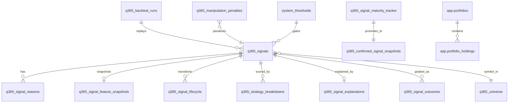

# Database Inventory — Quantorus365

**Version:** 2.1.0  
**Audit Date:** 2025-06-25  
**Runtime DB:** PostgreSQL (primary)  
**Legacy Source:** MySQL (one-way backfill only)  
**Parent Document:** [architecture-audit.md](./architecture-audit.md)

---

## Schema Management

| Mechanism | Location | Purpose |
|-----------|----------|---------|
| Postgres migrations | `migrations/postgres/001–009` | Versioned DDL |
| Proposal migrations | `migrations/postgres/010–013.*.proposal` | Pending schema |
| Runtime DDL | `src/lib/db/ensureAllSchemas.ts` | Idempotent boot-time ensure |
| Domain migrations | `src/lib/db/migrate*.ts` | Per-domain table creation |
| Signal engine DDL | `src/lib/signal-engine/repository/ensureSchemas.ts` | Signal tables |
| Backtest DDL | `src/lib/backtesting/repository/migrate.ts` | Backtest tables |
| Manipulation DDL | `src/lib/manipulation-engine/repository/migrate.ts` | Surveillance tables |
| News DDL | `src/lib/news-engine/repository/ensureNewsSchemas.ts` | News tables |
| Execution DDL | `src/lib/execution/schema.ts` | Execution tables |

**No ORM** — all access via `pg.query()` with parameterized SQL.

---

## PostgreSQL Domain Schemas

### `auth` — Authentication

| Table | Migration | Columns (key) |
|-------|-----------|---------------|
| `auth.users` | `002_auth.sql` | id, email, password_hash, role, totp_secret, created_at |
| `auth.sessions` | `002_auth.sql` | id, user_id, token, expires_at, created_at |
| `auth.audit_logs` | `002_auth.sql` | id, user_id, action, metadata, created_at |

### `master` — Reference Data

| Table | Migration | Purpose |
|-------|-----------|---------|
| `master.sectors` | `003_master.sql` | Sector taxonomy |
| `master.industries` | `003_master.sql` | Industry taxonomy |
| `master.instruments` | `003_master.sql` | Instrument registry (symbol, ISIN, exchange) |
| `master.symbol_aliases` | `003_master.sql` | Symbol alias mapping |

### `market` — Market Data Warehouse

| Table | Migration | Purpose |
|-------|-----------|---------|
| `market.snapshots_current` | `004_market.sql` | Latest quote per symbol (stale tier) |
| `market.snapshots_intraday` | `004_market.sql` | Intraday snapshots (partitioned) |
| `market.candles` | `004_market.sql` | OHLCV daily candles (partitioned) |
| `market.historical_stats` | `004_market.sql` | Precomputed historical statistics |

### `intel` — Intelligence

| Table | Migration | Purpose |
|-------|-----------|---------|
| `intel.news` | `005_intel.sql` | Canonical news articles |
| `intel.corporate_events` | `005_intel.sql` | Corporate events |
| `intel.announcements` | `005_intel.sql` | Exchange announcements |
| `intel.forecasts` | `005_intel.sql` | Analyst forecasts |
| `intel.target_prices` | `005_intel.sql` | Price targets |
| `intel.statements` | `005_intel.sql` | Financial statements |

### `app` — User Application Data

| Table | Migration | Purpose |
|-------|-----------|---------|
| `app.watchlists` | `006_app.sql` | User watchlists |
| `app.portfolios` | `006_app.sql` | Portfolio definitions |
| `app.portfolio_holdings` | `006_app.sql` | Holdings per portfolio |
| `app.alerts` | `006_app.sql` | User alert rules |
| `app.reports` | `006_app.sql` | Generated reports |

### `ops` — Operations

| Table | Migration | Purpose |
|-------|-----------|---------|
| `ops.scheduler_runs` | `007_ops.sql` | Cron job execution log |
| `ops.provider_health_logs` | `007_ops.sql` | Provider health history |
| `ops.dead_letter_events` | `007_ops.sql` | Failed event processing |
| `ops.audit_raw_payloads` | `007_ops.sql` | Raw provider payload archive |
| `ops._migrations` | `postgres/migrate.ts` | Migration version tracker |

---

## Application Tables (`q365_*`)

Created via `ensureAllSchemas.ts` and domain-specific migrations.

### Signals Domain

| Table | Owner Module | Purpose |
|-------|-------------|---------|
| `q365_signals` | signal-engine | Primary signal records |
| `q365_signal_reasons` | signal-engine | Reason codes per signal |
| `q365_signal_feature_snapshots` | signal-engine | Feature vector at generation |
| `q365_signal_lifecycle` | signal-engine | Lifecycle state transitions |
| `q365_strategy_breakdowns` | signal-engine | Per-strategy score breakdown |
| `q365_signal_outcomes` | learning | Graded signal outcomes |
| `q365_signal_explanations` | explainability | AI/human explanations |
| `q365_confirmed_signal_snapshots` | signals service | Matured confirmed signals |
| `q365_signal_maturity_tracker` | cron/signalMaturity | Maturity promotion tracking |

### Learning & Calibration

| Table | Purpose |
|-------|---------|
| `q365_strategy_performance_snapshots` | Rolling strategy metrics |
| `q365_confidence_calibration` | Confidence calibration curves |
| `q365_adaptive_recommendations` | Adaptive weight suggestions |
| `q365_learning_job_runs` | Learning job execution audit |
| `q365_options_snapshots` | Options chain snapshots |

### News Domain

| Table | Purpose |
|-------|---------|
| `q365_news_events` | Ingested news events |
| `q365_news_scores` | Sentiment/impact scores |
| `q365_news_ingestion_logs` | Ingestion audit trail |
| `q365_news_calibration` | News scoring calibration |
| `q365_news_adaptive_recommendations` | News weight adjustments |

### Manipulation / Surveillance

| Table | Purpose |
|-------|---------|
| `q365_manipulation_snapshots` | Daily manipulation scores per symbol |
| `q365_manipulation_events` | Detected manipulation events |
| `q365_manipulation_detector_results` | Per-detector results |
| `q365_manipulation_penalties` | Signal penalty values |

### Backtesting

| Table | Purpose |
|-------|---------|
| `q365_backtest_runs` | Run metadata, config, status, summary |
| Backtest trades/metrics | Persisted via `backtesting/repository/persistence.ts` |

### Operations & Config

| Table | Purpose |
|-------|---------|
| `q365_alerts` | System/user alerts |
| `q365_universe` | Tradable universe (Nifty 500 etc.) |
| `q365_symbol_mapping_override` | Symbol alias overrides |
| `q365_pipeline_run_locks` | Distributed run locks |
| `q365_data_feed_health` | Feed health snapshots |
| `q365_market_close_snapshot` | EOD market snapshot |
| `system_thresholds` | 25+ operational thresholds (single source of truth) |

### Legacy Parallel Tables (ensureAllSchemas)

| Table | Notes |
|-------|-------|
| `users` | Legacy auth (parallel to `auth.users`) |
| `user_sessions` | Legacy sessions |
| `password_resets` | Password reset tokens |
| `instruments` | Legacy instrument registry |
| `portfolios` | Legacy portfolios |
| `portfolio_positions` | Legacy positions |

---

## Execution Tables

| Table | File | Purpose |
|-------|------|---------|
| `q365_exec_signals` | `src/lib/execution/schema.ts` | Execution signal queue |
| `q365_exec_trades` | `src/lib/execution/schema.ts` | Trade execution records |
| `q365_exec_positions` | `src/lib/execution/schema.ts` | Open positions |

**Status:** Schema exists; broker layer stubbed (signal-only mode).

---

## Proposal Tables (Not Yet Applied)

| Migration File | Tables |
|----------------|--------|
| `010_q365_signal_due_diligence_reviews.sql.proposal` | `q365_signal_due_diligence_reviews` |
| `011_q365_daily_signal_reports.sql.proposal` | `q365_daily_signal_reports`, `q365_signal_learning_observations` |
| `012_q365_backtest_runs.sql.proposal` | Extended `q365_backtest_runs`, `q365_backtest_signal_outcomes` |
| `013_q365_engine_health.sql.proposal` | `q365_engine_health_snapshots`, `q365_engine_health_events` |

---

## Entity Relationship (Core Trading Path)



---

## Migration Commands

```bash
npm run db:migrate:pg          # Postgres versioned migrations
npm run db:migrate-all         # All domain migrations
npm run db:ensure              # Boot-time schema ensure
npm run db:backfill:pg         # MySQL → Postgres backfill
npm run db:check:pg            # Validate Postgres state
npm run db:validate:data       # Data integrity checks
```

---

## Data Access Patterns

| Pattern | Location | Usage |
|---------|----------|-------|
| `pg.query(sql, params)` | `src/lib/db/postgres.ts` | Primary access |
| `getDb()` shim | `src/lib/db.ts` | Legacy MySQL (being phased out) |
| Repository modules | `*/repository/*.ts` | Domain-specific queries |
| Chart queries | `src/lib/db/queries/chartQueries.ts` | Chart SQL |
| Stock detail | `src/lib/db/queries/stockDetailQueries.ts` | Detail SQL |

---

## Schema Drift Risks

| Risk | Detail | Mitigation |
|------|--------|------------|
| Dual auth tables | `users` + `auth.users` | Consolidate to `auth.*` |
| 6+ migration entry points | Multiple `migrate*.ts` files | Single migration orchestrator |
| Proposal migrations pending | 010–013 not applied | Apply in controlled window |
| MySQL still referenced | `validateEnv.ts` requires MYSQL_* | Update boot validator for PG-only |

---

*See [implementation-roadmap.md](./implementation-roadmap.md) for schema consolidation plan.*
