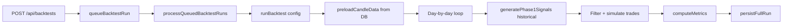

# Implementation Roadmap — Quantorus365

**Version:** 2.1.0  
**Audit Date:** 2025-06-25  
**Parent Document:** [architecture-audit.md](./architecture-audit.md)

---

## Gap Analysis Summary

| Area | Current State | Target State | Gap |
|------|--------------|--------------|-----|
| Architecture | Monolithic Next.js + workers | 6 bounded contexts | HIGH |
| Auth | Cookie presence middleware | Validated sessions on all routes | CRITICAL |
| Market data | 5 parallel price paths | Single `MarketDataProvider` gateway | HIGH |
| Database | PG primary + MySQL legacy + 6 migration entry points | PG-only, single orchestrator | MEDIUM |
| Backtesting | 3 engines (institutional, daily, tick) | Unified with tick as experimental | MEDIUM |
| Risk | 4+ modules, no unified interface | Single Risk Engine service | MEDIUM |
| Broker | Stubbed (signal-only) | Feature-flagged Broker Layer | LOW (deferred) |
| Monitoring | Partial `withApiHandler` adoption | Universal structured logging + SLO alerts | MEDIUM |
| Microservices | 7 scaffolds unused | Incremental extraction via contracts | LOW |
| CI/CD | No `.github/` workflows | Automated typecheck/lint/build/deploy | HIGH |
| Type safety | `tsc` passes; build ignores errors | Strict build gate | MEDIUM |

---

## Backtest Flow (Trading Engine)

Three engines exist today. Target: consolidate under Backtest Engine bounded context.

### A. Institutional Backtest (Primary)

**Location:** `src/lib/backtesting/`



| Component | File |
|-----------|------|
| Runner | `runner/backtestRunner.ts` |
| Queue | `runner/backtestQueue.ts` |
| Orchestrator | `runner/runOrchestrator.ts` |
| Signal replay | `replay/signalReplay.ts` |
| Simulation | `simulation/*.ts` |
| Metrics | `metrics/computeMetrics.ts` |
| API | `src/app/api/backtests/route.ts` |

**Triggers:** Nightly cron 19:00 IST, `POST /api/backtests`, queue drain every minute.

**Fidelity:** Uses real `generatePhase1Signals()` with historical `CandleProvider` — not a simplified model.

### B. Daily Signal Backtest

**Location:** `src/lib/signals/dailyBacktestEngine.ts`  
**API:** `POST /api/signals/backtest`

Grades today's signal pool against historical candles (MFE/MAE, hit target/stop). No portfolio simulation.

### C. Redis Tick Backtest (Experimental)

**Location:** `src/lib/pipeline/backtestEngine.ts`

Replays `market_ticks` through injectable `StrategyFn` + `pipeline/riskManager.evaluateRisk()`.

**Gap:** Should be isolated behind feature flag; not merged with institutional engine until tick data pipeline is production-ready.

---

## Phase-wise Roadmap

### Phase 0 — Stabilize & Secure (Weeks 1–2)

**Goal:** Close critical security gaps; no architecture changes.

| Task | Owner | Deliverable | Ref |
|------|-------|-------------|-----|
| Validate sessions in middleware | Backend | DB token check on every request | SEC-001 |
| Harden public endpoints | Backend | Remove reseed/events from PUBLIC_PATHS | SEC-002, SEC-003 |
| `requireSession` on all API routes | Backend | 174/174 coverage | SEC-004 |
| Gate debug/metrics behind admin | Backend | `requireAdmin` on `/api/debug/*`, `/api/metrics` | SEC-005 |
| Disable open registration in prod | Ops | `REGISTRATION_DISABLED` env flag | SEC-006 |
| Wire `pipelineLimiter` | Backend | Scanner, backtest, signal-engine routes | SEC-008 |
| Retire `getLivePrice` imports | Backend | Migrate to `marketDataResolver` | TD-009 |

**Exit criteria:**
- Security review P0 items closed
- `npm run typecheck && npm run lint && npm run build` pass
- No public mutation endpoints

---

### Phase 1 — Contracts & CI (Weeks 3–4)

**Goal:** Establish inter-module contracts and automated quality gates.

| Task | Deliverable |
|------|-------------|
| Finalize `packages/contracts` types | Signal, Strategy, Risk, Backtest request/response types |
| Define domain events | `signal.generated`, `backtest.completed`, `risk.breach` |
| Add GitHub Actions CI | `typecheck`, `lint`, `build`, `test:unit` on PR |
| Enforce provider gateway | CI rule: fail on direct vendor imports outside `src/providers/` |
| Structured logging migration | Replace `console.log` in top 5 API routes |
| Apply proposal migrations 010–013 | Engine health, daily reports, learning observations |

**Exit criteria:**
- CI green on every PR
- Contract types imported at 3+ module boundaries
- Proposal migrations applied in staging

---

### Phase 2 — Extract Strategy Engine (Weeks 5–7)

**Goal:** First bounded context as internal package.

```
packages/strategy-engine/
├── registry/          ← strategyRegistry.ts
├── evaluators/        ← strategies/*.ts
├── runner/            ← runStrategies.ts
├── conflicts/         ← resolveConflicts.ts
├── scoring/           ← confidenceScorer, riskScorer, strategyScorers
├── trade-plan/        ← buildTradePlan.ts
└── index.ts           ← public API
```

| Public API | Signature |
|------------|-----------|
| `evaluateStrategies` | `(features, regime) → StrategyResult` |
| `resolveConflicts` | `(candidates) → StrategyCandidate[]` |
| `getRegistry` | `() → StrategyRegistry` |

Signal Engine imports from `@quantorus/strategy-engine` instead of direct file paths.

**Exit criteria:**
- Zero direct imports from `signal-engine/strategies/` outside strategy package
- All strategy vitest tests pass
- No behavior change in signal output

---

### Phase 3 — Extract Risk Engine (Weeks 8–10)

**Goal:** Unified risk interface consolidating 4 modules.

**Consolidate:**
- `signal-engine/core/runRejectionEngine.ts`
- `signal-engine/risk/phase3Risk.ts`
- `signal-engine/portfolio-fit/portfolioRiskEngine.ts`
- `services/riskCoreService.ts`
- `services/preTradeGatewayService.ts`
- `services/breachDetectionService.ts`

| Public API | Purpose |
|------------|---------|
| `evaluateRejection(signal, context)` | 12-gate rejection |
| `evaluatePortfolioFit(signal, portfolio)` | Soft fit score |
| `evaluatePortfolioRisk(signal, portfolio)` | Hard limits |
| `getRiskSummary(portfolioId)` | Exposure metrics |
| `evaluatePreTrade(order)` | Pre-trade gateway |

**Exit criteria:**
- Single `RiskEvaluationResult` type across all callers
- Risk API routes delegate to Risk Engine package
- Breach detection wired to pre-trade gateway

---

### Phase 4 — Extract Backtest Engine (Weeks 11–14)

**Goal:** Backtest as independent worker process.

| Component | Action |
|-----------|--------|
| Institutional runner | Extract to `packages/backtest-engine/` |
| Daily backtest | Merge as `runDailyOutcomeBacktest()` method |
| Tick backtest | Isolate behind `BACKTEST_TICK_ENABLED` flag |
| Queue processor | Standalone worker (PM2 child or Docker) |
| Signal replay | RPC call to Signal Engine package |

**Exit criteria:**
- Backtest worker runs independently of Next.js HTTP process
- Nightly cron triggers worker, not in-process function
- Backtest API routes are thin BFF proxies

---

### Phase 5 — Extract Signal Engine (Weeks 15–18)

**Goal:** Signal pipeline as standalone service.

| Component | Action |
|-----------|--------|
| 4-phase pipeline | `packages/signal-engine/` |
| Signal service layer | `src/lib/signals/` moves into package |
| Maturity cron | Worker in signal-engine process |
| Confirmed snapshots | Owned by signal-engine repository |
| API routes | BFF calls RPC/event bus |

**Exit criteria:**
- `generatePhase4Signals()` callable via RPC
- Scheduler worker calls Signal Engine service, not direct import
- Signal DB tables owned by signal-engine schema

---

### Phase 6 — Broker & Admin Layers (Weeks 19–22)

**Goal:** Complete bounded context extraction.

#### Broker Layer (Feature-Flagged)

| Component | Status |
|-----------|--------|
| `placeOrder()` | Re-implement Kite adapter behind `EXECUTION_ENABLED` |
| `positionManager` | Active when flag on |
| Pre-trade gate | Mandatory via Risk Engine RPC |

#### Admin Layer

| Component | Action |
|-----------|--------|
| `systemConfigService` | Admin service owns `system_thresholds` |
| Monitor/Prometheus | Admin service exports metrics |
| Admin API routes | Proxy to Admin service |
| User management | Identity service (`services/identity/`) |

**Exit criteria:**
- 6 bounded contexts deployed as separate processes
- Next.js is thin BFF only
- Feature flags control broker activation

---

### Phase 7 — Decompose & Harden (Weeks 23–24)

| Task | Deliverable |
|------|-------------|
| Remove `ignoreBuildErrors: true` | Strict production build |
| Enable `strict: true` in tsconfig | Per-module incremental |
| Remove MySQL shim | PG-only runtime |
| Remove deprecated Kite/Yahoo stubs | Clean codebase |
| SLO alerting | Wire `docs/SLO_RUNBOOK.md` to automated alerts |
| Load testing | Backtest + signal scan under concurrent load |

---

## Development Process

### Feature Branch Strategy

No `.github/` workflows exist today. Recommended Git workflow:

```
main (production)
  └── develop (integration)
        └── feature/<ticket>-<description>
        └── fix/<ticket>-<description>
        └── chore/<description>
```

| Branch | Purpose | Merge Target |
|--------|---------|--------------|
| `main` | Production-ready code | — |
| `develop` | Integration staging | `main` (release) |
| `feature/*` | New features | `develop` |
| `fix/*` | Bug fixes | `develop` or `main` (hotfix) |
| `chore/*` | Tooling, docs, deps | `develop` |

**Rules:**
1. Never force-push `main`
2. PR required for all merges to `main` and `develop`
3. CI must pass: `typecheck`, `lint`, `build`, `test:unit`
4. Phase acceptance scripts run manually before release: `validatePhase*.ts`
5. One feature per branch — use [split-to-prs skill] for large changes

### Release Workflow

Current production deployment (VPS + PM2):

```bash
# 1. Pre-deploy validation
npm run typecheck
npm run lint
npm run build
npm run validate:engines-health    # optional

# 2. Deploy (on VPS)
git pull origin main
npm install
npm run build
npm run db:ensure                  # idempotent schema ensure

# 3. Restart
pm2 restart quantorus365-app       # or: pm2 start ecosystem.config.js --env production

# 4. Post-deploy validation
bash scripts/deployAndValidate.sh  # requires Q365_SESSION_COOKIE in prod
```

**PM2 topology** (`ecosystem.config.js` + `server.js`):

| Process | Role |
|---------|------|
| `quantorus365-app` | Next.js HTTP (port 5000) + WS (5001) |
| Child: scheduler | Market data, signal regen, backtest, maturity |
| Child: manipulation-scan | Cron 18:30 IST daily |
| Child: learning-scheduler | Cron 20:30 IST daily |

**Environment loading order** (`server.js`):
1. `.env.local` (operator overrides win)
2. `.env.production` (baseline, non-overriding)

**Recommended release checklist:**

- [ ] `npm run typecheck && npm run lint && npm run build` pass
- [ ] `npm run validate:engines-health` pass
- [ ] DB migrations applied (`npm run db:migrate:pg`)
- [ ] `envSafetyLock` passes (no `FORCE_MARKET_OPEN` in prod)
- [ ] IndianAPI quota within budget
- [ ] `deployAndValidate.sh` HTTP_AUTH mode passes
- [ ] PM2 process healthy (`pm2 status`)
- [ ] `/api/health` returns 200

**Docker path** (alternative, `docker-compose.prod.yml`):
```bash
docker compose -f docker-compose.prod.yml up -d --build
```

---

## Success Metrics

| Metric | Current | Phase 3 Target | Phase 7 Target |
|--------|---------|----------------|----------------|
| API routes with validated auth | ~50% | 100% | 100% |
| Routes using `withApiHandler` | ~17% | 50% | 100% |
| Direct vendor imports outside providers | ~10 files | 0 | 0 |
| Bounded contexts extracted | 0 | 2 (Strategy, Risk) | 6 |
| Build type errors ignored | Yes | No | No |
| MySQL runtime dependency | Partial | Partial | None |
| CI automated on PR | No | Yes | Yes |
| SLO breach auto-alert | No | No | Yes |

---

## Document Index

| Document | Content |
|----------|---------|
| [architecture-audit.md](./architecture-audit.md) | Master audit report |
| [api-inventory.md](./api-inventory.md) | 174 API routes |
| [database-inventory.md](./database-inventory.md) | Schema and tables |
| [signal-engine-flow.md](./signal-engine-flow.md) | 4-phase signal pipeline |
| [strategy-flow.md](./strategy-flow.md) | Strategy registry and evaluation |
| [security-review.md](./security-review.md) | Security risk register |
| [implementation-roadmap.md](./implementation-roadmap.md) | This document |

---

*Roadmap is documentation only. No business logic was modified during this audit.*
