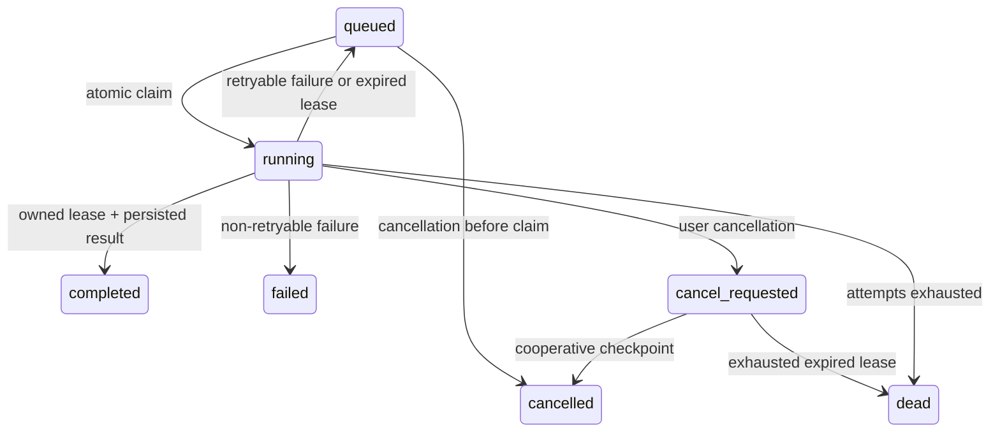

# Backtest queue state machine

Status transitions are conditional MySQL updates. A completion, heartbeat, failure, or cancellation acknowledgement must match the run ID, active state, processor ID, and (where applicable) unexpired lease.

`completed`, `cancelled`, and `dead` are terminal. `failed` is terminal for explicitly non-retryable errors. Attempt count increments only during claim and is never reset by retry or recovery. The internal `cancel_requested` token fits the legacy `VARCHAR(20)` status column. Public APIs map it to `RUNNING` and map `dead` to `FAILED`, preserving the existing response vocabulary.
