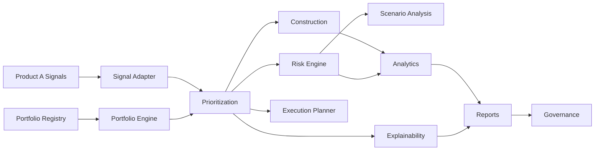

# Phase 8 — Portfolio Intelligence Architecture

## Purpose

Phase 8 builds an **institutional portfolio intelligence layer** that consumes Product A signals to support capital allocation, portfolio construction, risk controls, and execution planning — **without modifying signal generation**.

## Isolation Rules

| Rule | Enforcement |
|------|-------------|
| Product A pipeline unchanged | Portfolio code under `src/lib/portfolio/` only |
| Signal generation deterministic | No writes to signal engine |
| Portfolio consumes signals only | `consumption/signalAdapter.ts` adapts Phase 11 rows |
| No strategy/confidence/ranking changes | Prioritization reads confidence as-is |
| No adaptive learning changes | No Phase 4 integration |
| Explainable recommendations | Every signal has selection/rejection rationale |
| No automatic execution | `portfolioGovernance.ts` blocks auto-execution |

## Module Layout

```
src/lib/portfolio/
├── types.ts
├── intelligenceIndex.ts          # Phase 8 barrel export
├── positionManager.ts              # Existing execution facade (unchanged)
├── consumption/signalAdapter.ts
├── registry/portfolioRegistry.ts
├── engine/portfolioEngine.ts
├── construction/portfolioConstruction.ts
├── risk/riskEngine.ts
├── prioritization/signalPrioritization.ts
├── planner/executionPlanner.ts
├── scenarios/scenarioAnalysis.ts
├── analytics/portfolioAnalytics.ts
├── explainability/portfolioExplainability.ts
├── reports/portfolioReporting.ts
├── governance/portfolioGovernance.ts
└── intelligence/runPortfolioIntelligence.ts
```

## Data Flow



## Entry Point

```typescript
import { runPortfolioIntelligence } from '@/lib/portfolio/intelligence/runPortfolioIntelligence';

const result = runPortfolioIntelligence({
  portfolioId: 'pf_desk_1',
  signals: consumableSignals,
  author: 'pm@quantorus',
  allocationMethod: 'sector_balancing',
});
```

## Version

`PORTFOLIO_INTELLIGENCE_VERSION = 8.0.0`
