# Phase 7 — Research Platform Architecture

## Purpose

Phase 7 provides a **parallel quantitative research environment** for discovering, testing, and benchmarking alpha signals **without affecting the production signal engine**.

## Isolation Rules

| Rule | Enforcement |
|------|-------------|
| Production pipeline untouched | Research code lives under `src/lib/research/` only |
| Product A signals deterministic | No imports from research into signal generation |
| No live strategy changes | Experimental strategies are not registered in production |
| No ranking/confidence modifications | Research metrics are isolated |
| No adaptive promotion | `researchGovernance.ts` requires Phase 4 pipeline |
| Reproducibility | Every experiment stores seed, git commit, config version |
| No auto-promotion | Governance blocks bypass; manual approval required |

## Module Layout

```
src/lib/research/
├── types.ts                    # Core types
├── experimentRegistry.ts       # Named-author experiment store
├── datasets/datasetRegistry.ts # Research datasets
├── features/researchFeatures.ts
├── strategies/experimentalStrategies.ts
├── backtesting/deterministicBacktest.ts
├── ai/researchAi.ts
├── paperTrading/researchPaperTrading.ts
├── benchmarks/benchmarkFramework.ts
├── reports/researchReporting.ts
├── governance/researchGovernance.ts
└── experiments/runResearchExperiment.ts
```

## Data Flow

```mermaid
flowchart LR
  DS[Dataset] --> FE[Research Features]
  FE --> ST[Experimental Strategy]
  ST --> BT[Deterministic Backtest]
  BT --> BM[Benchmark Framework]
  BM --> RP[Research Reports]
  RP --> ER[Experiment Registry]
  ER --> GV[Governance Gate]
  GV -.->|manual only| P4[Phase 4 Promotion Pipeline]
```



## Entry Points

- **Programmatic:** `runResearchExperiment()` from `src/lib/research/experiments/runResearchExperiment.ts`
- **Benchmark:** `npm run benchmark:research`
- **Tests:** `npm run test:research`, `test:backtesting`, `test:paper-trading`, `test:experiment-registry`

## Version

`RESEARCH_WORKSPACE_VERSION = 7.0.0`
