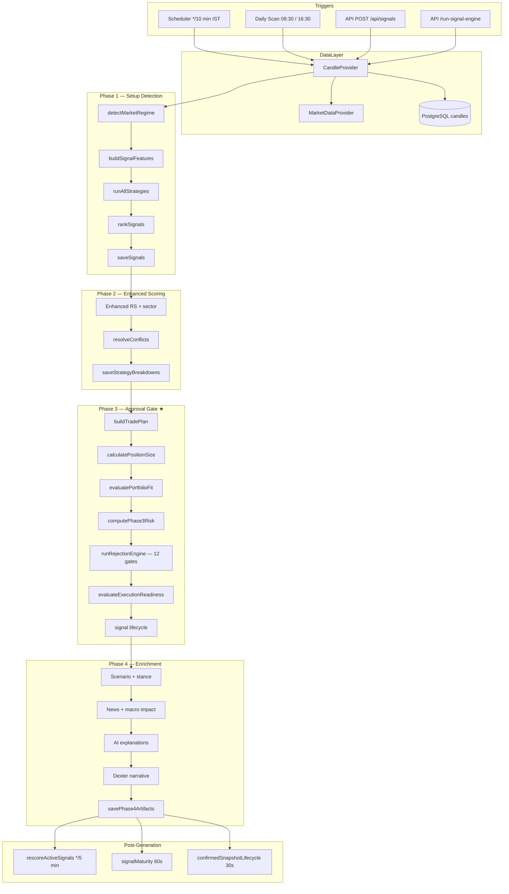

# Signal Engine Flow — Quantorus365

**Version:** 2.1.0  
**Audit Date:** 2025-06-25  
**Parent Document:** [architecture-audit.md](./architecture-audit.md)  
**Related:** [strategy-flow.md](./strategy-flow.md)

---

## Overview

The Signal Engine is the core decision pipeline that transforms market data into institutional-grade trade signals. Production runs call **`generatePhase4Signals()`**, which internally executes Phase 3 (the authoritative approval gate) before enrichment.

**Barrel export:** `src/lib/signal-engine/index.ts`

---

## End-to-End Flow



---

## Entry Points

| Entry | File | Function | Schedule / Trigger |
|-------|------|----------|-------------------|
| Intraday regen | `src/lib/workers/scheduler.ts` | `runSignalGeneration()` → `generatePhase4Signals()` | `*/10` 09:30–15:30 IST Mon–Fri |
| Morning scan | `src/lib/workers/dailyScanSchedule.ts` | `runPhase4Scan()` | 08:30 IST |
| Evening scan | `dailyScanSchedule.ts` | `runPhase4Scan()` after candle update | 16:30 IST |
| Manual API | `src/app/api/run-signal-engine/route.ts` | `generatePhase4Signals()` | POST/GET |
| Signals board | `src/app/api/signals/route.ts` | `generatePhase4Signals()` on refresh | POST |
| Per-symbol | `src/lib/signal-engine/live/analyzeInstrument.ts` | `generateSignal()` | Stock detail page |
| Custom universe | `src/lib/scanner/customUniverseBatchScanner.ts` | Batch scan | POST `/api/scanner/custom-universe/run` |

---

## Phase 1 — Setup Detection

**File:** `src/lib/signal-engine/pipeline/generatePhase1Signals.ts`  
**Function:** `generatePhase1Signals(candleProvider, options)`

### Per-Symbol Steps

1. **Regime detection** — `detectMarketRegime()` on benchmark (Nifty) candles
2. **Candle fetch** — `candleProvider.fetchDailyCandles(symbol)`
3. **Validation** — `validateCandleSeries()`, `validateFeatures()`
4. **Feature build** — `buildSignalFeatures()` (RSI, ADX, EMA, volume, structure)
5. **Relative strength** — `computeRelativeStrength()` vs benchmark
6. **Strategy evaluation** — `runAllStrategies(features, rs)` → see [strategy-flow.md](./strategy-flow.md)
7. **Manipulation penalty** — `applyManipulationPenalty()` (optional overlay)
8. **Ranking** — `rankSignals()` by confidence
9. **Persistence** — `saveSignals()` → `q365_signals` + maturity tracker

### Output

`QuantSignal` records in `q365_signals` with status `candidate` or `rejected`.

---

## Phase 2 — Enhanced Scoring

**File:** `src/lib/signal-engine/pipeline/generatePhase2Signals.ts`  
**Function:** `generatePhase2Signals()`

- Enhanced relative strength with sector context
- `isStrategyAllowedInRegime()` checks
- `scoreForStrategy()` per-strategy enhanced scoring
- `resolveConflicts()` when multiple strategies match
- Persists to `q365_strategy_breakdowns`

**Note:** Phase 2 is optional/legacy in some paths; Phase 3 remains authoritative.

---

## Phase 3 — Approval Gate (Authoritative)

**File:** `src/lib/signal-engine/pipeline/generatePhase3Signals.ts`  
**Function:** `generatePhase3Signals()`

### Pipeline Steps

| Step | Module | Function |
|------|--------|----------|
| Trade plan | `trade-plan/buildTradePlan.ts` | Entry, stop, targets |
| Position sizing | `position-sizing/positionSizer.ts` | `calculatePositionSize()` |
| Portfolio fit | `portfolio-fit/evaluatePortfolioFit.ts` | Soft fit score 0–100 |
| Phase 3 risk | `risk/phase3Risk.ts` | `computePhase3Risk()` (55/45 blend) |
| **Rejection engine** | `core/runRejectionEngine.ts` | **12 sequential gates** |
| Execution readiness | `execution/executionReadiness.ts` | `evaluateExecutionReadiness()` |
| Lifecycle | `lifecycle/signalLifecycle.ts` | State transitions |

### 12 Rejection Gates

`runRejectionEngine()` — a signal is blocked if ANY gate fails:

| # | Gate | Blocks When |
|---|------|-------------|
| 1 | Data Quality | quality < MIN_DATA_QUALITY |
| 2 | Strategy Match | no strategy matched |
| 3 | Scenario | strategy blocked in current scenario |
| 4 | Market Stance | strategy not in stance allowed list |
| 5 | Regime | BUY in BEAR without justification |
| 6 | Risk-Reward | R:R < MIN_RR |
| 7 | Confidence | confidence < stance-adjusted MIN_CONFIDENCE |
| 8 | Risk Score | risk_score > MAX_RISK_SCORE |
| 9 | Liquidity | volume < MIN_VOLUME |
| 10 | Stop Distance | stop outside ATR bounds |
| 11 | Portfolio Fit | fit_score < MIN_PORTFOLIO_FIT |
| 12 | Manipulation | manipulation penalty exceeds threshold |

Thresholds loaded from `system_thresholds` via `systemConfigService.ts`.

**Authority rule:** Phase 4 enrichment does NOT override Phase 3 rejection decisions.

---

## Phase 4 — Enrichment

**File:** `src/lib/signal-engine/pipeline/generatePhase4Signals.ts`  
**Function:** `generatePhase4Signals()`

1. Calls `generatePhase3Signals()` internally
2. Scenario classification + market stance
3. News impact overlay (`news-engine/impact/`)
4. AI explanations (`aiLayerService`)
5. Dexter narrative (`dexter/buildDexterNarrative.ts`)
6. `savePhase4Artifacts()` → explanations, feature snapshots

---

## Candle Data Sources

| Context | Provider | Source |
|---------|----------|--------|
| Worker cron | Inline `CandleProvider` | `market_data_daily` table |
| Evening update | removed vendor → warehouse | `candles` table via `candleDailyUpdateJob` |
| Live/API | `candleFallbackChain.ts` | removed vendor → cache → Yahoo → DB |
| Signal-critical | `MarketDataProvider` | `{ signalCritical: true }` throws on stale |

---

## Post-Generation Lifecycle

### Rescore (Every 5 min, market hours)

**File:** `src/lib/signal-engine/rescore/rescoreActiveSignals.ts`

Re-ranks active signals with fresh prices without full regeneration.

### Signal Maturity (Every 60s)

**File:** `src/lib/cron/signalMaturity.ts` → `runSignalMaturityWorker()`

```
q365_signals (raw)
    → q365_signal_maturity_tracker (scoring cycles)
    → q365_confirmed_signal_snapshots (promoted when mature)
```

Promotion criteria (env-configurable):
- `MATURITY_MIN_CYCLES` (default 3)
- `MATURITY_MIN_AGE_MINUTES` (default 10)
- `MATURITY_MATURE_THRESHOLD` (confidence floor)
- Stability, confidence drift, price drift checks

### Confirmed Snapshot Lifecycle (Every 30s)

**File:** `src/lib/cron/confirmedSnapshotLifecycle.ts`

Manages terminal states, expiry, and cleanup of confirmed snapshots.

---

## Signal API Assembly Layer

**File:** `src/lib/signals/` (23 modules)

The `/api/signals` route does NOT simply read DB rows — it assembles a rich response:

| Module | Role |
|--------|------|
| `confirmedSignalsService.ts` | Confirmed snapshot reads |
| `responseAssembly.ts` | Multi-source response builder |
| `confirmedSignalPolicy.ts` | Elite gate, tier classification |
| `freshnessService.ts` | Data freshness scoring |
| `signalFunnelBuilder.ts` | Funnel diagnostics |
| `rotationPolicy.ts` | Signal rotation rules |
| `enrichSignalIntelligence.ts` | Intelligence enrichment |
| `manipulationRiskFetch.ts` | Manipulation penalty overlay |
| `dailySignalReport.ts` | Daily report generation |
| `streamSignalsCache.ts` | SSE stream cache |

---

## Phase 11 & 12 (Advanced)

| Phase | File | Purpose |
|-------|------|---------|
| Phase 11 | `pipeline/runPhase11Pipeline.ts` | Integration pipeline |
| Phase 12 | `pipeline/phase12Routing.ts` | Regime-based routing (`SIGNAL_STRESS_FLOOR`) |

---

## Key Environment Variables

| Variable | Default | Effect |
|----------|---------|--------|
| `SIGNAL_RELAX_MODE` | false | Regime-relax retry in strategy runner |
| `SIGNAL_FULL_UNIVERSE_SCAN` | true | Scan full universe vs watchlist |
| `SIGNALS_TARGET_CAP` | — | Max signals per scan |
| `SIGNALS_MAX_LIMIT` | 1000 | API response hard cap |
| `ENABLE_MANIPULATION_JOIN` | false | Join manipulation penalties in reads |
| `ELITE_GATE` | on | Elite signal filtering |
| `SIGNAL_API_REQUIRE_STABLE` | — | Require stability for confirmed |
| `MATURITY_*` | various | Maturity promotion thresholds |
| `Q365_INPROC_SCHEDULER` | 0 in prod | Dev in-process cron mirror |

---

## Monitoring & Health

| Endpoint | Purpose |
|----------|---------|
| `/api/signals/engine-health` | Signal engine health |
| `/api/engine-health/status` | Public engine status |
| `/api/signals/diagnostics` | Funnel diagnostics |
| `/api/signals/health-report` | Health report |
| `/api/debug/signal-validation` | Debug validation |

Probe modules:
- `src/lib/monitor/engineHealthProbe.ts`
- `src/lib/signals/engineHealthMap.ts`

---

## Failure Modes

| Failure | Behavior |
|---------|----------|
| Stale candles (signal-critical) | `StaleDataError` — signal rejected |
| removed vendor quota exceeded | Quota guard blocks fetch; falls back or rejects |
| All strategies reject (regime) | Zero candidates unless `SIGNAL_RELAX_MODE` |
| DB lock on concurrent scans | `q365_pipeline_run_locks` prevents race |
| Phase 3 gate failure | Logged to rejection trail; signal not persisted as approved |

---

*See [strategy-flow.md](./strategy-flow.md) for strategy evaluation details and [implementation-roadmap.md](./implementation-roadmap.md) for modular extraction plan.*
