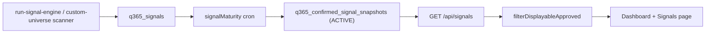
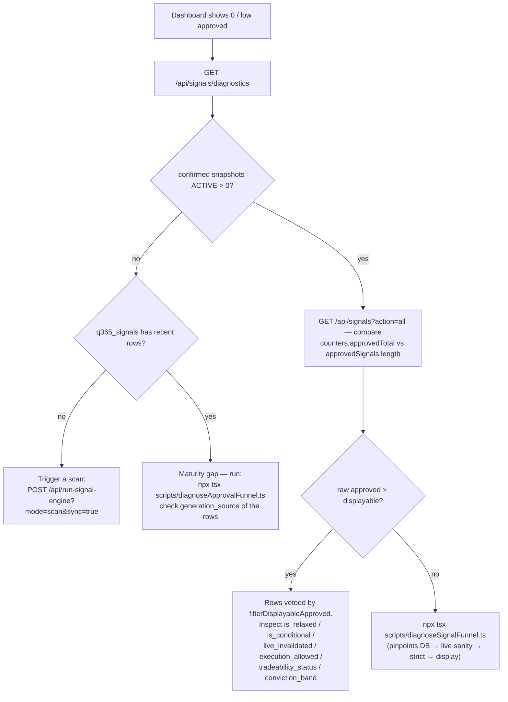
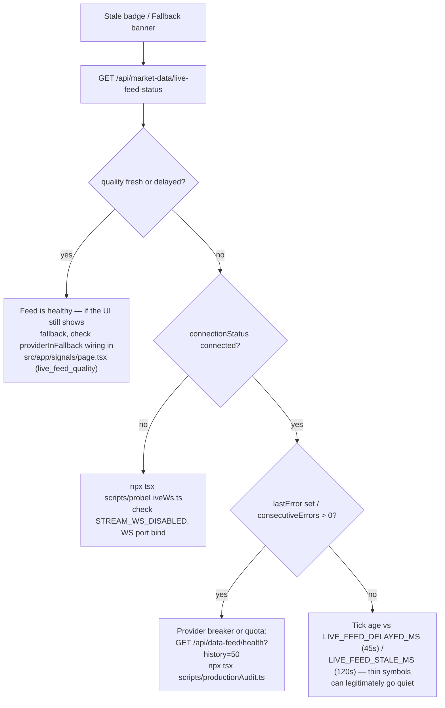

# Signals Debug Playbook

Operator-facing decision trees for the signals pipeline. Start from
the symptom, follow the tree, run the referenced script or endpoint.

Quick smoke (all four critical paths, read-only, safe in prod):

```bash
npm run smoke:signals
# with a session cookie for authenticated endpoints:
ENGINE_AUTH_COOKIE='q200_session=…' npm run smoke:signals
```

---

## The funnel (mental model)



Every stage can silently zero the visible row count while the previous
stage is full. Always locate the first empty stage before changing
anything.

---

## Symptom 1 — Dashboard shows 0 approved (or far fewer than expected)



Key facts:

- The Dashboard, Signals API counters, and Signals page all count via
  `src/lib/signals/filterDisplayableApproved.ts`. If they disagree, a
  layer stopped using the shared filter — the regression guard is
  `src/__tests__/displayableCountParity.vitest.ts`.
- `signals[]` / `approvedSignals[]` intentionally ship ALL
  server-approved rows; only the counters and the UI table apply the
  displayable filter. "Raw 18, displayable 4" is a data-quality
  signal, not a bug, as long as all three layers agree on 4.

## Symptom 2 — Live feed shows Stale / Fallback Mode during market hours



Key facts:

- Freshness is computed from **ingestion time** (`lastReceivedAt`),
  not the vendor quote timestamp — Yahoo's ~15-minute delay must NOT
  mark the feed stale (`src/lib/marketData/liveFeedState.ts`).
- Dual-source Yahoo is a shadow leg, never "Emergency Yahoo" fallback
  while `DUAL_SOURCE_ENABLED=true`.
- When `quality` is `stale`/`disconnected` during market hours,
  `liveFeedBlocksApprovals()` blocks new approvals — expect
  `approvalsBlocked: true` in live-feed-status.

## Symptom 3 — Engine Health DEGRADED on one page, HEALTHY elsewhere

Both the full map (`/api/signals/engine-health`) and the lightweight
preview (embedded in `/api/signals`) delegate to `buildEngineHealthMap`
in `src/lib/signals/engineHealthMap.ts`. If they disagree:

1. Compare `live_feed_quality` and `candle_age_hours` in the two
   payloads — the preview receives them from
   `src/lib/signals/responseAssembly.ts`.
2. A fresh/delayed live feed forces the Data Feed node HEALTHY
   (`buildDataFeedHealthNode` early return). If a page shows DEGRADED
   while the feed is fresh, that page is not passing
   `liveFeedQuality` through.
3. Regression tests: `src/__tests__/engineHealthStatus.vitest.ts`.

## Symptom 4 — Scan won't start (409) or never finishes

| Check | Command | Healthy answer |
|-------|---------|----------------|
| Engine lock | `GET /api/run-signal-engine?status=true` | `running=false` or progress advancing |
| Scanner lock | `GET /api/scanner/custom-universe/status` | `inFlight=false` or `progress.done` advancing |
| Force-clear engine lock | `npm run unblock:execution-lock` | — |
| Scanner stale lock | auto-clears via watchdog after ~30s (`PIPELINE_STALE_INFLIGHT_MS`) | look for `[PIPELINE RESET]` in logs |

If the scanner scored rows but the DB stayed empty, grep the logs for
`[SCAN ALERT]` — that means INSERTs failed (schema mismatch), not that
the scan found nothing.

## Symptom 5 — 404 / 401 on an API route

- 401 with `{"error":"Unauthorized"}` and no handler log: the request
  was rejected by `src/proxy.ts` (cookie presence check). Public
  paths are listed in `PUBLIC_PATHS` there.
- 404 on a documented route: confirm the `route.ts` file actually
  exists under `src/app/api/...` — docs and code have drifted before
  (the scanner status route was missing until 2026-07).

---

## Diagnostic endpoints

| Endpoint | Auth | Use |
|----------|------|-----|
| `GET /api/signals/freshness` | cookie | Fast pipeline probe (~10ms): batch id, confirmed count, pipeline run time |
| `GET /api/signals/diagnostics` | session | Schema + scanner + maturity + snapshot counts |
| `GET /api/signals/engine-health` | session | 12-node engine health map |
| `GET /api/scanner/custom-universe/status` | cookie | Scanner in-flight, progress, last summary |
| `GET /api/run-signal-engine?status=true` | session | Manual-run lock + live progress |
| `GET /api/market-data/live-feed-status` | public | Feed quality, tick age, approvals blocked |
| `GET /api/market-data/dual-source/status` | public | Dual-source config + both provider legs |
| `GET /api/data-feed/health` | cookie | Provider ring buffer + freshness label |

## Diagnostic scripts

| Script | What it answers |
|--------|-----------------|
| `npm run smoke:signals` | Are all four critical paths healthy right now? |
| `npx tsx scripts/diagnoseSignalFunnel.ts` | Which gate is killing rows (stage-by-stage survivors)? |
| `npx tsx scripts/diagnoseApprovalFunnel.ts` | Full Phase 4 + maturity + snapshot write audit |
| `npx tsx scripts/diagnoseInstitutionalFunnel.ts` | Stage-by-stage drop accounting on snapshots |
| `npx tsx scripts/productionAudit.ts` | API budget, provider flags, quota leak (exit 0 = safe) |
| `npx tsx scripts/probeLiveWs.ts` | Does resolveBatch + WS actually tick? |
| `npx tsx scripts/checkDatabaseFreshness.ts` | Is the candle warehouse stale? |

## Log tags to grep

| Tag | Meaning |
|-----|---------|
| `[DASHBOARD_SOURCE]` | Dashboard inputs: raw approved vs displayable counts |
| `[DASHBOARD_AGG]` | Signals route post-fallback counter recompute |
| `[ELITE_UI_INPUT]` / `[ELITE_UI_*]` | Client-side per-row veto audit on /signals |
| `[PIPELINE RESET]` / `[PIPELINE FORCE RESET]` | Stale in-flight lock force-cleared by watchdog |
| `[PIPELINE BLOCKED]` | Run refused because a lock is held |
| `[SCAN ALERT]` | Scanner scored signals but zero DB inserts — schema problem |
| `[ensureAllSchemas] NOT caching` | Boot DDL partially failed; retries on next request |
| `[AUTO-REBUILD]` | Signals page triggered a background scanner run |
| `[UNIVERSE]` | Universe load state at boot (503s on /api/signals when not ready) |

## Funnel SQL (MySQL)

```sql
-- Stage 1: what did the scanners write?
SELECT generation_source, COUNT(*) AS rows_, MAX(generated_at) AS latest
FROM q365_signals GROUP BY generation_source;

-- Stage 2: maturity state machine
SELECT status, COUNT(*) FROM q365_signal_maturity_tracker GROUP BY status;

-- Stage 3: what can the API actually surface?
SELECT status, COUNT(*) FROM q365_confirmed_signal_snapshots GROUP BY status;
```

If Stage 3 has ACTIVE rows but the UI is empty, the problem is the
display filter or the client — not the pipeline. Go to Symptom 1,
branch "raw approved > displayable".
